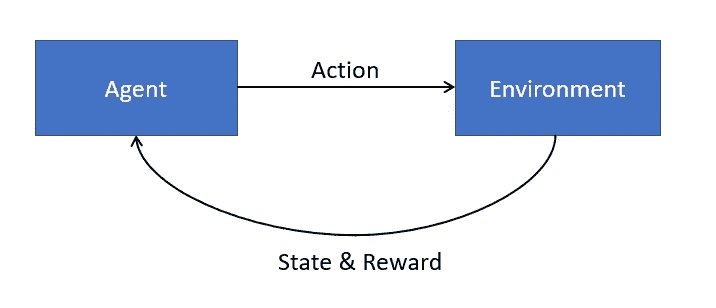
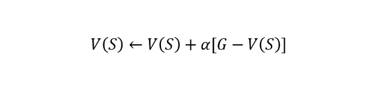
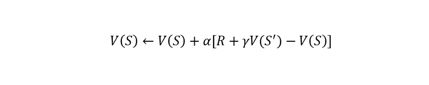
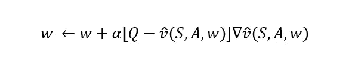
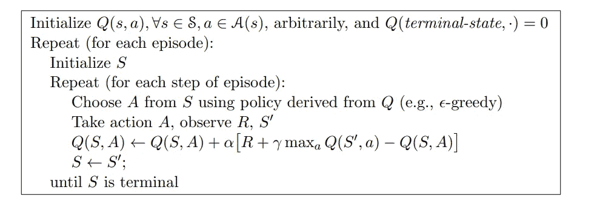
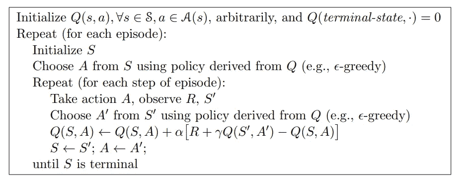

# 强化学习:导论

> 原文：<https://towardsdatascience.com/reinforcement-learning-an-introduction-a8783f9ea993>

## 机器学习基础

# 强化学习:导论

## 强化学习的基础介绍，所有你需要知道的开始

图片由 shutterstock 的 Andrey_Popov 提供

在 9 个小时内，谷歌的 AlphaZero 从只知道国际象棋的规则变成了击败世界上最好的模型。人类研究国际象棋已经超过 1000 年了，然而强化学习模型能够在可忽略不计的时间内加深我们对游戏的了解，除了游戏规则之外，不使用任何先验知识。没有其他机器学习领域允许在这个问题上取得这样的进展。今天，谷歌的类似模型正在广泛应用于各种领域，如预测和检测改变生活的疾病的早期迹象，改善文本到语音转换系统等。

# 这篇文章

机器学习可以分为 3 种主要范式。这些是**监督**学习、**非监督**学习、**强化**学习。你们中的大多数人可能知道很多关于监督和非监督学习的知识，但是第三个分支同样重要。最近强化学习引起了很多关注，正确理解它的基本原理是很重要的。强化学习可能有点令人望而生畏，因为即使是基础知识也有点复杂。

在这篇文章中，我将试图让你了解强化学习理论。在我的下一篇文章中，我将把我在这篇文章中展示的算法应用到一个真实的问题中，所以请继续关注！

# **基础知识**

## **代理、环境、状态、奖励**

作者图片

强化学习模型从环境中学习。环境有一套规则，通常被认为是确定性的。强化学习模型通过代理与环境交互。代理在环境中有一个**状态**，并且**代理可以执行改变环境中代理状态的动作**。

我们来看一个象棋机器人的例子:**环境**是棋盘，**代理**是象棋机器人，环境的**状态**是所有棋子的位置。给定棋盘的状态，只能进行有限数量的合法移动(**动作**)，这是由环境决定的。例如，国王不能像王后一样移动。

当代理采取一个动作时，环境将接收这个动作作为输入，并输出结果状态和奖励(见上图)。在国际象棋的例子中，在代理人移动一个棋子后，环境将返回这个移动和对手移动后棋盘的样子，这样就又轮到代理人了。环境也会回报一份奖励，比如说，如果你捕获了一块。

## **这些模型是如何学习的？**

经典的机器学习算法将很难从上述问题设置中学习。那么，我们如何通过与环境互动来教会模型从环境中学习呢？

在其他机器学习问题中，我们通常从定义损失函数开始，然后我们寻求优化。在强化学习中，我们不能立即做到这一点。为了帮助我们确定损失，我们可以从环境给予的回报开始。

回到象棋的例子，很明显，我们希望机器人赢得象棋比赛。然而，只在模型赢得比赛时奖励它是不切实际的(马尔可夫决策过程)。该模型将很难一步一步地学习，这使得训练过程缓慢并且可能不收敛。我们也想要短期回报，这可能就像在国际象棋的例子中捕捉一个棋子一样(动态编程)。

## **价值、奖励、政策**

让我们概括一下目前所看到的情况。***智能体通过动作与环境交互，这些动作改变环境的状态。该模型的目标是确定什么行动将导致最大的回报。***

为了确定最佳行动，强化学习通过估计行动的价值来工作。一个动作的值表示一个动作有多好，例如，一步棋有多好。**所有的强化学习都围绕着这个估算最优价值函数的思想。**

> 价值:行动的价值被定义为采取行动获得的直接回报加上结果状态的预期值乘以一个比例项的总和。换句话说，一个行动的价值是采取这个行动后下一个状态会有多好，加上从这个新状态预期的未来回报。

强化学习模型通过与环境交互、选择动作、观察新状态、观察回报然后更新来更新它们的价值函数。

除了价值函数，模型还需要学习一个策略。

> 策略:算法的策略是它如何基于当前状态的值选择采取什么动作。

强化学习算法希望尽可能最好地评估状态(价值函数)，以帮助它们做出导致最大回报的决策(政策)。

## **选择策略**

那么我们如何根据行动的价值来选择采取什么行动呢？人们可以定义一个贪婪的策略，总是选择具有最高直接回报的行动。正如我之前所讨论的，仅仅着眼于眼前的回报并不一定会带来长期的回报(在国际象棋中，总是走一步棋会带来更高的眼前回报，但可能不是最好的一步)。我们需要使用价值函数来考虑未来状态的预期回报。

所以最大化直接回报是行不通的，但是第二个政策怎么样呢？T2 总是采取价值最高的行动。请记住，我们正在尝试学习价值函数。采取具有最高值的动作将导致模型陷入局部最小值。如果我们当前的价值函数不是最优的，我们总是选择具有最高价值的行动，那么模型可能永远不会看到会产生更大回报的行动。

为了改进模型对价值函数的估计，模型必须探索。**优化价值函数需要勘探和开发之间的良好平衡。**剥削是指根据价值函数采取最佳行动(采取我们认为是最佳的举动)。探索是指采取随机行动，而不是价值函数建议的行动，这使我们能够探索其他状态，增加随机性，提高模型的性能。

过多的开发和模型会陷入局部极小值，过多的探索和模型根本不会收敛。

# 估计价值函数

强化学习都是关于价值函数(我们的状态/行动有多好)。这些模型通过与环境结合来连续学习多集**。情节可以被认为是强化学习中的时代，在国际象棋的例子中，它们将指示代理训练的完整游戏的数量。**

## **表格离散化和时间差分学习**

**学习最佳值函数的贪婪方法是离散化状态空间，然后检查每个状态(在离散化空间中)的每个可能动作的值，并选择具有最高值的动作。**

**离散化就是把一个连续的空间变成一个离散的空间。例如，如果我们想到一个赛车游戏，有(理论上)无限的速度和转角值可以输入到环境中。相反，我们统一采样汽车的速度。这些速度输入中的每一个都作为一个动作，我们可以用我们的值函数来检查这些动作的值。**

**为了学习价值函数，时间差分学习结合了**蒙特卡罗**和**动态规划**【1】中的方法。时间差异学习从原始经验中学习(基于过去的奖励更新价值函数)以及动态更新价值函数的估计，而不需要等待一集的结束。这两种策略的结合使得强化学习如此强大。**

## **蒙特卡洛法**

**蒙特卡洛方法等待一集结束后更新，它们纯粹根据经验更新，效率很低。以下是价值函数的蒙特卡洛更新:**

****

**其中 V 是价值函数，s 是给定时间的状态，alpha 是步长，G 是一集结束时的奖励。最佳值函数 V(S)将在每集结束时为每个状态匹配真实的奖励。为了确定最佳值函数，显示了上面的更新函数。**

**价值函数蒙特卡罗方法的更新必须等到情节的结尾(其中 G 是已知的)。想象一下，试图训练一个模型下棋，但你只能在每局棋结束时更新模型，这将是一个非常缓慢的过程！**

## **时间差异学习**

**因此，我们可以根据从所选动作**中收集的新信息，在每个时间步估算 G 值，而不是等到一集结束时才得到 G 值。**下面是值函数的时间差异学习更新:**

****

**其中 R 是根据策略采取行动后的即时回报，S’是根据策略采取行动后的状态，γ是比例项。**

**我们所做的就是用蒙特卡罗方法中的 G 代替 R+γV(S′)。这是贝尔曼方程，它有助于强化学习。我们将 G 估计为直接回报+下一个状态的估计值乘以一个比例项。**

**简单回顾一下:我们的目标是让 V(S)如此完美，以至于它总是精确地估计 G。然而，我们不能等到每一集的结尾才更新 v。所以我们用采取一个行动后收集的新信息来近似 G。**

**请密切关注此更新规则。我们潜在变量的新估计值等于其当前估计值加上一个比例项乘以一个误差。这听起来耳熟吗？类似的更新规则在机器学习中随处可见，从像[卡尔曼滤波](/kalman-filtering-a-simple-introduction-df9a84307add)这样的在线学习方法到像随机梯度下降这样的神经网络中的任何优化器。**

## **梯度下降法**

**离散化状态空间是解决强化学习问题的一种简单但可靠的方法。然而在现实中，这很快就会变得非常昂贵。简单地存储离散化的空间，所有可能状态下的所有可能动作，如果你想要好的分辨率，需要大量的内存。这就是为什么在实践中使用梯度下降法。**

**梯度下降法是强化学习中使用的一些最流行的在线近似法。在机器学习的其他部分，通常通过复杂的可微函数来学习输入和输出之间的映射。同样可以在强化学习中逼近价值函数。**

**让我们从梯度下降法的权重更新函数开始:**

****

**其中 v hat 是近似值函数估计(我们不能放 V，因为这是真值函数)。q 是给定行动的即时回报和未来状态的更新价值估计。**

**该表达式类似于前面显示的时间差异学习中的更新规则。在这里，模型的权重被更新，这又更新了我们的价值函数。和以前一样。采取行动后，从新的估计值中减去旧的估计值。价值函数的梯度乘以更新，类似于随机梯度下降，其中我们沿着权重相对于损失的梯度方向来最小化。**

**这里的关键是要认识到，模型是通过迈出一步来学习价值函数，查看奖励，并将下一个状态的价值与前一个状态的价值进行比较。**

## **SARSA 和 Q-Learning**

**我们现在知道所有关于时间差分学习和梯度下降方法来更新我们的价值函数。现在我们只需要一个算法来实现这个更新功能。**

**我将介绍强化学习中的两个主要算法，Q-learning 和 SARSA。Q-learning 是一种非策略算法，而 SARSA 是策略算法。(请记住，策略是我们在给定价值函数的情况下选择下一步行动时遵循的规则)。**

**脱离策略算法学习最优策略，而不管代理的动作，而作为策略算法学习代理正在执行的策略的最优值函数。**

**这两种算法对 Q 的估计是不同的(参见前面的更新规则)。Q-learning 根据下一个状态和贪婪动作(值最高的动作)学习最优 Q。其中，as SARSA 基于下一个状态学习最优 Q，并基于其策略学习动作。**

**让我们制定一项政策，在勘探和开发中保持良好的平衡。因此，假设概率为 1-ε时，我们采取价值最高的行动(频繁利用)，而概率为ε时，我们选择随机行动(有时探索)。**

**在前面看到的更新规则中，Q-learning 会将 Q 估计为 R + γ max(v(S '，a))，即即时奖励+奖励最高的动作的值的动作。相反，SARSA 将应用我们的策略，并且以ε概率，它将使用随机行动的值而不是产生最大回报的行动的值来估计 Q。**

**下面是萨顿和巴尔托关于这两种算法的一些伪代码。**

****

**Q-Learning:萨顿和巴尔托的非策略算法[1]**

****

**Sarsa:萨顿和巴尔托的策略算法[1]**

**在这两个模型中，我们应用策略来定义当前状态 S 和下一个动作 a。然后我们观察奖励 R 和下一个状态 S’。这两种算法的不同之处在于更新规则和它们如何估计 Q。Q-learning 是贪婪的，并在下一个状态中使用具有最大值的动作来获取 Q。SARSA 再次应用我们的策略，本质上是评估我们的代理在该状态下的价值。**

**这两种算法都是有效的，并且根据不同的场景，其中一种算法会优于另一种算法。**

# **结论**

**在强化学习中，我们试图找到一个模型来决定一个代理在一个环境中采取的最佳行动。这个决定必须考虑到环境如何表现，代理人的当前状态，预期的回报，以及代理人的预期未来状态。强化学习问题通常设置在在线设置上，其中在训练时不是所有的数据都可以被模型访问，因此模型必须在运行中学习，当数据进来时顺序地更新模型参数。**

**我希望这能帮助你理解解决强化学习问题的一些关键方法，比如表格离散化、时间差分学习和梯度下降法。**

**这些都将在我的下一篇文章中更有意义，我将使用 Python 训练一个强化学习模型，并将比较表格离散化、Q-Learning 和 SARSA 的性能。**

# **支持我**

**希望这对你有所帮助，如果你喜欢，你可以 [**关注我！**](https://medium.com/@diegounzuetaruedas)**

**你也可以成为 [**中级会员**](https://diegounzuetaruedas.medium.com/membership) 使用我的推荐链接，获得我所有的文章和更多:[https://diegounzuetaruedas.medium.com/membership](https://diegounzuetaruedas.medium.com/membership)**

# **你可能喜欢的其他文章**

**[卷积层与全连接层](/convolutional-layers-vs-fully-connected-layers-364f05ab460b)**

**[傅立叶变换:直观的可视化](/fourier-transforms-an-intuitive-visualisation-ba186c7380ee)**

# **参考**

**[1] R .萨顿和 a .巴尔托，强化学习，第二版。麻省理工学院出版社，2018。**