# 强化学习在山地车问题中的应用

> 原文：<https://towardsdatascience.com/reinforcement-learning-applied-to-the-mountain-car-problem-1c4fb16729ba>

## 机器学习的应用

## 我如何教一台机器玩这个简单的视频游戏

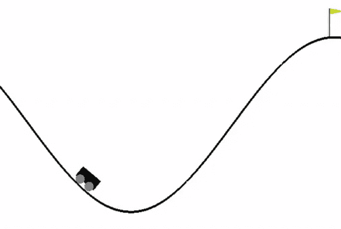

除非特别说明，所有 gif 和图片均由作者提供

增强学习问题是最有趣的机器学习问题之一。在这篇文章中，我教一个机器学习模型玩一个小游戏。

在我的[上一篇文章](/reinforcement-learning-an-introduction-a8783f9ea993)中，我详细介绍了强化学习理论，在这篇文章中，我将把这个理论应用于山地汽车问题。我将通过训练两个模型并比较它们的性能，向您展示解决这个问题的两种主要方法。第一个通过**表格离散化**训练，第二个通过**梯度下降法**训练。

# 1.山地汽车问题

## 问题设置

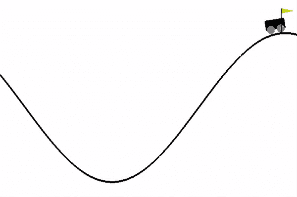

GIF。1:山地车问题

以上是山地汽车问题的 GIF(如果你看不到它，试试桌面或浏览器)。我用了 OpenAI 的运行游戏环境的名为 [gym](https://gym.openai.com/) 的 python 库。

汽车在两座小山之间启动。目标是让汽车到达右边的山顶。这辆车没有足够的发动机功率通过加速到达山顶。为了获胜，汽车必须通过前后摆动来增加动力，直到它有足够的速度到达旗子。

## 代理、动作、环境、状态

这辆车是我们的强化学习**代理** *。*它与环境相互作用，采取行动；玩游戏。

**环境**相当简单，我们只需要知道汽车在每一个**状态**下的两件事，它们是它的**位置**和它的**速度**。这个问题是二维的，它的状态空间(具有所有可能的位置和速度的空间)也是二维的。

汽车在每种状态下只有 3 种可能的**动作**，它可以向前加速，向后加速，或者什么也不做。每次代理采取一个动作，环境(游戏)都会返回一个新的状态(一个位置和速度)。

让我们举个例子，汽车从中间开始，它的位置可能是，速度也是。这是它的初始状态。然后，代理可能决定加速前进，并将该动作给予环境。环境将返回一个新的状态，比如位置 1，速度 1。我们模型的目标是学习在每个状态下采取什么行动来帮助它到达旗帜。

## 价值、奖励、政策

强化学习就是在代理做得好的时候奖励它(正强化)，做得不好的时候惩罚它(负强化)。

每当汽车到达旗帜，它将获得一大笔奖励。然而，我们不想只在模型到达旗帜时奖励它，因为这将使它难以学习。我们也可以奖励每个州的代理人。例如，人们可以在每一个州按比例奖励该模型，奖励的数量与它所建立的能量成比例。汽车需要积累足够的动能(速度)，然后将其转化为势能(高度)。奖励汽车每次储存的能量将有助于它学会够到旗子。

为了让我们的汽车学习在每一步采取什么行动，它将试图确定每个行动“有多好”。一个动作有多好，可以用一个状态的**值**来量化。一个国家的价值是该国所有未来预期回报的总和。一个州的价值越高，模型认为它将从中获得的回报就越多。**强化学习模型的目标是建立这个价值函数的近似值。**

所以在每一个状态下，汽车都可以看到它所有可能的动作(向前加速，向后加速，或者不加速)。然后，它可以计算未来状态的期望值，并选择最佳动作。

但是选择行动并不像采取期望值最高的行动那么简单。强化学习模型的策略是选择什么行动背后的逻辑。人们不能每次都选择价值最高的行动。这是因为如果我们的价值函数是错误的，那么我们就会过多地阻碍我们模型的学习。我们必须平衡**探索**(尝试随机行动)和**开发**(采取价值最高的行动)。更多的理论可以参考萨顿和巴尔托对 RL 的介绍[1]。

## 估计价值函数

我将用两种方法来估计价值函数。这些是通过表格离散化方法和梯度下降方法。

我还会比较两种算法来估计价值函数。这是 Q-Learning 和 SARSA。如果你想了解更多的细节，我建议查看[之前的文章](/reinforcement-learning-an-introduction-a8783f9ea993)，但是总的来说，Q-learning 是一个非策略算法，而 SARSA 是一个策略算法:

让我们设定一个示例策略，有 95%的概率汽车采取具有最高价值的行动，有 5%的概率汽车随机采取行动。

在采取行动时，Q-learning 和 SARSA 都会应用该政策。然而，当估计未来状态的值时，Q-learning 将总是采取具有最高值的动作，其中 as SARSA 将再次应用该策略。

# 2.表格离散化

表格离散化的目标是以表格形式了解所有可能状态的值。该表将包含所有可能的状态。

我们的状态空间是连续的，意味着有无限多的状态(具有无限分辨率的位置和速度)。假设我们的位置在-20 和 20 之间，其中 0 是汽车的起点。-20 到 20 之间有无限多的位置。

我们不能仅仅制作一个无限大的表来表示我们的状态空间，因此我们把它分成块。

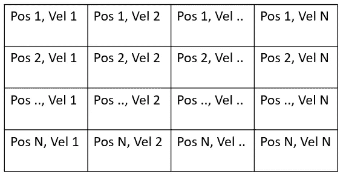

表 1:山地车问题的离散化空间

以上是山地车问题离散化空间的表格形式。分辨率是 N。因此有 N 个可能的速度值，和 N 个可能的速度值。所以总共有 N 种可能的状态。

## 近似值函数:表格法

现在，我们可以通过 Q-learning 来逼近价值函数，从而确定每个状态下的最佳行动:

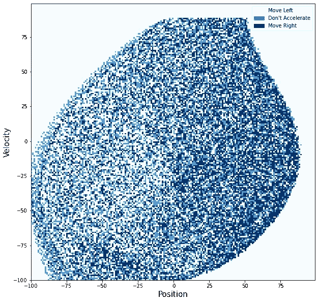

图 1:表格法 Q-Learning 的近似值函数

这里我把 N = 200 的空间离散化了。这是与上面相同的表格，但是我在每个框中用最高值的动作进行了着色。深蓝色表示向右加速，浅蓝色表示什么都不做，白色表示向左加速。

这个近似值函数有点像汽车的大脑。汽车将简单地做价值函数所指示的事情。

值函数非常复杂，当它在地图的右侧时，偏好向右移动，在地图的左侧，偏好向左移动。

我们来看看 value 函数是如何实时学习的(如果看不到 GIF 我建议切换到浏览器或者桌面)。

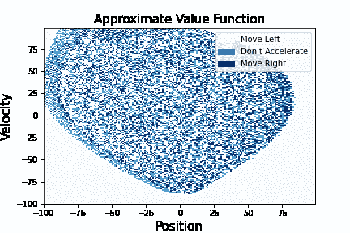

GIF。2:用列表法学习近似值函数

这个 GIF 是在 300 集期间生成的(汽车到达标志 300 次，直到它学习了这个值函数)。

一些很酷的观察:

*   原点稍微偏离中心，
*   默认动作是向左加速
*   模型只更新它看到的状态
*   这个模型似乎随着时间的推移扩大了它的观察空间
*   你离原点越远，你的能量越高(你的位置或速度越大)。

除了选择的动作，我还可以画出数值的大小。这表明汽车处于这些状态的次数，因此让我们了解模型的可信度，以及它在哪些状态下最有信心。

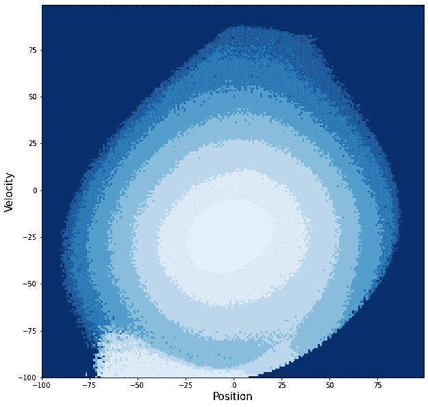

图 2:通过表格方法得到的价值函数的置信图

如你所料，原点明亮，表示信心高，外围黑暗，表示信心低。有趣的是左下方的尾巴。当位置在原点附近并且非常快且为负时，模型似乎对该做什么很有信心。这可能是它如何在左边的山上到达好的高度，允许它然后向左推并且到达旗子。

# 3.梯度下降法

表格离散化效果很好，学习起来也很快。然而，这是一个非常简单的问题，因此状态空间很容易被离散化。当遇到更困难的问题时，在内存中存储状态空间可能是不可能的。这就是梯度下降法的用武之地。

在梯度下降法中，我们学习一个将状态空间映射到值近似值的函数。对于一个线性模型，这可以简单地通过将状态与模型的权重进行点积来完成。然而，我们不仅仅想要输入和输出之间的线性映射，我们还在寻找更复杂的东西。在这里，你可以应用任何复杂的机器学习架构，比如神经网络。相反，我应用可能是我最喜欢的一种模型，径向基函数(RBF)。点击此处了解更多信息！

简而言之，RBF 模型使用一组高斯函数将输入空间映射到更高维的空间。在这个更高维度的空间中，我们可以拟合线性模型，有效地拟合原始空间中的非线性模型。

模型的权重可以用 Q-Learning 和 SARSA 来学习。让我们看看他们的学习价值函数是什么样的:

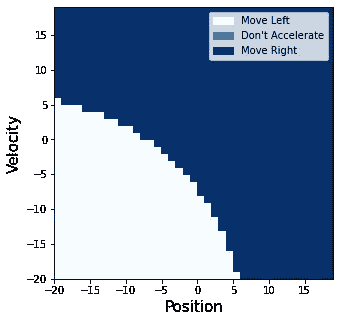

图 3:梯度下降法的价值函数，10 个基本函数(Q 学习)

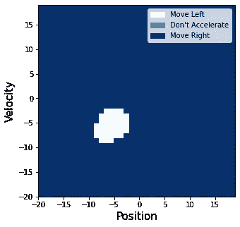

图 4:梯度下降法的价值函数，100 个基函数(Q 学习)

我只包含了 Q-Learning 值函数，因为 SARSA 和 Q-Learning 非常相似。有了 10 个基函数，您可以看到映射非常简单(几乎是线性的)，而包含 100 个基函数会创建一个更复杂的映射。

请注意，在上面的图片中，我已经将状态空间离散化以可视化值函数，但我实际上可以离散化到任意大的分辨率。这是因为我们的模型正在学习状态空间和值函数之间的映射，而不是学习每个状态的最佳值(像表格方法一样)。

你可以看到近似值函数比表格方法简单得多。这是因为我使用了低维径向基函数，因此映射非常平滑是正常的。由于这种平滑度，模型的性能受到影响。如果我使用非常复杂的东西，比如深度学习神经网络，那么价值函数可能会复杂得多。

# 4.比较性能

下表比较了所有三种方法的性能:

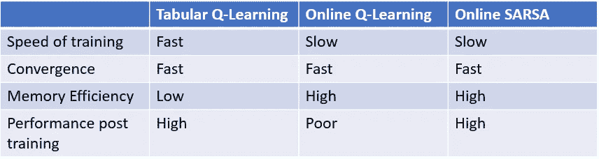

表 2:RL 中表格和在线学习方法的比较

正如我们所讨论的，在线学习的训练和收敛速度较慢，但内存效率更高，因为它不必以表格形式存储状态空间。**因此，表格方法根本无法很好地扩展。**对于这个简单的问题他们虽然处理得很好。

## 培训后绩效

您可能会注意到 Q-learning 模型的培训后表现很差，您可能会想知道这是为什么。让我们来看看培训后的模特表现:

图 5:已训练模型在 2000 个动作中完成运行的百分比

这里是每个模型在 2000 个动作中完成的运行百分比。表格方法在 100%的时候都是成功的，而 as SARSA 只在 78%的时候到达标记，而 Q-Learning 只有 21%。这与 Q-learning 是非策略的事实有关，这意味着当使用该模型时，它总是选择具有最高值的动作。上面看到的值函数不够复杂，模型无法学习最佳值函数，因此我们得到一个近似值。该政策增加的随机性有助于 SARSA 在不利的情况下摆脱困境。

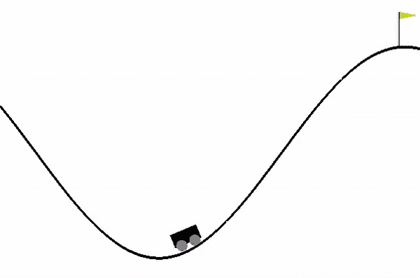

GIF。3:在线 Q-learning 方法未能到达标志

在上面的 GIF 中 Q-learning 在线模型卡住了。因为我们总是根据价值函数采取行动，从不随机化，所以模型可能会陷入这种情况。

## 趋同；聚集

这些模型一开始几乎不能解决问题，然而，在训练的最后，他们都很快解决了。

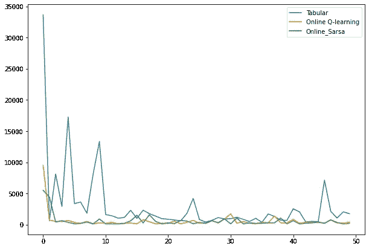

图 6:表格方法和在线学习方法的融合(动作数量与迭代次数)

在上图中，你可以看到模特在学习过程中到达终点线的动作数量。开始时，所有的模型都要做上千次动作才能到达终点。到最后，它们都是数百个，Q-Learning 和 SARSA 不那么零星。这可能与我在表格方法中使用的大学习率有关，它在以后的训练中变得平滑了。

# 结论

在本文中，我将强化学习应用于山地汽车问题。我比较了两种主要方法(表格方法和梯度下降方法)，并解释了这些模型是如何学习的。

这两种方法的主要区别在于，在表格离散化中，我们将状态空间分割成多个块，并学习每个状态的最佳值，这意味着该模型可以学习非常复杂的映射。在梯度下降法中，我们学习状态空间和值函数之间的平滑映射。我们发现梯度下降方法中的学习值函数比表格方法简单得多，因此表现不太好。根据您的资源和您正在处理的问题，一种方法可能比另一种更适合。

# 支持我

希望这对你有所帮助，如果你喜欢，你可以 [**关注我！**](https://medium.com/@diegounzuetaruedas)

您也可以成为 [**中级会员**](https://diegounzuetaruedas.medium.com/membership) 使用我的推荐链接，访问我的所有文章以及更多:[https://diegounzuetaruedas.medium.com/membership](https://diegounzuetaruedas.medium.com/membership)

# 你可能喜欢的其他文章

[强化学习:简介](/reinforcement-learning-an-introduction-a8783f9ea993)

[内核方法:简单介绍](/kernel-methods-a-simple-introduction-4a26dcbe4ebd)

# 参考

[1] R .萨顿和 a .巴尔托，强化学习，第二版。麻省理工学院出版社，2018。