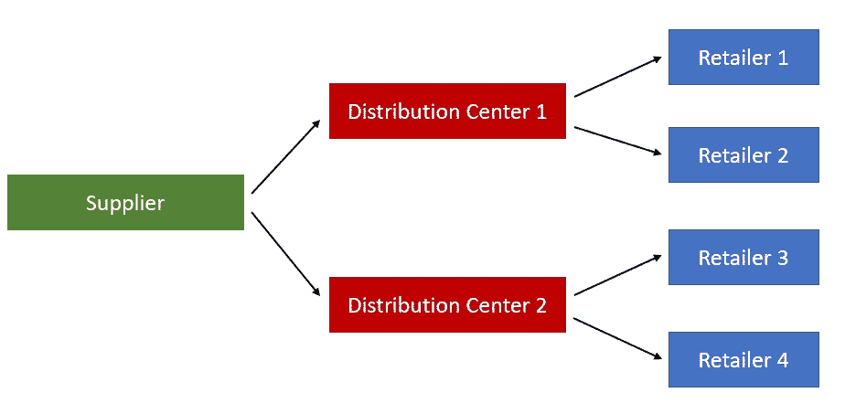
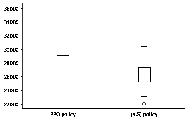

# 库存优化的强化学习系列 II:多级网络的强化学习模型

> 原文：<https://towardsdatascience.com/reinforcement-learning-for-inventory-optimization-series-ii-an-rl-model-for-a-multi-echelon-921857acdb00>

## 建立近似策略优化(PPO)模型来优化多级供应链网络的库存运作


纳斯蒂亚·杜尔希尔在 [Unsplash](https://unsplash.com?utm_source=medium&utm_medium=referral) 上的照片

更新:本文是我的博客系列*库存优化的强化学习*的第二篇文章。下面是同一系列中其他文章的链接。如果你感兴趣，请去看看。

[*库存优化的强化学习系列 I:单一零售商的 RL 模型*](https://medium.com/towards-data-science/a-reinforcement-learning-based-inventory-control-policy-for-retailers-ac35bc592278)

[*库存优化强化学习系列之三:RL 模型的虚拟到真实传递*](https://medium.com/towards-data-science/reinforcement-learning-for-inventory-optimization-series-iii-sim-to-real-transfer-for-the-rl-model-d260c3b8277d)

在我的[上一篇文章](https://medium.com/towards-data-science/a-reinforcement-learning-based-inventory-control-policy-for-retailers-ac35bc592278)中，我提出了一个优化单个零售商库存控制策略的 DQN 模型，其客户需求模式可以用混合正态分布来描述。与传统的( *s* ， *S* )库存控制策略相比，DQN 模型取得了明显更好的结果。在这篇文章中，正如我在上一篇文章的结尾提到的，我将在库存优化的 RL 方面更进一步，并专注于为更复杂的供应链网络(多级网络)构建 RL 模型。

# 多级网络 RL 建模的挑战

毫无疑问，为多级网络构建 RL 模型远比单个零售商复杂。复杂之处在于供应链中实体的增加导致了可伸缩性问题。在前一篇文章的单个零售商的例子中，我们只关心一个实体——零售商的库存控制策略。因此，只需要建立一个代理，其动作空间表示零售商的订货量。然而，多级网络是一个更复杂的系统，通常涉及不同类型的实体(例如，制造厂、配送中心、零售商等)。).

为了建立这样一个系统的模型，我们有两种可能的方法。第一种方法是将每个实体建模为独立的代理，并建立多代理 RL 模型。在这种方法中，每个代理只关心网络中一个实体的动作，这就限制了动作空间的大小。然而，与单代理 RL 模型相比，多代理 RL 模型通常更难训练和调整，因为整个模型的成功取决于每个代理的良好训练和调整，以及代理之间的合作。第二种方法是使用单个代理对整个网络进行建模，其动作空间足够灵活，可以同时描述所有实体的排序决策，例如，一个 *n* 维动作空间，每个维度对应于每个实体的排序决策。然而，这种方法的缺点是随着实体数量的增加，动作空间的大小急剧增加。动作空间的大小随着实体的数量呈指数增长。

# 简单多级网络的 RL 模型

让我们从[上一篇文章](https://medium.com/towards-data-science/a-reinforcement-learning-based-inventory-control-policy-for-retailers-ac35bc592278)中的例子开始。假设有一家零售公司，在全国不同地区开设零售店，销售可乐盈利。在[前一篇文章](https://medium.com/towards-data-science/a-reinforcement-learning-based-inventory-control-policy-for-retailers-ac35bc592278)中，我们没有关注单个零售店的库存运作，而是假设零售公司拥有自己的配送中心(DC)来满足其零售店的需求，我们寻求优化由配送中心和零售店组成的整个网络的库存控制策略。

为了使例子更简单，我们考虑一个仅由两个配送中心和四个零售商组成的多级网络。下图描述了配送中心和零售商之间的运输联系。



正在调查的简单多级供应链网络(图片由作者提供)

我们看到，零售公司首先从供应商那里购买可乐，然后将可乐运输到 DC 1 号和 DC 2 号。DC 1 存储库存以满足零售商 1 和零售商 2 的订单，DC 2 存储库存以满足零售商 3 和零售商 4 的订单。在本例中，让我们进一步假设所有四家零售商都有与[上一篇文章](https://medium.com/towards-data-science/a-reinforcement-learning-based-inventory-control-policy-for-retailers-ac35bc592278)中相同的客户需求模式。具体来说，所有四个零售商的客户需求都遵循混合正态分布，其中周一至周四的需求遵循具有最低均值的正态分布，周五的需求遵循具有中等均值的正态分布，周六至周日的需求遵循具有最高均值的正态分布。

对于这个特殊的问题，需要注意的是整个网络可以分解成两个子网络，一个由 DC 1、零售商 1 和零售商 2 组成，另一个由 DC 2、零售商 3 和零售商 4 组成。这两个子网络具有相同的客户需求分布。因此，为了使训练过程更容易，我们可以在这里采用分而治之的方法。我们不是对整个网络建模，而是仅通过一个 RL 代理对子网络建模，并且我们依次使用来自第一和第二子网络的数据来训练 RL 代理。RL 模型的状态、动作和奖励定义如下:

1.  State: ( *i_pt_dc1* ， *i_pt_r1，i_pt_r2，dow_t* )，其中 *i_pt_dc1* 为 DC 1 在 *t* 日结束时的库存位置*， *i_pt_r1* 为零售商 1 的库存位置， *i_pt_r2* 为*
2.  动作:( *a_t_dc1* ， *a_t_r1* ， *a_t_r2* )，其中 *a_t_dc1* 是 DC 1 在第 *t* 天结束时的订单数量， *a_t_r1* 是零售商 1 在时的订单数量注意，如果 *a_t_dc1* 、 *a_t_r1* 或 *a_t_r2* 为 0 *、*那么我们当时不下单对应的实体。行动空间受到最大订货量的限制，最大订货量由供应商或运输车辆的容量决定。
3.  奖励:*r _ t = r _ t _ R1+r _ t _ R2-h _ t _ R1-h _ t _ R2-h _ t _ dc1-f _ t _ R1-f _ t _ R2-f _ t _ dc1-v _ t _ dc1，*其中 *r_t_r1* 和 *r_t_r2* 为第(*t+1)**日白天在零售商 1 和 2 处销售产品所获得的收益 零售商 1、2 和 DC 1 在第 *t* 个决策时期产生的配送费用，以及 *v_t_dc1 i* s 在第 *t* 天结束时在 DC 1 产生的可变订购成本(供应商收取的产品购买成本)。 因为我们假设可变订购成本仅指购买成本，我们只需要在 DC 1 计算这个成本。很容易看出，报酬 *r_t* 就是在第 *t* 个决策历元从 DC 1、零售商 1 和零售商 2 组成的子网络中获得的利润。*

注意，这个建模框架遵循上一节提到的第二种建模方法，它可能会遭受维数灾难。如果我们假设每个实体的动作取从 0 到 *a_max* (最大订货量)的离散值，那么动作空间的大小随着网络中实体的数量呈指数增长。这给有效训练 RL 代理造成了困难。缓解这个问题的一种方法是将一个动作可以采取的值限制在[0，*a _ max**区间*内。*例如*，*如果 *a_max* = 20 *，*我们可以限制动作只能取值 0、5、15 或 20，而不是允许它取 0 到 20 之间的每个整数。这可能在某种程度上破坏从 RL 代理获得的结果策略的最优性，但是它可以显著地减小动作空间的大小。*

# *数值实验*

*假设有一家小型零售公司向其客户销售可乐。该零售公司有两个配送中心和四个零售商来满足客户需求。每当该公司想在任何 DC 或零售商那里补充库存时，该公司必须订购整数箱可乐(一箱装 24 罐)。假设对于零售商，可乐的单位售价为每箱 30 美元，持有成本为每箱每晚 3 美元，固定订购成本为每订单 50 美元，库存能力为 50 箱，每订单允许的最大订购量为 20 箱，在一个周日结束时初始库存为 25 箱，提前期为 2 天。周一至周四的需求服从正态分布 *N* (3，1.5)，周五的需求服从正态分布 *N* (6，1)，周六至周日的需求服从正态分布 *N* (12，2)。对于配送中心，每晚每箱的持有成本为 1 美元，固定订购成本为每订单 75 美元，库存能力为 200 箱，每订单允许的最大订单数量为 100 箱，周日结束时的初始库存为 100 箱，提前期为 5 天。我们从混合分布中生成 52 周的历史需求样本，并将其用作 RL 模型的训练数据集。*

*关于要使用的特定 RL 算法的选择，我采用了近似策略优化(PPO)算法，因为它是一种最先进的基于策略的 RL 算法，能够给出随机策略。我还尝试使用基于值的算法来生成确定性策略(例如，DQN)，但发现 PPO 对于这个特殊的例子更有效。这里，我省略了对 PPO 算法的详细解释，因为这不是本文的重点。感兴趣的读者可以参考[这篇文章](https://jonathan-hui.medium.com/rl-proximal-policy-optimization-ppo-explained-77f014ec3f12)了解更多细节。*

*作为基准，我们将使用用于训练 PPO 模型的相同数据集来优化经典( *s* ， *S* )库存控制策略，并在测试集中将其性能与 PPO 进行比较。*

## *PPO 模型的定型代码*

*首先，我们生成包含四家零售商 52 周历史需求记录的训练数据集。请注意，非整数需求数据会四舍五入为最接近的整数。*

```
*import numpy as np
import matplotlib.pyplot as plt
import random
np.random.seed(0)
demand_hist_list = []
for k in range(4):
    demand_hist = []
    for i in range(52):
        for j in range(4):
            random_demand = np.random.normal(3, 1.5)
            if random_demand < 0:
                random_demand = 0
            random_demand = np.round(random_demand)
            demand_hist.append(random_demand)
        random_demand = np.random.normal(6, 1)
        if random_demand < 0:
            random_demand = 0
        random_demand = np.round(random_demand)
        demand_hist.append(random_demand)
        for j in range(2):
            random_demand = np.random.normal(12, 2)
            if random_demand < 0:
                random_demand = 0
            random_demand = np.round(random_demand)
            demand_hist.append(random_demand)
    demand_hist_list.append(demand_hist)*
```

*然后，我们定义了 PPO 代理交互的库存优化问题的环境。该环境包含一个有一个 DC 和两个零售商的子网络。在本例中，零售商不考虑延期交货，因为我们假设如果顾客在零售店没有看到任何剩余的可乐，他们会去其他商店购买可乐。但是，DC 会考虑延期交货。当 DC 没有足够的库存来满足零售商的订单时，就会发生延期交货，而 DC 会在补充库存后尽快满足延期交货。为了限制行动空间的大小，我们允许 DC 的订货量取值为[0，10，20，30，40，50，60，70，80，90，100]，两个零售商取值为[0，5，10，15，20]。动作空间的大小现在是 11*5*5 = 275。*

```
*import itertools
action_lists = [[0, 10, 20, 30, 40, 50, 60, 70, 80, 90, 100],[0, 5, 10, 15, 20],[0, 5, 10, 15, 20]]
action_map = [x for x in itertools.product(*action_lists)]

class Retailer():
    def __init__(self, demand_records):
        self.inv_level = 25
        self.inv_pos = 25
        self.order_quantity_limit = 20
        self.holding_cost = 3
        self.lead_time = 2
        self.order_arrival_list = []
        self.backorder_quantity = 0
        self.capacity = 50
        self.demand_list = demand_records
        self.unit_price = 30
        self.fixed_order_cost = 50

    def reset(self):
        self.inv_level = 25
        self.inv_pos = 25
        self.order_arrival_list = []
        self.backorder_quantity = 0

    def order_arrival(self, current_period):
        n_orders = 0
        if len(self.order_arrival_list) > 0:
            index_list = []
            for j in range(len(self.order_arrival_list)):
                if current_period == self.order_arrival_list[j][0]:
                    self.inv_level = min(self.capacity, self.inv_level + self.order_arrival_list[j][1])
                    n_orders += 1
                    index_list.append(j)
            self.order_arrival_list =  [e for i, e in enumerate(self.order_arrival_list) if i not in index_list]
        holding_cost_total = self.inv_level*self.holding_cost
        return n_orders, holding_cost_total

    def satisfy_demand(self, demand):
        units_sold = min(demand, self.inv_level)
        self.inv_level = max(0,self.inv_level-demand)
        self.inv_pos = self.inv_level
        if len(self.order_arrival_list) > 0:
            for j in range(len(self.order_arrival_list)):
                self.inv_pos += self.order_arrival_list[j][1]
        revenue = units_sold*self.unit_price
        return revenue

class DistributionCenter():
    def __init__(self):
        self.inv_level = 100
        self.inv_pos = 100
        self.order_quantity_limit = 100
        self.holding_cost = 1
        self.lead_time = 5
        self.order_arrival_list = []
        self.capacity = 200
        self.fixed_order_cost = 75

    def reset(self):
        self.inv_level = 100
        self.inv_pos = 100
        self.order_arrival_list = []

    def place_order(self, order_quantity, current_period):
        if order_quantity > 0:
            self.order_arrival_list.append([current_period+self.lead_time, order_quantity])

    def order_arrival(self, retailers, current_period):
        if len(self.order_arrival_list) > 0:
            if current_period == self.order_arrival_list[0][0]:
                self.inv_level = min(self.capacity, self.inv_level+self.order_arrival_list[0][1])
                self.order_arrival_list.pop(0)
        holding_cost_total = self.inv_level*self.holding_cost
        return holding_cost_total

    def satisfy_demand(self, retailers, actions, current_period):
        quantity_satisfied = [0,0]
        total_backorder = np.sum([retailer.backorder_quantity for retailer in retailers])
        if total_backorder > 0:
            if self.inv_level <= retailers[0].backorder_quantity:
                retailers[0].backorder_quantity -= self.inv_level
                quantity_satisfied[0] += self.inv_level
                self.inv_level = 0
            if self.inv_level > retailers[0].backorder_quantity and self.inv_level <= total_backorder:
                if retailers[0].backorder_quantity == 0:
                    retailers[1].backorder_quantity -= self.inv_level
                    quantity_satisfied[1] += self.inv_level
                else:
                    quantity_left = self.inv_level - retailers[0].backorder_quantity
                    quantity_satisfied[0] += retailers[0].backorder_quantity
                    retailers[0].backorder_quantity = 0
                    quantity_satisfied[1] += quantity_left
                    retailers[1].backorder_quantity -= quantity_left
                self.inv_level = 0
            if self.inv_level > total_backorder:
                if retailers[0].backorder_quantity == 0 and retailers[1].backorder_quantity != 0:
                    quantity_satisfied[1] += retailers[1].backorder_quantity
                    retailers[1].backorder_quantity = 0
                if retailers[0].backorder_quantity != 0 and retailers[1].backorder_quantity == 0:
                    quantity_satisfied[0] += retailers[0].backorder_quantity
                    retailers[0].backorder_quantity = 0
                if retailers[0].backorder_quantity != 0 and retailers[1].backorder_quantity != 0:
                    quantity_satisfied[0] += retailers[0].backorder_quantity
                    quantity_satisfied[1] += retailers[1].backorder_quantity
                    retailers[0].backorder_quantity = 0
                    retailers[1].backorder_quantity = 0
                self.inv_level -= total_backorder

        if self.inv_level > 0:
            if self.inv_level <= actions[0]:
                quantity_satisfied[0] += self.inv_level
                retailers[0].backorder_quantity += actions[0] - self.inv_level
                self.inv_level = 0    
            if self.inv_level > actions[0] and self.inv_level <= np.sum(actions):
                if actions[0] == 0:
                    quantity_satisfied[1] += self.inv_level
                    retailers[1].backorder_quantity += actions[1] - self.inv_level
                else:
                    inv_left = self.inv_level-actions[0]
                    quantity_satisfied[0] += actions[0]
                    quantity_satisfied[1] += inv_left
                    retailers[1].backorder_quantity += actions[1] - inv_left
                self.inv_level = 0
            if self.inv_level > np.sum(actions): 
                if actions[0] == 0 and actions[1] != 0:
                    quantity_satisfied[1] += actions[1]
                if actions[0] != 0 and actions[1] == 0:
                    quantity_satisfied[0] += actions[0]
                if actions[0] != 0 and actions[1] != 0:    
                    quantity_satisfied[0] += actions[0]
                    quantity_satisfied[1] += actions[1]
                self.inv_level -= np.sum(actions)   
        else:
            retailers[0].backorder_quantity += actions[0]
            retailers[1].backorder_quantity += actions[1]  

        for i in range(len(retailers)):
            quantity_left = quantity_satisfied[i]
            while quantity_left > 0:
                if quantity_left > retailers[i].order_quantity_limit:
                    retailers[i].order_arrival_list.append([current_period+retailers[i].lead_time, retailers[i].order_quantity_limit])
                    quantity_left -= retailers[i].order_quantity_limit
                else:
                    retailers[i].order_arrival_list.append([current_period+retailers[i].lead_time, quantity_left])
                    quantity_left = 0

        self.inv_pos = self.inv_level
        if len(self.order_arrival_list) > 0:
            for j in range(len(self.order_arrival_list)):
                self.inv_pos += self.order_arrival_list[j][1]
        for retailer in retailers:
            self.inv_pos -= retailer.backorder_quantity

class MultiEchelonInvOptEnv():
    def __init__(self, demand_records):
        self.n_retailers = 2
        self.n_DCs = 1
        self.retailers = []
        for i in range(self.n_retailers):
            self.retailers.append(Retailer(demand_records[i]))
        self.DCs = []
        for i in range(self.n_DCs):
            self.DCs.append(DistributionCenter()) 
        self.n_period = len(demand_records[0])
        self.current_period = 1
        self.day_of_week = 0
        self.state = np.array([DC.inv_pos for DC in self.DCs] + [retailer.inv_pos for retailer in self.retailers] + \
                              self.convert_day_of_week(self.day_of_week))
        self.variable_order_cost = 10
        self.demand_records = demand_records

    def reset(self):
        for retailer in self.retailers:
            retailer.reset()
        for DC in self.DCs:
            DC.reset()
        self.current_period = 1
        self.day_of_week = 0 
        self.state = np.array([DC.inv_pos for DC in self.DCs] + [retailer.inv_pos for retailer in self.retailers] + \
                              self.convert_day_of_week(self.day_of_week))
        return self.state

    def step(self, action):
        action_modified = action_map[action]
        y_list = []
        for i in range(self.n_DCs):
            y = 1 if action_modified[i] > 0 else 0    
            y_list.append(y)
        for DC,order_quantity in zip(self.DCs,action_modified[:self.n_DCs]):
            DC.place_order(order_quantity,self.current_period)
        sum_holding_cost_DC = 0
        for i in range(self.n_DCs):
            holding_cost_total = self.DCs[i].order_arrival(self.retailers,self.current_period)
            sum_holding_cost_DC += holding_cost_total
            self.DCs[i].satisfy_demand(self.retailers,action_modified[i*2+1:i*2+3],self.current_period)
        sum_n_orders = 0
        sum_holding_cost_retailer = 0
        sum_revenue = 0
        for retailer,demand in zip(self.retailers,self.demand_records):
            n_orders, holding_cost_total = retailer.order_arrival(self.current_period)
            sum_n_orders += n_orders
            sum_holding_cost_retailer += holding_cost_total
            revenue = retailer.satisfy_demand(demand[self.current_period-1])
            sum_revenue += revenue    
        reward = sum_revenue - sum_holding_cost_retailer - sum_holding_cost_DC - sum_n_orders*self.retailers[0].fixed_order_cost - \
                 np.sum(y_list)*self.DCs[0].fixed_order_cost - np.sum(action_modified[:self.n_DCs])*self.variable_order_cost

        self.day_of_week = (self.day_of_week+1)%7
        self.state = np.array([DC.inv_pos for DC in self.DCs] + [retailer.inv_pos for retailer in self.retailers] + \
                              self.convert_day_of_week(self.day_of_week))
        self.current_period += 1
        if self.current_period > self.n_period:
            terminate = True
        else: 
            terminate = False
        return self.state, reward, terminate

    def convert_day_of_week(self,d):
        if d == 0:
            return [0, 0, 0, 0, 0, 0]
        if d == 1:
            return [1, 0, 0, 0, 0, 0] 
        if d == 2:
            return [0, 1, 0, 0, 0, 0] 
        if d == 3:
            return [0, 0, 1, 0, 0, 0] 
        if d == 4:
            return [0, 0, 0, 1, 0, 0] 
        if d == 5:
            return [0, 0, 0, 0, 1, 0] 
        if d == 6:
            return [0, 0, 0, 0, 0, 1]* 
```

*现在我们开始用 PyTorch 构建 PPO 模型。这部分 PPO 的实现是基于[这个资源库](https://github.com/nikhilbarhate99/PPO-PyTorch)的。*

```
*import torch
import torch.nn as nn
from torch.distributions import MultivariateNormal
from torch.distributions import Categorical

################################## set device ##################################
print("============================================================================================")
# set device to cpu or cuda
device = torch.device('cpu')
if(torch.cuda.is_available()): 
    device = torch.device('cuda:0') 
    torch.cuda.empty_cache()
    print("Device set to : " + str(torch.cuda.get_device_name(device)))
else:
    print("Device set to : cpu")
print("============================================================================================")

################################## PPO Policy ##################################
class RolloutBuffer:
    def __init__(self):
        self.actions = []
        self.states = []
        self.logprobs = []
        self.rewards = []
        self.is_terminals = []

    def clear(self):
        del self.actions[:]
        del self.states[:]
        del self.logprobs[:]
        del self.rewards[:]
        del self.is_terminals[:]

class ActorCritic(nn.Module):
    def __init__(self, state_dim, action_dim, has_continuous_action_space, action_std_init):
        super(ActorCritic, self).__init__()

        self.has_continuous_action_space = has_continuous_action_space

        if has_continuous_action_space:
            self.action_dim = action_dim
            self.action_var = torch.full((action_dim,), action_std_init * action_std_init).to(device)
        # actor
        if has_continuous_action_space :
            self.actor = nn.Sequential(
                            nn.Linear(state_dim, 256),
                            nn.Tanh(),
                            nn.Linear(256,256),
                            nn.Tanh(),
                            nn.Linear(256, action_dim),
                            nn.Sigmoid()
                        )
        else:
            self.actor = nn.Sequential(
                            nn.Linear(state_dim, 384),
                            nn.Tanh(),
                            nn.Linear(384, 384),
                            nn.Tanh(),
                            nn.Linear(384, action_dim),
                            nn.Softmax(dim=-1)
                        )
        # critic
        self.critic = nn.Sequential(
                        nn.Linear(state_dim, 128),
                        nn.Tanh(),
                        nn.Linear(128, 128),
                        nn.Tanh(),
                        nn.Linear(128, 1)
                    )

    def set_action_std(self, new_action_std):
        if self.has_continuous_action_space:
            self.action_var = torch.full((self.action_dim,), new_action_std * new_action_std).to(device)
        else:
            print("--------------------------------------------------------------------------------------------")
            print("WARNING : Calling ActorCritic::set_action_std() on discrete action space policy")
            print("--------------------------------------------------------------------------------------------")

    def forward(self):
        raise NotImplementedError

    def act(self, state):
        if self.has_continuous_action_space:
            action_mean = self.actor(state)
            cov_mat = torch.diag(self.action_var).unsqueeze(dim=0)
            dist = MultivariateNormal(action_mean, cov_mat)
        else:
            action_probs = self.actor(state)
            dist = Categorical(action_probs)

        action = dist.sample()
        action_logprob = dist.log_prob(action)

        return action.detach(), action_logprob.detach()

    def evaluate(self, state, action):

        if self.has_continuous_action_space:
            action_mean = self.actor(state)

            action_var = self.action_var.expand_as(action_mean)
            cov_mat = torch.diag_embed(action_var).to(device)
            dist = MultivariateNormal(action_mean, cov_mat)

            # For Single Action Environments.
            if self.action_dim == 1:
                action = action.reshape(-1, self.action_dim)
        else:
            action_probs = self.actor(state)
            dist = Categorical(action_probs)
        action_logprobs = dist.log_prob(action)
        dist_entropy = dist.entropy()
        state_values = self.critic(state)

        return action_logprobs, state_values, dist_entropy

class PPO:
    def __init__(self, state_dim, action_dim, lr_actor, lr_critic, gamma, K_epochs, eps_clip, has_continuous_action_space, action_std_init=0.6):

        self.has_continuous_action_space = has_continuous_action_space

        if has_continuous_action_space:
            self.action_std = action_std_init

        self.gamma = gamma
        self.eps_clip = eps_clip
        self.K_epochs = K_epochs

        self.buffer = RolloutBuffer()

        self.policy = ActorCritic(state_dim, action_dim, has_continuous_action_space, action_std_init).to(device)
        self.optimizer = torch.optim.Adam([
                        {'params': self.policy.actor.parameters(), 'lr': lr_actor},
                        {'params': self.policy.critic.parameters(), 'lr': lr_critic}
                    ])

        self.policy_old = ActorCritic(state_dim, action_dim, has_continuous_action_space, action_std_init).to(device)
        self.policy_old.load_state_dict(self.policy.state_dict())

        self.MseLoss = nn.MSELoss()

    def set_action_std(self, new_action_std):
        if self.has_continuous_action_space:
            self.action_std = new_action_std
            self.policy.set_action_std(new_action_std)
            self.policy_old.set_action_std(new_action_std)
        else:
            print("--------------------------------------------------------------------------------------------")
            print("WARNING : Calling PPO::set_action_std() on discrete action space policy")
            print("--------------------------------------------------------------------------------------------")

    def decay_action_std(self, action_std_decay_rate, min_action_std):
        print("--------------------------------------------------------------------------------------------")
        if self.has_continuous_action_space:
            self.action_std = self.action_std - action_std_decay_rate
            self.action_std = round(self.action_std, 4)
            if (self.action_std <= min_action_std):
                self.action_std = min_action_std
                print("setting actor output action_std to min_action_std : ", self.action_std)
            else:
                print("setting actor output action_std to : ", self.action_std)
            self.set_action_std(self.action_std)

        else:
            print("WARNING : Calling PPO::decay_action_std() on discrete action space policy")
        print("--------------------------------------------------------------------------------------------")

    def select_action(self, state):

        if self.has_continuous_action_space:
            with torch.no_grad():
                state = torch.FloatTensor(state).to(device)
                action, action_logprob = self.policy_old.act(state)

            self.buffer.states.append(state)
            self.buffer.actions.append(action)
            self.buffer.logprobs.append(action_logprob)

            return action.detach().cpu().numpy().flatten()
        else:
            with torch.no_grad():
                state = torch.FloatTensor(state).to(device)
                action, action_logprob = self.policy_old.act(state)

            self.buffer.states.append(state)
            self.buffer.actions.append(action)
            self.buffer.logprobs.append(action_logprob)

            return action.item()

    def update(self):
        # Monte Carlo estimate of returns
        rewards = []
        discounted_reward = 0
        for reward, is_terminal in zip(reversed(self.buffer.rewards), reversed(self.buffer.is_terminals)):
            if is_terminal:
                discounted_reward = 0
            discounted_reward = reward + (self.gamma * discounted_reward)
            rewards.insert(0, discounted_reward)

        # Normalizing the rewards
        rewards = torch.tensor(rewards, dtype=torch.float32).to(device)
        rewards = (rewards - rewards.mean()) / (rewards.std() + 1e-7)

        # convert list to tensor
        old_states = torch.squeeze(torch.stack(self.buffer.states, dim=0)).detach().to(device)
        old_actions = torch.squeeze(torch.stack(self.buffer.actions, dim=0)).detach().to(device)
        old_logprobs = torch.squeeze(torch.stack(self.buffer.logprobs, dim=0)).detach().to(device)

        # Optimize policy for K epochs
        for _ in range(self.K_epochs):

            # Evaluating old actions and values
            logprobs, state_values, dist_entropy = self.policy.evaluate(old_states, old_actions)

            # match state_values tensor dimensions with rewards tensor
            state_values = torch.squeeze(state_values)

            # Finding the ratio (pi_theta / pi_theta__old)
            ratios = torch.exp(logprobs - old_logprobs.detach())

            # Finding Surrogate Loss
            advantages = rewards - state_values.detach()   
            surr1 = ratios * advantages
            surr2 = torch.clamp(ratios, 1-self.eps_clip, 1+self.eps_clip) * advantages

            # final loss of clipped objective PPO
            loss = -torch.min(surr1, surr2) + 0.5*self.MseLoss(state_values, rewards) - 0.01*dist_entropy

            # take gradient step
            self.optimizer.zero_grad()
            loss.mean().backward()
            self.optimizer.step()

        # Copy new weights into old policy
        self.policy_old.load_state_dict(self.policy.state_dict())

        # clear buffer
        self.buffer.clear()* 
```

```
*import os
import glob
import time
from datetime import datetime

import torch
import numpy as np

################################### Training ###################################
def train():
    print("============================================================================================")

    has_continuous_action_space = False # continuous action space; else discrete

    max_ep_len = 364                   # max timesteps in one episode
    max_training_timesteps = int(364*15000)   # break training loop if timeteps > max_training_timesteps

    print_freq = max_ep_len * 10        # print avg reward in the interval (in num timesteps)

    action_std = 0.6            # starting std for action distribution (Multivariate Normal)
    action_std_decay_rate = 0.03       # linearly decay action_std (action_std = action_std - action_std_decay_rate)
    min_action_std = 0.03               # minimum action_std (stop decay after action_std <= min_action_std)
    action_std_decay_freq = int(1e5)  # action_std decay frequency (in num timesteps)
    #####################################################

    ## Note : print/log frequencies should be > than max_ep_len

    ################ PPO hyperparameters ################
    update_timestep = max_ep_len/2       # update policy every n timesteps
    K_epochs = 20               # update policy for K epochs in one PPO update

    eps_clip = 0.2          # clip parameter for PPO
    gamma = 0.99            # discount factor

    lr_actor = 0.00005       # learning rate for actor network
    lr_critic = 0.0001       # learning rate for critic network

    random_seed = 0         # set random seed if required (0 = no random seed)
    #####################################################

    state_dim = 9
    action_dim = 275

    torch.manual_seed(random_seed)
    np.random.seed(random_seed)

    ################# training procedure ################

    # initialize a PPO agent
    ppo_agent = PPO(state_dim, action_dim, lr_actor, lr_critic, gamma, K_epochs, eps_clip, has_continuous_action_space, action_std)

    # track total training time
    start_time = datetime.now().replace(microsecond=0)
    print("Started training at (GMT) : ", start_time)

    print("============================================================================================")

    # printing and logging variables
    print_running_reward = 0
    print_running_episodes = 0

    time_step = 0
    i_episode = 0

    # training loop
    for i in range(2):
        env = MultiEchelonInvOptEnv(demand_hist_list[i*2:i*2+2])
        while time_step <= max_training_timesteps:

            state = env.reset()
            current_ep_reward = 0

            for t in range(1, max_ep_len+1):

                # select action with policy

                action = ppo_agent.select_action(state)
                state, reward, done = env.step(action)

                # saving reward and is_terminals
                ppo_agent.buffer.rewards.append(reward)
                ppo_agent.buffer.is_terminals.append(done)

                time_step +=1
                current_ep_reward += reward

                # update PPO agent
                if time_step % update_timestep == 0:
                    ppo_agent.update()

                # if continuous action space; then decay action std of ouput action distribution
                if has_continuous_action_space and time_step % action_std_decay_freq == 0:
                    ppo_agent.decay_action_std(action_std_decay_rate, min_action_std)

                # printing average reward
                if time_step % print_freq == 0:

                    # print average reward till last episode
                    print_avg_reward = print_running_reward / print_running_episodes
                    print_avg_reward = round(print_avg_reward, 2)

                    print("Episode : {} \t\t Timestep : {} \t\t Average Reward : {}".format(i_episode, time_step, print_avg_reward))

                    print_running_reward = 0
                    print_running_episodes = 0

                # break; if the episode is over
                if done:
                    break

            print_running_reward += current_ep_reward
            print_running_episodes += 1

            i_episode += 1
    torch.save(ppo_agent.policy.state_dict(), desired_path)

if __name__ == '__main__':

    train()*
```

## *用于优化(S，S)策略的代码*

*对于这个特定的数值实验，可能的( *s* 、 *S* ) 组合的数量大得惊人。因此，列举所有可能的组合来优化( *s* ， *S* )策略是不切实际的。这里，我们采用贝叶斯优化(BO)来获得最优( *s* ， *S* )策略。BO 是一种黑盒优化方法。它通过从目标函数顺序采样并更新逼近目标函数的代理模型来优化目标函数。BO 使用一个获取函数来确定在哪里采样下一个点，并且随着更多的点被采样，代理模型的精度不断提高。最后，BO 返回所有先前采样点中具有最佳目标函数值的点作为最优解。关于 BO 更详细的介绍，感兴趣的读者可以参考本文。这部分业务对象的实现基于[这个库](https://github.com/fmfn/BayesianOptimization)。*

*在代码中，我们定义了一个有 6 个参数的目标函数，分别是 *s_DC，s_DC，s_r1，S_r1，s_r2，S_r2。*目标函数计算在历史需求数据集上获得的利润， *s_DC* 和 *S_DC* 定义两个*DC 的( *s，S* ) 策略， *s_r1* 和 *S_r1* 定义( *s，S* ) 策略然后我们使用 BO 优化这个函数。我们将 *S_DC* 的上限设置为 210，留出一点额外的空间来允许 *S* 到*取一个高于容量的值。我尝试将 *S_r1* 和 *S_r2* 到每个值的上限设置为【60，70，80，90，100】，发现 90 给出了最佳目标值。因此，我选择 90 作为上限。历史需求数据集上的最优解竟然是( *s_DC，s_DC，s_r1，S_r1，s_r2，S _ R2*)*=*(62，120，15，41，17，90) *。******

```
*def MultiEchelonInvOpt_sS(s_DC,S_DC,s_r1,S_r1,s_r2,S_r2):
    if s_DC > S_DC-1 or s_r1 > S_r1-1 or s_r2 > S_r2-1:
        return -1e8
    else:
        n_retailers = 4
        n_DCs = 2
        retailers = []
        for i in range(n_retailers):
            retailers.append(Retailer(demand_hist_list[i]))
        DCs = []
        for i in range(n_DCs):
            DCs.append(DistributionCenter()) 
        n_period = len(demand_hist_list[0])
        variable_order_cost = 10
        current_period = 1
        total_reward = 0
        while current_period <= n_period:
            action = []
            for DC in DCs:
                if DC.inv_pos <= s_DC:
                    action.append(np.round(min(DC.order_quantity_limit,S_DC-DC.inv_pos)))
                else:
                    action.append(0)
            for i in range(len(retailers)):
                if i%2 == 0:
                    if retailers[i].inv_pos <= s_r1:
                        action.append(np.round(min(retailers[i].order_quantity_limit,S_r1-retailers[i].inv_pos)))
                    else:
                        action.append(0)
                else:
                    if retailers[i].inv_pos <= s_r2:
                        action.append(np.round(min(retailers[i].order_quantity_limit,S_r2-retailers[i].inv_pos)))
                    else:
                        action.append(0)
            y_list = []
            for i in range(n_DCs):
                y = 1 if action[i] > 0 else 0    
                y_list.append(y)
            for DC,order_quantity in zip(DCs,action[:n_DCs]):
                DC.place_order(order_quantity,current_period)
            sum_holding_cost_DC = 0
            for i in range(n_DCs):
                holding_cost_total = DCs[i].order_arrival(retailers[i*2:i*2+2],current_period)
                sum_holding_cost_DC += holding_cost_total
                DCs[i].satisfy_demand(retailers[i*2:i*2+2],action[i*2+2:i*2+4],current_period)
            sum_n_orders = 0
            sum_holding_cost_retailer = 0
            sum_revenue = 0
            for retailer,demand in zip(retailers,demand_hist_list):
                n_orders, holding_cost_total = retailer.order_arrival(current_period)
                sum_n_orders += n_orders
                sum_holding_cost_retailer += holding_cost_total
                revenue = retailer.satisfy_demand(demand[current_period-1])
                sum_revenue += revenue    
            reward = sum_revenue - sum_holding_cost_retailer - sum_holding_cost_DC - sum_n_orders*retailers[0].fixed_order_cost - \
                     np.sum(y_list)*DCs[0].fixed_order_cost - np.sum(action[:n_DCs])*variable_order_cost

            current_period += 1
            total_reward += reward
        return total_reward*
```

```
*from bayes_opt import BayesianOptimization
pbounds = {'s_DC': (0,210), 'S_DC': (0, 210), 's_r1': (0, 90), 'S_r1': (0, 90), 's_r2': (0, 90), 'S_r2': (0, 90)}
optimizer = BayesianOptimization(
    f=MultiEchelonInvOpt_sS,
    pbounds=pbounds,
    random_state=0,
)
optimizer.maximize(
    init_points = 100,
    n_iter=1000
)
print(optimizer.max)*
```

## *测试 PPO 策略的代码*

*我们首先创建 100 个客户需求数据集进行测试。100 个数据集中的每一个都包含四家零售商 52 周的需求数据。我们可以将每个数据集视为未来 1 年需求的可能情景。然后，我们在每个需求数据集上评估 PPO 策略，并收集每个数据集的总回报。*

```
*np.random.seed(0)
demand_test = []
for k in range(100,200):
    demand_list = []
    for k in range(4):
        demand = []
        for i in range(52):
            for j in range(4):
                random_demand = np.random.normal(3, 1.5)
                if random_demand < 0:
                    random_demand = 0
                random_demand = np.round(random_demand)
                demand.append(random_demand)
            random_demand = np.random.normal(6, 1)
            if random_demand < 0:
                random_demand = 0
            random_demand = np.round(random_demand)
            demand.append(random_demand)
            for j in range(2):
                random_demand = np.random.normal(12, 2)
                if random_demand < 0:
                    random_demand = 0
                random_demand = np.round(random_demand)
                demand.append(random_demand)
        demand_list.append(demand)
    demand_test.append(demand_list)*
```

```
*import os
import glob
import time
from datetime import datetime

import torch
import numpy as np

has_continuous_action_space = False # continuous action space; else discrete
action_std = 0.6            # starting std for action distribution (Multivariate Normal)
action_std_decay_rate = 0.03       # linearly decay action_std (action_std = action_std - action_std_decay_rate)
min_action_std = 0.03               # minimum action_std (stop decay after action_std <= min_action_std)
action_std_decay_freq = int(1e5)  # action_std decay frequency (in num timesteps
eps_clip = 0.2          # clip parameter for PPO
gamma = 0.99            # discount factor
K_epochs = 20
lr_actor = 0.00005      # learning rate for actor network
lr_critic = 0.0001       # learning rate for critic network

random_seed = 0         # set random seed if required (0 = no random seed)
#####################################################

state_dim = 9
action_dim = 275

torch.manual_seed(random_seed)
np.random.seed(random_seed)

ppo_agent = PPO(state_dim, action_dim, lr_actor, lr_critic, gamma, K_epochs, eps_clip, has_continuous_action_space, action_std)
ppo_agent.policy_old.load_state_dict(torch.load(desired_path))
ppo_agent.policy.load_state_dict(torch.load(desired_path))

reward_RL = []
for demand in demand_test:
    reward_total = 0
    for i in range(2):
        env = MultiEchelonInvOptEnv(demand[i*2:i*2+2])
        state = env.reset()
        done = False
        reward_sub = 0
        while not done:
            action = ppo_agent.select_action(state)
            state, reward, done = env.step(action)
            reward_sub += reward
            if done:
                break
        reward_total += reward_sub
    reward_RL.append(reward_total)*
```

## *测试(S，S)策略的代码*

*我们在同一个测试集上评估( *s* ， *S* )策略。*

```
*def MultiEchelonInvOpt_sS_test(s_DC,S_DC,s_r1,S_r1,s_r2,S_r2,demand_records):
    if s_DC > S_DC-1 or s_r1 > S_r1-1 or s_r2 > S_r2-1:
        return -1e8
    else:
        n_retailers = 4
        n_DCs = 2
        retailers = []
        for i in range(n_retailers):
            retailers.append(Retailer(demand_records[i]))
        DCs = []
        for i in range(n_DCs):
            DCs.append(DistributionCenter()) 
        n_period = len(demand_records[0])
        variable_order_cost = 10
        current_period = 1
        total_reward = 0
        total_revenue = 0
        total_holding_cost_retailer = 0
        total_holding_cost_DC = 0
        total_variable_cost = 0
        while current_period <= n_period:
            action = []
            for DC in DCs:
                if DC.inv_pos <= s_DC:
                    action.append(np.round(min(DC.order_quantity_limit,S_DC-DC.inv_pos)))
                else:
                    action.append(0)
            for i in range(len(retailers)):
                if i%2 == 0:
                    if retailers[i].inv_pos <= s_r1:
                        action.append(np.round(min(retailers[i].order_quantity_limit,S_r1-retailers[i].inv_pos)))
                    else:
                        action.append(0)
                else:
                    if retailers[i].inv_pos <= s_r2:
                        action.append(np.round(min(retailers[i].order_quantity_limit,S_r2-retailers[i].inv_pos)))
                    else:
                        action.append(0)
            y_list = []
            for i in range(n_DCs):
                y = 1 if action[i] > 0 else 0 
                y_list.append(y)
            for DC,order_quantity in zip(DCs,action[:n_DCs]):
                DC.place_order(order_quantity,current_period)
            sum_holding_cost_DC = 0
            for i in range(n_DCs):
                holding_cost_total = DCs[i].order_arrival(retailers[i*2:i*2+2],current_period)
                sum_holding_cost_DC += holding_cost_total
                DCs[i].satisfy_demand(retailers[i*2:i*2+2],action[i*2+2:i*2+4],current_period)

            sum_n_orders = 0
            sum_holding_cost_retailer = 0
            sum_revenue = 0
            for retailer,demand in zip(retailers,demand_records):
                n_orders, holding_cost_total = retailer.order_arrival(current_period)
                sum_n_orders += n_orders
                sum_holding_cost_retailer += holding_cost_total
                revenue = retailer.satisfy_demand(demand[current_period-1])
                sum_revenue += revenue  
            reward = sum_revenue - sum_holding_cost_retailer - sum_holding_cost_DC - sum_n_orders*retailers[0].fixed_order_cost - \
                     np.sum(y_list)*DCs[0].fixed_order_cost - np.sum(action[:n_DCs])*variable_order_cost

            current_period += 1
            total_reward += reward

        return total_reward*
```

```
*reward_sS = []
for demand in demand_test:
    reward = MultiEchelonInvOpt_sS_test(62, 120, 15, 41, 17, 90, demand)
    reward_sS.append(reward)*
```

## *对数值结果的讨论*

*PPO 策略在 100 个需求数据集上的平均利润为$31187.03，( *s* ， *S* )策略的平均利润为$26390.87，这表明利润增加了 18.17%。PPO 和( *s* ， *S* )政策在 100 个需求数据集上获得的利润箱线图如下所示。*

**

*测试集中 PPO 策略和(S，S)策略获得的利润的箱线图(图片由作者提供)*

*我们已经看到，PPO 政策在目前的表述下优于( *s* ， *S* )政策。其性能可能还有进一步提升的空间。例如，我们可以将动作建模为[0，1]之间的连续值 *x* 。因此，每个实体的订单数量将是*x**最大订单数量。在我以后的文章中，我可能会朝着这个方向更进一步，看看这种方法的效果如何。*

*感谢阅读！*