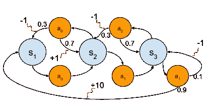
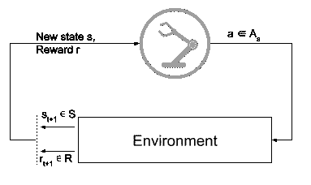

# 强化学习简介:马尔可夫决策过程

> 原文：<https://towardsdatascience.com/reinforcement-learning-intro-markov-decision-process-c73a030f045d>

照片由 [Unsplash](https://unsplash.com?utm_source=medium&utm_medium=referral) 上的[延斯·勒列](https://unsplash.com/@madebyjens?utm_source=medium&utm_medium=referral)拍摄

马尔可夫决策过程是强化学习中最基本的知识之一。它被用来表示优化问题中的决策。

我们在这里提出的版本是有限 MDP，它分析离散时间，离散行动问题，涉及一定量的随机性。这意味着相同的动作序列有可能在两次尝试之间导致不同的情况。

在这里，我们着重于呈现数学框架的一般结构，例如所涉及的元素和将它们链接在一起的方程。我们还将讨论在用 MDP 表述问题时可能会遇到的一些困难。

# 代理和环境之间的相互作用

在大多数现代文献中，你的学习系统通常被称为代理。这个术语不仅仅包括最近算法中的神经网络估计器。代理与环境交互以解决任务。稍后，我们将进一步详细讨论环境的构成，因为它可能会成为一个问题。环境依赖于两个主要部分:它的转换和奖励功能。两者都与系统和任务的性质有关。

例如，下图显示了一个环境，其中有三种状态和四种可供代理使用的操作。代理必须完成的任务是转换所有三种状态并返回。有些状态有积极和消极的奖励，可能对应于边际收益或有害的附带目标。这个观点来自一个外部的、无所不能的观察者，他能从整体上看问题。对于我们的代理人来说通常不是这样，他们只能观察他们周围的情况和他们直接行动的结果。

**问题** : *你能用随机策略求解第一个状态的预期收益吗？如果是，请回复！这种策略在任何状态下都有均等的机会选择行动 0 或 1。请继续关注关于价值函数的文章！*

图 1，作者:一个简单的 MDP 图，包括状态、动作、转换和奖励

图形表示是 MDP 的可视化综合，表示为元组:

其中:

*   S 是代理可达到的所有状态的集合。它们是上图中的蓝色节点。
*   *A* 是动作的集合，称为动作空间。这通常由 *S* 中的状态 *s* 决定，即在该状态 *s* 下可用的动作。它们是上图中的橙色节点。
*   *P* 是转移概率矩阵。它对应于动作 *a* 将状态 *s* 转换到状态*s’*的概率。它们是上图中一些动作后记录的概率，例如使用动作 1 后从状态 2 转换到状态 1 的概率为 0.6。
*   *R* 是由 *s* 和*s’*之间的过渡产生的直接奖励。它们由红色曲线指向的整数表示。

虽然该图代表了整个系统，但如果我们想分析一个代理的体验，我们必须**在其上下文中描述每个决策**。这个上下文一般在一个情节内，一个从 t=0 到 t 的有限序列。

一集的长度一般是由任务决定的，比如用 Y 步解决一个迷宫。但是，有些问题可能是无限的，看不到可控制的尽头，比如金融交易或低级机器人。在这种情况下，一集的结尾是人为定义的，代理人在一段经历中学习。

图 2，作者:代理-环境交互循环

每个交互被定义为元组:

从当前状态 s，代理选择动作 *a* ，这导致新状态*s’*，奖励 *r* 。基于策略π选择动作，策略π是学习算法在任何 RL 方法中试图优化的主要部分。

策略π是状态表示和动作之间的映射。作为人类，我们有类似的行为:当回家时，我们知道在特定的十字路口左转，或者当交通灯变红时踩刹车。我们识别模式，并知道哪些行为符合它们。

但是，要识别某样东西，它需要一个独特的形状，这样我们才能做出正确的决定。如果一栋建筑中的所有走廊都完全一样，没有任何标志，你能在特定时刻仅用眼睛看到的东西找到周围的路吗？

# 代表系统

状态表示的主要目的是给代理**足够的信息，让它知道自己处于哪个状态，下一步应该去哪里**。这些可以包括传感器读数、图像或处理过的指示器。

在只需要观察的任务中，例如机械臂拿起一个物体，只需要传感器。如果我们知道臂和物体的位置，我们可以预测转子的增量。

在需要一些历史概念的任务中，处理过的指示器是必要的。在自动驾驶汽车中，感知汽车的位置与知道汽车要去哪里一样重要。

在这两种情况下，适当的信息粒度都很重要。可以使用适合于该任务的任何粒度，从最低的传感器到最高的抽象级别。

当机械臂控制转子时，告诉它必须“向左”走可能还不够:它必须走多远？1 增量，四分之一圈还是一整圈？它必须适应每个任务，以方便代理的学习。

这样，控制器代理可以被训练给出高阶动作，例如“左、右、下、上”，驾驶代理可以将其解释为输入。然后，这种驱动力又会通过电压或增量等低级动作作用于转子。

机器人问题凸显了另一个关注点:我们在哪里定义代理的属性和环境之间的区别？手臂在空间中的绝对位置或库存的数量为代理提供了关于环境的重要信息，但与他们的行为相关联，这些行为应该是代理的一部分，而不是环境的一部分。

然而，它们是行动的结果，无论是对马达施加电压还是购买物品。**代理人和环境之间的界限是由代理人直接控制的变量**。因此，最后施加的电压不应该被认为是环境的一部分，而是药剂的一部分。

# 创造你的目标

代理人的目标是从一系列行为中获得最大的期望回报。由于预期的回报是通过整个剧集获得的累积分数，代理可能会做出局部次优的选择，以便在稍后达到更有利可图的结果。这一点在国际象棋比赛中最为明显，在这种比赛中，如果能获得有利的位置，玩家愿意牺牲棋子。奖励函数定义了什么被认为是有利的或不利的。

## 奖励

对特定的状态转换给予奖励。他们可以在每一步或一集的结尾被触及。因为代理人试图最大化它们，适当地塑造奖励函数可以影响我们希望看到的代理人表现出的期望行为。它可以是任何价值函数，只要它突出了期望的最终目标。

1.  对于有明确最终目标的任务，当目标达成时，可以给予一大笔奖励。
2.  对于视频游戏，可以利用游戏中的分数。
3.  然而，对于以安全为先的机器人任务，我们也需要一种阻止危险行为的方法。

*   如果人类的安全处于危险之中，用一个大的负面奖励来提前结束一个情节可以确保代理人迅速避开这些行为。
*   对于不太严重的情况，负奖励确保代理人不会停留在那个状态。

奖励可以包括不同职能的组合，只要它符合基本的度量准则。因此，它应该是凸的，以便给定一个顺序，您能够使用该顺序对性能进行排序。如果分数越高越好，就不应该出现分数越低排名越高的情况。

最后，当使用复合函数时，它们应该都在相同的数量级上，否则低阶函数很少被考虑。

## 返回

我们将收益 G 定义为我们的代理在一集期间获得的累积奖励:

在许多 RL 问题中，情节的长度相当长。因此，在一个事件的第一步可能会有令人困惑的预期回报，没有明确的行动。一种解决办法是引入贴现因子。它缩小了代理人对其所能获得的回报的预期。我们的收益 G 变成了:

正如我们所看到的，选择一个合适的γ意味着更远的步骤对行动的回报几乎没有贡献:

因此，一集内给定时间的预期回报可以通过以下公式获得:

作为参考，这里有一个基于γ的代理可以预见多远的尺度:

*   0.9 = 10 步
*   0.99 = 100 步
*   0.999 = 1000 步

# 定义 MDP 背后的数学

从前面的章节中，我们已经看到了转移概率矩阵，以及如何计算一集的预期收益。这些概念是允许我们构思决策过程的基础！

我们可以估计在当前状态下采取任何行动可以获得的回报:

当前状态 *s* 是固定的，所以我们可以迭代 *s* 中可用的所有动作 *a* 。对于每个动作，我们估计到达状态*s’*的概率，这应该奖励我们一个分数 *r* 。在许多问题中，函数 *Pr* 是已知的，但对于其他问题，它是使用蒙特卡罗抽样等技术来估计的。

从这个等式中，我们也可以忽略回报，而专注于状态转移概率，这是我们接下来可能要做的:

为了仅获得预期回报，对于代理在其状态下可用的每条路径，我们使用“状态-动作-下一状态”估计回报:

# 马尔可夫性质及其重要性

> 这通常需要更多的直接感觉，但从来没有超过所有过去感觉的完整历史。来自萨顿和巴尔托，2018。

马尔可夫特性是状态信号中包含的内容的一个要求，它完成了“表示系统”一节中提到的内容。

信息必须只包含直接测量的感觉。保留所有过去的观察是非常不鼓励的，因为这种做法很难。但是，对过去行为的感觉是可能的，例如在自动驾驶汽车系统中突出运动。这样做的目的是让图片尽可能的浅，以便于学习一个策略π。

这个属性是必需的，因为数学框架假设下一个状态*s’*直接链接到当前状态 *s* 和被选择的动作 *a* 。如果这种关系不成立，主要方程就失效，学习就变得不可能。

然而，完美的马尔可夫问题在现实世界中很少见，这也是为什么一些宽容被接受的原因，近年来出现了新的框架，包括[部分抽象的 MDP](https://ieeexplore.ieee.org/document/9561435) 和部分可观测的 MDP ( [POMDP](https://cran.r-project.org/web/packages/pomdp/vignettes/POMDP.html) )。

这些使我们能够对包括扑克在内的问题进行建模，扑克是一个著名的不完全问题，每个玩家都不知道对手的牌。游戏中涉及的心理学也使它变得更加复杂。玩家可能经常虚张声势，或者在没有把握的时候弃牌。

因此，扑克需要在直接环境中不可获得的信息，因此与马尔可夫性质相矛盾。然而，我们已经看到深度强化学习代理击败人类扑克玩家的一些最新结果。这取决于框架的问题，并找到一种方法来传达足够的信息给代理。

我希望这篇文章能帮助您更好地理解这个无所不在的框架！如果你想获得更多这样的文章，请在 [Twitter](https://twitter.com/marc_velay) 或 [LinkedIn](https://www.linkedin.com/in/marc-velay/) 上联系我。

稍后再见，了解更多强化学习！