# 模拟数据上近似混合整数分配解的强化学习

> 原文：<https://towardsdatascience.com/reinforcement-learning-to-approximate-mixed-integer-allocation-solutions-on-simulated-data-ce8f770fdb5b>

## 这个副业项目创建了一个实验，该实验生成模拟数据，创建混合整数解，并训练强化学习网络来近似最优分配


[https://upload . wikimedia . org/Wikipedia/commons/d/de/Distribution _ centre _ % 28J _ Sainsbury % 27s % 29 . jpg](https://upload.wikimedia.org/wikipedia/commons/d/de/Distribution_centre_%28J_Sainsbury%27s%29.jpg)

*注意:该项目在源代码或数据方面不隶属于任何组织。这是我从零开始开发的一个个人项目。*

# 太久没读了

本文总结了在分配优化领域构建混合整数规划模型时需要考虑的一些业务成果和目标。

开发的源代码创建了以下内容:1)一个框架，用于模拟商店风格-颜色目标库存、承诺投资和配送中心的捆绑包；2)一个数据管道，用于创建最佳 MIP 分配建议；3)一个强化学习算法，用于近似分配建议。

看起来强化学习算法能够学习*一些*策略来给商店分配捆绑包。然而，该算法的有效性相对来说比 MIP 解决方案差，并且可能*贪婪地接近*来生成分配提议。

如果您有构建 RL 模型的经验，并且希望改进该算法，请随时[创建一个拉取请求](https://docs.github.com/en/pull-requests/collaborating-with-pull-requests/proposing-changes-to-your-work-with-pull-requests/creating-a-pull-request)。这个项目可以在我的 [Github](https://github.com/freedomtowin/rl-allocation-solver) 上找到。

# 目的

本实验的目的是观察强化学习(RL)算法是否可用于近似混合整数规划(MIP)模型的分配建议。

RL 分配算法的用例是实验性的，对 RL 解决方案和神经网络的改进可能会改变用例。有可能使用 RL 算法来预解 MIP 解空间的某一部分。在某些情况下，它可以用来代替 MIP 模型。也有可能为不同的输入数据或场景建立多个 RL 模型。

分配方案的质量取决于*更多*因素，而不是解决方案与目标库存的接近程度，即，它还取决于模型能够产生多少商业价值。以下是一些需要考虑的因素:

1.  超额/不足分配成本，其中*不足分配成本*是在目标库存下不分配一个单位的成本，*超额分配成本*是在目标库存上分配一个单位的成本。这在有多个 SKU 的包的情况下发挥作用。这些是设计分配算法时要考虑的可能特征:1)产品的毛利、周期库存、安全库存、可视最小值和服务水平
2.  分配的统计离差，即当没有足够的库存来满足所有商店的*最优分配*时，分配库存时算法的公平性如何。
3.  分配算法是否提高了销售额？这需要复杂的模拟和/或销售损失数据。
4.  建议算法如何处理不同级别或不同优先级的商店？

出于本实验的目的，MIP 目标和约束条件尽可能简单。在实践中，目标可能需要考虑上述因素和潜在的其他业务成果。

# 模拟数据

随机生成以下数据元素以创建分配)来训练 RL/MIP 模型:

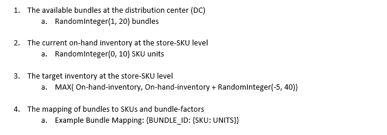

作者图片

```
“1”:{“AR”:1,”AB”:1,”AG”:1,”BR”:1,”BB”:1,”BG”:1,”CR”:1,”CB”:1,”CG”:1}“2”:{“AR”:3,”AB”:3,”AG”:3,”BR”:0,”BB”:0,”BG”:0,”CR”:0,”CB”:0,”CG”:0}“3”:{“AR”:0,”AB”:0,”AG”:0,”BR”:3,”BB”:3,”BG”:3,”CR”:0,”CB”:0,”CG”:0}
```

对于这个实验，对于训练数据集有 200 个随机生成的分配，对于验证数据集有 100 个随机分配。这些数据被保存到有效载荷数据结构中。对于这些有效载荷中的每一个，MIP 模型求解并将解存储到另一个数据结构中。

# 混合整数规划模型

MIP 模型用输入数据和决策变量构建潜在解决方案空间的计算图。在给定约束和目标函数的情况下，求解器使用一种算法，即“分支-切割”，来有效地搜索最优解。然而，解空间可能很复杂和/或很大，这可能增加 MIP 模型的求解时间。

MIP 模型使用目标库存和分配方案之间的平方差作为目标。

*MIP 目标*

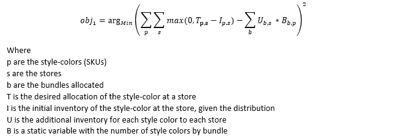

作者图片

*最优分配*被定义为 SKU 每个商店的目标库存 T 和承诺库存 I 之间的差额。一个变量 U 用于表示商店收到的包数。跨束的分解 SKU 数量与*最优分配*进行比较。

*约束*

该特定目标需要一个约束，即确保商店间分配的捆的数量等于或小于配送中心可用的捆的数量。

> 这一目标的另一种表述可以使用四个辅助变量来考虑分配不足/过多的成本。

## 爆炸 SKU 量

根据分配建议计算建议库存:

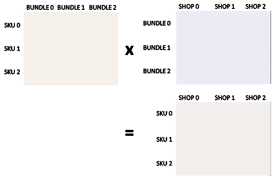

作者图片

可以通过取捆绑包-PF 和建议分配之间的点积找到分解的 SKU 建议数量，其中 PF 是每个捆绑包的 SKU 乘数。

# 强化学习算法细节

当网络学习时，分配算法有可能得出不可行或不真实的分配。RL 算法使用连续的、可能是分数的车间捆绑分配表示法。然而，这个问题本质上是离散的。

## RL —奖励

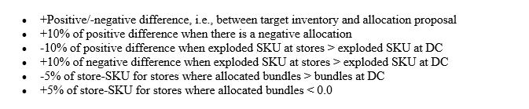

作者图片

## 输入数据

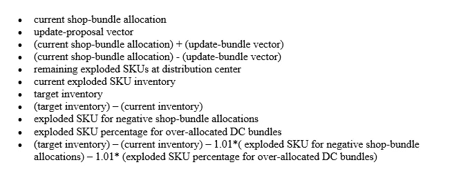

作者图片

## RL 网络

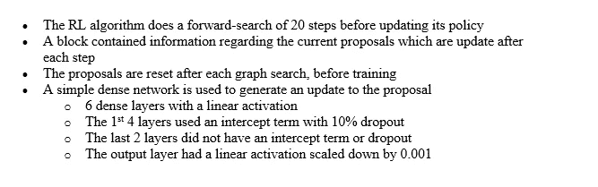

作者图片

## **RL 约束**

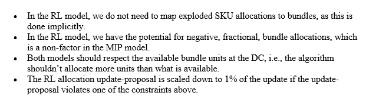

作者图片

## **RL 奖励功能**

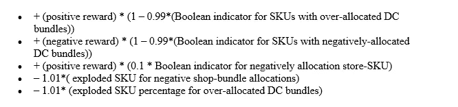

作者图片

# 验证指标

对于这个实验，对于训练数据集有 200 个随机生成的分配，对于验证数据集有 100 个随机分配。下面显示的分析和图用于验证集。

## 平均绝对误差比较

下图显示了 RL 解决方案与 MIP 解决方案的 MAE。

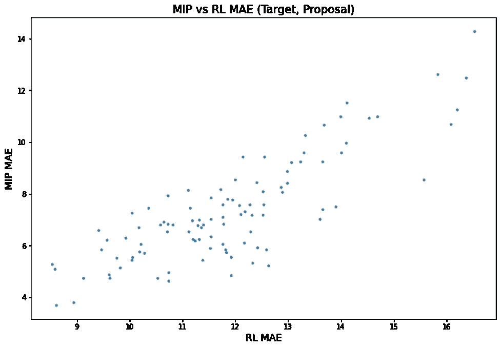

作者图片

RL 溶液的 MAE 和 MIP 溶液的 MAE 之间似乎存在线性关系。在最坏的情况下，RL 解决方案的 MAE 大约是 MIP 解决方案的两倍。

## 相关分析

下图显示了 MIP 建议、RL 建议和目标的最终风格-颜色(SKU)分配之间的相关性。

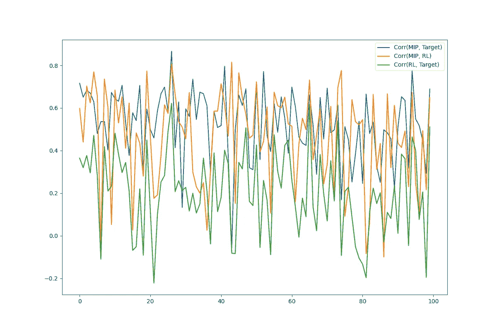

作者图片

**跨验证集的平均相关性:**
* MIP/RL:0.46
* MIP/Target:0.52
* RL/Target:0.20

## MIP 和 RL 解决方案在分配方案上最大的两个区别是

下图显示了 RL 和 MIP 解决方案之间分配方案的两个最大差异(MAE)。

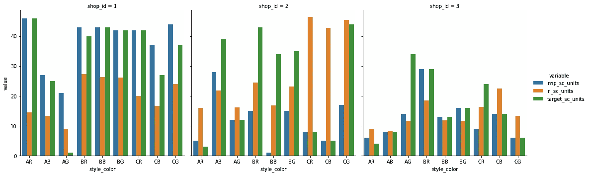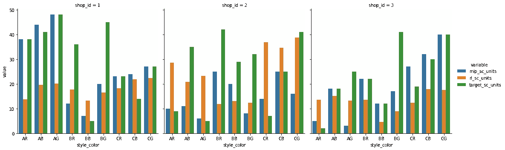

作者图片

有趣的是，即使在分配方案之间有很大的差异，这并不总是转化为更高的 MAE。0

## RL 解决方案的最低两个 MAE 分配方案

下图显示了 RL 解决方案相对于目标方案的两个最佳分配方案(最低 MAE)。

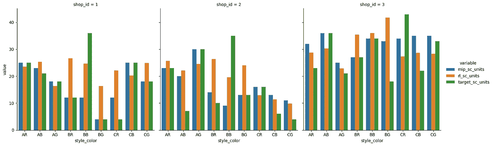

作者图片

## RL 解决方案的最高两个 MAE 分配提案

下图显示了 RL 解决方案相对于目标方案的最差的两个分配方案，最高 MAE。

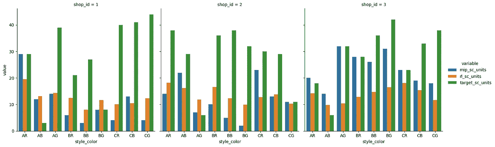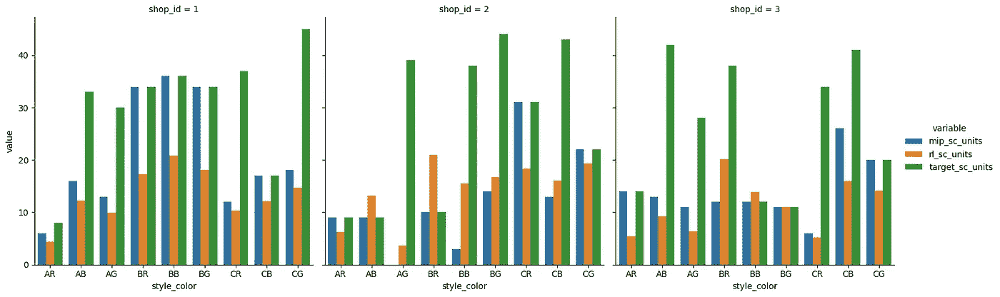

作者图片

# 结论

该结果似乎表明，使用连续的、分数的、束表示，为分配优化创建有效的强化学习算法是可能的。然而，在强化学习算法中使用这种表示有许多潜在的问题。例如，如果将一个捆绑包平均分配给多个商店，会发生什么情况？在 RL 方法之上，需要另一种算法来解决这些冲突。

过度分配的成本、商店-SKU *最优分配*相对于建议数量的幅度，以及跨商店的建议的“均匀性”或“公平性”可能需要领域专业知识来满足特定的业务需求。MIP 方法可以通过添加和调整目标中的成本项来处理来自领域专家的输入，以便处理多个业务需求。强化算法没有这种可调输入。

如果你有建立 RL 模型的经验，并且想改进这个算法，请随时联系我。

# 资源

[强化学习简介](http://incompleteideas.net/book/RLbook2020.pdf)
[什么是 Q-learning？](https://www.javatpoint.com/reinforcement-learning#Q-Learning)
[谷歌强化学习参考](https://ai.googleblog.com/2021/04/evolving-reinforcement-learning.html)

# 接触

领英:[https://www.linkedin.com/in/rkotwani/](https://www.linkedin.com/in/rkotwani/)