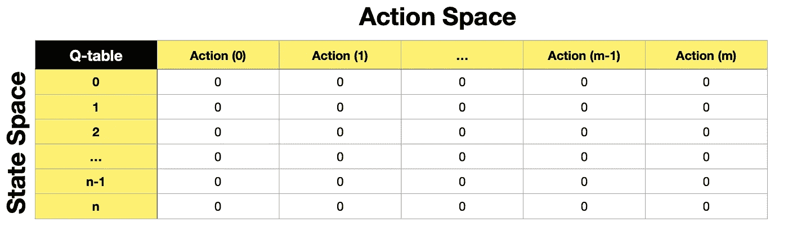
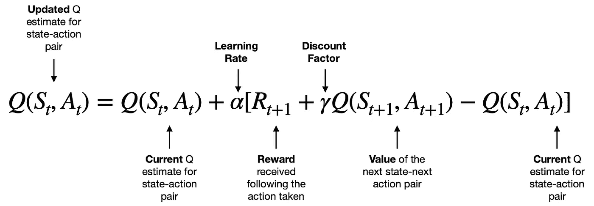
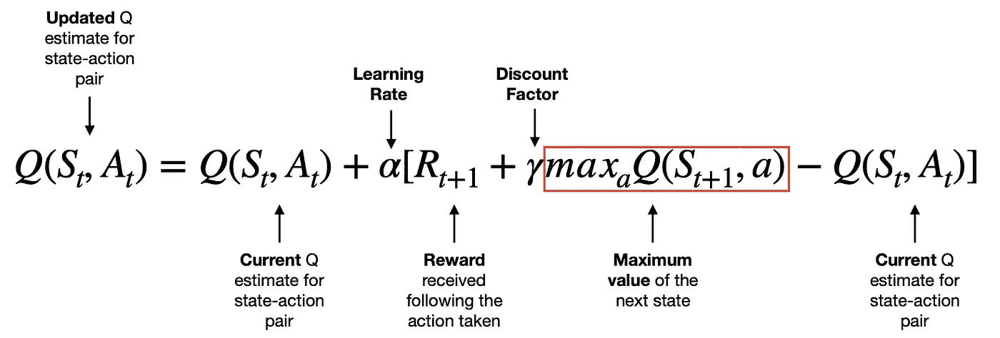
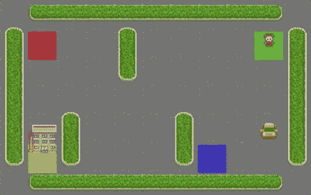
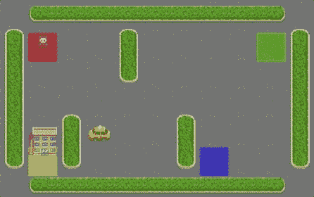
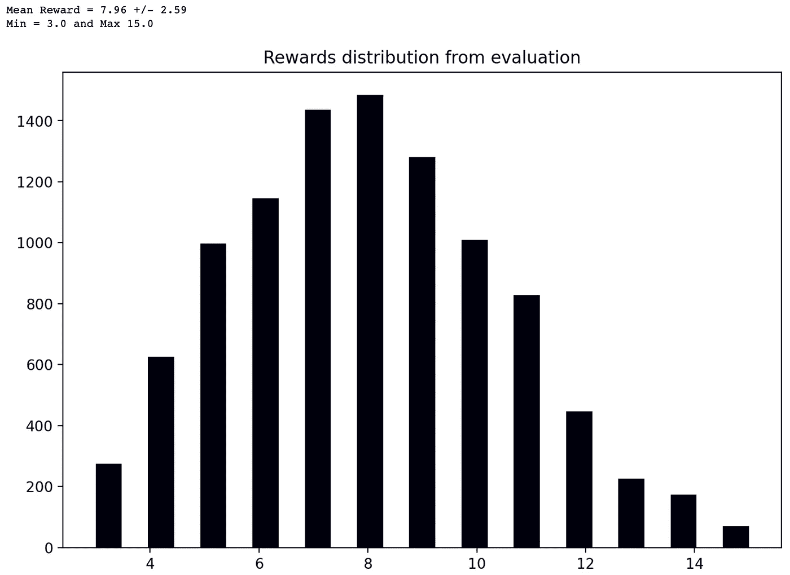
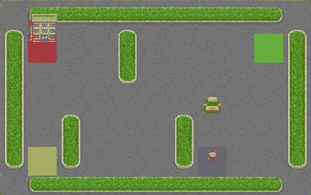

# SARSA 强化学习——Q-学习算法的一个很好的替代方案

> 原文：<https://towardsdatascience.com/reinforcement-learning-with-sarsa-a-good-alternative-to-q-learning-algorithm-bf35b209e1c>

## 强化学习

## 如何使用状态-动作-奖励-状态-动作(SARSA)算法教智能代理玩简单的游戏


图片由 [bamenny](https://pixabay.com/users/bamenny-2092731/?utm_source=link-attribution&utm_medium=referral&utm_campaign=image&utm_content=1214536) 来自 [Pixabay](https://pixabay.com//?utm_source=link-attribution&utm_medium=referral&utm_campaign=image&utm_content=1214536)

# 介绍

机器学习的美妙之处在于，它不缺乏处理复杂任务的方法。例如，**强化学习(RL)** 从业者已经开发了多种算法，能够教会**智能代理**导航他们的环境并执行动作。

在本文中，我深入研究了一种叫做 **SARSA** (状态-动作-奖励-状态-动作)的 RL 算法，它是 Q-Learning 的近亲。

如果您不熟悉强化学习或 Q-Learning，请随意探索我以前的文章:

*   [强化学习(RL)——什么是强化学习，它是如何工作的？](/reinforcement-learning-rl-what-is-it-and-how-does-it-work-1962cf6db103)
*   [Q-学习算法](/q-learning-algorithm-how-to-successfully-teach-an-intelligent-agent-to-play-a-game-933595fd1abf)

# 内容

*   SARSA 在机器学习(ML)算法领域的地位
*   SARSA 是如何工作的？
    - Q 表
    - SARSA 算法
    -与 Q 学习的比较
*   Python 示例，我们教一个智能代理如何玩 Taxi-v3 游戏

# **SARSA 在机器学习(ML)算法领域的地位**

机器学习算法之间存在相似之处，这使我们能够根据架构和用例对它们进行分类。因此，我创造了一个观想，帮助我们看到整个 ML 宇宙。

**图表是交互式的**，请点击👇在不同的类别上探索和揭示更多。

你会在**基于值的方法**组中的**强化学习**ML 算法分支下找到 **SARSA** (下一节会有更多相关内容)。

机器学习算法分类。由[作者](https://solclover.com/)创建的互动图表。

# SARSA 是如何工作的？

## q 表

SARSA 是一种**基于值的方法**，类似于 Q-learning。因此，它使用一个 **Q 表**来存储每个**状态-动作对**的值。使用基于价值的策略，我们通过教代理**识别哪些状态(或状态-动作对)更有价值来间接训练代理**。

通常，我们从 Q 表中初始化为 0 的所有值开始，并使用训练来优化 Q 表。然后，我们的代理可以使用存储在 Q 表中的信息来选择每个状态下的最佳动作(即，代理选择的每个状态下具有最高值的动作)。

下面是一个空 Q 表的示例:



空 Q 表。图片作者[作者](https://solclover.com/)。

## SARSA 算法

SARSA 是一个**基于策略的**算法，这是它与 Q-Learning(非策略算法)的区别之一。 **On-policy** 是指在训练过程中，我们对 agent 使用相同的策略 **act** (代理策略)和**update**value function(更新策略)。同时，使用**非策略**方法，我们使用不同的策略来执行和更新。

现在让我们来看看 SARSA 算法本身:



SARSA 算法。图片来自[作者](https://solclover.com/)。

*   q 是**值函数**，左边 Q(𝑆𝑡,𝐴𝑡项是特定状态-动作对的**新值**。注意，S 指状态，A 指动作。
*   在等式的右边，我们找到相同的 Q(𝑆𝑡,𝐴𝑡项，在这种情况下，它是同一状态-动作对的当前值。
*   为了更新当前值，我们在代理采取行动后获取**奖励(** 𝑅𝑡+1)，为下一个状态-下一个行动对 𝛾𝑄(𝑆𝑡+1,𝐴𝑡+1) **加上用γ**贴现的**值，并减去**当前值** Q(𝑆𝑡,𝐴𝑡).**
*   因此，方括号中的项产生正值、零或负值，这导致 Q(𝑆𝑡,𝐴𝑡).的新值增加、不变或减少注意，我们还应用了一个**学习率(alpha)** 来控制每次更新的“大小”。

由于 SARSA 使用**时间差分(TD)方法**，该算法将在每一步后不断更新 Q 表，直到我们达到最大迭代次数或解决方案收敛到最优。

## **与 Q-Learning 的比较**

如果我们看一下 Q-Learning 算法使用的等式，我们可以看到，区别在于它如何选择下一个状态的值。即 **Q-Learning 基于 Q-table 中的现有值为下一个状态取最大值**。同时， **SARSA 取下一个状态-下一个动作对的值，**，如上所示。



q-学习算法。图片由[作者](https://solclover.com/)提供。

# **Python 示例，我们教智能代理如何玩 Taxi-v3 游戏**

为了更好地理解它是如何工作的，让我们使用 SARSA 算法来教代理如何玩在 [Open AI 的健身房环境](https://www.gymlibrary.dev/environments/toy_text/taxi/)中可用的 Taxi-v3 游戏。

请看下面的 gif 图片，它展示了游戏的样子:



Gif 图片由[作者](https://solclover.com/)使用来自 [Taxi-v3 游戏](https://www.gymlibrary.dev/environments/toy_text/taxi/)的组件创建。

游戏的目标是让出租车从一个上车地点**搭载一名乘客**(看到一个人)，该地点可以是四个彩色方块中的任何一个，然后**将该乘客带到下车地点**(看到一座建筑)，该地点也可以是四个彩色方块中的任何一个。

默认游戏奖励如下:

*   -每一步 1 分，除非触发了另一个奖励
*   运送一名乘客+20
*   -10 分因非法执行“上车”和“下车”行动

## 设置

我们需要获得以下库:

*   [为](https://www.gymlibrary.dev/) [Taxi-v3](https://www.gymlibrary.dev/environments/toy_text/taxi/) 游戏环境打开艾的健身房库
*   [Numpy](https://numpy.org/) 用于数据操作
*   [Matplotlib](https://matplotlib.org/stable/index.html) 和内置的 IPython 库，用于显示代理如何导航其环境

让我们导入库:

上面的代码打印了本例中使用的包版本:

```
numpy: 1.23.3
gym: 0.26.0
matplotlib: 3.6.0
```

接下来，我们设置一个 Taxi-v3 环境:

设置好环境后，让我们检查一下**描述**、**状态空间**和**动作空间**:

```
Environment Array: 
[[b'+' b'-' b'-' b'-' b'-' b'-' b'-' b'-' b'-' b'-' b'+']
 [b'|' b'R' b':' b' ' b'|' b' ' b':' b' ' b':' b'G' b'|']
 [b'|' b' ' b':' b' ' b'|' b' ' b':' b' ' b':' b' ' b'|']
 [b'|' b' ' b':' b' ' b':' b' ' b':' b' ' b':' b' ' b'|']
 [b'|' b' ' b'|' b' ' b':' b' ' b'|' b' ' b':' b' ' b'|']
 [b'|' b'Y' b'|' b' ' b':' b' ' b'|' b'B' b':' b' ' b'|']
 [b'+' b'-' b'-' b'-' b'-' b'-' b'-' b'-' b'-' b'-' b'+']]State(Observation) space: Discrete(500)
Action space: Discrete(6)
```

您可以看到环境布局与本节开头的 gif 图像中显示的布局相匹配。

状态空间包含 500 个离散状态，代表 25 个出租车位置、5 个可能的乘客位置(包括乘客在出租车中的情况)和 4 个目的地位置的所有可能组合，即 25 * 5 * 4 = 500。

同时，**动作**是:

*   0:向南移动
*   1:向北移动
*   2:向东移动
*   3:向西移动
*   4:搭载一名乘客
*   5:让乘客下车

在我们开始模型训练之前，让我们的代理(出租车)执行随机动作，并渲染它在环境中的运动。

以下是上述代码的输出:



由[作者](https://solclover.com/)使用来自 [Taxi-v3 游戏](https://www.gymlibrary.dev/environments/toy_text/taxi/)的组件创建的 Gif 图像。

## 模特培训

设置完成后，让我们使用 **SARSA** 为我们的代理在这个游戏中找到最好的 **policy(𝜋)** 。

我们首先初始化几个参数:

为了平衡**探索与开发**，我们将在整个培训中改变 epsilon。我们将从 epsilon=1(纯探索)开始，并随着每一集而衰减 epsilon，以逐渐从纯探索转向开发。

接下来，让我们初始化 Q 表。正如我们在上一节中所看到的，这将是一个 500 x 6 的表格，行代表状态，列代表动作。我们用全 0 初始化 Q 表，因为在开始训练之前，我们不知道每个状态的价值。

以下是初始化 Q 表的片段:

```
array([[0., 0., 0., 0., 0., 0.],
       [0., 0., 0., 0., 0., 0.],
       [0., 0., 0., 0., 0., 0.],
       ...,
       [0., 0., 0., 0., 0., 0.],
       [0., 0., 0., 0., 0., 0.],
       [0., 0., 0., 0., 0., 0.]])
```

SARSA 是一个 **on-policy** 算法，因此我们将使用相同的**ε-贪婪策略**来操作和更新 Q 表。现在让我们定义用于培训和评估的函数:

如果你仔细观察 **update_Q** 函数，你会发现它包含了上一节分析的 SARSA 算法方程。

最后，让我们定义我们的培训功能:

现在我们可以调用训练函数并查看结果:

在训练之后，我们得到 Q 表作为输出。但是，很难说是否最优。因此，我们需要做一些额外的评估。以下是培训后 Q 表的一个片段:

```
array([[  0\.        ,   0\.        ,   0\.        ,   0\.        ,
          0\.        ,   0\.        ],
       [-15.88478151, -14.78900627, -16.69581259, -14.66434947,
        -12.6181495 , -23.80156577],
       [ -6.19468628,  -2.88294982,  -6.49649702,  -2.24076811,
         -0.99650814, -13.12010172],
       ...,
       [ -4.25834456,   2.30997394,  -5.05986368,  -3.97161199,
        -12.53096203, -15.46710745],
       [-17.96569618, -12.49725207, -16.13686029, -10.22935569,
        -24.18094778, -27.10102464],
       [ 12.22333031,   6.43016417,  12.76697657,  15.36125068,
          4.18029065,   2.6316856 ]])
```

## **评估**

既然很难通过考察 Q 表来判断结果，那我们就来运行一万集来评价代理的表现。我们将使用**平均值**、**标准差**和**报酬的最小/最大值**等统计数据以及**分配图**。

我们调用上述函数，并使用以下代码显示结果:



模型评估结果。图片由[作者](https://solclover.com/)提供。

让我们来看看结果:

*   **一万集的平均回报是 7.96 +/- 2.59。**它表示奖励有所变化，但那是因为在每集开始时，出租车、乘客和下车地点会发生变化。因此，每次我们需要不同数量的步骤来完成任务，所以我们并不总是得到相同的奖励(每走一步减 1 分)。
*   **最小奖励是 3，这证实了我们总是得到正的奖励。**查看地图，我们可以很容易地计算出，如果我们在相对的角落初始化出租车和乘客，下车位置与出租车的原始位置相同，则需要 17 步(16 次移动+ 1 次上车动作)。因此，为最远的场景选择最佳路线将导致奖励 3 (20 - 17)。
*   最高奖励是 15 英镑，所以让我们看看为什么我们不能期望更高。如果乘客在下车地点被初始化，该集立即结束(即，不是有效场景，因此没有希望获得 20 分)。因此，我们所能希望的最好情况是乘客和出租车在同一地点初始化。如果我们选择两个最接近的颜色方块(红色和黄色)，代理将使用 5 次移动(1 次上车，4 次移动)将乘客从上车地点运送到下车地点，给我们最大可能的奖励 15 (20 - 5)。
*   **奖励分布图显示奖励接近正态分布。因此，虽然它不能证明我们有一个最优策略，但它表明代理人正在做出理性的行动。**

确保我们有最优策略的一种方法是计算每个初始状态所需的最少步骤数。然后验证代理从未采取超过最小数量的步骤。然而，我将把它作为一个练习留给读者。

相反，让我展示一个按照我们的策略执行行动的代理的可视化。

上面的代码给了我们下面的可视化，它确认了，至少在下面捕获的两个场景中，代理已经采取了一个最佳的方法:



由[作者](https://solclover.com/)使用来自 [Taxi-v3 游戏](https://www.gymlibrary.dev/environments/toy_text/taxi/)的组件创建的 Gif 图像。

# 结束语

现在你知道了 SARSA 是如何工作的，以及它与标准的 Q 学习算法有什么不同。健身房图书馆提供了许多其他环境(游戏)，所以我鼓励你用你新学到的知识来训练一个代理玩不同的游戏。

你可以在我的 [**GitHub 库**](https://github.com/SolClover/Art057_RL_SARSA) 找到完整的 Python 代码。请注意，有两个 Jupyter 笔记本，一个用于 Taxi-v3 游戏，另一个用于冰封湖游戏。

请不要忘记[订阅](https://solclover.com/subscribe)到**了解其他强化学习算法**，我将在我即将发表的文章中涉及这些算法。

干杯！🤓
**索尔·多比拉斯**

***如果您不是中等会员，*** *请考虑使用我下面的个性化链接加入:*

<https://bit.ly/3J6StZI> 