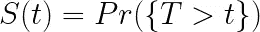
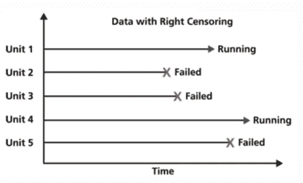
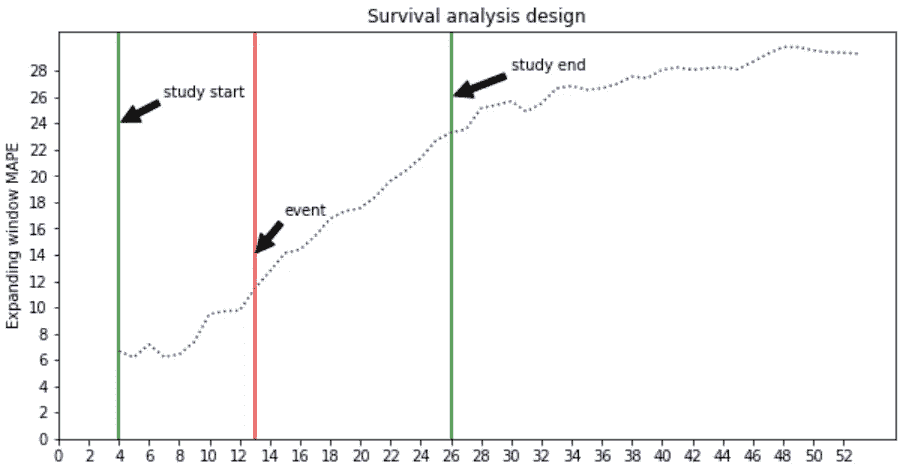
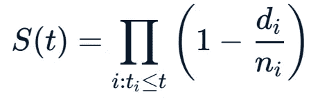
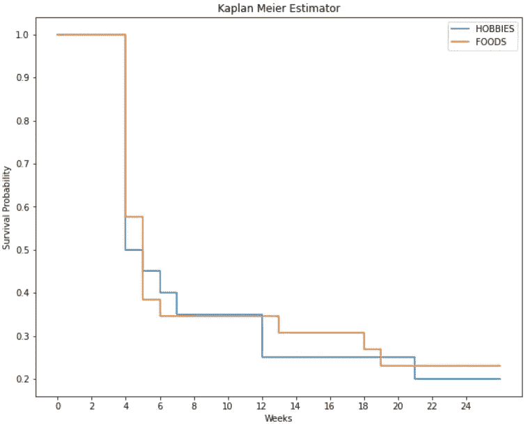

# 生产中可靠预测模型的生存分析

> 原文：<https://towardsdatascience.com/reliable-forecast-modelling-2094cc5237a1>

## 采取积极措施确保模型在生产中的可靠性和可用性

安德里亚斯·瓦格纳在 [Unsplash](https://unsplash.com?utm_source=medium&utm_medium=referral) 上拍摄的照片

随着企业越来越多地转向基于机器学习和分析的解决方案，当模型投入生产时，挑战就出现了。其中一个挑战是模型预测的漂移，这使得它们从长期来看不太可靠。

这种现象在时间序列预测模型中最为明显。经济周期、货币政策、消费者行为和竞争对手活动的变化会导致预测不准确。

这个问题需要被动和主动的解决方案。应对生产中预测模型漂移的被动方法是根据预测的业务规则设置阈值。如果实际时间序列和预测之间的差异超过了指定的阈值，则称为漂移事件，在自动设置中会触发对现有模型的进一步分析或再训练。

## 模型可靠性和可用性

在我们深入这个主题之前，让我们定义几个术语来进一步讨论。

机器学习社区指的是可靠性的概念，包括模型预测中的不确定性和对生产数据进行概括的失败的密切相关的想法[1]。

在本文中，我将预测可靠性的想法扩展如下:

> **模型可靠性**定义为模型预测**在特定时间点的可靠性。**

一个可靠的模型是这样一种模型，它的预测是可以依赖的，直到我们在某个时间点想要替换它。这就引出了第二个定义:

> ***型号可用性*** *是指满足型号可靠性生产要求的型号的可用性。*

不符合这些要求的模型应该被重新训练或替换。

## 比较被动和主动策略以确保模型的可靠性

在以下情况下，对自动化系统中的漂移事件做出反应似乎是一种合理的策略:

1.  生产的车型数量有限，因此再培训成本较低。
2.  这种事件发生的频率很少。
3.  对模型可用性没有严格的要求。

对于某些业务，尤其是零售和物流，要建模的时间序列的数量可能会达到数千，如果不是数十万的话。此外，这些时间序列可能密切相关，例如属于相同的地理、材料和领域等。通过进一步分析或重新训练模型来应对大规模漂移事件，可能会节省大量计算和分析时间。

为了使模型在生产中可靠，在它漂移和触发再训练之前有体面的正常运行时间，必须有一个预先预见模型漂移的策略。这是这样的:

1.  可以满足与模型可用性相关的 SLA 要求。
2.  可以在预生产环境中对这类案例进行分析，以进行根本原因分析。
3.  已知这些事件在模型中的频率和流行程度，可以预先计算出再训练的计算要求。

在上述情况下，积极主动的方法可能更合适。这种方法本质上应该在模型投入生产之前提供对此类事件的合理估计。

## 用于分析预测模型可靠性的生存模型

我发现对时间序列预测模型有用的一种估计模型可靠性的方法是利用生存分析来模拟预测模型中的性能衰减。

假设关于模型性能的良好历史是可用的，或者大量密切相关的模型是可用的，我们可以创建生存模型来预测模型衰退并进行主动分析。这种分析将有助于我们量化不同场景下的再训练和模型可用性的计算要求，并有助于提前规划。

在这里，我将演示一个简单的例子，通过这个例子，我们可以使用生存模型来查看给定的一组时间序列模型会出现什么样的衰减。

但首先，生存模型速成班。

## 生存分析——速成班

生存分析是统计学的一个分支，处理对事件时间的分析。生存模型预测事件发生的时间[2]。例子包括设备故障前的时间、贷款违约前的时间等。

这里的想法是模拟如下给出的生存概率分布。

作者图片

这里， **T** 是直到事件发生的等待时间，生存函数是该等待时间大于某一时间 **t** 的概率。换句话说，存活到时间 **t** 的概率。

与生存分析密切相关的是审查制度的概念。如果我们不知道一个事件何时发生，那么这个事件就被称为被删截了。最直观的审查是当我们实验的观察期结束时，被研究的对象没有面对一个事件，即它可能在未来面对一个事件。这样的数据被说成是**右删**。这是与我们的预测模型可靠性研究最相关的审查类型。

图片来源:[可靠性——一个用于可靠性工程的 python 包](https://pypi.org/project/reliability/) [4]

有几种生存建模技术——大致分为两类:即参数化和非参数化。**参数模型**对生存概率分布的形式做出假设，当配备了支持这些假设的领域知识时，参数模型是很好的选择。**另一方面，非参数模型**不对概率分布做出假设，而是根据手头的数据进行经验计算。

两种建模类型的最终目标都是获得一个生存函数，给定一个特定的时间点，将输出到该点的生存概率。

## 示例应用— M5 预测数据集

现在，让我们来看一个具体的例子和一个解决时间序列模型可靠性问题的建议方案。

在本例中，我们将采用 M5 预测数据集。自 1982 年以来，该数据集被用于由 Spyros Makridakis 教授领导的 M 系列预测竞赛的第五次迭代。数据集在[这里](https://forecasters.org/resources/time-series-data/)可用。

该数据包含不同层级的销售额，即项目、部门、产品类别和商店。它包括来自美国三个州的商店，即加利福尼亚州、德克萨斯州和威斯康星州。

## 方法学

为了进行这项研究，我们将在管道的两个不同阶段，即预处理阶段和评估指标生成阶段，进行一些特殊的考虑。这个评价指标反过来会导致我们的事件和审查。

本实验的设计有如下配置。我将很快详细解释这些参数。

## 预处理

在预处理中，基于配置，我们过滤我们感兴趣的商店和部门。接下来是将 sales 列融合(宽格式到长格式的转换)成一列。

销售数据存在于项目级别。我们在每个商店部门级别总结这一点。现在，我们有了每个部门的商店级销售数据。

## 系统模型化

我们为每个商店部门建立 Prophet 模型。Prophet 是由脸书研究所开发的一个非常流行的时间序列预测模型。我们使用默认参数和 1 年的测试预测范围来构建这些模型。

## 生存分析设计

现在，我们讨论该方法的关键，即执行生存建模所需的步骤。为此有两个实用程序。

第一个实用程序作用于测试集，并在从第 **4 周**到第 **26 周** (6 个月)的**扩展窗口**上计算 **MAPE** (平均绝对百分比误差——评估时间序列预测的流行指标)。为什么我们这样计算 MAPE？

*如果我们假设生产中预测模型的事件发生时间是其性能下降超过给定阈值之前的时间，我们可以使用生存分析来模拟该等待时间，从而采取主动措施来确保模型的可靠性。*

正是通过使用类似于**扩展窗口 MAPE** 的度量来生成模型相对于时间的评估分数，我们可以生成退化/衰变/漂移的时间，进而可以对其进行建模。

第一个实用程序在测试集上生成一个基于时间的评估度量，而第二个实用程序在性能下降的第一周设定阈值，并将其标记为一个事件。在配置中，阈值为 10 的 **MAPE。简单来说，我们在扩张的 MAPE 跨越 10 岁的第一周纪念一个事件。对于研究结束时未超过阈值的商店部门模型，即 **26 周**被标记为删截。**

## 卡普兰-迈耶估计量

Kaplan-Meier 估计量是生存函数的非参数估计量[3]。它通常是生存分析工具包中的第一个基线模型。假设我们没有重要的领域知识和协变量来通知我们，为了说明起见，我们将使用这个估计量。

估计量由以下公式给出:

礼貌(维基百科:卡普兰-迈耶估计)

其中 **dᵢ** 是在**发生的事件，tᵢ** 和 **nᵢ** 是截至 **tᵢ.没有面对事件的总被试**

在这一阶段，我们从 store-dept 模型中汇总所有事件和审查员的观察结果，并为每个部门构建 Kaplan-Meier 模型。

## 结果

拟合 Kaplan-Meier 估计值的结果是一个生存函数，在我们的研究期间绘制在这里。

作者图片

它为我们提供了属于爱好和食品部门的模型在研究中每周的生存概率。

## 讨论和解释

研究开始时的存活概率如预期的 **1.0** 。这两个部门的**中位生存时间**是生存概率为 **0.5** 的时间，是 **4** 周。

> 有了生产中模型的**生存分布**和规定**概率阈值**的**业务规则**，我们可以通过采取主动措施来确保模型的可靠性，如安排再培训和分析，而无需等待生产中的性能事故。

一个示例设置可以使用**第 95 百分位**生存时间 **2** 周，并在生产中达到该限制之前重新培训给定部门的所有商店级模型，以确保模型退化低于指定概率的阈值。

## 结论

一旦我们采取主动措施，比如上面描述的生存分析，模型的可用性就变得容易了。

这种方法可以跨不同类别的模型执行，也可以跨除零售和物流以外的场景的建模策略执行。

此外，我们没有详细讨论的另一个方面是，这种方法需要新的指标来生成故障时间事件。这些度量不仅为研究生产中的模型可靠性，而且为作为基于时间的单独评估度量提供了大量机会，这对于时间序列预测模型非常有用。

最后，本文专门讨论了预测建模中的问题，但是具有适当评估指标的相同原则也可以用于其他建模方法。

## **参考文献**

[1]苏驰·萨里亚，阿达什·苏巴斯瓦米，教程:安全可靠的机器学习(2019) *，ACM 公平、问责和透明会议*

[2] Kartsonaki，c .，生存分析(2016)，*诊断组织病理学*

[3]贾森·t·里奇医学博士、杰·卡尔·尼尔医学博士等人,《理解卡普兰-迈耶曲线的实用指南》( 2014 年),耳鼻喉科——头颈外科

[4]m . Reid，《可靠性——用于可靠性工程的 Python 库》(版本 0.8.2) (2022 年)，[https://doi.org/10.5281/ZENODO.3938000](https://doi.org/10.5281/ZENODO.3938000)

*如果你喜欢这篇文章，并希望看到更多关于实用和现实世界数据科学的帖子，请在 Medium 上关注我，让我们在*[*Linkedin*](https://www.linkedin.com/in/hassan-javed-610/)*上联系。干杯！*