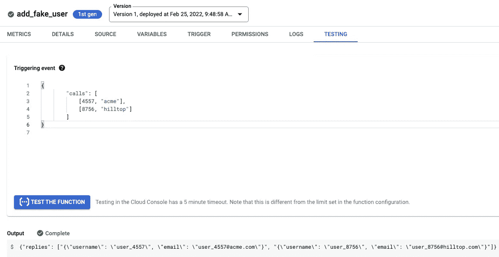
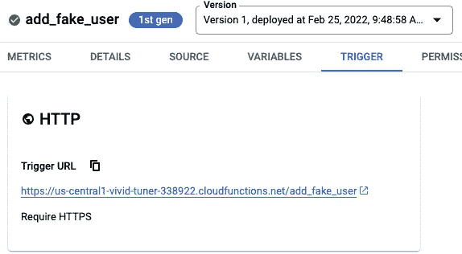

# BigQuery 中的远程函数

> 原文：<https://towardsdatascience.com/remote-functions-in-bigquery-af9921498438>

## 它是如何工作的，你能用它做什么

BigQuery 提供了调用用户定义函数(UDF)的能力，但是这些 UDF 必须在 [SQL](https://cloud.google.com/bigquery/docs/reference/standard-sql/user-defined-functions) 或 [JavaScript](https://cloud.google.com/bigquery/user-defined-functions) 中。这些函数完全在 BigQuery 中运行，因此提供了很好的可伸缩性和性能(SQL 比 JavaScript 更好)。但是在很多情况下，您需要在 BigQuery 之外运行代码，并且希望运行用其他语言编写的代码。对于这两种情况，现在可以使用[遥控功能](https://cloud.google.com/bigquery/docs/reference/standard-sql/remote-functions)。


由[凯利·西克玛](https://unsplash.com/@kellysikkema?utm_source=unsplash&utm_medium=referral&utm_content=creditCopyText)在 [Unsplash](https://unsplash.com/s/photos/remote?utm_source=unsplash&utm_medium=referral&utm_content=creditCopyText) 上拍摄的照片

在本文中，我将向您展示远程函数是如何工作的，然后讨论一些用例。

## 1.远程功能如何工作

远程功能通过与 Google Cloud Functions (GCFs)的集成来工作，GCFs 是 Google Cloud 上的无服务器功能即服务。

*   用 Node.js，Python，Go，Java，.net、Ruby 或 PHP
*   将其包装在 SQL UDF 中—这是现有的新功能
*   照常使用 SQL UDF

让我们看一个例子。

## 1.1 [Admin]创建 BigQuery 和云函数之间的连接

嗯，你在权限方面有一点设置。这是您的管理员可能需要做的事情。

*   从 [GCP web 控制台](https://console.developers.google.com/apis/api/bigqueryconnection.googleapis.com/)，启用 BigQuery 连接 API
*   在安装了 gcloud SDK 的 Cloud Shell 或其他环境中，执行以下操作:

```
gcloud components update
bq mk --connection --display_name='my_gcf_conn' \
      --connection_type=CLOUD_RESOURCE \
      --project_id=$(gcloud config get-value project) \
      --location=US  **gcf-conn**
bq show --location=US --connection gcf-conn
```

最后一行将向您展示 BigQuery 用来调用云函数的服务帐户。记住这一点，因为我们必须让云功能允许这个服务帐户。

## 1.2 创建云功能

为了测试这个功能，我们需要创建一个云函数，让我们开始吧。访问 [GCP 控制台](https://console.cloud.google.com/functions)并创建新的云功能:

*   调用函数 add_fake_user
*   接受所有其他默认值
*   将语言更改为 Python 3.9
*   将入口点更改为 add_fake_user
*   将以下代码复制粘贴到编辑器中:

```
import jsondef add_fake_user(request):
      request_json = request.get_json(silent=True)
      replies = []
      calls = request_json['calls']
      for call in calls:
        userno = call[0]
        corp = call[1]
        replies.append({
          'username': f'user_{userno}',
          'email': f'user_{userno}@{corp}.com'
        })
      return json.dumps({
        # each reply is a STRING (JSON not currently supported)
        'replies': [json.dumps(reply) for reply in replies]
      })
```

上面的代码从输入请求中提取了两列(call[0]和 call[1])。第一个被视为 userno，第二个被视为用户所属的公司。基于这些，代码“查找”用户的身份。我在这里实际上并没有攻击外部系统，只是假装而已——但关键的想法是，谷歌云函数中的代码几乎可以是任何东西。

请注意上面代码的两点:

*   云函数不只是从 BigQuery 获得一行。它接收一堆行。这就是为什么我要迭代

```
for call in calls
```

*   我想将一堆不同的字段返回给 BigQuery，所以我应用了一个技巧，将我想返回的所有数据值转换成一个 JSON 字符串:

```
replies = []
...
replies.append({
          'username': f'user_{userno}',
          'email': f'user_{userno}@{corp}.com'
        })
...
return json.dumps({
        # each reply is a STRING (JSON not currently supported)
        'replies': [json.dumps(reply) for reply in replies]
      })
```

## 1.3 试用云功能

试试云功能。

*   切换到云功能的测试选项卡
*   将以下内容复制粘贴到编辑器选项卡中:

```
{
        "calls": [
            [4557, "acme"],
            [8756, "hilltop"]
        ]
}
```

这是 BigQuery 将发送的 JSON 的格式。本质上是一个行数组。示例输入中的每一行都包含两个字段:一个整数和一个字符串。云函数会把这两个字段拉出来做它的事。

*   您应该会看到回复 JSON:



作者 GCP 控制台截图

## 1.4 允许 BigQuery 调用这个云函数

您必须显式地允许 BigQuery 调用这个特定的云函数。因此，切换到 Permissions 选项卡，添加 BigQuery 服务帐户(参见步骤 1.1)作为云函数调用程序。

## 1.5 将云函数包装在 SQL UDF 中

在 BigQuery 中，创建一个数据集来保存 SQL UDF:

```
bq show blogs || bq mk -d blogs
```

编写一个 SQL UDF，它将利用到 BigQuery 的连接并调用云函数:

```
CREATE OR REPLACE FUNCTION **blogs.add_fake_user**(user_id int64, corp_id STRING) RETURNS STRING
REMOTE WITH CONNECTION `PROJECTID.us.gcf-conn`
    OPTIONS (
        -- change this to reflect the Trigger URL of your cloud function (look for the TRIGGER tab)
        endpoint = '[https://REGION-](https://us-central1-vivid-tuner-338922.cloudfunctions.net/add_fake_user')PROJECTID[.cloudfunctions.net/add_fake_user'](https://us-central1-vivid-tuner-338922.cloudfunctions.net/add_fake_user')
    )
```

注意上面有两个地方要改。您可以从 GCP 控制台的主页面板中找到项目 ID。您可以在云函数的触发器选项卡中找到触发器 URL:



作者 GCP 控制台截图

## 1.6 照常使用 SQL UDF

例如，您可以查询:

```
 SELECT
      start_station_id, end_station_id, 
      **blogs.add_fake_user(trip_id, bikeid)**
    FROM `bigquery-public-data.austin_bikeshare.bikeshare_trips`
    LIMIT 10
```

返回的是一个 JSON 字符串，因此您可以使用 JSON 函数解析它:

```
WITH data AS (
          SELECT
            trip_id, bikeid, 
            start_station_id, end_station_id, 
            blogs.add_fake_user(trip_id, bikeid) AS reply
          FROM `bigquery-public-data.austin_bikeshare.bikeshare_trips`
          LIMIT 10
    )

    SELECT 
      * EXCEPT(reply),
      **JSON_QUERY(reply, '$.email')** AS user_id
    FROM data
```

或者，您可以使用 JSON 类型(它目前在预览版中):

```
WITH data AS (
          SELECT
            trip_id, bikeid, 
            start_station_id, end_station_id, 
            **SAFE.PARSE_JSON**(blogs.add_fake_user(trip_id, bikeid)) AS reply
          FROM `bigquery-public-data.austin_bikeshare.bikeshare_trips`
          LIMIT 10
    )

    SELECT 
      * EXCEPT(reply),
      **reply.email**
    FROM data
```

## 2 个使用案例

在需要在 BigQuery 之外运行代码的情况下，以及希望运行用其他语言编写的代码的情况下，远程函数非常有用。但是，您不希望过度使用远程函数，因为与原生 SQL UDFs 相比，它们在性能和成本方面存在劣势。远程函数的性能通常不如原生 BigQuery SQL，因为它需要额外调用 BigQuery 插槽和自动扩展虚拟机的云函数。此外，在成本方面，您将为 BigQuery 和云功能付费。

以下是一些潜在的使用案例。

## 2.1 浓缩

一个关键的用例是用外部服务创建的数据丰富 BigQuery，并写出一个新表。

假设你有一个部署到顶点 AI 端点的机器学习模型。远程函数使您能够调用 BigQuery 数据上的模型，并创建一个包含丰富数据的新表。这也适用于预先构建的谷歌模型，如谷歌翻译和顶点实体提取。

非 ML 丰富用例包括地理编码和实体解析。

*注意，如果你的 ML 模型在 TensorFlow 中，我推荐你* [*直接加载为 BigQuery ML*](https://cloud.google.com/bigquery-ml/docs/reference/standard-sql/bigqueryml-syntax-create-tensorflow) *模型。这种方法比远程函数更有效。*

## 2.2 实时查找

作为 SQL 工作流的一部分，您可以使用远程函数来查找实时信息(例如股票价格、汇率)。

例如，您可以让仪表板或交易应用程序简单地调用一个 SQL 查询来过滤一组证券，然后查找符合选择标准的股票的实时价格信息:

```
WITH stocks AS (
   SELECT
      symbol
   WHERE
      ...
)
SELECT symbol, **realtime_price**(symbol) AS price
FROM stocks
```

其中 realtime_price()是一个远程函数。

## 2.3 用动态 ELT 代替计划 ETL

2.2 中的股票价格场景通常的做法是编写一个 ETL 管道，定期为所有证券创建一个当前价格表。这对于交易量少的证券来说可能是一种浪费，并会带来不必要的延迟。针对此类证券，将 ETL 管道更改为 ELT 管道可以显著降低存储和计算成本。

一般来说，远程函数方法允许您在业务中用 ELT 管道替换许多预定的 ETL 管道，ELT 管道可以在需要时动态地查找信息。

## 2.4 高性能计算

不是所有的事情都可以用 SQL 完成。以交易为例，复杂的投资组合策略可能最好用统计友好的编程语言(比如 Python)来完成，并且可能需要在加速器(比如 GPU)上执行。

SQL 查询可以将这样的高性能计算提供给远程函数。

## 2.5 Java 中的业务逻辑

2.4 中的高性能计算是需要用高性能语言实现的业务逻辑的一个例子。您可能希望用 Java 之类的语言实现业务逻辑的另一个常见原因是，业务逻辑可以在多个地方重用，包括 web 和后端应用程序。

远程函数允许您将 Java 中的业务逻辑作为 SQL 工作流的一部分来应用。

## 2.6 与其他系统的集成

我在本文第一部分中的例子是查找用户凭证。通常，当您需要将 BigQuery 与外部系统(如令牌代理等)集成时，远程函数会有所帮助。

*注意，在像 Cloud SQL 和 Spanner 这样的事务性数据库的特定情况下，您可以使用 EXTERNAL_QUERY 并完全保留在 SQL 中。但是对于其他类型的外部系统，远程功能将被证明是有用的。*

## 2.7 混合云工作流

因为云功能可以调用任何代码，甚至在 GCP 之外，这也可以是实现混合云工作流的一种方式。确保您调用的服务能够处理并发性！

## 2.8 遗留代码

如果您有您的用例所必需的专有或遗留代码，远程函数允许您从 SQL 调用它。一种常见的情况是支持强制特定(非标准)加密或令牌化的合规性要求。

## 2.9 迁移

当从遗留数据仓库迁移时，您可能会使用 SQL 和 JavaScript 之外的语言来定义用户函数。远程功能允许您将这些 UDF 迁移到云中。

在这些情况下，云函数可能比 SQL 更有效，无论如何你都需要外部计算，或者简化是值得的。

尽情享受吧！

*感谢克里斯·克罗斯比和沈超的有益讨论*

## 后续步骤:

1.  为了方便起见，[本文中的步骤也列在了与 O'Reilly 的书](https://github.com/GoogleCloudPlatform/bigquery-oreilly-book/tree/master/blogs/remote_func) [BigQuery:权威指南](https://www.amazon.com/Google-BigQuery-Definitive-Warehousing-Analytics/dp/1492044466)相对应的 GitHub 库中。试试吧！
2.  阅读[远程功能](https://cloud.google.com/bigquery/docs/reference/standard-sql/remote-functions)的文档页面。
3.  阅读云函数文档，了解[性能](https://cloud.google.com/functions/docs/bestpractices/tips#performance)技巧。