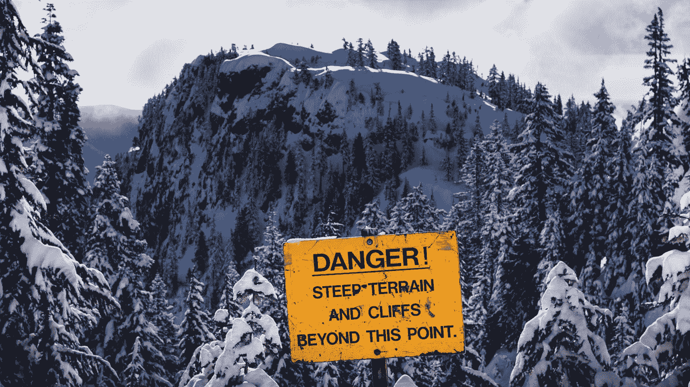

# 远程查看在 AWS Panorama 上运行的计算机视觉模型

> 原文：<https://towardsdatascience.com/remote-view-your-computer-vision-models-running-on-aws-panorama-32922369ecf>

## 监控全景应用程序

## SkyLine 简介:从工作站查看 Panorama 应用程序输出的库


照片由 [Elisa Schmidt](https://unsplash.com/@elisasch?utm_source=medium&utm_medium=referral) 在 [Unsplash](https://unsplash.com?utm_source=medium&utm_medium=referral) 上拍摄

实时智能视频分析应用开发和边缘设备部署是一项复杂的任务。在过去的几年中，行业参与者构建了支持这一活动的平台。著名的例子包括[英伟达 Metropolis](https://www.nvidia.com/en-us/autonomous-machines/intelligent-video-analytics-platform/) 、[英特尔的 OpenVINO](https://www.intel.com/content/www/us/en/developer/tools/openvino-toolkit/overview.html) 和 [AWS Panorama](https://aws.amazon.com/panorama/) 。虽然这些解决方案使视频分析应用程序开发的某些方面更加简单，但在生产中部署视频分析应用程序之前，仍有许多问题需要处理。这篇文章介绍了 SkyLine，它是开源工具系列[中的第一款](https://github.com/Neosperience/backpack)，可以简化 AWS Panorama 应用程序的开发。

AWS Panorama 是一个机器学习设备和软件框架，允许您在 edge 上部署视频分析应用程序。有关部署 Panorama 应用程序的详细介绍和分步指南，请参考 [*在 AWS Panorama 的边缘部署对象检测器模型*](/deploy-an-object-detector-model-at-the-edge-on-aws-panorama-9b80ea1dd03a) 。

AWS Panorama 框架简化了视频分析应用程序开发的许多方面，包括摄像机连接管理、视频解码、帧提取、模型优化和加载、显示输出管理、应用程序的无线部署以及其他功能。尽管如此，一些任务仍然具有挑战性，包括当模型不按预期工作时的诊断任务。

# 天际线介绍

获得有关 Panorama 应用程序正确功能的视觉反馈的唯一可用方法是将显示器物理连接到设备的 HDMI 端口。显示器将显示部署在设备上的单个应用程序的输出视频流。然而，实际接触设备并不总是可行的。SkyLine 允许将任何 Panorama 应用程序的输出视频重新流式传输到外部服务，例如，传输到 [AWS Kinesis 视频流](https://docs.aws.amazon.com/kinesisvideostreams/latest/dg/what-is-kinesis-video.html)。这个特性对于远程监控应用程序非常方便。

## SkyLine 是如何工作的？

SkyLine 实例化一个头部带有`[appsrc](https://gstreamer.freedesktop.org/documentation/app/appsrc.html)`元素的 [GStreamer 管道](https://gstreamer.freedesktop.org/documentation/application-development/introduction/basics.html)。一个 [OpenCV](https://docs.opencv.org/4.5.5/dd/d43/tutorial_py_video_display.html) `[VideoWriter](https://docs.opencv.org/4.5.5/dd/d43/tutorial_py_video_display.html)`被配置为向`appsrc`写入:它不是将连续的帧保存到视频文件，而是流式传输到输出接收器。当打开`VideoWriter`实例时，用户应该指定输出流的帧宽和帧高以及帧速率。您可以手动设置这些参数，或者让 SkyLine 根据输入尺寸和向其输入新帧的频率来推断这些参数。如果使用这种自动配置功能，一些帧(默认为 100 帧)将在流传输开始时被丢弃，因为 SkyLine 将使用它们来计算帧速率的统计数据并测量帧尺寸。这是天际线的“热身”。如果您发送不同大小的帧，SkyLine 将调整输入的大小，但这会带来性能损失。您还需要以每秒帧数参数中指定的频率向 SkyLine 发送新帧。如果帧以不同的频率发送，视频片段在 Kinesis 视频流中就会不同步，您将无法流畅地重播视频。


Josh Redd 在 [Unsplash](https://unsplash.com?utm_source=medium&utm_medium=referral) 上拍摄的照片

`SkyLine`是处理 GStreamer 管道状态机的抽象基类。具体实现`KVSSkyLine`向[亚马逊 Kinesis 视频流](https://aws.amazon.com/kinesis/video-streams/)服务发送帧。很容易扩展 SkyLine 来支持其他服务，特别是如果已经有了一个 GStreamer 插件。

# 将 SkyLine 集成到全景应用程序中

## 配置 Docker 容器

SkyLine 依赖于自定义编译的外部库。所有这些库必须在应用程序的 docker 容器中正确编译和配置，以使`SkyLine`工作。这些库包括:

*   GStreamer 1.0 安装了标准插件包、libav、工具和开发库；
*   OpenCV 4.2.0，用 GStreamer 支持和 Python 绑定编译；
*   numpy(通常由 Panorama 应用程序的基本 docker 映像安装)。

如果您想使用`KVSSkyLine`(将视频流传输到 Amazon Kinesis 视频流的`SkyLine`实现)，它还需要以下库:

*   亚马逊 Kinesis 视频流(KVS)制作商 SDK 编译有 GStreamer 插件支持；
*   环境变量`GST_PLUGIN_PATH`配置为指向 KVS 生产商 SDK GStreamer 插件编译后的二进制文件所在的目录；
*   环境变量`LD_LIBRARY_PATH`包括 KVS 制作商 SDK 编译的第三方开源依赖；
*   `boto3`(通常由 Panorama 应用程序的基本 docker 映像安装)。

在 SkyLine 的源代码库中，examples 文件夹中提供了一个[样例 Dockerfile](https://github.com/Neosperience/backpack/blob/master/examples/Dockerfile) ，展示了如何在任何容器中正确安装这些库和 SkyLine。在大多数情况下，只需要将示例中的相关部分复制到应用程序的 docker 文件中。请注意，第一次编译 docker 容器时，可能需要一个小时来正确编译所有的库。

## 为 KVSSkyLine 设置 AWS IAM 权限

`KVSSkyLine`使用包装在 GStreamer sink 元素中的 Amazon Kinesis Video Streams(KVS)Producer 库，将处理后的帧发送到 KVS 服务。KVS 生产者需要 AWS 证书。它可以使用与 Panorama 应用程序角色关联的凭据，但您必须明确配置它。`KVSSkyLine`需要权限来执行以下操作:

```
kinesisvideo:DescribeStream
kinesisvideo:GetStreamingEndpoint
kinesisvideo:PutMedia
```

如果`KVSSkyLine`需要在第一次使用时自动创建 Kinesis 视频流，那么还应该包含`kinesisvideo:CreateStream`动作。允许`KVSSkyLine`向 Kinesis 视频流写入数据的示例策略如下所示:

```
{
    "Version": "2012-10-17",
    "Statement": [
        {
            "Effect": "Allow",
            "Action": [
                "kinesisvideo:DescribeStream",
                "kinesisvideo:CreateStream",
                "kinesisvideo:GetDataEndpoint",
                "kinesisvideo:PutMedia"
            ],
            "Resource": [
                "*"
            ]
        }
    ]
}
```

## 设置凭据

有两种类型的 AWS 安全凭证:静态和临时。前者永远不会过期，如果发生泄漏，您应该手动使它们失效并重新配置应用程序。因此，强烈建议不要在生产环境中使用它们。静态 AWS 凭证的示例包括 IAM 用户的访问密钥 Id 和秘密访问密钥对。


照片由[安吉拉·梅伦科娃](https://unsplash.com/@mangelinka?utm_source=medium&utm_medium=referral)在 [Unsplash](https://unsplash.com?utm_source=medium&utm_medium=referral) 拍摄

临时凭据在预定义的时间段后过期。在泄漏的情况下，它们只能在有效期内使用，通常在几个小时的量级。临时凭据可以在过期之前续订，以便延长其使用期限，或者可以在过期后更换为新凭据。这个过程需要来自使用这种类型的凭证的应用程序的额外协调。临时凭证的示例包括 AWS 访问密钥 Id、秘密访问密钥和会话令牌。

我们提供不同的选项来为凭证提供在`kvs`模块中提供的`KVSCredentialsHandler`子类。如果您想使用静态凭证进行测试，[在您的 AWS 帐户中创建一个 IAM 用户](https://docs.aws.amazon.com/IAM/latest/UserGuide/id_users_create.html)，并[为该用户附加一个类似上面的策略](https://docs.aws.amazon.com/IAM/latest/UserGuide/access_policies_manage-attach-detach.html)。您应该将该用户配置为对 AWS 资源进行编程访问，并获得用户的 [AWS 访问密钥和密钥对](https://docs.aws.amazon.com/IAM/latest/UserGuide/id_credentials_access-keys.html):在应用程序代码中创建一个`KVSInlineCredentialsHandler`或`KVSEnvironmentCredentialsHandler`实例，以便在 GStreamer 管道定义中直接或作为环境变量将这些凭证传递给 KVS 生产者插件。但是，由于这些凭据不会过期，因此不建议在生产环境中使用此配置。即使在开发和测试环境中，您也应该采取适当的安全措施来保护这些凭证:不要在源代码中硬编码它们。相反，使用 AWS Secret Manager 或类似的服务向您的应用程序提供这些参数。

`KVSSkyLine`也可以使用 [Panorama 应用程序角色](https://docs.aws.amazon.com/panorama/latest/dev/permissions-application.html)将应用程序的凭证传递给 KVS 生产者。这些凭据是临时的，这意味着它们将在几个小时内过期，用户应该在过期前更新它们。生成器库需要文本文件中的临时凭据。`KVSFileCredentialsHandler`管理凭证的更新，并定期用新凭证更新文本文件。如果您希望使用这种方法，请将类似于上面示例的策略附加到您的应用程序角色。请记住，如果在`KVSFileCredentialsHandler`刷新凭证后 Panorama 应用程序——KVS 集成仍然工作，请始终对其进行测试。让您的应用程序运行几个小时，并定期检查它是否继续向 KVS 传输视频。在更新凭证时，您还可以在应用程序的 CloudWatch 日志中找到诊断信息。

## 环境变量

需要两个环境变量让 GStreamer 找到 KVS 生产者插件。这些变量的名字是`GST_PLUGIN_PATH`和`LD_LIBRARY_PATH`。他们指向 KVS 生产商 GStreamer 插件及其第三方依赖项的文件夹。在提供的示例 Dockerfile 文件中，这些变量的正确值被写入容器中一个名为`/panorama/.env`的小配置文件。您应该将该文件的路径传递给`KVSSkyLine`，或者确保这些环境变量包含正确的值。

# 用法示例

当初始化一个`KVSSkyLine`实例时，您应该传递创建您的流的 AWS 区域名、流名和凭证处理程序实例。如果您想要手动配置帧速率和帧的尺寸，您也应该在这里设置它们。当两个参数都指定时，SkyLine 跳过预热阶段，直接将第一帧发送给 KVS。当您准备好发送帧时，调用打开 GStreamer 管道的`start_streaming`方法。在这个方法被调用后，您需要定期向调用`put`方法的流发送新的帧，发送频率在帧速率中指定或者由`KVSSkyLine`推断。您可以在同一个`KVSSkyLine`实例上停止和重新启动流式传输。

以下示例使用由 Panorama 应用程序承担的 IAM 应用程序角色的临时凭据:

`KVS`天际线用法举例

如果一切正常，你可以在 AWS 控制台的 [Kinesis 视频流页面](https://console.aws.amazon.com/kinesisvideo/home)上观看重新流过的视频。当然，你可以在将图像发送到 SkyLine 之前对其进行修改:根据深度学习模型的推理结果在其上绘制注释。

# 释文

*注释*和*注释驱动*提供了一种在不同渲染后端绘制注释的统一方式。目前，实现了两个注释驱动程序:

*   `PanoramaMediaAnnotationDriver`允许您在`panoramasdk.media`对象上绘制，并且
*   `OpenCVImageAnnotationDriver`允许你在一个 OpenCV 图像(numpy 数组)上绘制对象。


照片由[卢卡斯·乔治·温迪特](https://unsplash.com/@lucasgwendt?utm_source=medium&utm_medium=referral)在 [Unsplash](https://unsplash.com?utm_source=medium&utm_medium=referral) 拍摄

该库可以绘制两种类型的注释:标签和框。

## 使用注释

根据可用的后端，您可以在视频帧处理循环开始时创建一个或多个注释驱动程序实例。在处理单个帧的过程中，您需要在 python 集合中收集要在该帧上绘制的所有注释(例如，在`list`中)。当处理完成时，您在任意数量的驱动程序上调用`render`方法，传递相同的注释集合。注释中使用的所有坐标都被标准化为`[0; 1)`范围。

示例用法:

背包注释的用法示例

# 刊后语

即使 SkyLine 是一个有用的工具，它的使用可能会引起两个问题，您应该仔细考虑。我们不鼓励在生产环境中使用 SkyLine:它是一种开发辅助工具或调试工具。



格雷格·罗森克在 [Unsplash](https://unsplash.com?utm_source=medium&utm_medium=referral) 上拍摄的照片

第一个问题是技术性的。目前，Panorama 应用程序中的应用程序代码不能直接访问板载 GPU 因此，SkyLine 完成的所有视频编码都在设备的 CPU 上运行。这种行为可能会降低设备的速度:使用 SkyLine 传输单个输出流可能需要设备 10–30%的 CPU 容量。

第二个问题与数据保护有关。Panorama 设备旨在保护正在处理的视频流。它有两个以太网接口，将摄像机网络(通常是闭路局域网)与设备的互联网接入分开。使用 SkyLine，您可以将视频流从受保护的闭路摄像机网络传输到公共互联网。在使用 SkyLine 之前，您应该仔细检查您的应用程序和摄像机网络的数据保护要求。此外，根据 [AWS 共享责任模型](https://aws.amazon.com/compliance/shared-responsibility-model/)的要求，您有责任对 SkyLine 使用的所有 AWS 凭证保密。

# 从这里去哪里？

`SkyLine`是`Backpack`的一部分，后者是一套更广泛的工具，旨在帮助 AWS Panorama 上的软件开发。其他组件将在以后的帖子中介绍，请继续关注我们，获取最新信息。

`Backpack`是开源的，在 GitHub 上[可用。您可以在基于 ARM64 的系统上构建并运行](https://github.com/Neosperience/backpack)[示例 docker 容器](https://github.com/Neosperience/backpack/blob/master/examples/Dockerfile)。例如，假设您已经[在 t4g 类型 EC2 实例上设置了 Panorama 测试实用程序](https://github.com/aws-samples/aws-panorama-samples/blob/main/docs/EnvironmentSetup.md)。在这种情况下，您可以在 EC2 实例上使用以下命令在该容器中构建和启动一个 shell:

```
$ git clone [https://github.com/Neosperience/backpack.git](https://github.com/Neosperience/backpack.git)
$ cd backpack/examples
$ docker build . -t my_backpack_example:1.0
$ docker run -it my_backpack_example:1.0 bash
```

该容器也可以在装有新的 M1 ARM 芯片的 MacBook Pro 上构建和执行。

backpack 库用 docstrings 进行了广泛的文档化。您可以在线阅读[详细的 API 文档](https://s3.eu-west-1.amazonaws.com/github-ci.experiments.neosperience.com/Neosperience/backpack/docs/index.html)或使用容器外壳中的`python3`解释器；

```
root@my_backpack_example:/# python3
>>> import backpack.skyline, backpack.kvs, backpack.annotation
>>> help(backpack.skyline)
>>> help(backpack.kvs)
>>> help(backpack.annotation)
```

您还可以尝试在`Backpack`中找到的其他`SkyLine`实现。例如，`RTSPSkyLine`允许您在应用程序容器中托管 RTSP 服务器，并通过 RTSP 客户端直接连接到 Panorama 设备以监控您的应用程序。

让我知道你是如何使用`SkyLine`的，你希望看到哪些新特性，并关注未来关于`Backpack`其他组件的帖子。

**2022 年 6 月 20 日更新**:`backpack`库的遥视模块更名为`skyline`。

# 关于作者

Janos Tolgyesi 是一名 AWS 社区构建者，在 Neosperience 担任机器学习解决方案架构师。他在 ML technologies 工作了五年，在 AWS infrastructure 工作了八年。他喜欢构建东西，让它成为边缘的[视频分析应用](https://www.neosperience.com/solutions/people-analytics/)或基于点击流事件的[用户分析器](https://www.neosperience.com/solutions/user-insight/)。你可以在 [Twitter](https://twitter.com/jtolgyesi) 、 [Medium](/@janos.tolgyesi) 和 [LinkedIn](http://linkedin.com/in/janostolgyesi) 上找到我。

背包的开源项目得到了[新科学](https://www.neosperience.com)的支持。

我要特别感谢[卢卡·比安奇](https://medium.com/u/6550450171ac?source=post_page-----32922369ecf--------------------------------)校对这篇文章。