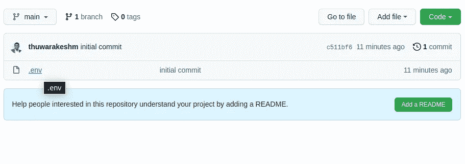
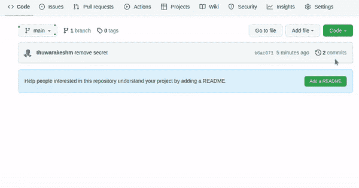

# 如何删除你不小心上传到 Github 的敏感数据

> 原文：<https://towardsdatascience.com/remove-file-from-git-history-ce404d7463d3>

## 如何避免它们进入那里？—这是一个非常简单的处理方法。


照片由[像素](https://www.pexels.com/photo/shallow-focus-photo-of-man-holding-floor-brush-ceramic-figurine-434163/)的[皮克斯拜](https://www.pexels.com/photo/shallow-focus-photo-of-man-holding-floor-brush-ceramic-figurine-434163/)拍摄

我经常遇到这种事。

我创建存储库，并且我知道我需要将我的密钥存储在一个环境文件中。但是我总是提交我的更改，而不把它们添加到 gitignore 文件中。

结果，我们的秘密都在网上了！

现在，即使您将环境文件添加到 gitignore，它也不会从历史中消失。

严重程度可能会有所不同，这取决于您上传的信息以及重置它的难度。然而，这是可以预防的！因此，我们应该始终阻止此类敏感数据进入云中。

但是，如果你不小心按到了什么东西，下面是正确清除的方法。

[](/github-automated-testing-python-fdfe5aec9446) [## 如何使用 GitHub 动作在每次提交时运行 Python 测试？

### 自动化枯燥的工作，并通过 CI 管道确保代码质量。

towardsdatascience.com](/github-automated-testing-python-fdfe5aec9446) 

# 正确删除 GitHub 中的秘密文件。

当您提交一个机密文件(例如。env)，它成为 git 历史的一部分。移除文件并重新提交不会清除它。稍后将它添加到 gitignore 也不会有帮助。

以前，人们使用 git-filter-branch 来挖掘分支模型。相信我；你不会想进去的。

如果你不同意，这里有关于 [git-filter-branch 文档](https://git-scm.com/docs/git-filter-branch)的警告信息。

> git filter-branch 有太多的缺陷，可能会导致不明显的历史重写——Git filter 分支文档的混乱

幸运的是，我们有一个更简单的选择。它叫做 [BFG 回购清道夫。](https://rtyley.github.io/bfg-repo-cleaner/)

BFG 是一个社区维护的公用事业。是用 Java 写的。所以确保你已经在电脑上准备好了。

## 如何不删除 Git 中的秘密文件？

让我们为这个演练创建一个示例 repo。

我创建了一个只有一个文件的回购。它是一个. env 文件，里面有一个密钥。有了它，我做了第一次承诺。现在。env 文件应该在历史记录中。

```
$ mkdir testrepo
$ cd testrepo/
$ echo "SECRET_KEY=039jrad8932" > .env
$ git init$ git add .
$ git commit -m 'initial commit'
```

让我们在 GitHub(或者 Bitbucket 等)上创建一个云仓库。)并将我们的代码上传到那里。

```
$ git remote add origin [git@github.com](mailto:git@github.com):<Your-Repo>.git
$ git branch -M main
$ git push -u origin main
```

哎呀，我们的秘密在网上！如果您访问您的远程回购，您可以看到。环境文件。



[作者截图。](https://thuwarakesh.medium.com)

让我们移除它，重新提交并推动它。并且刷新云回购看看效果。

```
$ rm .env
$ git add .env
$ git commit -m 'remove secret'
$ git push origin main
```

唷！现在没了。

不，还没有。它仍然在提交历史中。任何能接触到回购协议的人都可以看到。



由[作者录制的屏幕录像。](https://thuwarakesh.medium.com)

没用！

[](/python-project-structure-best-practices-d9d0b174ad5d) [## 让您的 Python 项目结构更优雅的 7 种方法

### 以下是易于管理、可伸缩且易于理解的 python 项目结构的最佳实践。

towardsdatascience.com](/python-project-structure-best-practices-d9d0b174ad5d) 

## 用 BFG 删除 Git 上的秘密文件。

以下是去除它们的正确方法。正如我前面提到的，你需要 BFG。BFG 需要 Java。

您可以使用以下命令确认您的计算机上是否安装了 Java。如果没有，请[按照这个文档来安装它。](https://www.java.com/en/download/help/download_options.html)

你可以从他们的[官方页面](https://rtyley.github.io/bfg-repo-cleaner/)下载 BFG jar 文件。

**第一步:**要从所有分支的历史中删除文件，首先，您需要创建我们的远程存储库的镜像克隆。

```
$ git clone --mirror git://<Your-Repo>.git
```

什么是镜像回购？

假设您进入新克隆的存储库。你看不到你的普通文件。相反，您会看到 Git 用来管理存储库的文件和文件夹。我们称这样的仓库为裸回购。但是镜像回购，除了裸回购内容之外，还有你的文件、分支、历史等的完整副本。，在里面。

**第二步:**下面是从历史中删除文件的代码。确保从克隆的存储库之外运行这段代码。

```
java -jar bfg.jar **--delete-files .env <Your-repo>.git**
```

上面的代码将在终端上打印一些有用的信息。它会通知您是否有任何与您的标准匹配的文件、分支和提交会受到影响，等等。

你的文件没有被删除。它只从 git 历史中删除。因此，在永久删除它们之前，您需要查看屏幕上的信息。

**第三步:**您可以运行下面的代码，当您完成评审时，将它从所有分支和提交中永久删除。这个命令需要在存储库中运行。

```
$ cd <Your-Repo>.git # if you're still outside the repo directory. $ git reflog expire --expire=now --all && git gc --prune=now --aggressive$ git push
```

如果您现在刷新远程存储库页面，您将看不到机密文件。不在文件区。甚至在提交时也没有。

我们刚刚从网上删除了我们的秘密。

# 最后的想法

推送敏感文件，如。用密码包围是我经常犯的错误。

BFG 可能不是你犯错误的通行证。后果可能是灾难性的。但这是为了营救。

最后，我想说的是，尽管 BFG 删除了所有分支和提交历史中的文件，但它不会影响你的最后一次提交。这种提交也被称为头部。

BFG 假设最后一次提交发生在生产中。改变那里的任何东西都可能使你的部署失败。

BFG 的文件说，“你需要解决这个问题，BFG 帮不了你。”

此外，如果其他人有您的存储库的本地副本，您仍然有风险。

[](/3-ways-to-deploy-machine-learning-models-in-production-cdba15b00e) [## 在生产中部署机器学习模型的 3 种方式

### 部署 ML 模型，并使它们对用户或项目的其他组件可用。

towardsdatascience.com](/3-ways-to-deploy-machine-learning-models-in-production-cdba15b00e) 

> 朋友，感谢你的阅读！在[***LinkedIn***](https://www.linkedin.com/in/thuwarakesh/)*[***Twitter***](https://twitter.com/Thuwarakesh)*，以及*[***Medium***](https://thuwarakesh.medium.com/)*上跟我打招呼。**
> 
> **还不是中等会员？请使用此链接* [***成为会员***](https://thuwarakesh.medium.com/membership) *因为，在不为你额外付费的情况下，我为你引荐赚取一小笔佣金。**