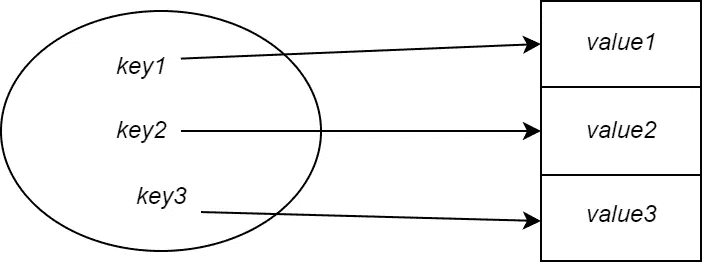
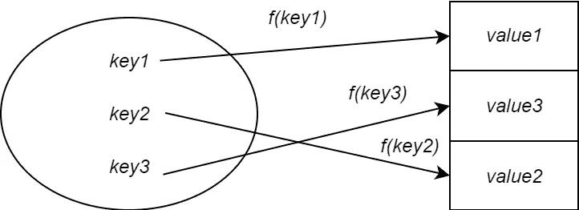
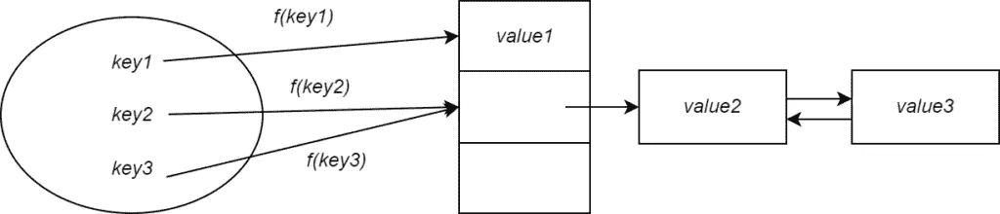

# 替换 Python 列表，让你的代码快几个数量级！

> 原文：<https://towardsdatascience.com/replace-python-lists-and-make-your-code-orders-of-magnitude-faster-702c08fb397b>

## 没有花哨的库，没有复杂的工程，只有一种数据结构——哈希表。

作者图片

每个初学编程的人都喜欢 for-loops，因为它们很实用，也很容易理解。同样，大家都爱数组。然而，更多的时候，我们开始在任何事情上使用数组，而不去考虑它。我们上了数据结构的课，但在实践所学内容时，我们做得不够。直到最近我才发现自己掉进了这个陷阱。我正在处理一个编程任务，试图挑战自己写出高效快速的代码。

我们可以做得更好！

在这篇文章中，我们将简要介绍 Python 中的字典和集合。我们将(重新)发现这些数据结构在我们的代码中使数据操作超快的能力。我们将了解哈希表如何导致巨大的算法性能改进。

但首先我们需要回顾一些概念。
是时候回归基础了！

# 回到基础:散列表

编程语言中的数据结构是计算机科学中抽象数据结构的实现。Python 字典和集合基本上是一个*哈希表*。哈希表是一种抽象数据结构的实现，称为*关联数组*，字典*或映射*。简单地说，哈希表是从键到值的映射。给定一个键，可以查询数据结构以获得相应的值。**

*实现这一点的简单方法是使用一个*直接地址表*或一个数组。
所以对于一个键 *1* ，我们将把值存储在数组的索引位置 *1* 。*

**

*图片作者。用数组直接寻址。
每个键简单地映射到数组中的下一个槽。*

*但是这种方法有一个问题。如果有很多键，数组的大小会很大。这使得按内存方式存储变得不可行。*

*对此的解决方案是使用一个*散列函数。*哈希函数负责将键映射到哈希表中存储的值。你给它传递一个键，它就抛出一个叫做*哈希值*的值。哈希值确定哈希表中存储对应于该键的值的位置。换句话说，它是一个指数。*

**

*图片作者。使用哈希函数和哈希表。*

*现在，哈希表的大小将小于直接地址表的大小。这意味着哈希表在内存方面是可行的。然而，这也意味着两个键可以映射到相同的值。
这被称为*哈希冲突*，当哈希函数在给定两个不同键的情况下输出相同的值时就会发生。*

**

*图片作者。通过用链表链接来解决散列冲突。*

*为了解决这个问题，如果两个键散列为相同的值，我们可以将值存储在一个链表中(见上图)。任何随后的冲突只会导致该值被追加到链表中。这被称为通过*链接*的冲突解决。*

*现在你可以想象一下，如果所有的键都被散列为相同的值，那么它们都将被添加到链表中，这意味着性能不会比使用链表更好！*

*如果哈希表太满，就会调整其大小。该阈值被称为*负载系数*，并确定已占用插槽与可用插槽的比率。通常，当值超过`3/4`时，哈希表的大小就会改变。这确保了链表不会太满，并保证了承诺的平均性能。最后，散列函数通常以这样一种方式被选择，即它们跨槽均匀地分布密钥。这意味着碰撞的几率很小。*

*太好了！现在让我们看看一些大 O 符号。*

# *回到基础:O(1)与 O(n)*

*在数组中搜索元素的平均时间复杂度为`O(n)`,因为我们需要线性遍历列表来找到元素。
列表越大，搜索元素所需的时间越长。你可以想象这是一排人站在那里，从最左边的人开始，问他是否是你要找的人。
如果不是，你问旁边的人，以此类推。你可以想象，如果有 1000 个人对 10 个人，找到那个人需要更长的时间。*

*但是对于哈希表，搜索的平均时间复杂度是`O(1)`——它是常数。不管你存储的元素数量是多少，是 100 万还是 10 个，找到一个元素总是需要一个固定的时间单位。换句话说，对于所有大小的输入，它都是快速的。
你可以想象一群人站着，多一个人是你的帮手。要找到那个人，你只需要问帮助者，而不是在整个团队中寻找。助手会立即告诉你你感兴趣的人在哪里。*

*元素的插入和删除也是`O(1)`。*

**点击* [*此处*](https://www.bigocheatsheet.com/) *获取一份非常好的数据结构和大 o 的备忘单。**

*好了，现在是编码的时候了，看看哈希表是如何工作的！*

# *代码和基准*

*我们将模拟以下任务:*

*   *一个列表`**L**`，包含从 0 到 100，000 的排序元素。倒数第三个索引有一个随机生成的负值，范围从 0 到 100，000。*
*   *列表`**R**`包含从 0 到 100，000 的元素，按排序顺序排列。*

*任务很简单。我们需要找到`**L**`中没有出现在`**R**`中的值。*

*我知道有更简单的方法来解决这个问题，但出于学习的目的，我们将尝试一种更复杂的方法。*

*`solution`函数是一个解决方案的简单实现。我们对`**L**`进行迭代，并检查每个元素是否存在于列表`**R**`中。`in`操作符检查成员资格，类似于执行搜索操作。如果它存在，我们简单地返回负整数。*

*该解决方案的耗时约为***60 秒*** 。*

*如果我们分析`solution`函数的代码，我们看到时间复杂度是***【o(n^2】***。
这是因为对于 ***L*** 中的每个元素，我们都在遍历 ***R*** 并检查成员资格。for 循环在运行 ***n*** 步时采用 ***O(n)*** 。对于每一步，我们都要做 O(n) 操作，因为我们需要检查列表 ***R*** 中的每一个元素，看它是否是我们要找的元素。
这就给出了***【o(n)*o(n)=o(n^2】****

*该操作以二次时间运行。所花费的时间将等于输入大小的平方。你可以想象得到越来越大的数字的平方会产生越来越大的值。*

*我们能做些什么来改善这种情况？*

*代替遍历 ***R*** 来检查成员资格，我们可以将 ***R*** 实现为散列表而不是数组。因此，检查成员资格的时间复杂度将是****(1)***。
因此，运算会取***【O(n)* O(1)= O(n)***。**

**这是线性的输入大小！因此，所花费的时间将与输入大小成正比(与二次方相反)。**

**等着看性能提升吧！**

**计时`solution2`给出 0.011 秒*的经过时间。这是超过 5000 倍的进步！***

# ***结论和结束语***

***总之，你已经了解了使用散列函数和散列表背后的动机。我们简要地看了一下散列表的大 O 符号，并将其与数组的大 O 符号进行了比较。更重要的是，我们看到了一个实现，它利用哈希表在创纪录的时间内解决了一个算法问题。***

***作为软件工程师，我们必须知道在正确的情况下使用正确的工具，而不是试图在我们遇到的每个场景中使用暴力技术。***

***记住这一点，有几点需要记住。***

***就像所有的事情一样，哈希表并不是万能的。它们并不适合所有的用例。例如，重复元素不能存储在哈希表中。因此，如果您的用例需要，您最好使用数组。同样，哈希表也是不排序的。如果您的用例需要一个排序的数据结构，哈希表不是答案。最后，没有内置函数来查找哈希表中的最大或最小元素。最后，上面提到的时间复杂度是*平均情况*。可能会出现“T2”最差情况，这意味着散列表的性能与数组相同。***

**我希望你喜欢这篇文章的内容。下次见。**

# **资源**

**科尔曼·托马斯·H 等人，*算法简介*(麻省理工学院出版社，2009)。**

***原载于*[*https://haseebkamal.com*](https://haseebkamal.com/replace-python-lists-and-make-your-code-orders-of-magnitude-faster/)*。***