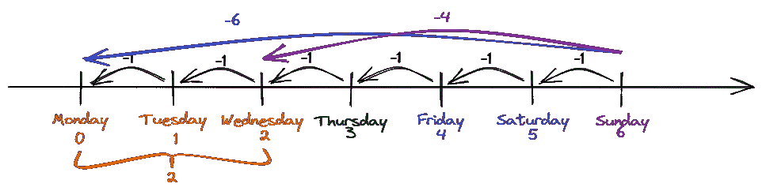

# 使用 Python 的报告自动化技巧

> 原文：<https://towardsdatascience.com/report-automation-tips-with-python-783a9cd58e23>

## [使用 PYWIN32 实现自动化](https://towardsdatascience.com/tagged/automation-with-pywin32)

## 分享一些技巧，让你的自动化脚本更干净，更容易调试。我从一年前写的新秀剧本中了解到


照片由 [Amanpreet Deol](https://unsplash.com/@amanpreetdeol1?utm_source=unsplash&utm_medium=referral&utm_content=creditCopyText) 在 [Unsplash](https://unsplash.com/?utm_source=unsplash&utm_medium=referral&utm_content=creditCopyText) 上拍摄

嗯，最近，我正在调试我一年前写的自动化脚本，因为它们不能在新电脑上正常运行。我只是不能停止思考我当时在想什么。总的来说，调试我的脚本是一次有趣而痛苦的经历。哈哈！

我从痛苦的调试经历中学到的第一个教训是:

# 不要硬编码日期计算变量

通常，自动化脚本被编写为在从 ERP 系统生成输入报告的当天或第二天填充每周报告。生成的输入报告将总是具有相同的报告名称，并且总是具有报告生成日期的文件名。

例如*材料使用报告 15042022.xlsx* 和*材料使用报告 22042022.xlsx* 。报告名称“材料使用报告”应该始终一致，日期格式也应该一致。

在我的例子中，生成的报告通过保存在网络驱动器中或通过电子邮件发送出去来共享。然后，自动化脚本将读取它们并执行所需的转换，比如合并表或旋转。

所以，我使用`datetime.date.today()`函数来获取日期，然后结合需要下载的报告的名称。如果脚本被安排在报告生成的同一天，我将直接使用函数的输出，否则我将使用`timedelta`函数来计算实际日期。

```
# the file is processed on the next day of the file received
file_received_date = datetime.date.today() - timedelta(*days* = 1)
```

这在开发阶段看起来非常好，但是到了测试阶段，我总是不得不手动调整`timedelta`函数的参数来获得正确的日期。经过无数次的测试，我终于意识到，我不应该这样编码。因为脚本每周运行一次，所以我应该能够在一周的任何一天运行脚本来获得输出。例如下面，脚本被安排在每周一。

```
# add 1 day for everyday delayed
day_delay = datetime.date.today().weekday()# the process file dated the next day of the file received
date_process_file = datetime.date.today() - timedelta(*days* = day_delay)
```

weekday()函数将以数字形式返回日期的星期几。因为 Python 索引从零开始，所以一周的第一天，即星期一，用 0 表示，如下所示。

```
Monday: 0
Tuesday: 1
Wednesday: 2
Thursday: 3
Friday: 4
Saturday: 5
Sunday: 6
```

因此，如果我在星期二运行脚本，也就是第二天，则 date_process_file 需要减去一天。

如果我的脚本被安排在周一以外的任何一天，我只需要从 day_delay 中减去当天的索引，计算如下。day_delay 以数字形式返回日期的星期几。

```
# Scheduling on Wednesday
date_process_file = datetime.date.today() - timedelta(*days* = day_delay - 2)
```

这背后的逻辑如下图所示。



图片作者。用 Excalidraw 创建。

对于计划在星期一运行的报告，如果我们在星期日运行脚本，我们必须将日期减去 6 天才能得到星期一的日期，而 6 是星期日的索引，星期一的索引是 0。

对于计划在周三运行的报告，如果我们在周日运行脚本，我们必须减去 4 天才能得到周三的日期，而 4 等于周日的索引减去周三的索引。

如果我们推导出一个公式，它应该是这样的。

```
actual_date = datetime.date.today() - timedelta(*days* = weekday_script_run - weekday_report_scheduled)
```

# 明智地使用复制方法

我的一个痛点是我当时太懒了。我滥用了 PyWin32 复制方法。当我被指派自动执行每周报告时，已经有旧的报告设置了格式。因此，我只是将上周报告的格式复制并粘贴到由我的自动化脚本生成的新工作簿中。

```
# copy paste FORMAT only, which includes font colour, fill colour, and border
wb2.Sheets(sheetname).Range("A:D").Copy()
wb.Sheets(sheetname).Range("A1").PasteSpecial(Paste=win32c.xlPasteFormats)
```

一切都很好，直到用户希望在新报告中添加一个新列。这意味着我的复制粘贴技巧不能再用了，否则格式将会完全不匹配🤣。

这是我学到的第二课:

> 明智地使用复制方法

在您编写脚本将任何内容复制粘贴到新报告之前，请三思！复制-粘贴就像硬编码任何 Python 变量一样。总是回顾你试图复制粘贴的部分，并彻底思考如果将来有新的需求，这是否会受到影响。

如果您想知道我是如何解决这个问题的，我会显式地对格式进行编码🤣。

```
wb.Sheets(sheetname).Columns("A:A").AutoFit()
wb.Sheets(sheetname).Columns("B:B").ColumnWidth = 19.71
wb.Sheets(sheetname).Columns("C:C").ColumnWidth = 43
wb.Sheets(sheetname).Columns("D:I").AutoFit()
wb.Sheets(sheetname).Columns("J:N").ColumnWidth = 23
```

在解决这个问题的过程中，我还学习了一些可以用 Python 实现的 Excel 格式。

## 文字换行

```
wb.Sheets(sheetname).Range("B1").WrapText = True
```

## 设置边框线条样式

作者要点

在第 12 行，`Range(select_table, select_table.End(win32c.xlDown))`将选择 Excel 文件中的整个表格，因此我们不需要指定最后一行。第一个参数`select_table` 是指表格的第一行，第二个参数`select_table.End(win32c.xlDown)`将根据第一列选择行，当第一列为空时停止。

# 修复系统生成的 Excel 文件，该文件不能被使用 PyWin32 的熊猫读取

这是指如下的类型错误。

```
TypeError: expected <class 'openpyxl.styles.fills.Fill'>
```

因此，Excel 文件可以直接在我的笔记本电脑上打开，但无论我如何尝试，熊猫都无法读取。然后，最终，我解决了这个问题，我想是以一种不太聪明的方式🤣。这是 StackOverFlow 平台上存在的一个问题，人们建议恢复到旧版本的 OpenPyXL 或将文件重新保存为 XLS 文件类型。

我确实尝试过恢复到旧版本的 OpenPyXL，但是没有解决错误。我还试着安装了与我在旧 PC 上安装的版本相同的所有软件包，在旧 PC 上脚本仍然可以工作，但在新 PC 上仍然出现相同的错误。

然后，我尝试建议的第二种解决方案，即将文件重新保存为 XLS 文件。不幸的是，它导致了另一个错误如下。

```
XLRDError: Workbook is encrypted
```

我试着通读微软的文档，但是仍然不能保存未加密的文件。当我几乎要放弃的时候，我试着将文件重新保存为 CSV 文件，它运行得非常好！

```
import win32com.client as win32
import pandas as pd
win32c = win32.constants
import pandas as pdfile_xlsx = r"the original file*.*xlsx"
file_csv = r"the new file*.*csv"# create excel object
excel = win32.gencache.EnsureDispatch('Excel.Application')# excel can be visible or not
excel.Visible = True  # False
wb = excel.Workbooks.Open(file_xlsx_local)wb.SaveAs(file_csv, win32c.xlCSV, win32c.xlLocalSessionChanges, win32c.xlExclusive)wb.Close()
excel.Quit()# read the resaved file
df_csv = pd.read_csv(file_csv, *encoding*='windows-1252', *low_memory*=False)
```

该文件需要一个特殊的编码来读取，但现在一切都解决了😉。

我把这个问题添加到我的课程中的原因是，我的学长建议我把它保存为一个新文件，但我一开始并没有认真对待。如果我直接在我的笔记本电脑上打开文件，并将其保存为不同的文件，它可以工作。但是，我觉得我甚至不能用熊猫来阅读它，我怎么能把它保存为另一个文件。

在挣扎了几个小时后，我意识到我所需要的就是使用 PyWin32 打开文件并将其保存为另一个文件。这是因为 PyWin32 通过访问 Window 的组件对象模型(COM)[1][2]来访问 Excel 文件。

所以，这里学到的一课是认真对待学长的建议，他们是学长是有原因的。此外，我应该在写剧本的时候保持创造性。

以上是我在调试脚本时学到的三点经验。

> 你经历过类似的事情吗？

让我知道我并不孤单！🤣

# 写一个干净的 Python 代码

最后，我很感激我在写这个脚本之前阅读了干净代码的概念。我稍微干净的代码允许我在我第一次写代码 1 年后很快赶上我的代码(仍然有很大的改进空间😁).

我忘了我是在哪里读到的，但是我相信你在学习编程的时候，在某个地方看到过关于编写干净代码的文章或视频。比如[这是我最近看的](https://dev.to/alexomeyer/10-must-know-patterns-for-writing-clean-code-with-python-56bf)的一篇。

对于编写干净的代码，有各种版本的建议。对我来说，最重要的概念是保持变量和函数名的可解释性。名称应该是描述性的，易于阅读。因此，应该避免含糊的缩写形式。

# 保持联系

订阅 [YouTube](https://www.youtube.com/channel/UCiMtx0qbILP41Ot-pkk6eJw)

# 边注

在[用 Python 自动化 Excel](/automate-excel-with-python-7c0e8c7c6256)中，我解释了 Excel VBA 的**对象、方法和属性**。这是使用`pywin32`时你必须知道的 3 个主要概念。

如果您有兴趣**自动化数据透视表，并从数据透视表中提取过滤后的数据到 pandas DataFrame** ，那么您可以使用[用 Python 自动化数据透视表(创建、过滤和提取)](https://kahemchu.medium.com/automate-excel-with-python-pivot-table-899eab993966)。

如果你的工作使用 Google Sheets 而不是 Microsoft Excel，你可以参考这篇文章，“[自动化 Google Sheet Report](/automate-google-sheet-reporting-in-5-minutes-8bbdc1f8e293) ”来了解可能的自动化。

## 参考

1.  [Excel COM 加载项和自动化加载项](https://support.microsoft.com/en-us/topic/excel-com-add-ins-and-automation-add-ins-91f5ff06-0c9c-b98e-06e9-3657964eec72)
2.  [Chris moff ITT 著](https://pbpython.com/windows-com.html)

*祝贺并感谢你阅读到最后。希望你喜欢这篇文章。*😊


照片由[Courtney hedge](https://unsplash.com/@cmhedger?utm_source=unsplash&utm_medium=referral&utm_content=creditCopyText)在 [Unsplash](https://unsplash.com/s/photos/thank-you?utm_source=unsplash&utm_medium=referral&utm_content=creditCopyText) 上拍摄