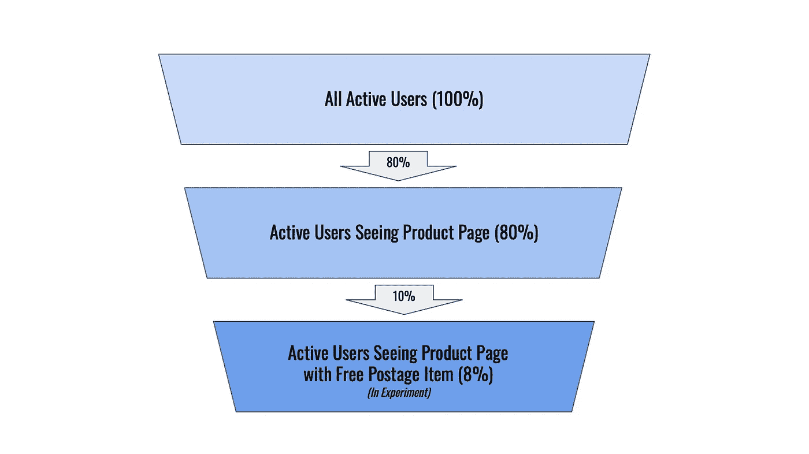

# 正确报告 A/B 测试的影响

> 原文：<https://towardsdatascience.com/reporting-the-impact-of-your-a-b-tests-correctly-3cdb15d60d79>

## 如何使用背线碰撞来测量和比较实验结果

(图片来自[Unsplash.com](https://unsplash.com/photos/VJHb4QPBgV4))

P 实验中的阳性结果是分析师日常工作中的亮点之一(对产品团队也是如此)。从构思到实施，看到一个关键指标朝着预期的方向显著移动，是对实验中所有辛勤工作的巨大回报。

在这种情况下，很容易走开，自豪地向组织的其他人报告一个关键指标的观察到的百分比增长。然而，测试结果通常不能代表全部用户，可能会错误地反映实验的整体业务影响。

在这篇文章中，我将深入探讨如何在整个组织中报告实验结果，以允许不同产品计划之间的可比性，并支持公正的决策。

# 曝光点

让我们从一个例子开始，在 ebay 的产品页面上看下面的(编造的)AB 测试。新的“*免邮费*”横幅已添加到测试单元，目的是转化更多用户，增加该群体的购买数量:

(图片由作者提供)

横幅在以下情况下显示:

*   用户需要进入产品页面(因此，只停留在主页上的用户不会接触到实验)
*   产品页面上显示的项目必须符合免费送货的条件(因此，只查看不合格产品的用户将不会被添加到测试中)

## 并非所有用户都是实验的一部分

当进行这样的测试时，并不是网站或应用程序上的所有用户都会立即加入到实验中。通常我们选择一个**暴露点**，用户必须通过这个暴露点才能成为 AB 测试的一部分。这个点应该尽可能地靠近治疗，以避免结果的稀释，并确保我们只测量新变化的影响。

在*免费邮寄-* 实验中，一个好的曝光点可能是有资格免费送货的产品页面的入口。因此，只有至少进入过一次这样的页面的用户才会成为实验的一部分(无论是在测试组还是对照组)。

让我们假设 80%的活跃用户进入了产品页面，其中 10%的用户查看了一个符合免邮费条件的商品页面。这意味着 8%的活跃用户将会接触到这个实验:

实验人群的构成(占总人口的百分比)(图片由作者提供)

# 实验与背线碰撞

假设我们运行了这个实验，并在测试组中看到每个用户的事务有+10%的显著增长。在这一点上，在整个组织中广泛宣布这一巨大胜利是非常诱人的("*哇，我们每个用户的交易量增加了 10%！"*)。

团队可能会尝试跟进这一成功，并开始考虑类似的实验。其他实验虽然成功，但只实现了 2%的增长，可能看起来没什么大不了的。

但是让我们记住，只有一小部分用户真正有资格成为实验的一部分。这意味着，如果实验发布，对每个用户的事务的总体影响将显著降低！

# 报告顶线而不是实验影响

在上面的例子中，假设只有 8%的用户符合条件，实验对整个群体的交易率的总体影响(或*顶线*影响)将只有 0.8%，而不是 10%。

另一个实验只显示了实验中 2%的用户交易增加，如果它影响了更大的用户群，那么它仍然更有价值(为此，超过 40%的用户必须在新体验的目标群中)。

这意味着**实验表明，如果覆盖率更高的话，期望指标的增益更小，最终仍然可以产生更大的影响**。

产品团队应始终致力于根据对顶线指标的影响来报告他们的结果。这在比较不同测试的影响时避免了混淆，并允许组织的其他部分容易地评估特定产品领域的潜力。

# 喜欢这篇文章吗？

那么你可能也会喜欢我的另一个关于 AB 测试的帖子:

</how-to-set-the-minimum-detectable-effect-in-ab-tests-fe07f8002d6d>  </finding-the-right-significance-level-for-an-ab-test-26d907ca91c9> 