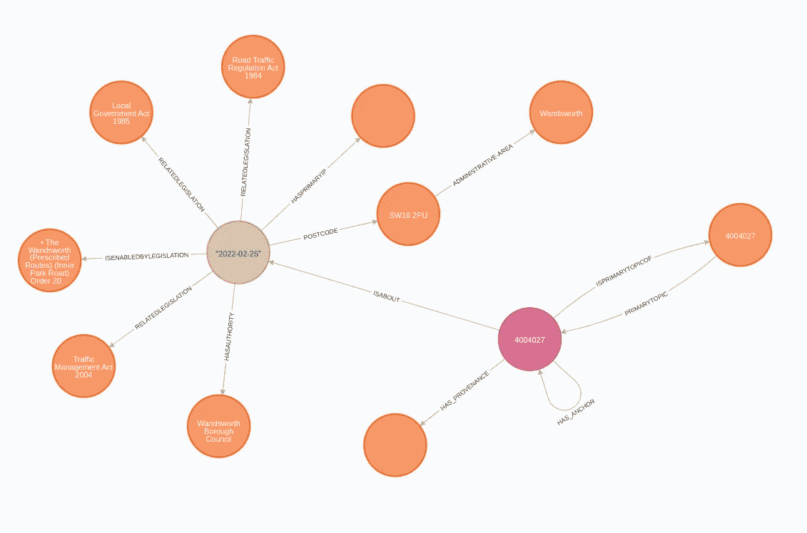
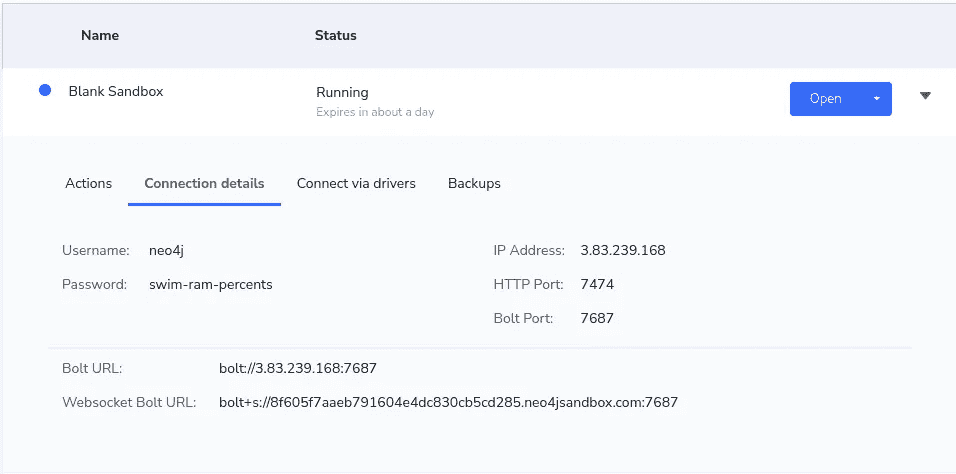

# 将英国的公共记录表示为知识图表

> 原文：<https://towardsdatascience.com/represent-united-kingdoms-public-record-as-a-knowledge-graph-647b6fd07b3d>

## 利用英国公报 API 功能构建知识图，并在 Neo4j 中进行分析

我喜欢从各种来源构建知识图表。一段时间以来，我一直想创建一个政府知识图表，但一直在努力寻找任何易于访问且不需要我花费数周时间开发数据管道的数据。起初，我认为我必须使用 OCR 和 NLP 技术从公共记录中提取有价值的信息，但幸运的是，我偶然发现了英国公报。英国公报是一个保存英国官方公共记录信息的网站。在[开放政府许可 v3.0](https://www.nationalarchives.gov.uk/doc/open-government-licence/version/3/) 下，网站上和通过其 API 的所有内容都是可用的。这意味着，虽然端点返回个人信息，如相关人员的姓名，但我将在本文中排除这些信息。因为它们通过 API 端点提供公共记录信息，所以我们不必使用任何抓取工具来提取信息。更令人印象深刻的是，您可以以链接数据格式(RDF)导出数据。链接数据是一种表示结构化数据的格式，这种数据是相互链接的，并且在处理节点和关系时实质上表示一个图形。

例如，我们可以看一个包含[道路交通法通知](https://www.thegazette.co.uk/notice/4004027)的示例通知。如果我们点击通知的[链接数据视图，我们可以检查数据结构。由于许可权的不确定性，我在这篇文章中省略了通知截图，但所有数据都可以在官方公共记录网站上找到。](https://www.thegazette.co.uk/notice/4004027?view=linked-data)

我们可以获取与给定的道路交通行为通知相关联的数据信息，并构建一个知识图。



关联数据信息的图形可视化。图片由作者提供。

因为链接数据结构(RDF)已经包含了关于节点和关系的信息，所以我们不需要手工定义一个图表模式。

大多数图数据库使用 RDF(资源描述框架)或 LPG(标记属性图)模型。如果使用 RDF 图形数据库，链接数据信息的结构将与数据库中的图形模型相同。然而，你可能从我以前的帖子中知道，我喜欢使用 Neo4j，它利用了 LPG 图模型。这里我就不多讲这两种模式的区别了。如果你想了解更多关于 RDF 和 LPG 模型之间的区别，我会向你推荐由 [Jesús Barrasa](https://medium.com/u/ca9ab94418f0?source=post_page-----647b6fd07b3d--------------------------------) 所做的[演讲](https://neo4j.com/blog/rdf-triple-store-vs-labeled-property-graph-difference/)。

由于链接数据结构经常用于传输数据，Neo4j 的人员通过使用 [Neosemantics 库](https://neo4j.com/labs/neosemantics/)，使得导入或导出链接数据格式的数据变得容易。在本帖中，我们将使用 Neo4j 数据库结合 Neosemantics 库来存储从英国公报的 API 中获取的链接数据信息。

和往常一样，如果你想跟着一起去，我准备了一个 [Colab 笔记本](https://github.com/tomasonjo/blogs/blob/master/gazette/UK%20Gazette.ipynb)。

## 环境设置

要继续操作，您需要有一个安装了 Neosemantics 库的 Neo4j 数据库的运行实例。

一种选择是使用 Neo4j 沙盒环境，这是 Neo4j 数据库的一个免费云实例，预装了 Neosemantics 库。如果您想使用 Neo4j 沙盒环境，[启动一个带有空数据库的空白项目](https://sandbox.neo4j.com/?usecase=blank-sandbox)。

另一方面，您也可以使用 Neo4j 的本地环境。如果你选择本地版本，我推荐使用 [Neo4j 桌面应用](https://neo4j.com/download/)，这是一个数据库管理应用，它有一个简单的界面，只需点击一下就可以添加插件。

## 设置与 Neo4j 实例的连接

在开始之前，我们必须从笔记本环境建立与 Neo4j 的连接。如果您正在使用沙盒实例，您可以从**连接详细信息**选项卡中复制详细信息。



沙盒连接详细信息。图片由作者提供。

现在，您只需在代码中输入您的连接详细信息:

## 配置新语义库

需要在资源节点上定义唯一的约束，新语义库才能工作。您可以使用下面的 Cypher 语句定义 unique 约束。

```
CREATE CONSTRAINT n10s_unique_uri IF NOT EXISTS ON (r:Resource)
ASSERT r.uri IS UNIQUE
```

接下来，我们需要定义新语义配置。我们有几个选项来指定我们希望 RDF 数据如何作为 LPG 图导入。我们将保留大部分配置默认值，只设置 **handleVocabUri** 和 **applyNeo4jNaming** 参数。同样，您可以查看配置选项的[完整参考文档。](https://neo4j.com/labs/neosemantics/4.3/reference/)

使用下面的 Cypher 语句定义新语义配置。

```
CALL n10s.graphconfig.init({
  handleVocabUris: 'MAP',
  applyNeo4jNaming: true
})
```

## 构建英国公共记录的知识图谱

我们将利用英国公报 API 搜索通知。通知提要 API 是公开可用的，不需要任何授权。然而，出于某种原因，你需要假装你是一个浏览器。我不知道这背后的原因，但我花了 30 分钟试图让它工作。API 的文档可以在 [GitHub](https://github.com/TheGazette/DevDocs/blob/master/notice/notice-feed.md) 上获得。

通过 API 过滤通知的两个主要参数是类别代码和通知类型。类别代码是更高级别的过滤器，而通知类型只允许您选择类别的一个子部分。类别代码和通知类型的完整列表可在[以下网站](https://www.thegazette.co.uk/noticecodes)上获得。有一个广泛的选择通知你可以选择，从国家和议会到公司法规等等。

如上所述，我们可以下载每个通知的链接数据格式信息。Neosemantics 库的一个优点是它可以从本地文件以及简单的 API 中获取数据。工作流程如下。

*   使用通知提要 API 来查找相关的通知 id
*   使用 Neosemantics 提取关于指定通知 id 的 RDF 信息，并将其存储在 Neo4j 中

以下 Cypher 语句用于从英国 Gazette API 导入 RDF/XML 结构的信息。

Cypher 语句期望**数据**参数包含一个链接列表，其中包含关于通知的 RDF/XML 信息。Neosemantics 库也支持其他 RDF 序列化格式，比如 JSON-LD 和其他格式，如果你想知道的话。

最后，我们将定义接收类别代码和通知类型参数的函数，并将通知信息存储在 Neo4j 数据库中。

我们从通知提要 API 的每个请求中获得 100 个通知 id。如果您想导入更多内容，我已经在函数中包含了分页功能。正如您可能从代码中看到的，我们向通知提要发出一个请求，并构造一个链接列表，其中存储了关于通知的 RDF/XML 信息。接下来，我们将该列表作为参数输入到 Cypher 语句中，其中 Neosemantics 库将遍历所有链接并将信息存储在 Neo4j 中。这很简单。

现在，我们可以导入州类别代码下的最后 1000 个通知。如果您查看[通知代码参考](https://www.thegazette.co.uk/noticecodes)，您可以看到状态通知属于类别代码值 11。

导入图形的图形模式很复杂，不容易可视化，因此我们将跳过它。我没有花太多时间理解整个图形结构，但是我准备了几个示例 Cypher 语句，可以让我们开始。

例如，我们可以检查任何奖项的最后五名获奖者。

```
MATCH (award)<-[:ISAWARDED]-(t:AwardandHonourThing)-[:HASAWARDEE]->(person)-[:HASEMPLOYMENT]->(employment)-[:ISMEMBEROFORGANISATION]->(organization)
RETURN award.label AS award,
       t.relatedDate AS relatedDate,
       person.name AS person,
       employment.jobTitle AS jobTitle,
       organization.name AS organization
ORDER BY relatedDate DESC
LIMIT 5
```

*结果*

我了解到一个人也可以被任命为大英帝国的指挥官。

```
MATCH (n:CommanderOrderOfTheBritishEmpire)<-[:ISAPPOINTEDAS]-(notice)-[:HASAPPOINTEE]->(appointee),
      (notice)-[:HASAUTHORITY]->(authority)
RETURN n.label AS award,
       notice.relatedDate AS date,
       appointee.name AS appointee,
       authority.label AS authority
ORDER BY date DESC
LIMIT 5
```

*结果*

为了避开裁决，我们还可以检查哪些通知与各种法规相关。

```
MATCH (provenance)<-[:HAS_PROVENANCE]-(n:Notice)-[:ISABOUT]->(l:Legislation:NotifiableThing)-[:RELATEDLEGISLATION]->(related)
RETURN n.hasNoticeID AS noticeID,
       n.uri AS noticeURI,
       l.relatedDate AS date,
       provenance.uri AS provenance,
       collect(related.label) AS relatedLegislations
ORDER BY date DESC
LIMIT 5
```

*结果*

我们的知识图表的好处在于它包含了公报网站的所有数据参考。这使我们能够核实并在需要时找到更多信息。此外，通过我的数据探索，我注意到并不是所有的信息都是从通知中解析出来的，因为很多信息很难自动组织成图表。稍后会详细介绍。

假设你和我一样，很快对状态信息感到厌倦。在这种情况下，您可以获取更多与业务相关的信息，如公司回购自己的股票、公司董事被取消资格或合伙关系解除。

我花了 30 分钟弄清楚如何正确使用通知类型和类别代码参数来过滤通知提要。当您要按通知类型筛选时，必须包括类别代码参数。否则，过滤不会像预期的那样工作。

我们不必担心为额外的通知提要创建单独的图表或数据库。图表模式已经在 RDF/XML 数据结构中定义，您可以将所有通知类型导入到一个 Neo4j 实例中。

现在，您可以检查哪些合作关系已经解散。

```
MATCH (n:PartnershipDissolutionNotice)-[:ISABOUT]->(notifiableThing)-[:HASCOMPANY]->(partnership),
      (notifiableThing)-[:ISENABLEDBYLEGISLATION]->(enabledby)
RETURN n.hasNoticeID AS noticeID,
       notifiableThing.relatedDate AS date,
       notifiableThing.uri AS noticeURI,
       enabledby.label AS enablingLegislation,
       partnership.name AS partnership
ORDER BY date DESC
LIMIT 5
```

*结果*

另一个有趣的信息是关于哪些公司已经或打算回购自己的股票。

```
MATCH (legislation)<-[:RELATEDLEGISLATION]-(n:RedemptionOrPurchase)-[:HASCOMPANY]->(company)
RETURN n.relatedDate AS date,
       company.name AS company,
       company.uri AS companyURI,
       collect(legislation.label) AS relatedLegislations,
       n.uri AS noticeURI
ORDER BY date DESC
LIMIT 5
```

*结果*

## 更上一层楼

如前所述，在一些例子中，并非所有信息都是从链接数据结构中的通知中提取的。一个这样的例子是成员在伙伴关系中的变化。我们有关于成员发生变化的合作关系的信息，但不知道具体发生了什么变化。我们可以检索的所有数据如下:

```
MATCH (notice)-[:ISABOUT]->(n:PartnershipChangeInMembers)-[:HASCOMPANY]->(company)
RETURN notice.hasNoticeID AS noticeID,
       notice.uri AS noticeURI,
       n.relatedDate AS date,
       company.name AS company
ORDER BY date DESC
LIMIT 5
```

*结果*

例如，如果我们检查网站上的[第一次通知，我们可以观察到链接数据格式中没有成员的实际变化。我认为遗漏成员变更信息的原因是成员变更通知有太多的变化，无法以结构化的方式捕获它们。](https://www.thegazette.co.uk/notice/3984531)

似乎条条大路通罗马，或者在我们的情况下，当处理文本时，你可能不得不利用 NLP 技术。所以我添加了一个简单的例子，使用[空间](https://spacy.io/)从通知中提取组织和个人实体。

通知的文本没有存储在我们的知识图中，所以我们必须利用英国公报 API 来检索它。我使用 BeatifulSoup 从 XML 响应中提取文本，然后让它通过 SpaCy 的 NLP 管道来检测组织和人员提及。代码没有将实体存储回 Neo4j。我只是想给你一个简单的例子，告诉你如何开始利用 NLP 的能力来提取更多的信息。

我们现在可以在伙伴关系通知的成员中检测到几个变化的实体。

结果如下:

```
Extracting entities for 3996989

Pursuant to section 10 of the Limited Partnerships Act 1907, notice is hereby given in respect of IIF UK 1 LP, a limited partnership registered in England with registered number LP012764 (the “Partnership”), that:

 1.	FCA Pension Plan Trustee Limited as trustee of the FCA Pension Plan was admitted as a new limited partner of the Partnership.

Entities 
 --------------------
IIF UK 1 LP ORG
LP012764 ORG
the FCA Pension Plan ORG
```

NLP 管道没有提取特定的变化，但至少这是一个开始，因为由于文本的非标准结构，您无法创建基于规则的差异提取。如果您运行提取，您可以观察到通知在文本结构和信息上有很大的不同。我省略了其他例子，因为它们包含个人信息。

## 结论

英国公报 API 提供了丰富的官方信息，你可以用来检查国家，企业或个人破产。这些只是我想到的一些使用案例。使用 [Neosemantics](https://neo4j.com/labs/neosemantics/) 库，您可以轻松地将检索到的链接数据格式导入 Neo4j，在那里可以对其进行处理和分析。如果你有一些 NLP 能力，你也可以丰富知识图。

如果您发现了一些令人兴奋的用例，或者已经开发了从文本中提取附加信息的 NLP 管道，请告诉我。

和往常一样，代码可以在 [GitHub](https://github.com/tomasonjo/blogs/blob/master/gazette/UK%20Gazette.ipynb) 上获得。