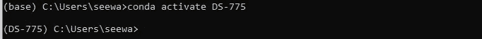

# 使用 Conda 的可再现数据科学

> 原文：<https://towardsdatascience.com/reproducible-data-science-with-conda-48f9de6eabd5>

## 教程|管理环境| CONDA

# 使用 Conda 的可再现数据科学

## 可重复的数据科学，快速简单的方法


(图片由作者提供)

对于任何类型的研究，重要的是其结果可以被他人复制。如果他们没有复制测试的方法和工具，他们可能会得出不同的甚至是矛盾的结论。在数据科学环境中，有两个非常重要的变异来源需要控制:代码本身，以及用于运行代码的包。

对于代码本身，你可能已经在使用某种版本控制系统，比如 [git](https://git-scm.com/about) 或 [GitHub](https://github.com/features) 。这些确保了使用了正确的代码版本。只要您和您的团队正确使用它，找到最新版本的代码应该是一件简单的事情。

</github-desktop-for-data-scientists-b9d8a3afc5ea>  

变化的另一个来源是代码运行的环境，比如使用的 python 版本或者安装的包的版本。

## 一个例子

在这里，我假设您已经掌握了 git 和 GitHub，但是需要知道如何确保相同的代码以相同的方式运行。如果这听起来有点混乱，让我们后退一步，看一个例子，这将有助于解释它。

在 [scikit learn](https://scikit-learn.org/stable/) 模块中，有一个`[LatentDirichletAllocation](https://scikit-learn.org/stable/modules/generated/sklearn.decomposition.LatentDirichletAllocation.html#sklearn.decomposition.LatentDirichletAllocation)` [(LDA)](https://scikit-learn.org/stable/modules/generated/sklearn.decomposition.LatentDirichletAllocation.html#sklearn.decomposition.LatentDirichletAllocation) 功能。这个函数对文本文档执行主题建模，根据文档中包含的单词确定文档中的主题。这个函数有一个名为`learning_method`的参数，它极大地改变了完成这个任务的方式。有一种`batch`方法，它在每一步中使用所有的训练数据，还有一种`online`方法，它使用小批量的训练数据来增量地更新模型。

当 scikit learn 发布 0.20 版本时，他们将参数`learning_method`的默认值从`online`更改为`batch`。这意味着任何使用版本 0.19.2 训练此模型的人都会让它以不同于运行版本 0.20.4 的人的方式运行，假设他们没有显式设置此参数。

首先，这如何改变模型的输出？嗯，根据这篇论文的摘要，

> …在线 LDA 发现主题模型与批处理中发现的模型一样好，甚至更好…而且只需很少的时间。

因此，无论选择哪种方法，模型的输出都不会有太大的不同。问题在于计算的速度。对于生产环境，尤其是使用数百万条记录来训练该模型的生产环境，速度很重要。如果没有必要，您不希望不必要地升级机器或配置虚拟机来处理大得多的数据。论文提到了这一点，但是 scikit learn 在他们的文档中也提到了`LatentDirichletAllocation` (LDA)函数的速度。来自[版本 1.0.2 文档](https://scikit-learn.org/stable/modules/generated/sklearn.decomposition.LatentDirichletAllocation.html#sklearn.decomposition.LatentDirichletAllocation):

> 一般来说，如果数据量很大，在线更新会比批量更新快很多。

因此，如果我们运行完全相同的代码来训练 LDA 模型，但我们使用 2 个不同版本的 scikit learn，我们可能需要完全不同的时间和计算资源来训练模型。为了确保我们使用相同版本的 scikit learn，我们可以设置、导出和加载一个环境。这样，每个人都将使用相同的默认参数运行相同版本的包。

# 让事物与环境保持一致

环境只是定义代码运行环境的一种方式。在公共存储库中，你可能会看到一个`requirements.txt`或者一个`environment.yml`。这些文件将包含用于分析的环境中的包的列表，使用了哪个版本，以及可能是从哪里安装的。在 python 中有几种管理环境的方法，但是在这里我们将集中在使用 conda 和`environment.yml`文件从命令行进行管理。

## 先决条件

首先，为了在 Windows 的命令行中使用 conda 命令，您需要下载并安装 [Anaconda Navigator](https://docs.anaconda.com/anaconda/navigator/index.html) 。这是我喜欢安装 python 的方式，因为它允许使用 conda 命令和非常简单的环境管理，同时允许安装许多流行的工具，如 Jupyter 笔记本。它还在 Windows 上安装了 Anaconda 提示符，允许您从命令行轻松地与 python 交互，而无需将其添加到您的系统路径中。你可以在 Anaconda 的网站上了解更多关于安装它的信息。

## 创造新环境

如果你刚刚开始一个项目，创造一个环境是一个很好的起点。**从 Anaconda 提示符**中，基本命令是

```
$ conda create --name envname
```

其中`envname`是要创建的环境的名称。如果您想要安装特定版本的 python，您可以将它包含在环境创建命令中。

```
$ conda create --name envname python=3.7
```

如果您需要安装软件包，或者这些软件包的特定版本，也可以在这里指定。

```
$ conda create --name envname scipy=0.15.0
```

当您创建环境时，您可以添加多个参数来获得您想要的环境，指定 python 的一个版本并一次性安装您想要的包和版本。不知道需要哪些包或版本？不要担心，您可以在以后安装更多的包到环境中。

## 激活环境

一旦创建了环境，您需要激活它来使用它。

```
$ conda activate envname
```

其中`envname`是环境的名称。您将在下一个命令的命令行中看到该环境的名称，表明您现在正在使用该环境。



“基地”变“DS-775”，我的环境(作者截图)

一旦环境被激活，你就可以启动一个 Jupyter 笔记本，像平常一样开发。

## 列出环境

如果您已经创建了多个环境，或者即使您使用某个特定的环境已经有一段时间了，您可能想要查看哪些环境是在您的机器上创建的。

```
$ conda env list
```

提供系统上所有环境及其位置的列表。如果您忘记了环境名称的拼写，这也使得激活环境变得容易。

## 环境和 environment.yml 文件

如前所述，一些开发人员会在他们的存储库中包含一个`environment.yml`文件，这样其他人就可以使用相同的包复制他们的工作。这对于生产环境也很有帮助，这样我们就可以避免我在介绍示例中讨论的包版本之间的差异问题。

```
$ conda create -f environment.yml
```

从包含`environment.yml`的目录中，运行上面的命令。f 标志告诉 conda 我们想要使用文件中的信息来创建环境。

如果我们想创建`environment.yml`文件，我们可以在环境激活时导出它。

```
$ conda activate myenv
$ conda env export > environment.yml
```

这将在当前目录中创建文件，其中包含我们在另一台机器上复制环境所需的所有内容。只需将该文件发送到另一台机器，并使用它创建环境。

# 结论

我们讨论了使用环境背后的动机，提供了一个例子，当使用相同包的不同版本时，相同的代码可以提供不同的执行。我们还介绍了一些使用 conda 从命令行管理环境的最有用的命令，例如创建环境，使用`environment.yml`文件创建环境，以及创建`environment.yml`文件与他人共享您的环境。

<https://realdrewdata.medium.com/membership>  

有关使用 conda 管理 python 环境的更多信息，请查看以下资源:

*   康达备忘单:[https://docs . conda . io/projects/conda/en/4 . 6 . 0/_ downloads/52a 95608 c 49671267 e 40 c 689 E0 BC 00 ca/conda-Cheat Sheet . pdf](https://docs.conda.io/projects/conda/en/4.6.0/_downloads/52a95608c49671267e40c689e0bc00ca/conda-cheatsheet.pdf)
*   Conda 用户指南，管理环境:[https://docs . conda . io/projects/conda/en/latest/User-Guide/tasks/manage-Environments . html](https://docs.conda.io/projects/conda/en/latest/user-guide/tasks/manage-environments.html)