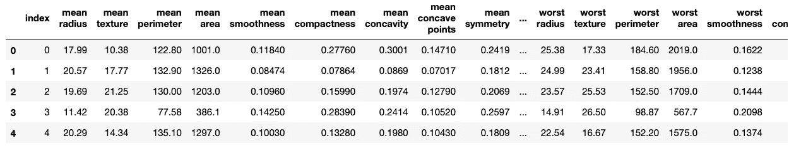
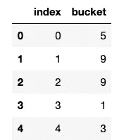
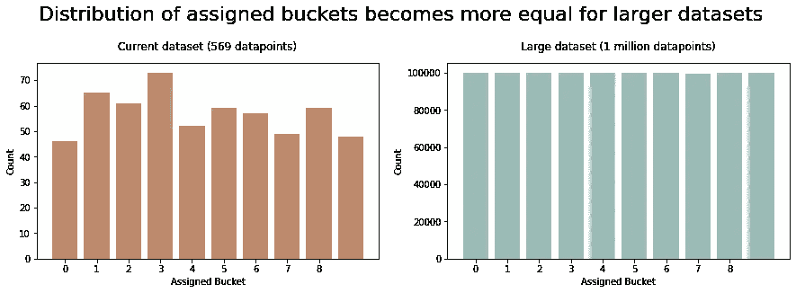

# 可重复 ML:也许你不应该使用 Sklearn 的 train_test_split

> 原文：<https://towardsdatascience.com/reproducible-ml-maybe-you-shouldnt-be-using-sklearn-s-train-test-split-ea8550ddd18d>


照片由[杰森·登特](https://unsplash.com/@jdent?utm_source=unsplash&utm_medium=referral&utm_content=creditCopyText)在 [Unsplash](https://unsplash.com/s/photos/careful?utm_source=unsplash&utm_medium=referral&utm_content=creditCopyText) 拍摄

再现性对于强大的数据科学至关重要，毕竟，这是一门科学。

但是 ML 中的重现性可能非常困难:

> **模型的行为不仅取决于你的代码，还取决于用来训练它的底层数据集**

因此，严格控制用于训练和测试模型的数据点对于确保重现性至关重要。

## **分割数据的方式会对感知的模型性能产生重大影响**

如果您“随机”分割数据，那么从统计上来说，测试集中的离群值会比训练集中的离群值多。由于您的模型在训练期间不会“看到”许多异常值，因此在预测“异常值”时，它在测试集上的表现会很差。

现在想象一下，你再次随机分割数据，现在“离群值”都在训练集中，没有一个在测试集中。很可能你的‘模特表现’会提高。这种性能提升与所选择的模型关系不大，只是与训练/测试集的统计属性有关。

因此，控制和理解训练和测试拆分非常重要，以便在多次训练运行中有效地比较不同的候选模型。

## **Sklearn train_test_split**

大概最流行的分割数据集的方法是使用 Sklearn 的 [train_test_split](https://scikit-learn.org/stable/modules/generated/sklearn.model_selection.train_test_split.html) 函数。

开箱即用，`train_test_split`函数会将您的数据随机分成一个训练集和一个测试集。

每次运行该函数时，您将获得不同的数据分割。再现性不理想。

> “啊！”—你说
> 
> "我设置了随机种子，所以它是可重复的！"。

公平点。

设置随机种子当然是一个很好的主意，而且对提高可重复性大有帮助。我强烈建议为任何具有非确定性输出的函数设置随机种子。

> **然而，随机种子可能不足以确保再现性**

**本文将展示** `**train_test_split**` **函数并不总是保证可再现的分割，即使是使用随机种子集。我还将推荐另一种解决方案——散列法——用于更健壮和可重复的分割。**

这并不是说你不应该使用`train_test_split`，只是为了强调它可能比你想象的更敏感。在某些情况下，这可能导致难以调试的不一致分割。

```
This article was originally published on my blog, [engineeringfordatascience.com](https://engineeringfordatascience.com/posts/ml_repeatable_splitting_using_hashing/)
```

# train_test_split 有什么问题？

**如果底层数据没有任何变化，设置随机簧片只能保证可再现的分割。**

`train_test_split`是**而不是*确定性的*。**

从`train_test_split`生成的分割对底层数据的“排序”和添加到现有数据集中的任何“新数据”都很敏感。

**如果您的数据集以任何方式被打乱或修改，数据将被完全不同地分割。**不能保证单个数据点会*总是 *** 在训练集中，或者*总是 *** 在测试集中。这意味着原始训练集中的数据点现在可能出现在测试集中，反之亦然，如果数据被打乱的话。

因此，对于同一个数据集，根据数据集中各行的排序方式，可以得到*完全*不同的拆分。那挺让人担心的。

即使删除了一个数据点，交换了两行的顺序，或者添加了单个数据点，您也会得到完全不同的训练和测试分割。

这种对数据的“超敏感性”可能会令人惊讶——起初对我来说的确如此——并导致意想不到的模型训练结果。

让我们用一个简单的演示来说明这个问题。

> *💻这篇文章的所有代码都在 GitHub 上的* [*随机笔记本*](https://github.com/julian-west/e4ds-snippets/blob/master/best-practices/repeatable-splitting/Reproducible%20ML%20-%20Maybe%20you%20shouldn%27t%20be%20using%20sklearn%27s%20train_test_split.ipynb) *中提供🚀*

我们将首先从`sklearn.datasets`下载一个示例数据集，并创建一个“索引”列来唯一标识每一行。

```
**from** **sklearn.datasets** **import** load_breast_cancer**import** **pandas** **as** **pd***# download an example dataset*
data = load_breast_cancer()
df = pd.DataFrame(data["data"], columns=data["feature_names"])*# create an 'index' column to use to uniquely identify each row*
df = df.reset_index(drop=False)df.head()
```



现在我们用 Sklearn 的`train_test_split`拆分数据，设置随机状态(种子)。

```
**from** **sklearn.model_selection** **import** train_test_splitTEST_RATIO = 0.1
SEED = 42*# split into training and test using a random seed*
x_train_skl, x_test_skl = train_test_split(df, test_size=TEST_RATIO, random_state=SEED)
```

接下来，我们打乱原始数据帧，并再次分割数据。为了保持一致性，我们仍将使用与之前相同的随机种子。

请注意，没有添加新数据，我们只是对行进行了重新排序。

```
*# shuffle the orginal dataframe*
df_shuffled = df.sample(frac=1)*# split the shuffled dataframe using the same random seed*
x_train_skl_shuffled, x_test_skl_shuffled = train_test_split(
    df_shuffled, test_size=TEST_RATIO, random_state=SEED
)
```

理想情况下，`x_test_skl`和`x_test_skl_shuffled`测试集中包含的行应该是相同的，因为我们使用了相同的随机种子。

然而，当我们比较每个测试集中包含的行 id 时，我们注意到它们是不同的！即使两次的随机状态(种子)是相同的。数据没有任何变化，只是被打乱了。

```
*# compare the row ids included in the original test set vs shuffled test set. Should return True if identical rows are included in each test set*set(x_test_skl["index"]) == set(x_test_skl_shuffled["index"])False
```

这凸显了`train_test_split`函数是多么敏感，甚至对数据的重新排序也是如此。

更重要的是，如果底层数据发生了变化，那么重现原始数据分割和调试模型性能将会非常困难。

# 依赖随机种子会有什么后果？

## 这很危险

随机种子仅在数据集未发生任何变化时保证再现性。

您能 100%确定数据集在两次训练之间没有改变吗？如果同事删除了异常数据点或添加了新行。您的数据分割将与原始分割完全不同，无法轻松复制旧的数据分割。

你可以使用数据版本控制工具，比如 [dvc](https://dvc.org/) 来帮助跟踪变化，然而，这并不能阻止你的数据分割发生变化。最好能防止代码中的分裂变化。

## **难以有效比较车型**

在比较模型时，我们希望能够控制尽可能多的变量。这应该包括哪些数据点用于训练和测试。

如果您的数据拆分在不同的运行之间有很大的不同，您可能会观察到性能上的显著差异。例如，如果您有几个“异常值”数据点，它们在最初的训练运行的训练集中，但现在在您的测试集中，您的模型性能可能会“下降”，因为它不能像以前一样预测测试集中的异常值。

## **难以调试**

如果您不能有效地比较模型，那么就很难调试性能问题。

假设您向数据集添加了一些新的数据点并重新训练了模型，但是模型的性能下降了。

如果您对随机种子集使用了`train_test_split`，那么当底层数据发生变化时，您将得到完全不同的数据分割。很难理解模型性能的下降是由于新数据的质量，还是如前一点所强调的，仅仅是因为数据被不同地分割。

# 什么时候 train_test_split 可能不合适？

## …如果您将来需要根据原始数据和新数据重新训练您的模型

如前所述，对现有数据的任何底层更改，无论是重新排序还是添加一个额外的数据点，都会导致完全不同的数据拆分。您的原始数据分割将不可复制。

如果你用*全新的*数据集重新训练模型，这不成问题，因为显然所有的训练和测试数据点都会不同。

但是，如果您再次使用包含原始数据点的数据集进行训练，理想情况下，您应该能够在新的训练运行期间复制它们的原始数据分割。即使有随机种子集，`train_test_split`也不能保证这一点。

## …如果您从一个不断发展的数据源中采样或检索源数据

在理想情况下，您应该完全控制源数据集，但是，有时情况并非如此。

例如，如果您使用存储在 BigQuery 中的表作为许多团队使用的源。您不能保证查询返回的行的顺序，同时新行可能被追加到表中。

另一个例子是，如果您正在处理存储在文件系统中的图像数据。如果新图像被添加到您的源文件夹，您不能保证文件路径的顺序，尤其是在添加新图像的情况下。

## …如果您有不适合内存的大型数据集

如果您需要将数据分布在多台机器上，以便并行处理数据，那么使用非确定性方法分割训练和测试数据可能会有问题，并且难以确保可重复性。

## …如果您的实验或生产代码将用另一种语言重写

由于`train_test_split`是不确定的，数据分割不容易跨语言重现。

例如，您可能希望将自定义 Python 模型的性能与使用 BigQuery 的 BQML(使用 SQL 定义)创建的模型进行比较。从`train_test_split` Sklearn 中分离出来的内容不容易直接转化成 SQL。

团队使用 Python 构建模型原型，然后使用另一种语言(如 Java)编写生产系统，这种情况也很常见。为了帮助将原型模型翻译成另一种语言的过程，理想情况下，我们应该能够以相同的方式在两种语言中分割数据，以确保可再现性，并帮助调试从原始模型到新模型的任何差异。

# 解决方案:散列法

## 哈希是什么？

> *“哈希函数是可用于将任意大小的数据映射到固定大小的值的任何函数”* [*维基百科*](https://en.wikipedia.org/wiki/Hash_function)

有许多不同的散列算法，但本质上它们允许您可重复地将输入转换成任意值。

哈希函数的输出是确定性的——对于相同的输入，它总是相同的。

## 它是如何可重复地分割数据的？

在数据分割的上下文中，我们可以使用哈希来可靠地将分割分配给各个数据点。由于这是一个确定性的过程，我们可以确保数据点总是被分配到相同的分割，这有助于再现性。

该过程工作如下:

*   使用数据点的唯一标识符(例如，ID 或通过连接多个列)，并使用哈希算法将其转换为任意整数。每个唯一的数据点将具有来自散列函数的唯一输出。
*   使用[模运算](https://en.wikipedia.org/wiki/Modulo_operation)将数据任意分成“桶”
*   选择存储桶子集中的所有数据点作为训练集，其余的数据点作为测试集

## **伪码(90:10 数据分割)**

```
row_id = "0001"# convert id into a hashed integer value
hash_value = hash(row_id)# assign a bucket between 0 and 9
bucket = hash_value % 10# add id to train set if less than 9 (i.e. approx 90% of the data)
if bucket < 9:
   train_set.append(row_id)
else:
   test_set.append(row_id)
```

# 使用哈希的原因

## **确定性**

与`train_test_split`不同，散列对数据中的潜在变化是健壮的。

使用这种方法，一个单独的数据点将*总是*被分配到同一个存储桶。如果数据被重新排序或添加了新数据，分配的存储桶将不会改变。这是更可取的，因为数据点的训练/测试分割分配现在独立于数据集的其余部分。

## **提高开发效率，减少人为错误**

当与同事并行处理模型时，非常容易不小心忘记使用随机种子，甚至使用不同的随机种子。这使您面临人为错误的风险。

使用相同的散列算法消除了用随机种子在代码中显式控制可再现性的需要。只要您同意您的团队使用哪种散列算法，您将总是重新创建相同的分割。没有人为错误的风险。

## **原始数据和预处理数据的一致分割**

在实验过程中，您可能会研究不同的预处理步骤，并将中间数据和预处理数据保存在一个新文件中。然后，您可以在另一个阶段加载这些中间数据，以继续您的分析。

由于预处理数据不同于原始数据，当从新文件加载时，使用`train_test_split`和随机种子将给原始数据和预处理数据不同的分割。

只要用于计算哈希值的列没有改变，哈希将为原始数据和预处理数据提供相同的拆分。

## **存储和内存高效**

还有其他策略来对抗再现性(本文稍后讨论)，例如将数据显式保存在“训练”文件和“测试”文件中，或者在数据中添加新列来指示数据点属于哪个训练/测试分割。

但是，有时您无法将数据保存到新文件并添加列，例如，如果您没有权限复制或编辑原始数据源，或者数据太大。

哈希是确定性的，需要时可以在内存中“动态”计算数据点分割，而无需显式更改底层数据或保存到新文件中。

# Farmhash 算法

有许多不同的哈希算法，用于多种用例，如校验和和加密。

为了创建可再现的训练/测试分割，我们需要使用“指纹”散列函数。[指纹散列函数](https://devopedia.org/fingerprinting-algorithms)是轻量级的、高效的和确定性的——它们将总是为相同的输入返回相同的值。

加密哈希函数，如 MD5 和 SHA1，不适合这种使用情况，因为它们不具有确定性，而且它们的计算开销也很大。

[Farmhash 由 Google](https://github.com/google/farmhash) 开发，[推荐给这个用例](/ml-design-pattern-5-repeatable-sampling-c0ccb2889f39)。它有一个简单的 [Python 库](https://pypi.org/project/pyfarmhash/)实现，可以跨许多其他语言使用，包括 [BigQuery SQL](/ml-design-pattern-5-repeatable-sampling-c0ccb2889f39) 。

> *farm hash 的另一种替代方法是使用 zlib 和 crc32 校验和算法。本笔记本中显示了一个实施示例，来自* [*使用 Scikit-Learn、Keras 和 TensorFlow*](https://github.com/ageron/handson-ml2/blob/master/02_end_to_end_machine_learning_project.ipynb) 进行机器实践学习

下面是一个 farmhash 的演示，以及我们如何使用它来为我们的数据点分配存储桶。

## 演示

[PyPI 上的 Python 包](https://pypi.org/project/pyfarmhash/)

```
*# install Python library*
*# ! pip install pyfarmhash*
```

我们可以使用数据点的唯一标识符(即 ID 或列值的连接)来散列数据点。

让我们从使用 farmhash 的`fingerprint64`函数将单个 ID 转换成散列整数值开始。

```
**import** **farmhash**example_id = "0001"
hashed_value = farmhash.fingerprint64(example_id)
**print**(hashed_value)6241004678967340495
```

我们现在可以使用任意函数将这个数据点分配给一个“桶”。

一个有用的方法是使用模函数。散列算法的整数输出是随机分布的，因此，例如，使用除数为 10 的模函数会将数据分成 10 个随机桶(从 0 到 9)。

```
*# assign a bucket using the modulo operation*
bucket = hashed_value % 10
**print**(bucket)5
```

因此，我们的数据点 ID“0001”将被分配给存储桶 5。当我们使用除数 10 时，我们将有 10 个不同的桶。因此，例如，我们可以将所有存储桶为“1”的数据点分配给测试集，以使用 10%的数据进行测试。

## 使用 Farmhash 分割数据集

现在，让我们将这种分割策略应用到我们的数据集。

下面的`hash_train_test_split`函数可用于使用指定的散列函数将数据帧分割成训练集和测试集。在此示例中，该函数创建一个新列来存储存储桶分配。这只是出于演示目的，没有必要实际将存储桶值存储在您的数据中，因为存储桶可以从行 ID“动态”地重复计算。

和以前一样，我们将使用原始乳腺癌数据集创建训练/测试分割，但使用带有 Farmhash 的哈希方法，而不是带有随机种子的 sklearn 的`train_test_split`。

然后，我们将打乱数据，再次分割数据，并比较测试集 id，以确保分割是相同的。

```
*# create a training and test set from original dataset using hashing method*
x_train_hash, x_test_hash = hash_train_test_split(
    df,
    split_col="index",
    approx_test_ratio=TEST_RATIO,
) *# create a training and test set from shuffled dataset using hashing method*
x_train_hash_shuffled, x_test_hash_shuffled = hash_train_test_split(
    df_shuffled,
    split_col="index",
    approx_test_ratio=TEST_RATIO,
)*# show which bucket each row has been assigned for demo purposes*
x_train_hash[["index", "bucket"]].head()
```



```
*# compare the row ids included in each test set*
set(x_test_hash["index"]) == set(x_test_hash_shuffled["index"])True
```

问题解决了！即使底层数据帧被打乱，相同的行 id 仍然出现在测试数据集中。

# 考虑

哈希方法比常见的 Sklearn `train_test_split`要复杂一点(虽然不多)。因此，在实现这种方法时，有一些额外的重要事情需要考虑和了解。

## **散列法不会根据您指定的训练/测试比率准确分割您的数据**

哈希算法的输出整数是一致的，但仍然是随机的。由于统计上的偶然，您可能会有稍微多一点的输出被分配到一个特定的存储桶，这意味着您可能不会得到*恰好* 10%的数据被分配到测试集。可能会多一点或少一点。这就是为什么我将`hash_train_test_split`函数中的参数命名为‘approx _ test _ ratio ’,因为结果将仅是该比率的近似值。

在我们上面的例子中，我们指定比率为 0.1，并期望测试集大小为 56。然而，我们实际上最终在测试集中只有 46 条记录(8%)。



作者图片

数据集越大，存储桶分配就越均匀，分割就越接近您想要的比例(大数定律)。

一般来说，这应该不是问题。使用 90:10 的训练/测试分割是任意的。实际上，你的分成比目标比例多一点或少一点都没关系。

## **应该选择多少个水桶？**

也就是说，您应该使用哪个数字作为模数运算的除数。

这实际上取决于期望的测试分割的粒度。如果您想要 90:10 的分割，您可以使用“10”作为除数将您的数据分割成 10 个桶。然后选择其中一个桶作为您的测试集，它大约是您的数据点的 10%。

如果您想要 15%的数据用于测试，您可以使用`100`作为除数将数据分成 100 个桶。您可以从您的数据中随机选择 15 个桶，以获取 15%的数据进行测试。

## **平台交叉兼容性怪癖**

尽管如此，哈希方法在不同平台上是一致的。那在某种程度上是真实的。

这里就不赘述了。在我的博客上的[原文中可以找到关于在 BigQuery 和 Python 中使用散列法分割数据的“陷阱”的更详细的讨论:](https://engineeringfordatascience.com/posts/ml_repeatable_splitting_using_hashing/#considerations)

> TL；dr:只是要注意不同的语言是如何处理对负数应用模数函数的…

# 哈希的替代方法

为了完整起见，这里有另外两个常见的更明确的方法来确保一致的训练/测试分割。

## 在数据中创建附加列

您可以使用`train_test_split`(或另一种随机分割方法)来初始定义分割。然后在数据集中创建一个额外的列，以明确记录该数据点是应该包含在定型还是测试中(或者指定 K 折叠验证的折叠)。

这里是 Abhishek Thakur 实现的[示例，他用它来定义交叉验证的“折叠”。](https://github.com/abhishekkrthakur/mlframework/blob/master/src/create_folds.py)

这将确保您的分割在训练跑之间被“记住”,因为它们是明确定义的。

从积极的方面来看，哪些数据点属于每个拆分是非常透明的。但是，缺点是它会增加数据集的总大小，这对于非常大的数据集来说可能是不可持续的。此外，如果您没有对数据集(例如共享数据库表)的完全控制权，您可能无法向原始模式添加列。

## 将培训和测试数据保存到不同的文件中

另一种常见的方法是在第一次拆分数据后，将您的训练数据和测试数据存储到单独的文件中。例如，转换成名为`train.csv`和`test.csv`的文件。如果数据对于单个文件来说太大，你也可以将多个文件分别保存到名为`train`和`test`的文件夹中。

这可能是一种有效的方法。但是，有时将所有数据复制一份并保存到单个文件中并不可行。例如，如果数据集非常大，或者您没有权限从原始源进行复制。

哈希方法可以在运行中和内存中可重复地计算确定性数据拆分，从而无需将数据复制到单个文件中。

# 结论

Sklearn 的`train_test_split`对于入门教程和小型静态数据集来说效果很好，然而，在现实世界中事情会变得更加复杂。

再现性是可持续部署 ML 模型的关键。Sklearn `train_test_split`对底层数据的变化惊人地敏感，可能并不合适，尤其是当您向现有数据中添加新数据时。

**散列法将单个数据点的训练/测试任务与数据集的其余部分分离开来。**这产生了一种更健壮的分割数据的方法。

散列是一个很好的解决方案，但是，它可能会矫枉过正。如果你正在一个小的静态数据集上完成一次性训练，Sklearn 的`train_test_split`和一个随机种子就足够了。然而，哈希是数据科学家工具箱中的一个重要补充，可以提高重现性并防止模型性能发生意外变化。

编码快乐！

```
This article was originally published on my blog, [engineeringfordatascience.com](https://engineeringfordatascience.com/posts/ml_repeatable_splitting_using_hashing/)Code for the article can be found in [this GitHub repository](https://github.com/julian-west/e4ds-snippets/tree/master/best-practices/repeatable-splitting)
```

# 参考资料和资源

**哈希**

*   ML 设计模式:可重复采样(这篇文章的灵感来源)
*   [在创建训练测试分割之前，散列您的数据](https://www.bi-kring.nl/192-data-science/1340-reusing-data-for-ml-hash-your-data-before-you-create-the-train-test-split)
*   [Farmhash 算法描述](https://github.com/google/farmhash/blob/master/Understanding_Hash_Functions)
*   [Python Farmhash 库](https://pypi.org/project/pyfarmhash/)
*   [不同于使用 Scikit-Learn、Keras 和 TensorFlow 进行动手机器学习的哈希实现](https://www.danli.org/2021/06/06/hands-on-machine-learning/)另[参见笔记本](https://github.com/ageron/handson-ml2/blob/master/02_end_to_end_machine_learning_project.ipynb)
*   [谷歌文档:散列的考虑因素](https://developers.google.com/machine-learning/data-prep/construct/sampling-splitting/randomization)