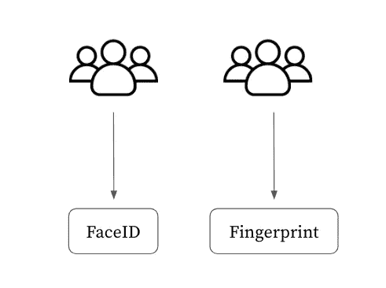
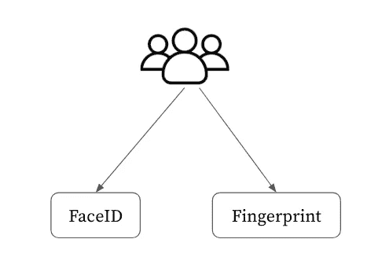
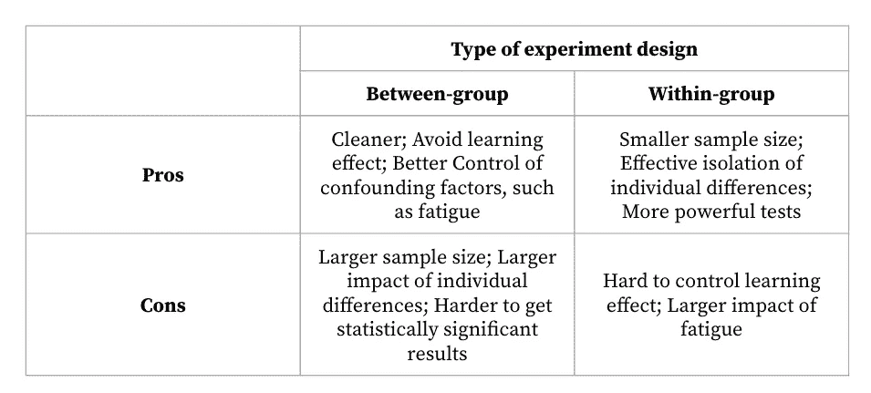
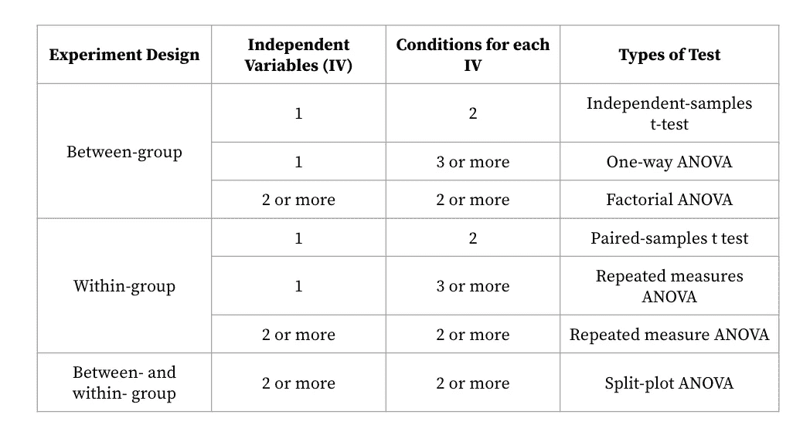

# 涉及人体研究的研究方法

> 原文：<https://towardsdatascience.com/research-methods-involving-human-studies-67fedb56df42>

## 研究假设、假设检验和显著性检验

来自[像素](https://www.pexels.com/photo/books-in-black-wooden-book-shelf-159711/)的图像

我目前正在从事两个研究项目，这两个项目都需要我进行人体研究，以验证我的研究假设。我在想:为什么不利用这个机会，把涉及人体研究的研究方法中的关键点记下来，供以后参考呢？这也是这篇文章存在的原因。

# **研究假设**

在进行实验研究时，第一步通常是制定一个研究假设，这是一个可以根据经验进行评估的具体问题陈述。通常，一个实验会包括至少一个**零假设** (H0，0 应该被下标)和一个**替代假设** (HA，A 应该被下标)。典型地，H0 指出实验处理之间不存在差异。“哈”总是一个与 H0 相矛盾的命题。**实验的目的是收集统计数据来反驳或否定 H0，以支持 HA** (Rosenthal 和 Rosnow，2008)。通常，一个好的假设符合以下标准:

*   专注于一个可以在一次实验中解决的可测试主题；
*   是用简洁、直白的语言写的；
*   明确描述对照组或实验条件。

## 变量

一个定义明确的假设必须指定**因变量** (DVs)和**自变量** (IVs)。为了容易区分这两个概念，静脉指的是研究人员可以控制的治疗或条件，静脉指的是研究人员需要监测的结果(Oehlert，2010)。通常评估的五种类型的 dv 包括效率、准确性、主观满意度、易学性和保持率，以及身体或认知需求。例如，给定一个 H0:

> 使用 FaceID 和指纹时，登录所需的时间没有区别。

示例中的 IV 是身份验证方法(FaceID 或指纹)，DV 是登录所花费的时间，是对效率的衡量。

# 试验设计

接下来，我们需要根据我们建立的研究假设来设计实验。这使我们能够描绘出实验总体范围的大致图景，并对实验的预算和时间表做出可靠的估计。实验的结构可以通过回答两个问题来定义:

*   在整个实验中，我们要检查多少个静脉？
*   每个 IV 包含多少个不同的值(条件)？

对于第一个问题，如果实验只有一个 IV，简单的单水平设计就足够了。如果有两个或更多的 iv，则需要析因设计。

## 组间和组内

根据第二个问题的答案，我们选择采用组间或组内设计。在组间设计中，每个参与者只暴露在一个实验条件下，但是在组内设计中，每个人在整个实验期间都被要求暴露在所有的实验条件下。下面是上面给出的记录示例的组间和组内设计的图示。

组间(左)和组内(右)(图片由作者提供)

组间设计和组内设计都各有利弊，而这两种设计的利弊恰恰是截然相反的。组间或组内设计的选择将导致不同类型的显著性检验。

组间和组内设计的利弊(图片由作者提供)

***那么什么时候选择哪个呢？*** 一般来说，研究者更倾向于组内设计，除非存在以下条件:实验是考察个体差异很小的简单任务；会受到学习效果显著影响的任务；或者无法使用组内设计进行调查的问题(例如，条件相互排斥，如来自加拿大和中国的用户)。

组内设计更受研究者的青睐，这种设计类型的局限性可以在某些方面得到缓解。使用 [**拉丁方设计**](https://cs.uwaterloo.ca/~dmasson/tools/latin_square/) 可以减轻学习效果和疲劳的负面影响。此外，可以通过为用户提供适当的**训练时间**来熟悉任务，从而降低学习效果，因为人类的典型学习曲线是，我们在第一阶段的学习中取得快速进步，随后随着持续练习而逐渐恶化。此外，为了解决由多个实验任务引起的疲劳问题，通常建议单次会议应该持续 60 至 90 分钟或更少。

此外，为了发现可能的偏差，在进行真实数据收集之前进行多次试点测试是至关重要的。

# 统计分析

几乎所有的实验研究都是用显著性检验来检验和报告的，显著性检验使我们能够评估在样本人群中获得的结果的可推广性的置信度。然而，在决定使用哪种测试之前，有必要了解第一类错误和第二类错误之间的区别。

## 第一类和第二类错误

第一类错误有时被称为⍺错误或“假阳性”。这是指拒绝 H0 的错误，而这是事实，不应该被拒绝。II 型错误通常被称为β错误或“假阴性”。它指的是错误的没有拒绝 H0，当它是明显错误的，应该被拒绝(罗森塔尔和罗斯诺，2008)。例如，在 COVID 测试的情况下，我们有一个假设:“这个人是 COVID 阳性的”。

那么类型 I 错误将是:“该人被测试为 COVID 阳性，而她/他实际上是阴性的”。第二类错误将是:“该人被测试为 COVID 阴性，而她/他实际上是阳性的”。

一般认为 I 型错误比 II 型错误危害更大。统计学家将第一类错误称为“轻信错误”，而第二类错误称为“盲目错误”。第一类错误可能导致比现有状态更糟的情况，而第二类错误可能导致失去改善当前状态的机会。

## 控制一类和二类错误的风险

在计划实验和分析数据时，我们必须考虑犯 I 型和 II 型错误的可能性。在统计学中，犯第一类错误的概率称为α(或显著性水平，P 值)，犯第二类错误的概率称为β。测试的统计功效，定义为 1-β，是当 H0 为假且应被拒绝时成功拒绝的概率(Cohen，2013)。

典型地，非常低的 P 值 ( < 0.05)用于最小化 I 类错误的发生。如果显著性检验给出的值大于 P < 0.05 处的 t 值，则表明犯 I 型错误的概率小于或等于 0.05。换句话说，错误拒绝 H0 的概率小于 0.05。

为了控制第二类错误的发生，通常推荐使用一个**大样本量**，即使当[效应量](https://www.physport.org/recommendations/Entry.cfm?ID=93385)很小时，它也允许我们检测两个条件之间的差异。

## 显著性测试

合并多个条件或组的用户研究的最终目标是确定条件或组之间是否有任何差异。由于数据的差异，我们不能简单地比较不同条件下的平均值，并宣布存在差异，因为平均值不同。相反，我们必须应用统计显著性检验来确定哪些方差可以用 IVs 来解释，哪些不能。显著性检验将表明观察到的差异随机发生的概率。如果偶然出现差异的概率很小(小于 0.05)，我们可以肯定地说，观察到的差异是由于受控静脉的差异。

比较平均值的常用显著性检验(图片由作者提供)

上图展示了一些常用的比较均值的显著性检验。t 检验是 T2 方差分析的简化版本(有时被称为“f 检验”)，只涉及两组或两组条件。这些测试可以很容易地在软件中完成，如 [SPSS](https://www.youtube.com/watch?v=tcaAJX4MRmw) 和 [Excel](https://statisticsbyjim.com/hypothesis-testing/t-tests-excel/) 。让我们看看如何解释测试结果，我们将以 t 检验为例。

t 测试在软件中返回值，t 值越大，表明 H0 为假的可能性越大。换句话说，t 值越大，这两个均值偏离的可能性就越大。请记住，t 值必须与自由度和显著性水平一起报告。这可以帮助读者确定数据分析是否正确进行，并准确解释研究结果。

下面是一个报告 t 检验结果的示例:

> 独立样本 t 检验表明，使用 FaceID 的组和使用指纹的组在登录时间上存在显著差异(t(15)=2.178，p<0.05).

The t value in the above example is 2.178, which is greater than the t value for the particular degree of freedom (df=15) at the 95% confidence level (t=2.131, which can be found in a [t-表](https://www.sjsu.edu/faculty/gerstman/StatPrimer/t-table.pdf))。这就是为什么它被报道为有显著差异。

## 双尾和单尾

上面讨论的实验是双尾的，意味着差异的方向没有指定，使用 FaceID 可能会提高登录速度，降低登录速度，或者对登录速度没有影响。然而，在某些实证研究中，假设提供了关于差异方向的信息。例如，在登录时间示例中，如果假设被更改为:

> 使用 FaceID 的人比使用指纹的人花费更少的时间来记录。

在这种情况下，我们预计 FaceID 的使用将提高记录速度，因此应该使用单尾 t 检验。大于 90%置信区间的 t 值表明 H0 假设是错误的，两个平均值之间的差异显著。

# 结论

总之，人机交互研究实验的典型**生命周期**如下:

1.  确定研究假设。
2.  指定研究设计。
3.  进行试点研究以评估研究的设计、系统和工具。
4.  招募参与者。
5.  运行实际的数据收集会话。
6.  分析数据。
7.  报告结果。

我们已经在这篇文章中讨论了很多，但还有更多要讨论的。

如果你对这个话题感兴趣，我强烈推荐你去读、冯、霍赫海塞(，2017)的《人机交互的研究方法》。它进一步讨论了调查、日记、案例研究和访谈等研究方法的常见类型；如何管理结构化可用性测试；如何分析定性数据；数据收集方法、道德问题等等。

感谢你花时间阅读我的博客。请关注最新动态，并随时发表评论或在 [Linkedin](https://www.linkedin.com/in/fangyiyu/) 上与我联系。

## 参考资料:

罗森塔尔和罗斯诺(2008 年)。*行为研究精要:方法与数据分析*。

Oehlert，G. W. (2010 年)。*实验设计和分析的初级课程*。

科恩，J. (2013 年)。*行为科学的统计功效分析*。劳特利奇。

(2017 年)、冯、霍赫海塞(2017)。*人机交互中的研究方法*。摩根·考夫曼。