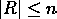
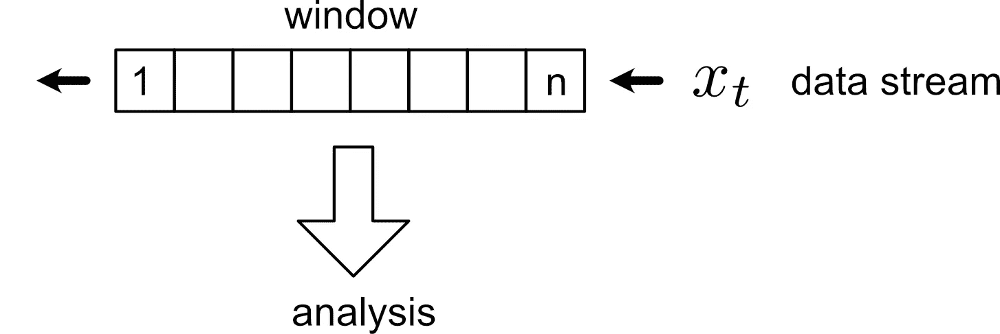
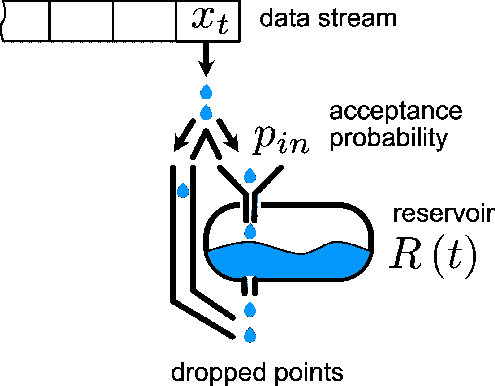
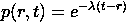
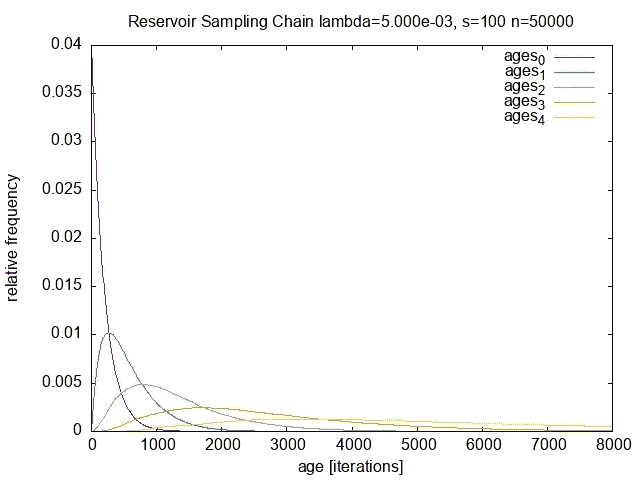
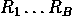
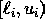

# 4 高效流处理的采样技术

> 原文：<https://towardsdatascience.com/reservoir-sampling-for-efficient-stream-processing-97f47f85c11b>

## **了解如何使用不同的随机采样技术采集数据流。**


由[乔纳森·格林纳韦](https://unsplash.com/@jogaway?utm_source=unsplash&utm_medium=referral&utm_content=creditCopyText)在 [Unsplash](https://unsplash.com/s/photos/dice?utm_source=unsplash&utm_medium=referral&utm_content=creditCopyText) 上拍摄的照片

物联网设备会产生持续的测量和日志数据流，难以进行及时分析。尤其是在嵌入式系统或边缘设备中，内存和 CPU 能力对于这种流的即时分析来说太有限了。即使是强大的系统也(迟早)会在观察到达数据的完整历史方面存在问题。

**油藏取样**的基本思想是**保持一个有代表性的有限空间油藏**



通过对溪流取样。分析(例如，发现异常值，进行统计，如均值、方差、统计测试等。)在储层 *R* 上执行，无需观察所有数据点。续集中总结了一些维护 *R* 的策略。

*代表*的含义显然取决于应用。如果您对过去一小时的平均温度感兴趣，一个简单的滑动窗口可能会很好。如果您需要更长的历史记录来比较当前系统状态，则(有偏差的)油藏取样可能更好。

我们假设数据点流 *x(t)* 在时间 *t=1，2，…到达。*

根据应用的不同， *t* 可能是不规则事件的逻辑时间，也可能是固定采样率下的样本索引。

## 1.推拉窗

这是最简单直接的方法。保持大小为 *n* 和跳跃/子采样因子 *k ≥1* 的先进先出(FIFO)队列。除此之外，步长因子 s ≥ 1 描述了在分析之前窗口移动了多少时间步长。



滑动窗口(图片由作者提供)。

**优势**

*   易于实施
*   确定性—储层可以从一开始就非常快地充满

**弊端**

*   油藏 *R* 代表的时间历程较短；长期的概念漂移不容易被发现——异常值会产生嘈杂的分析

## 2.无偏油藏取样

保持一个容器 *R* ，使得在时间 *t > n* 时，容器中接受点 *x(t)* 的概率等于 *n/t* 。

算法[1]如下:

*   用水流的第一个 *n 个*点填充储槽 *R* 。
*   在时间 *t > n* 用接受概率 *n/t* 替换储库中随机选择的(等概率)条目 *R* 。

这导致了一个库 *R(t)* 使得每个点 *x(1)…x(t)* 包含在具有相等属性 *n/t* 的 *R(t)* 中。

**优点**

*   水库以相等的概率包含来自河流所有历史的数据点。
*   实现非常简单；添加一个点只需要 O(1)

**弊端**

*   一个观念的漂移是无法弥补的；在这种采样技术中，最老的数据点 x(1)与最新的数据点 x(t)同等重要。

## 3.有偏油藏取样

有偏油藏采样算法。3.1，[2]数据点 x(t)在储层中的概率是其在 R 内停留时间的减函数。因此，在 R 中找到较早历史点的概率很高。非常老的数据点将以非常低的概率出现在 R 中。



有偏差的油藏取样图解(图片由作者提供)

点 x(r)包含在 R(t)中的概率等于



所以这是一个指数遗忘。有关算法的详细信息，请参见[2]和 [**goreservoir**](https://github.com/andremueller/goreservoir) 包。

`github.com\andremueller\goservoir`包中的例子显示了一组无偏油藏取样器的滞留时间。



油藏取样链输出(图片由作者提供)

**优点:**

*   添加新数据点的 O(1)算法。
*   缓慢移动的概念漂移可以得到补偿。
*   可调遗忘因子可以针对感兴趣的应用进行调整。

**弊端:**

*   这是一种随机技术。所以算法是非确定性的。然而，可以通过运行独立储层的集合来估计方差[3]



## 4.直方图

在观察数据流的同时维护直方图。至此，数据点被分类到区间/桶中



如果预先知道观察值的有用范围，一个简单的带有计数和断点的向量就可以完成这项工作。

v-最优直方图试图最小化每个直方图桶内的方差。[4]提出了一种算法，用于有效地维护来自数据流的近似 V-最优直方图。这与区间数据相关，例如温度值的时间序列；即绝对值和数值之间的距离有意义。

## 履行

我将方法 1 和 3 实现为 Go [5]库。参见[https://github.com/andremueller/goreservoir](https://github.com/andremueller/goreservoir)

要使用库调用

```
go get github.com/andremueller/goreservoir`
```

有一个清晰的界面来使用和实现新的采样器。`Add`功能将多个样本放入容器，并返回丢弃的样本。

```
// Sample is a single sample data point. As Go currently has no generics the common
// pointer to all types interface{} was used.
type Sample interface{}

type Sampler interface {
    // Add adds one or multiple samples to the Sampler.
    // Returns a set of dropped samples in this step.
    Add(samples []Sample) []Sample

    // Data returns a slice of the current samples within the Sampler.
    Data() []Sample

    // Reset resets the state of the sampler
    Reset()
}
```

以下算法在 **goreservoir** 库中实现:

*   `Sliding`实现了一个**滑动窗口**<github.com/andremueller/goreservoir/pkg/window>。
*   `DynamicSampler`实现了 Alg。[1]之 3.1-**有偏油藏取样**<github.com/andremueller/goreservoir/pkg/reservoir>。
*   `EnsembleSampler`将相同的数据点分配给多个采样器——因此您可以进行某种引导/集合处理。
*   `ChainSampler`可用于将一个采样器的输出(丢弃点)堆叠到下一个采样器中。

在[github.com/andremueller/goreservoir/cmd/reservoir/main.go](https://github.com/andremueller/goreservoir/blob/master/cmd/reservoir/main.go)中可以找到与`DynamicSampler`一起使用的`ChainSampler`的简单示例。该示例的输出是一个数据点在油藏中停留的时间(单位为步)。

[1] J. S. Vitter，“储层随机取样”，*美国计算机学会会刊。数学。Softw。*，第 11 卷，第 1 号，第 37–57 页，1985 年 3 月，doi: [10.1145/3147.3165](https://doi.org/10.1145/3147.3165) 。

[2] C. C. Aggarwal，“河流演变中的有偏油藏取样”，载于第 32 届超大型数据库国际会议会议记录*，2006 年，第 607-618 页。*

[3] B .埃夫龙和 R. J .蒂布拉尼， [*自举简介*](https://books.google.com?id=gLlpIUxRntoC) 。CRC 出版社，1994 年。

[4] S. Guha、N. Koudas 和 K. Shim，“数据流和直方图”，载于第 33 届 ACM 计算理论年度研讨会的会议记录——STOC，2001 年，第 471-475 页，doi:[10.1145/380752.380841](https://doi.org/10.1145/380752.380841)。

[5]“Go 编程语言。”https://go.dev/(2021 年 12 月 27 日访问)。