# 使用 Pandas stack()和 unstack()重塑数据帧

> 原文：<https://towardsdatascience.com/reshaping-a-dataframe-with-pandas-stack-and-unstack-925dc9ce1289>

## 有效使用 Pandas stack()和 unstack()的 7 个技巧


照片由[派恩瓦特](https://unsplash.com/@pinewatt?utm_source=unsplash&utm_medium=referral&utm_content=creditCopyText)在 [Unsplash](https://unsplash.com/s/photos/frame?utm_source=unsplash&utm_medium=referral&utm_content=creditCopyText) 上拍摄

> *当您处理包含具有某种序列的变量的数据集时，例如时间序列数据，通常需要进行整形。*
> 
> *来源于弗吉尼亚大学研究数据服务部[1]*

Pandas 提供了各种用于重塑数据帧的内置方法。其中，`stack()`和`unstack()`是重组**列**和**行**(也称为**索引**)最常用的两种方法。

*   `stack()`:从列到行堆叠规定的层次。
*   `unstack()`:从行到列拆分规定的级别。来自堆栈的逆操作。

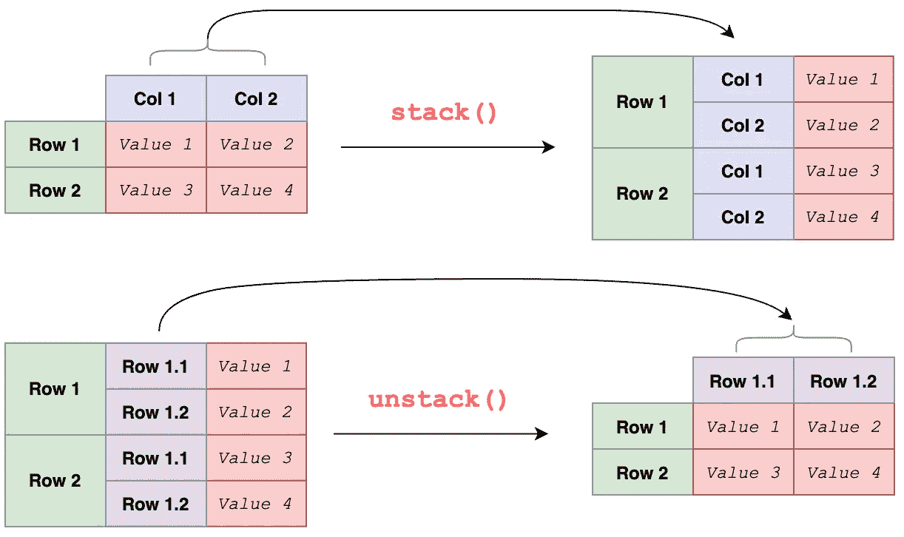

熊猫栈()和解散栈()(图片由作者提供)

`stack()`和`unstack()`看起来使用起来相当简单，但是仍然有一些技巧你应该知道来加速你的数据分析。在本文中，您将学习熊猫应对以下用例的技巧:

1.  个别能级
2.  多层次:简单案例
3.  多个级别:缺少值
4.  多个级别:指定要堆叠的级别
5.  多个级别:删除缺少的值
6.  拆分:简单情况
7.  拆分:更多级别

> 源代码请查看[笔记本](https://github.com/BindiChen/machine-learning/blob/main/data-analysis/067-pandas-stack/pandas-stack-unstack.ipynb)。更多教程可从 [Github Repo](https://github.com/BindiChen/machine-learning) 获取。

# 1.个别能级

最简单的`stack()`可以应用在具有单级列的数据帧上。它只是将标签从**列**堆叠到**行**并输出一系列。

```
df_single_level = pd.DataFrame(
    [['Mostly cloudy', 10], ['Sunny', 12]],
    index=['London', 'Oxford'],
    columns=['Weather', 'Wind']
)df_single_level**.stack()**
```


数据帧上最简单的堆栈()并输出一系列数据(图片由作者提供)

# 2.多层次:简单案例

通常，我们会在具有多级列的数据帧上使用`stack()`。让我们为演示创建一个数据帧。创建具有多级列的 DataFrame 有多种方法，最简单的方法之一是创建一个 MultiIndex 对象`MultiIndex.from_tuples()`，并将结果传递给`pd.DataFrame()`中的`columns`参数:

```
multi_col_1 = pd.**MultiIndex**.from_tuples(
    [('Wind', 'mph'), ('Wind', 'm/s')]
)df_multi_level_1 = pd.DataFrame(
    [[13, 5.5], [19, 8.5]],
    index=['London', 'Oxford'],
    **columns=multi_col_1**
)
```

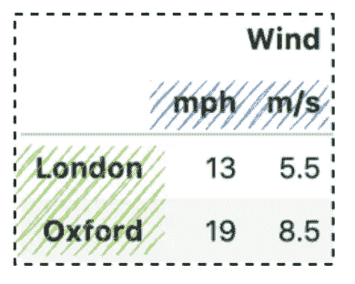

多索引数据框

通过调用`stack()`，它将获取列级`(mph, m/s)`并将其堆叠到行轴上。

```
df_multi_level_1.stack()# Same as 
df_multi_level_1.stack(**level=-1**)
df_multi_level_1.stack(**-1**)
```

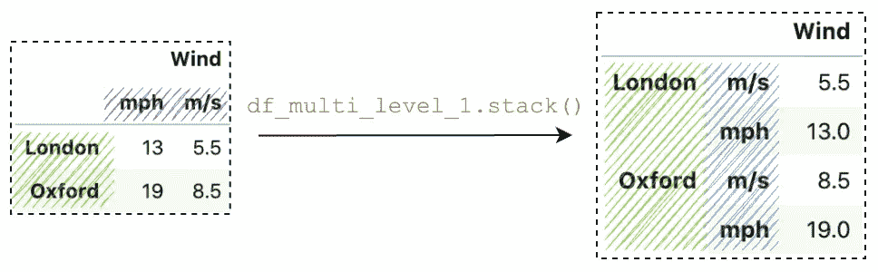

熊猫在多索引数据框架上堆叠()

在幕后，它根据参数`level`运行操作。参数`level`默认为`-1`，它获取最内层，并将其从列轴堆叠到行轴上。

如果您想了解更多关于 MultiIndex 的内容，可以查看这篇文章:

[](/accessing-data-in-a-multiindex-dataframe-in-pandas-569e8767201d) [## 在熊猫的多索引数据框架中访问数据

towardsdatascience.com](/accessing-data-in-a-multiindex-dataframe-in-pandas-569e8767201d) 

# 3.多个级别:缺少值

当堆叠具有多级列的数据帧时，缺少值是很常见的。让我们创建另一个数据帧示例:

```
multi_col_2 = pd.MultiIndex.from_tuples(
    **[('Wind', 'mph'), ('Temperature', '°C')]**
)df_multi_level_2 = pd.DataFrame(
    [[13, 8], [19, 6]],
    index=['London', 'Oxford'],
    columns=multi_col_2
)df_multi_level_2.stack()
```

与第一级中具有相同值`'Wind'`的前一示例`multi_col_1`不同，`multi_col_2`具有 2 个不同的值`'Wind'`和`'Temperature'`。现在，我们得到缺失值，因为堆叠的数据帧比原始数据帧有更多的值，缺失值用`NaN`填充。

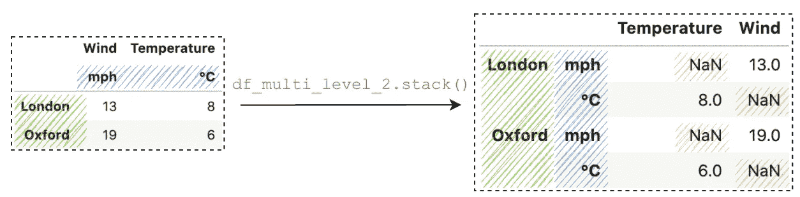

熊猫栈()(图片由作者提供)

# 4.多个级别:指定要堆叠的级别

`stack()`中的第一个参数是`level`，它控制堆叠哪一层。让我们创建一个具有两个不同级别的多指数:

```
multi_col_2 = pd.MultiIndex.from_tuples(
    [('Wind', 'mph'), ('Temperature', '°C')]
)# **Level 0**
multi_col_2.**get_level_values(0)** # Index(**['Wind', 'Temperature']**, dtype='object')# **Level 1**
multi_col_2.**get_level_values(1)** # Index(**['mph', '°C']**, dtype='object')
```

我们可以传递一个数字来指定要堆叠的级别。要指定要堆叠的多个级别，我们可以传递一个列表:

```
df_multi_level_2.stack(**0**)df_multi_level_2.stack(**[0, 1]**)df_multi_level_2.stack(**[1, 0]**)
```

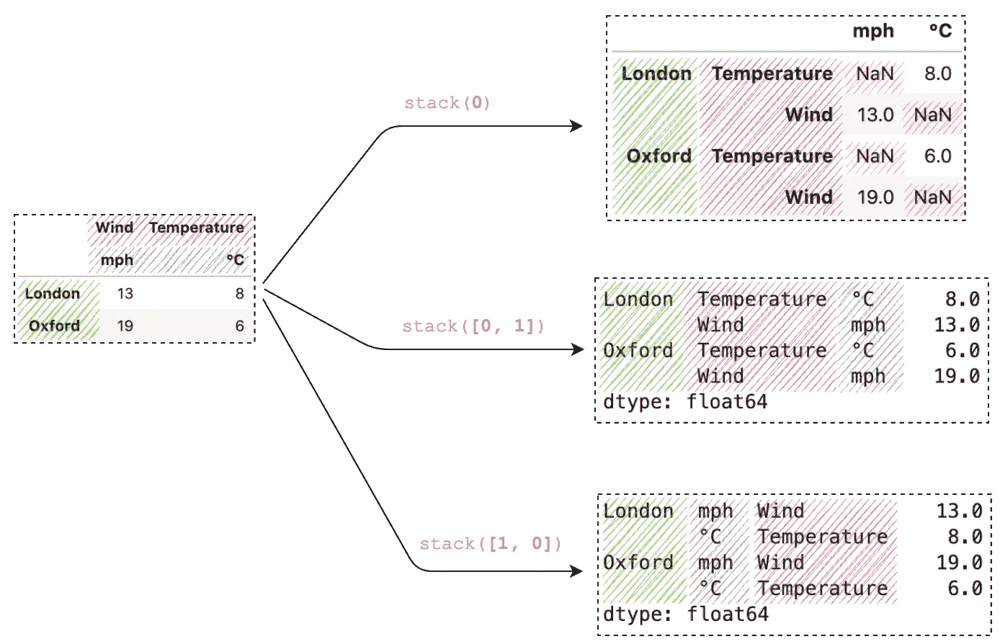

熊猫栈()(图片由作者提供)

# 5.多个级别:删除缺少的值

默认情况下，当调用`stack()`时，所有值缺失的行将被删除。这种行为可以通过将`dropna`设置为`False`来控制:

```
df_multi_level_3 = pd.DataFrame(
    [[**None**, 10], [11, 7.0]],
    index=['London', 'Oxford'],
    columns=multi_col_2
)df_multi_level_3.stack()df_multi_level_3.stack(**dropna=False**)
```

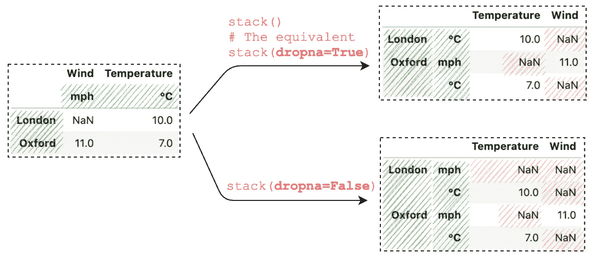

用 Pandas stack()删除丢失的值(图片由作者提供)

# 6.拆分:简单情况

类似地，Pandas `unstack()`也支持参数`level`,它默认为`-1`,后者将对最内部的索引应用操作。

```
**index** = pd.MultiIndex.from_tuples([
  ('Oxford', 'Temperature'), 
  ('Oxford', 'Wind'),
  ('London', 'Temperature'), 
  ('London', 'Wind')
])s = pd.Series([1,2,3,4], **index=index**)
```

通过对具有 MultiIndex 的系列调用`unstack()`，它会将最内部的索引拆分到一列上。要指定要拆垛的级别，我们可以传递级别编号:

```
s.unstack()
# It's equivalent to
s.unstack(**level=-1**)# Unstack a specific level
s.unstack(**level=0**)
```

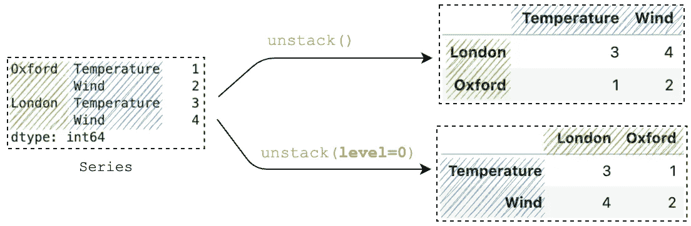

熊猫解散()(图片由作者提供)

# 7.拆分:更多级别

通常，我们会在更多的层次上使用`unstack()`。让我们来看一个包含 3 个级别的示例:

```
index = pd.MultiIndex.from_tuples([
  ('Oxford', 'Weather', '01-01-2022'), 
  ('Oxford', 'Temperature', '01-01-2022'), 
  ('Oxford', 'Weather', '02-01-2022'),
  ('Oxford', 'Temperature', '02-01-2022'),
  ('London', 'Weather', '01-01-2022'), 
  ('London', 'Temperature', '01-01-2022'),
  ('London', 'Weather', '02-01-2022'),
  ('London', 'Temperature', '02-01-2022'),
])s = pd.Series(
  ['Sunny', 10, 'Shower', 7, 'Shower', 5, 'Sunny', 8], 
  **index=index**
)
```

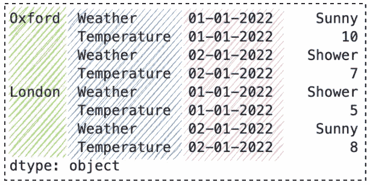

两级多指标

通过调用`unstack()`，它将最里面的索引拆分到列上。

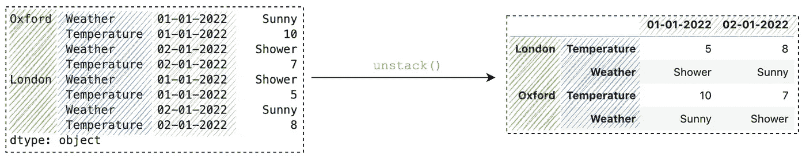

熊猫解散堆叠()

例如，我们可以使用[方法链接](/using-pandas-method-chaining-to-improve-code-readability-d8517c5626ac)来运行另一个`unstack()`或者传递一个列表

```
# Method chaining
df**.unstack().unstack()**
df**.unstack().unstack().unstack()**# The equivalent
df**.unstack([2,1])**
df**.unstack([2,1,0])**
```

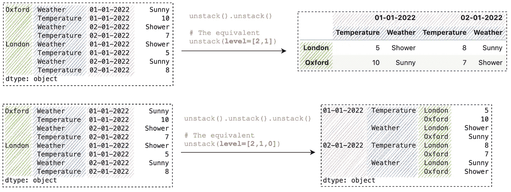

熊猫解散堆叠()示例

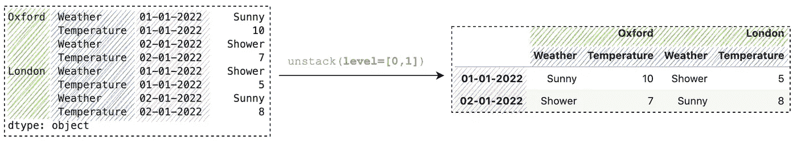

熊猫解散()示例(图片由作者提供)

如果您想了解更多关于方法链接的知识，可以查看这篇文章:

[](/using-pandas-method-chaining-to-improve-code-readability-d8517c5626ac)  

# 结论

在本文中，我们介绍了使用熊猫`stack()`和`unstack()`重塑数据帧的 7 个用例。这些方法本身使用起来非常简单，是数据预处理中操作数据的最受欢迎的方法之一。

感谢阅读。请查看[笔记本](https://github.com/BindiChen/machine-learning/blob/main/data-analysis/067-pandas-stack/pandas-stack-unstack.ipynb)获取源代码，如果您对机器学习的实用方面感兴趣，请继续关注。更多教程可从 [Github Repo](https://github.com/BindiChen/machine-learning) 获得。

# 参考

*   [1]弗吉尼亚大学:[研究数据服务+科学](https://data.library.virginia.edu/stata-basics-reshape-data/)