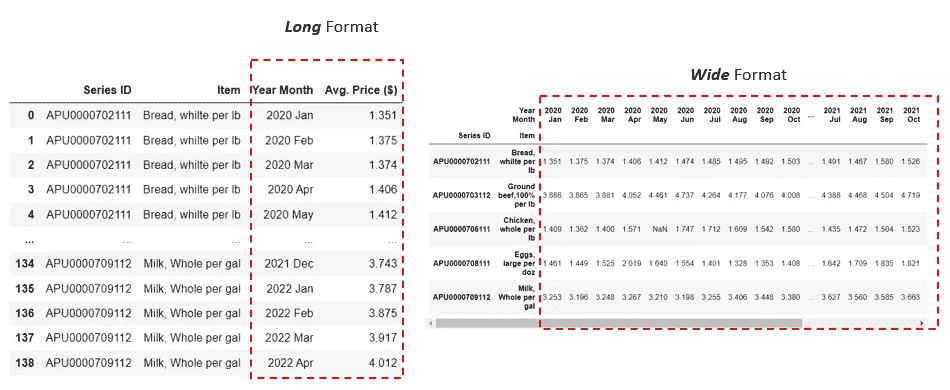
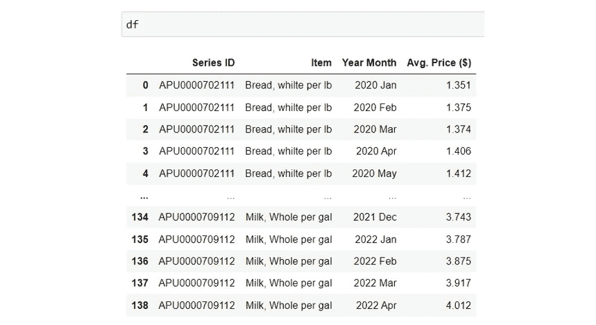
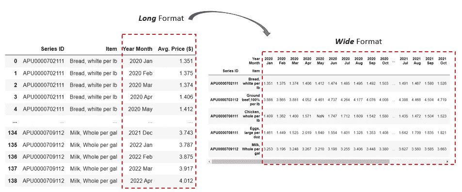
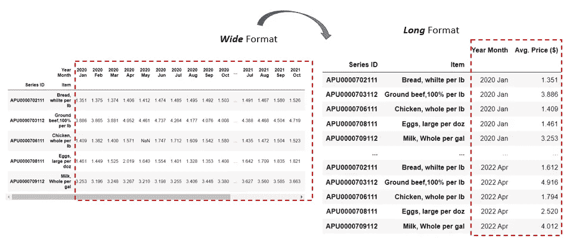

# 重塑熊猫数据框架:从长到宽，反之亦然

> 原文：<https://towardsdatascience.com/reshaping-a-pandas-dataframe-long-to-wide-and-vice-versa-517c7f0995ad>

## 用这两个简单的方法透视/反透视熊猫数据帧


图片由 [Pixabay](https://pixabay.com/illustrations/panda-animal-texture-unique-art-5364820/) (作者修改)

重塑`pandas`数据框架是数据分析领域最常见的数据争论任务之一。它也称为将表格从长格式转置或旋转/取消旋转为宽格式或从宽格式转置或旋转为长格式。那么什么是长数据格式，什么是宽数据格式，我们如何将数据帧从长到宽进行整形，反之亦然？

下面我们来看一个简单的例子。该示例显示了从 2020 年 1 月到 2022 年 4 月美国所有城市 5 种食品类别的平均食品价格。



作者图片

左边的数据帧具有长格式。“系列 ID”和“项目”列代表食品类别。“Year Month”是一个单列，包含从 2020 年 1 月到 2022 年 4 月的所有月份。“价格($)”在“年月”列中有一个对应于每个月的值。

请注意左边的数据框架是如何以长格式构建的:每个食品类别(“项目”)都有多个重复的行，每一行都代表一个特定的年/月以及对应于该年/月的平均食品价格。虽然我们只有 5 个食物类别(“项目”)，但我们总共有 139 行，这使得数据帧成为一个“长”形。

相比之下，右侧的数据框具有宽格式，更像电子表格样式的格式。在这种格式中，每行代表一个独特的食物类别。我们旋转左边数据框中的“年/月”列，这样每个月都在一个单独的列中——使右边的数据框成为一个“宽”形。左表中“年/月”列的值现在变成了右表中的列名，我们得到了“平均”。每个月/年列的价格。

现在我们已经了解了什么是长数据格式和宽数据格式，让我们看看如何在 Pandas 中轻松地在这两种格式之间切换。我们将使用上面显示的样本数据集作为示例。你可以点击下载样本数据集[。让我们首先将原始 CSV 文件读入 Pandas 数据帧，并对数据做一些轻微的处理:](https://beta.bls.gov/dataQuery/find?fq=survey:[ap]&s=popularity:D)



作者图片

## 从长到宽重塑:

如前一节所述，该数据帧具有长格式。为了将 Pandas 中的数据帧由长变宽，我们可以使用 Pandas 的`pd.pivot()`方法。

```
**pd.pivot(df, index=, columns=, values=)**
```

`columns`:用于制作新框架列的列(如“年/月”)。

`values`:用于填充新帧值的列(如 Avg。价格($))。

`index`:用于制作新框架索引的列(如“系列 ID”和“项目”)。如果没有，则使用现有索引。



作者图片

## 从宽到长重塑:

现在，我们如何将宽格式数据转换回长格式呢？为了将一个数据帧由宽变长，我们可以使用 Pandas 的`pd.melt()`方法。

```
**pd.melt(df, id_vars=, value_vars=, var_name=, value_name=, ignore_index=)**
```

`id_vars`:用作标识符变量的列

`value_vars`:要取消透视的列。在我们的示例中，它将是年/月列的列表(“2020 年 1 月”、“2020 年 2 月”、“2020 年 3 月”等)。)

`var_name`:用于“变量”列的名称

`value_name`:用于“值”列的名称

`ignore_index`:如果为‘真’，则忽略原始索引。如果为“False”，则保留原始索引



作者图片

总而言之，如果你需要将熊猫的数据帧从长变宽，使用`pd.pivot()`。如果你需要将一个熊猫数据帧从宽变长，使用`pd.melt()`。感谢阅读，希望这篇简短的`pandas`教程对你有所帮助！

## 数据源:

美国劳工统计局:[调查:消费者价格指数——平均价格数据](https://beta.bls.gov/dataQuery/find?fq=survey:[ap]&s=popularity:D)([https://www.bls.gov/data/](https://www.bls.gov/data/))。这是一个公共的、开放的数据集，可以使用 BLS 公共数据 API 进行检索。BLS 公共数据 API 允许公众访问所有 BLS 项目的原始经济数据。不需要许可证。

你可以通过这个[推荐链接](https://medium.com/@insightsbees/membership)注册 Medium 会员(每月 5 美元)来获得我的作品和 Medium 的其他内容。通过这个链接注册，我将收到你的会员费的一部分，不需要你额外付费。谢谢大家！