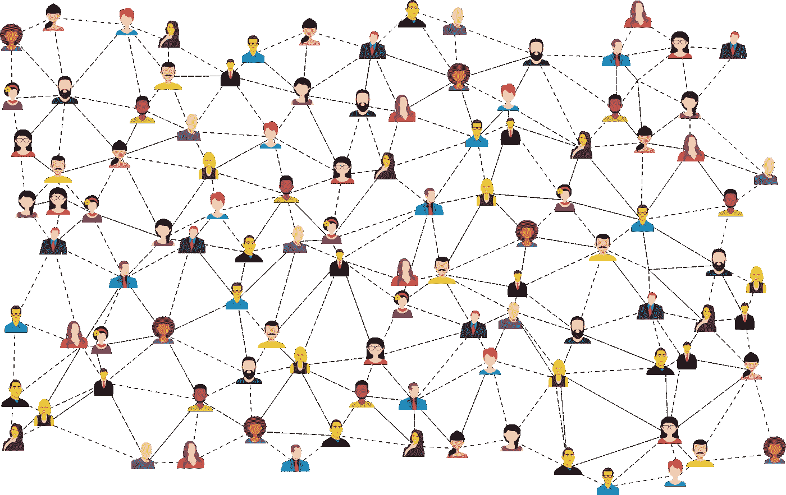
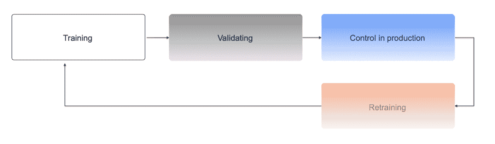
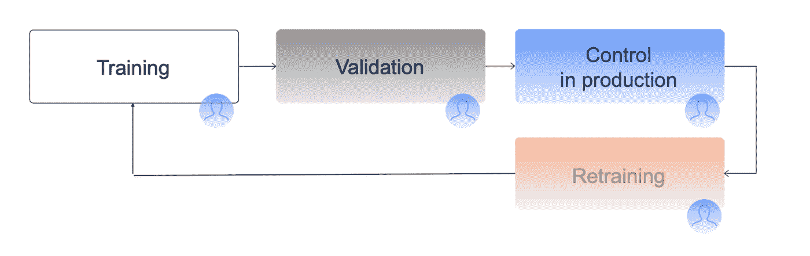
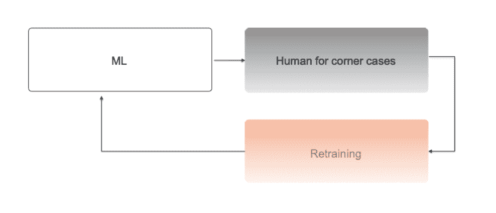
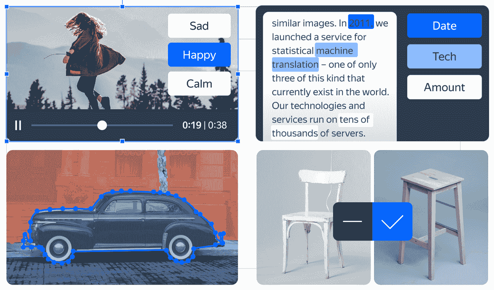
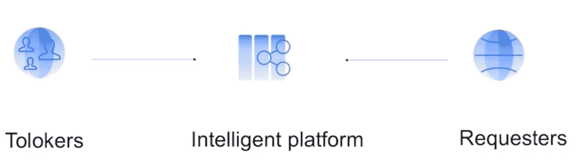
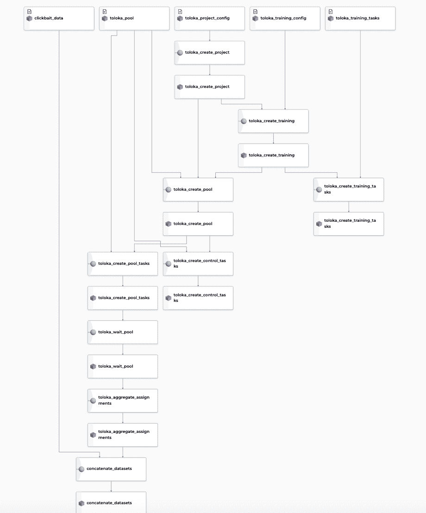

# 弹性人在回路管道与厚皮动物和托洛卡

> 原文：<https://towardsdatascience.com/resilient-human-in-the-loop-pipelines-with-pachyderm-and-toloka-99e33f29df85>

## 为 ML 管理、存储和标记数据

图片来自[皮克斯拜](https://pixabay.com/?utm_source=link-attribution&utm_medium=referral&utm_campaign=image&utm_content=3846597)的[戈登·约翰逊](https://pixabay.com/users/gdj-1086657/?utm_source=link-attribution&utm_medium=referral&utm_campaign=image&utm_content=3846597)

## 为什么数据准备很难

许多数据科学家和机器学习团队报告说，他们花了大约 80%的时间来准备、管理或管理他们的数据集。

在过去的 5-10 年中，有三件事情使 ML 复兴:算法的突破、快速和可扩展的硬件以及大型精选数据集。数据是人工智能基础的重要支柱，需要付出大量努力才能获得。

不幸的是，很难确切知道特定标签会对你的模型产生什么影响，但你不能只是等待你的数据变得理想。没有一家软件公司会在他们的应用程序完美之前推迟发布——如果是那样的话，他们永远不会发布任何东西。数据也是一样。你必须从某个地方开始，这就是机器学习生命周期出现的地方。

作者图片

机器学习的生命周期就是迭代。但人们经常忽略的事实是，机器学习中实际上有两个具有共生关系的生命周期:代码和数据。

我们不断地对它们进行迭代，提供我们对问题的理解来改进我们的代码和数据。

这意味着迭代必须是我们 ML 过程的基本部分。我们越能整合正确的工具，就越能更好地利用我们人工智能团队的洞察力来解决现实世界的问题。

## ML 生产管道

这里是机器学习生产管道的简化版本，从训练阶段开始，然后是验证步骤。

作者图片

通常我们会训练和验证几个模型，一旦我们发现一个表现足够好的模型，我们就把它推向生产。一旦模型投入生产，我们就监控它的性能以捕捉任何精度偏差。如果准确度下降，我们重新训练模型，这意味着我们循环回到最初的训练步骤。

通常，这个过程是一个连续的循环，在产品的生命周期中要执行多次。

## **回路中的人类**

但这真的是管道的全部吗？简而言之，答案是否定的。上面显示的循环是机器学习项目的典型，但它缺少一个重要的组成部分:人类的参与。大多数人工智能产品都需要大量的人力，尤其是在数据标签这一步。

作者图片

当我们采用人在回路原则时，参与可以发生在许多不同的阶段:

*   在训练阶段，我们需要人类对监督学习的数据进行注释。
*   为了监控生产中的模型，我们理想地需要人工标记的数据来定期检查我们的预测是否有偏差。
*   当出现偏差时，我们需要人为标注的样本进行再训练。

在整个过程中，很明显我们不能仅仅依赖自动化。我们需要在机器学习生命周期的每个阶段都包括人类。

作者图片

此外，还有另一个 ML 管道需要不断的人工注释。这是一个传统意义上的人在回路中的工作流，如上图所示。

在这里，人们用困难的情况来帮助实际的 ML 算法。许多最大似然算法给了我们与它们所做的预测相关的置信度。我们可以选择一个阈值概率来过滤算法发现困难的情况，并将它们发送给人类判断。人类预测被发送到最终用户，并且还被发送回算法，以帮助通过再训练来提高性能。

在下一节中，我们将介绍 Toloka 和 Pachyderm，看看这两个工具如何帮助您构建有弹性的人在回路管道。

## 托洛卡

[Toloka](https://toloka.ai/) 是一个众包数据标注平台，允许标注大量数据。在下面的照片中，您可以看到一些使用平台标记的数据类型的示例。

作者图片

这是一个非详尽的任务列表。您应该能够执行任何类型的数据标记，因为该工具允许您使用构建块或 JavaScript 设计自己的界面。

## **但是我们为什么需要像 Toloka 这样的标签工具呢？**

所有的 AI 产品都需要不断的数据标注。你拥有的数据越多，你的算法就越好。

速度至关重要。标记数据越快，迭代就越快，从而加快模型的开发和评估。

在许多 ML 项目中，雇员被明确地雇佣来做数据标记，但是这并不总是最好的解决方案。Toloka 允许您利用群众的力量按需扩大或缩小标签流程。

作者图片

Toloka 是一个开放的工具，请求者和执行者都可以在电脑或手机上访问它。请求者是 ML 工程师、数据科学家、研究人员和其他发布需要标记的任务的人。一旦发布了这些任务，Tolokers(群众)就可以使用它们，他们可以根据时间和兴趣自由选择他们的工作量。请求者可以确信任务会很快完成，因为总会有一个人可以完成特定的请求。

## **Toloka 作为工程任务**

人群的可用性和多样性允许 Toloka 像对待工程任务一样对待标签任务。这个过程可以通过 Python 和 Java 客户端使用开放 API 来实现自动化。这意味着数据标记可以很容易地集成到 ML 管道中，并且新数据流可以在需要时自动触发标记过程。

作者图片

事实上，我们可以使用 Toloka 作为标记集群，这使得它可以与其他 ML 工具集成，如 Pachyderm。

## 迟钝的人

[Pachyderm](https://www.pachyderm.com) 是 MLOps 数据版本和数据管道的领导者。它是数据驱动应用程序的 GitHub。

借助 Pachyderm 的数据版本管理，您可以通过 repos 和 commits 来组织和迭代数据。Pachyderm 允许您对任何类型的数据进行版本化，无论是图像、音频、视频、文本还是任何其他数据。版本化系统经过优化，可以扩展到任何类型的大型数据集，这使得它成为 Toloka 的完美组合，为您提供了内聚的可复制性。

除了版本控制，Pachyderm 的管道还允许您将代码连接到数据仓库。当提交新数据时，他们可以通过重新运行管道来自动化机器学习生命周期的许多组件(如数据准备、测试、模型训练)。厚皮管道和版本控制一起为您的机器学习工作流提供了端到端的传承。

## **厚皮动物和托洛卡在行动:点击诱饵数据**

Toloka 和 Pachyderm 一直在合作，为您带来这两种工具集成的示例。我们已经创建了一个管道，可用于注释 clickbait 数据，如下所示。

作者图片

为了做到这一点，我们建立了厚皮动物管道来协调 Toloka 的标记流程。下图显示了我们为此项目创建的管道流。

作者图片

最初，我们有一个名为“clickbait data”的 repo，它保存可用于训练 ML 模型的数据。然后，我们有几个管道管理 Toloka，用新的例子丰富这个数据集。

然后，我们创建一个厚皮动物管道，用 Toloka 创建一个基本项目。然后，相应的管道接收带文本的 CSV 文件，向 Toloka 添加任务，并创建所谓的蜜罐，帮助我们对注释进行质量控制。我们用它来运行一个管道，该管道启动 Toloka 中的注释过程，然后是聚合管道。一旦我们有了注释结果，就会有一个数据集连接管道，将旧数据与新注释的示例合并在一起。

也许这种设置最令人兴奋的方面是，每次我们向 Pachyderm 中的 repo 添加不带注释的新数据时，都会自动触发标记过程。这意味着，如果你需要不断地注释更多的数据和重新训练机器学习模型，建议的管道是可重用的。

## **总之**

为了建立在现实世界中工作的机器学习模型，我们需要为迭代做好准备。这意味着为数据开发和人在回路中的交互结合正确的工具。有了 Pachyderm 和 Toloka，数据监管和管理变得前所未有的强大和灵活。这是一种全新的方式来扩展您的标注任务，同时对您的数据转换进行版本控制、管理和自动化。

如果你想了解这个集成项目的细节，你可以在这个 [GitHub repo](https://github.com/Toloka/toloka-pachyderm) 中看到代码。

有关详细信息和示例，[请观看带完整管道演示的网络研讨会视频](https://youtu.be/qETRXvcTyhg)。

*原发表于*[*https://to loka . ai*](https://toloka.ai/blog/resilient-human-in-the-loop-pipelines/)*。*

本文是与吉米·惠特克合著的。

*PS:我正在 Medium 和*[***aboutdatablog.com***](https://www.aboutdatablog.com/)*上撰写深入浅出地解释基本数据科学概念的文章。你可以订阅我的* [***邮件列表***](https://medium.com/subscribe/@konkiewicz.m) *每次我写新文章都会收到通知。如果你还不是中等会员，你可以在这里加入***。**

*下面还有一些你可能喜欢的帖子*

*     *