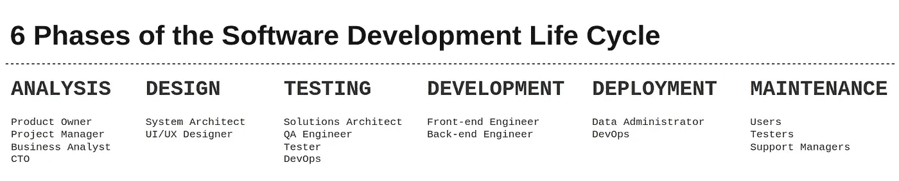

# 高级软件工程师的职责

> 原文：<https://towardsdatascience.com/responsibilities-of-a-senior-software-engineer-e30d3989610>

## 软件工程

## 一个关于责任和工程师角色的故事

最近，我被指派去面试我现在工作的公司的一个高级职位，实际上我在想——怎样才能成为一名优秀的高级软件工程师？

我经历了整个交易——我做过初级、中级，然后是高级软件工程师，我看到了前述角色的各种不同的*【定义】*。

我想到了一些事情，我认为这些事情在描述这个角色的行业中应该是常见的，所以今天我想概述一下高级软件工程师的*【职责】*，希望它可以帮助正在阅读的人，无论是高级工程师还是正在招聘的人。让我们开始吧！

# 高级软件工程师

图片来源——【afgprogrammer@unsplash.com 

高级工程师是团队范围内的个人角色，不一定直接向团队领导报告。

从技术上讲，团队领导和高级软件工程师的角色没有太大的区别。两者都需要很高的工程技术，都是对团队的带动、管理和关心。唯一的区别应该是，团队领导是更多管理任务的关键人物，但接替高级职位的工程师必须有能力在任何给定的时间点履行团队领导的职责。

高级工程师的其他特征是推动计划、带来和交付价值的良好记录。该角色的目标是通过交付稳定且可扩展的工程解决方案来创造价值。

> 高级工程师必须具备在端到端生命周期内交付软件的知识、广度和熟练程度。

## **什么是端到端的生命周期？**

软件(系统)开发生命周期或 SDLC 本质上是一个管理软件开发的模型，它可以被分解成多个阶段。许多人将这些称为端到端生命周期阶段。

软件生命周期阶段——作者图片

各个阶段可能因公司而异，在某些情况下甚至因团队而异。尽管如此，我们的目标始终是将项目或产品从最初的想法和概念一直带到部署。生命周期主要包括:

*   规划和分析阶段
*   设计和原型阶段
*   软件开发
*   软件测试
*   集成和部署
*   操作和维护阶段

**高级工程师对所有这些阶段**都有贡献，不仅仅是与开发相关的阶段。除了对这些阶段中的每一个阶段做出贡献之外，一名高级工程师将驱动并拥有最关键的部分。除了编写实现本身，测试它，集成它，然后维护它之外，一个人需要理解并能够承担一组业务需求，提炼它们，设计解决方案，并最终交付它。

**所有权心态**是一件大事，也许会带来一些*的议论，*但它绝对是真实的。

> 高级软件工程师必须在各个方面体现主人翁精神。

高级人员不只是执行任务，这可能是低级角色的职责范围。他们将需要经常扮演不同的角色，有时在业务方面工作，同时推动团队交付实现。

对于高级工程师的日常工作范围，没有一套预定义的方法，但他们需要提取优先级，定义和解决问题，确定范围内和范围外的内容，识别和预防风险，并制定解决方案，并且需要能够独立完成这些工作。高级工程师经常与产品负责人合作，必要时也与其他团队合作。

高级工程师能够处理复杂和简化涉及许多系统的问题，充当团队产品的*“团队架构师】*。当
适用时，他们构建可能在整个公司共享的组件。**他们还对整个公司或部门范围内的计划做出贡献，而不仅仅是团队。**

另一个需要的技能是处理团队过程，Scrum，提供好的实践，并作为其他团队成员的导师。

> 高管必须有影响力，产生影响，推动团队，为他人树立榜样，并应体现公司价值观。

如果我需要编写一份**职责**的粗略列表，这些职责是:

*   开发高质量的软件设计和架构
*   推动计划
*   照顾好团队
*   指导其他工程师
*   在各个方面提供价值

显然，为了检查他人和我们自己，我们需要一些能够证明高级工程师表现的**指标**。这些通常包括:

*   对公司/部门级别的影响，无论该影响与技术解决方案、工程流程还是其他相关
*   产品性能——软件质量，例如软件的吞吐量和响应时间
*   产品可用性
*   代码质量
*   将一个想法从构思到实施的质量
*   架构可扩展性、设计和优化
*   自动化
*   良好的 SCRUM 实践
*   指导其他工程师

显然，有许多度量标准、目标和属性来定义一个高级软件工程师，但是希望上面总结了它的一个好的部分。

这篇文章是关于一个高年级学生需要如何行动以及他们的目标应该是什么。

如果你是一名软件工程师，正在阅读这篇文章，我希望这篇文章能对你有所帮助，无论你已经是一名大四学生，还是你正期待成为一名大四学生。此外，我希望这篇文章能帮助和指导那些招聘人员和那些需要定义一套原则和描述以在公司或部门内使用的人。

感谢您的阅读！🎉