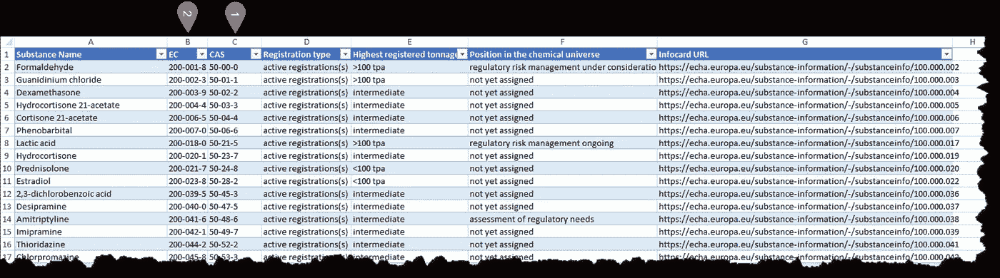
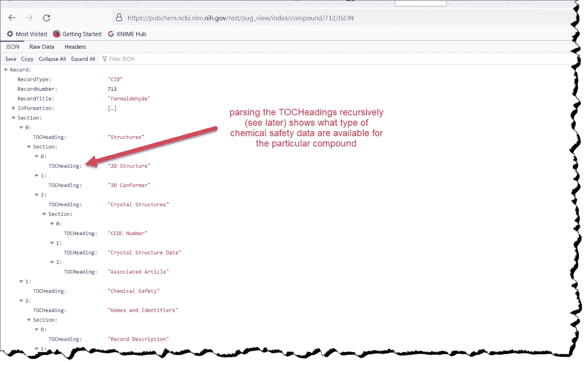
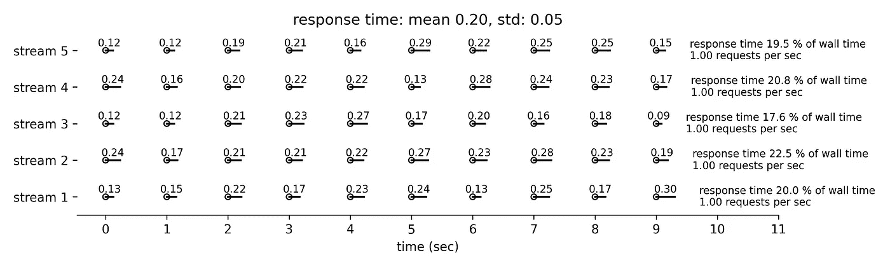
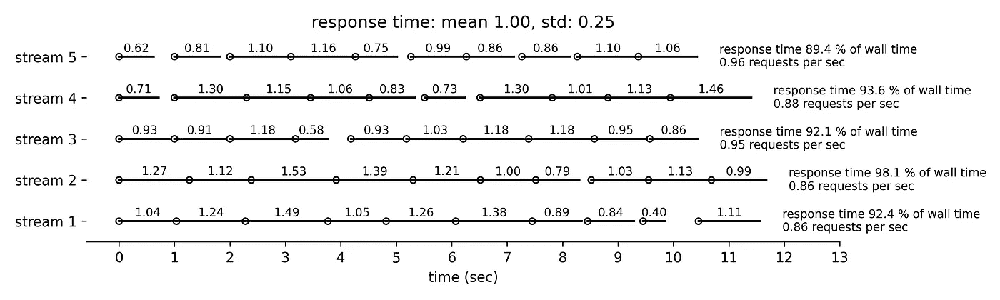
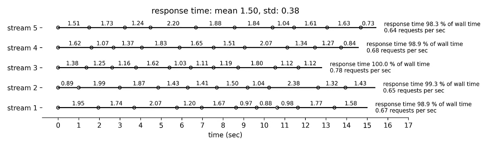

# 负责任的并行数据检索

> 原文：<https://towardsdatascience.com/responsible-concurrent-data-retrieval-80bf7911ca06>

## 以 PubChem 化学安全数据为例，探讨如何降低数据检索率的策略


作者在希腊克里特岛南部某地拍摄的照片

**目录**

[设置场景](#0f58)
[同步数据检索](#0119)
[异步数据检索](#423d)
∘ [概念化速率节流](#c8d7)
∘ [并发和速率节流检索使用异步](#1c38)
∘ [结果概述](#e6ba)
[结论](#692b)

# 设置场景

一般来说，在外部资源从容不迫地做出响应时，通过巧妙切换上下文，可以使用单核来协调 I/O 绑定的进程。尽管如此，仍有几种方法可以使用，它们在两个主要方面有所不同:

*   他们是使用[抢占式](https://en.wikipedia.org/wiki/Preemption_%28computing%29#Preemptive_multitasking)还是[协作式](https://en.wikipedia.org/wiki/Cooperative_multitasking)(也称为非抢占式)多任务处理，这与谁控制上下文切换有关
*   如何调节数据检索以满足数据提供者的需求

在我看来，后者是最重要的。当与数据提供者交互时，我们需要确保数据检索率不超过我们所使用的服务指定的限制。数据分析师有责任采取负责任的行动，而不仅仅是从数据接收者的角度着眼于优化流程。

本文以化学品安全为主题。它使用基于 [asyncio](https://docs.python.org/3/library/asyncio.html) 的多任务协作，从[public chem](https://pubchem.ncbi.nlm.nih.gov/)收集欧盟使用的所有工业化学品的化学安全数据。在欧盟，每年生产或进口 1 吨或以上的物质需要根据 REACH 法规的要求进行注册。注册物质的列表可以方便地从[这里](https://echa.europa.eu/universe-of-registered-substances)下载，格式良好的 excel 文件如下所示(图 1)。即使将来该列表不可用，任何物质标识符列表都可以用作输入。或者，可以从附带的[资源库](https://github.com/karpanGit/myBlogs/tree/master/ResponsibleConcurrentDataRetrieval)中获得本文撰写时使用的列表。



图 1:欧盟生产或进口的物质，标明了其数字标识符(化学文摘社编号和欧洲委员会编号)

物质清单可以用熊猫阅读，代码如下。

这里没什么特别的。如果过滤不清楚，目的是保留具有[化学文摘社编号](https://en.wikipedia.org/wiki/CAS_Registry_Number)的物质，这是一个可以很容易地用于从 PubChem 检索数据的标识符。如 PubChem PUG REST [文档](https://pubchemdocs.ncbi.nlm.nih.gov/pug-rest)和[教程](https://pubchemdocs.ncbi.nlm.nih.gov/pug-rest-tutorial)中所述，也可以使用其他标识符。

本文的用例包括两个步骤。第一步是使用 CAS 号获取相应的 PubChem 化合物 ID (CID)。例如，甲醛的化学文摘社编号为 50–00–0，可通过 POST [请求](https://pubchemdocs.ncbi.nlm.nih.gov/pug-rest-tutorial)获得相应的 CID

```
https://pubchem.ncbi.nlm.nih.gov/rest/pug/compound/name/cids/JSON
```

带标题

```
Content-Type: application/x-www-form-urlencoded
```

和身体

```
name=50-00-0
```

在编写时，这给出了 CID 712。CAS 号可能对应于由实现处理的多个 CID。这一步也可以通过使用更简单的 GET 请求来完成，但是我们更喜欢 PubChem 提供的 POST 功能，因为它不会受到可以在 URL 中传递的字符的限制(例如，当从物质名称获取 CID 时)。当起点是 CAS 号时，这不太重要，但我选择了更通用的实现。

第二步是获得特定化合物的索引，即列出存在的信息，但没有全部数据内容；实质上是该记录的目录。在甲醛的情况下，这可以使用 GET [请求](https://pubchemdocs.ncbi.nlm.nih.gov/pug-view#_full_record)来获得

```
https://pubchem.ncbi.nlm.nih.gov/rest/pug_view/index/compound/712/JSON
```

该用例基本上允许分析工业化学品 PubChem 中可用的信息类型。PubChem 是一个庞大的存储库，提供全面的化学信息和流畅的编程访问，专为数据密集型研究而构建。本文仅使用所提供的部分功能来解释 Python 中的并发性，可以进一步扩展该功能以从 PubChem 获得更多数据，例如生物测定数据。尽管如此，所展示的用例足够复杂，足以代表这种集成可能带来的挑战。

# **同步数据检索**

在考虑并发性之前，使用基于优秀的[请求](https://pypi.org/project/requests/)包的同步(阻塞)方法来测试数据检索方法是有用的。

与从 CAS 号中检索 CID 相关的第一步由函数`retrieve_CID`执行，而与检索特定 CID 的 PUG 视图索引相关的第二步由函数`retrieve_pugview`执行。

该方法使用化学文摘社编号作为起点。然而，该实现也允许使用 EC 号或物质名称作为起点，以防读者发现这很有用。由于这个原因，需要 URL 和字节编码，这里没有详细解释，但是希望从代码中可以看得很清楚。类似地，我没有提供对`import logger`导入和日志方法的解释，因为这对本文并不重要。关于日志的复习，请参考这个优秀的[资源](https://realpython.com/python-logging/)。通过重试失败的尝试和创建一个请求会话，可以进一步优化同步方法，但是在同步函数中没有讨论这一点，因为本文的重点是异步实现。完整的代码可以在附带的 GitHub [库](https://github.com/karpanGit/myBlogs/tree/master/ResponsibleConcurrentDataRetrieval)中看到。

回到甲醛的例子，我们可以用

它返回的 JSON 输出与我们在浏览器中使用甲醛 CID 看到的相同



图 2:甲醛的帕格观察指数(CID=712)

响应中一个特别有趣的部分是嵌套的 TOCHeading 值，当涉及到欧盟的工业化学品时，可以递归解析这些值来查看 PubChem 包含多少数据。我们将在文章的结尾回到这个问题。

这种同步方法可能是以编程方式从 PubChem 获取数据的最简单方式，可能已经对一些读者有用了。然而，本文的目的是超越同步方法，展示如何针对相当大数量的 CAS 号并发执行两个 REST 请求(但是不要大到考虑 PubChem 提供的 ftp 数据检索选项)。并发性并不是最容易涉及的话题。因此，在并行工作之前，实现同步方法总是明智的。这确保了正确使用 REST API，并设置了基线来检查并发方法的任何性能增益。根据记录，从化学文摘社编号开始检索甲醛指数大约需要 1.3 秒。

# 异步数据检索

## **概念化的速率调节**

使用 API 检索数据时，最重要的一个方面是遵守数据提供者的条款和条件，这些条款和条件可能会对检索到的数据施加限制。在我们的例子中，不存在这样的复杂性，因为数据不会用于任何特定的应用程序，因为目的是演示检索数据的过程，而不是构建面向用户的应用程序或以不同的方式利用数据。除了数据使用之外，负责任地检索数据也很重要，这样我们就不会给数据提供商的服务器带来过度的压力。本节尝试如何在我们的用例中实现速率调节。

PubChem 规定了[请求量限制](https://pubchemdocs.ncbi.nlm.nih.gov/programmatic-access#_RequestVolumeLimitations)，要求对程序性 web 请求进行节流，以便:

*   每秒不超过 5 个请求
*   每分钟不超过 400 个请求
*   每分钟运行时间不超过 300 秒

第二个要求似乎是多余的，如果我们在一整分钟内每秒提交 5 个请求，那么一分钟内提交的请求数将是 300，即少于 400。哪个条件可能是限制条件取决于典型请求的响应时间，而响应时间又可能取决于所请求的数据量、服务的总负载以及与 PubChem 的负载平衡器相关的细微差别。总而言之，这意味着我们不能假设相同的请求如果在不同的时间执行将花费相同的时间。该方法应该是通用的和灵活的，以考虑到这种波动。

编排数据检索的起点是我们每秒可以提交多达五个请求。如果我们假设我们正在运行五个独立的并发流，那么所有的需求都可以得到满足，如果每个请求的响应时间被测量为:

*   花费*t*1 秒的响应之后是 1- *t* 秒的空闲时间
*   花费 *t* ≥ 1 秒的响应可以立即跟随另一个请求

下面模拟了响应时间分布不同的四种不同情况([库](https://github.com/karpanGit/myBlogs/tree/master/ResponsibleConcurrentDataRetrieval)包含`utilities.py`中的函数`visualise_task_orchstrationin`)。我们假设有五个并发流，每个并发流发出十个请求。在图 2 中，响应时间相当短，服从正态分布，平均值为 0.2 秒，标准差为 0.05 秒。我们可以看到，速率限制条件是每秒的请求数。五个并发流每秒提交 5 个请求，但是响应时间(PubChem 服务器上的负载)只有墙时间的 20%，而 80%是空闲时间。这意味着我们每分钟只使用 60 秒的运行时间，但不幸的是，我们无法在不违反请求量限制的情况下进一步延长运行时间。



图 2:从平均值为 0.2 秒、标准偏差为 0.05 秒的正态分布中得出的响应时间；响应时间用一条从请求开始处开始的水平线(空心圆圈)表示，并带有注释

图 3 模拟了稍长的响应时间，从平均值为 0.5 秒、标准偏差为 0.12 秒的正态分布中提取。同样，速率限制条件是每秒的请求数。现在运行时间大约是每分钟 5x0.5x60 = 150 秒。


图 3:从平均值为 0.5 秒、标准偏差为 0.12 秒的正态分布中得出的响应时间

图 4 模拟了更长的响应时间，平均值为 1 秒，标准偏差为 0.25 秒。我们可以看到，五个并发流每秒提交的请求总数略少于 5 个，运行时间略少于每分钟 300 秒。



图 4:从平均值为 1.0 秒、标准偏差为 0.25 秒的正态分布中得出的响应时间

最后，图 5 模拟了最长的响应时间，平均值为 1.5 秒，标准偏差为 0.38 秒。很少有请求会有空闲时间。限速条件是运行时间接近每分钟 300 秒。



图 5:从平均值为 1.5 秒、标准偏差为 0.38 秒的正态分布中得出的响应时间

在实践中，由于[请求生命周期](https://docs.aiohttp.org/en/stable/tracing_reference.html#aiohttp-client-tracing-reference)的复杂性和准确测量响应时间的挑战，我们将把空闲时间增加 0.1 秒，以留出一些误差。

上述方法可以进一步改进，特别是如果响应时间波动，例如通过遵循具有更快和更慢响应的二项式分布。在这种情况下，更快的响应后面会有更少的空闲时间，因为更慢的响应确保我们不会那么容易达到每秒五个请求的限制。然而，这种方法开发起来更复杂，如果不加监督地运行，可能会有危险，因为除非我们能够在理论上保证请求量限制不会被超过，否则我们可能会无意中给 PubChem 施加压力，最终导致 IP 被阻塞。

我们注意到 PubChem 还提供了动态节流功能。伴随所有 PUG-REST web 请求的 HTTP 响应头包含关于用户有多接近极限的信息。PubChem 可以根据总体需求动态调整这些限制，因此可以实时使用这些限制来确保并发率得到相应的动态调整。这种反馈循环机制超出了本文的范围，本文将涉及相当多的内容。在本文中，动态节流仅用于双重检查数据检索率是否保持在可接受的范围内。

在下一节中，我们将使用五个独立且并行的流来实施数据检索方法，以数千种物质的化学文摘社编号为起点来检索其 CID。这些 cid 将是唯一的，然后用于检索它们相应的 PUG 视图索引。

## 使用 asyncio 的并行和速率受限检索

异步方法在很大程度上基于同步方法，但在本次会议中列出了一些调整。

最关键的调整是用 [aiohttp](https://aiohttp.readthedocs.io/en/stable/) 模块替换阻塞请求模块，这是一个以异步方式发出 http 请求的库。请求本身是使用单个 aiohttp 会话发出的，以利用会话内部连接池的重用。

虽然这种情况很少发生，但实现会重新提交可能暂时失败的请求，例如，由于网络问题或 PubChem 的服务器繁忙。查看日志，这种情况只发生几十次，没有一个请求需要提交两次以上。

速率调节是通过一个异步[信号量](https://docs.python.org/3/library/asyncio-sync.html#asyncio.Semaphore)来实现的

```
sem = asyncio.Semaphore(limit)
```

用`limit=5`。信号量管理一个内部计数器，该计数器在每次`sem.aquire()`调用时递减(一旦我们使用信号量进入上下文管理器),在每次`sem.release()`调用时递增(一旦我们使用信号量退出上下文管理器)。计数器永远不能低于零；当`sem.aquire()`发现它是零时，它会阻塞，直到某个任务调用`sem.release()`唤醒另一个等待获取信号量的任务。这实质上实现了前面概念上的五个并发且独立的流。

短请求之后是一个`asyncio.sleep(idle_time)`调用，其中空闲时间取决于请求持续时间，假设请求持续时间反映了 PubChem 计算时间。幸运的是，aiohttp 支持[客户端跟踪](https://docs.aiohttp.org/en/stable/client_advanced.html#aiohttp-client-tracing)，它通过将监听器协程附加到由`TraceConfig`实例提供的信号上来工作:

```
async def on_request_start(session, trace_config_ctx, params):
    trace_config_ctx.start = asyncio.get_event_loop().time()

async def on_request_end(session, trace_config_ctx, params):
    elapsed_time = asyncio.get_event_loop().time() - trace_config_ctx.start
    if trace_config_ctx.trace_request_ctx['request duration'] is not None:
        raise Exception('should not happen')
    trace_config_ctx.trace_request_ctx['request duration'] = elapsed_time

trace_config = aiohttp.TraceConfig()
trace_config.on_request_start.append(on_request_start)
trace_config.on_request_end.append(on_request_end)
```

该实例用作`ClientSession`构造函数的参数，其结果是客户端触发了`TraceConfig`支持的不同信号。这些信号将第一个参数`ClientSession`和第二个参数`[SimpleNamespace](https://docs.python.org/3/library/types.html)`称为`trace_config_ctx`，它们可用于共享属于同一请求和同一`TraceConfig`类的不同信号的状态。这使得能够测量从请求开始到结束所用的时间。`trace_config_ctx`参数在请求流开始时初始化。更复杂的是，我们需要将信息从侦听器传递回实现请求的协程，以便可以设置空闲时间。代码使用了在请求执行开始时给出的`trace_request_ctx`参数，它被所有 HTTP 动词接受，并将作为关键字参数传递给实例化`trace_config_ctx`的默认工厂。我们不使用这个功能向监听器传递数据，而是获取请求持续时间，因为一旦请求返回，键值对`trace_request_ctx = {'request duration': None}`的值将被设置。

诚然，这一节介绍了许多概念。在附带的[库](https://github.com/karpanGit/myBlogs/tree/master/ResponsibleConcurrentDataRetrieval)中查看整个实现可能更容易。

## 结果概述

具有化学文摘社编号的物质数量为 17，829，相当于 17，700 个独特的化学文摘社编号。使用协程`retrieve_CID`我们获得了 15 361 个唯一的 CID 号码，其中 12 873 个 CAS 号码只有一个 CID 号码。4 117 化学文摘社编号在 PubChem 数据库中找不到，710 化学文摘社编号有两个或两个以上的 CID 编号。后者表明了工业化学品的物质鉴定挑战和 PubChem 中潜在的重复记录。总而言之，整个数据检索花费了 2.04 小时，即使数据检索需要定期重复，这也绝不是令人望而却步的。在处理日志时，我们可以看到两种请求类型的平均响应时间都不到 0.2 秒，响应时间的分布非常窄，如下所示。尽管如此，还是有一些例外。使用 [seaborn](https://seaborn.pydata.org/generated/seaborn.boxplot.html) 生成箱线图的代码也可以在补充[库](https://github.com/karpanGit/myBlogs/tree/master/ResponsibleConcurrentDataRetrieval)中找到。


图 6:响应时间

检查日志，有大约 30 个警告与超过 PubChem 的请求量限制有关，响应代码为 503，消息为“请求太多或服务器太忙”，与大约 33k 的请求相比，这是相当小的。这是一个相当小的数字，最终重试后数据检索成功。限制导致这种情况的原因可能不值得研究，因为很难准确解释 PubChem 对计算时间的定义以及我们的客户端跟踪方法测量的响应时间。PubChem 允许一些回旋余地，我们显然在负责任地使用这些余地。

使用`utilities.py` 中的递归函数`utilities/parse_TOCHeadings`，我们看到 PubChem 包含 6 248 个 CID 编号的生物测定数据，即几乎一半的检索 CID 编号。此类数据可用于危险评估，同时 PubChem 还包含大量使用和暴露信息，对风险评估很有价值。[库](https://github.com/karpanGit/myBlogs/tree/master/ResponsibleConcurrentDataRetrieval)包含该[文件](https://github.com/karpanGit/myBlogs/blob/master/ResponsibleConcurrentDataRetrieval/output/data_availability.xlsx)中所有 TOC 标题的完整数据可用性。

# **结论**

还有其他方法来实现速率限制并发数据检索，例如通过将 asyncio 与一个[队列](https://docs.python.org/3/library/asyncio-queue.html)相结合。也允许限制同时连接的数量，但我决定采用信号量方法，因为这是一个更通用的节流解决方案，只依赖于 asyncio 本身。数据检索不是唯一可以异步执行的部分。例如，检索到的数据可以异步存储在 PostgreSQL [数据库](https://github.com/aio-libs/aiopg)或[文件系统](https://github.com/Tinche/aiofiles)中。asyncio 库和框架的列表在不断地[增长](https://github.com/timofurrer/awesome-asyncio#alternatives-to-asyncio)，现在有许多优秀的资源可用(例如，请阅读这篇优秀的[文章](https://realpython.com/async-io-python/)并浏览最后的资源链接)。事实上，甚至还有 asyncio 的替代品，比如 [curio](https://github.com/dabeaz/curio) 和 [trio](https://github.com/python-trio/trio) 。我对这些替代品的成熟程度了解不多。我承认 asyncio 发展很快，理解何时使用诸如 futures、tasks 和 coroutines 之类的东西并不容易，但同时它包含在标准库中，并且它现在有足够的发展势头。并发不是一个简单的话题，想象力是没有限制的。例如，在不同的[内核](http://use a single core and hence speed-up is achieved by cleverly switching context whilst the external resource is taking its time to respond.)中运行多个 asyncio 循环可能会同时融化您的笔记本电脑和大脑(双关语)。玩笑归玩笑，我觉得 asyncio 对于数据分析师和数据科学家通常遇到的大多数 io 绑定流程来说已经足够了。

为了完整起见，IO 绑定的进程也可以使用[多线程](https://realpython.com/python-concurrency/#threading-version)来编排。我个人的观点是，asyncio 是比多线程更好的选择，因为切换上下文是显式的，不需要担心线程安全，这并不意味着 asyncio 没有自己的挑战。

实现是本文使用的高级 asyncio 功能，如`asyncio.gather()`。更明确地与循环和任务进行交互可以导致进一步的优化，从而使数据检索更加接近 PubChem 的请求量约束的限制。这是否值得追求是个人喜好的问题，因为性能的提高可能是微不足道的。此外，实现将不可避免地变得更加复杂，asyncio 不仅复杂，而且在不断发展。维护代码需要相当多的脑力来阅读和试验新的特性，这可能会超过好处，除非你在理论上倾向于并享受挑战多于你需要的结果。人们有不同的观点和世界观，如果你准备好迎接挑战，请给我留言，指出你的方法。我将非常乐意阅读更多关于它的内容！

**免责声明**

从欧洲化学品管理局获得的物质清单受此处和[免责声明](https://echa.europa.eu/universe-of-registered-substances)中解释的[法律条款和条件的约束。PubChem 数据使用政策和免责声明可在](https://echa.europa.eu/legal-notice)[这里](https://www.ncbi.nlm.nih.gov/home/about/policies/)找到。在使用本文中讨论的任何公开数据之前，请查阅这些页面。