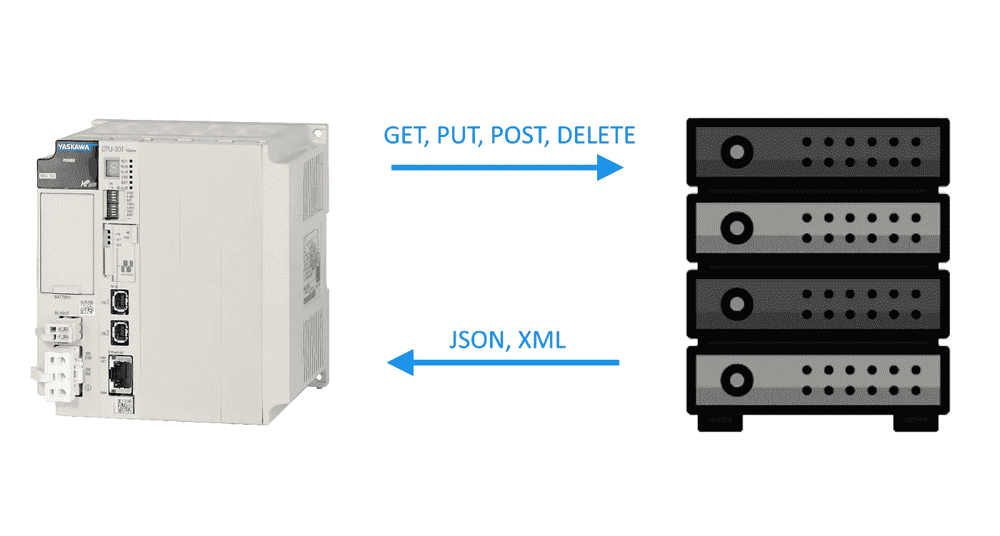
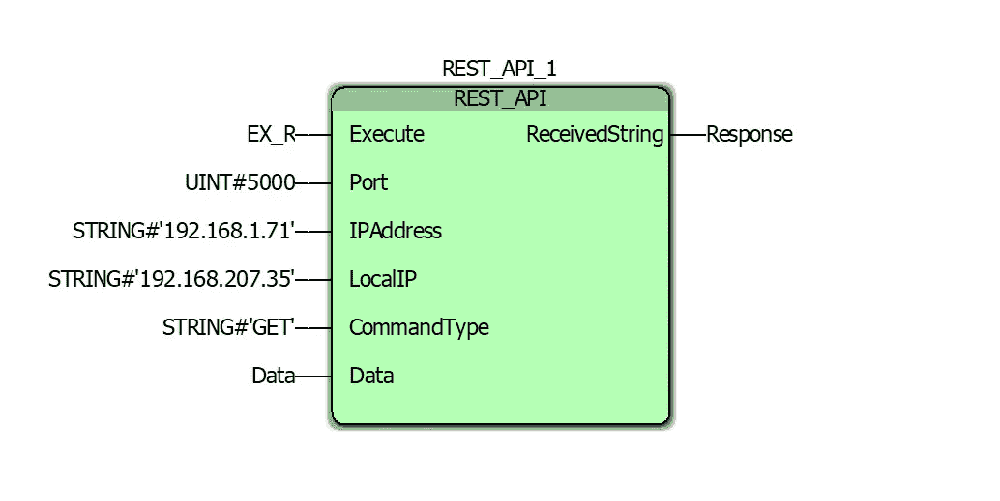
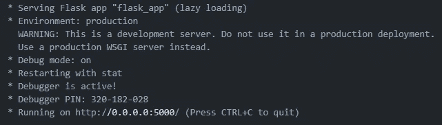

# 工业 PLC 上的 REST APIs

> 原文：<https://towardsdatascience.com/rest-apis-on-industrial-plcs-eb17e8c4d51b>

## 扩展 PLC 的功能以执行几乎任何任务



与 REST API 的通信，作者的图像

## 介绍

API 允许两个不同应用程序之间的简单接口，在本文中，Python [REST API](https://en.wikipedia.org/wiki/Representational_state_transfer) 的基本实现将用于管理来自 PLC 的各种 SQL 命令。

在这个例子中，数据将从连接到 MP3300iec 控制器的适马-7 伺服驱动器网络中采样。这些数据将用于训练和评估一个[异常检测](/anomaly-detection-on-servo-drives-f711f3e6022f)模型，该模型将在类似配置的机器网络中使用。出于这个原因，一个好的设计应该是有一个中央服务器与所有这些机器通信，存储所有数据，计算模型的权重，并将权重实时分配回控制器。

## 动机

通过 REST API 与 Python 应用程序通信，任何不可能在 PLC 上运行的东西现在都可以在本地服务器上运行，并将结果返回给 PLC。这允许昂贵的计算过程与控制器一起实时运行。例如，如果在控制器上与其他进程和任务一起运行，具有几十万或几百万个参数的大型机器学习模型可能会导致看门狗错误或 cpu 负载问题。有两个直接的解决方案:

1.  缩小机器学习模型的规模
2.  在不同的硬件上运行计算

在某些情况下，选项 1 可以很好地工作，但是，模型的准确性可能会受到影响。有些应用可能会损失精度，但其他要求更高精度的应用可能需要选项 2。

除了将计算负载分配给另一个设备，REST API 对于执行控制器不常见的动作也很有用。一些示例可能包括:跟踪订单或库存、从第三方应用程序获取信息或与外部网络通信。

虽然可以直接从控制器与第三方应用程序进行通信，但使用给定应用程序作者提供的预建库和存储库进行通信要容易得多。随着 Python 和其他现代编程语言的流行，有许多库和工具可以为您完成繁重的工作。使用 REST API 允许您这样做，以及流程所需的任何额外的定制操作。

## REST API

API 将在位于与所有控制器相关联的本地网络内的服务器上运行。Python 的 Flask 模块用于创建所有用于数据处理的端点。定义的第一个端点将用于向数据库添加数据点，如下所示:

```
[@app](http://twitter.com/app).route('/add_row', methods=['POST'])
def add_row():
    row_data = request.data
    if insert_sql_row(data):
        return json.dumps({'statusCode': 200, 'data': 'Success'})
    else:
        return json.dumps({'statusCode': 400, 'data': 'Error'})def insert_sql_row(row_data) -> bool:
    try:
        database = mysql.connector.connect(
            host = 'localhost',
            user = 'admin',
            password = 'password'
        )
        cursor = database.cursor() sql_statement = 'INSERT INTO table_name VALUES ('
        for value in row_data:
            sql_statement = f'{sql_statement},{value}'
        sql_statement = f'{sql_statement})' cursor.execute(sql_statement)
        database.commit()
        cursor.close()
        database.close()
        return True
    except:
        return False
```

上面代码中的几个关键项目:

*   **/add_row 端点:**这是当控制器希望向数据库添加一行数据时将使用的端点。
*   **request.get_data():** 这将返回与请求相关的数据，该数据包含要输入数据库的采样值行，以及与网络请求相关的其他信息
*   **mysql.connector:** 这是用来连接和查询 sql 数据库的模块。

定义的下一个端点将用于从数据库中检索异常检测模型。模型权重将存储在不同的表中，这反映在下面的代码中:

```
[@app](http://twitter.com/app).route('/retrieve_model', methods=['GET'])
def retrieve_model():
    model_id = request.data
    return json.dumps(
                       {'statusCode': 200, 
                        'data': str(retrieve_sql_row(model_id))
                       }
                      )def retrieve_sql_row(model_id):
    try:
        database = mysql.connector.connect(
            host = 'localhost',
            user = 'admin',
            password = 'password'
        )
        cursor = database.cursor()
        cursor.execute(f'SELECT * FROM ml_model_table 
                          WHERE model_id="{model_id}"'
                       )
        row = cursor.fetchone()
        cursor.close()
        database.close()
        return row if row else []
    except:
        return []
```

## 与 API 通信

控制器通过 TCP 套接字发送的 HTTP 请求与 API 通信。对于将异常检测模型权重返回给客户端的基本 GET 命令，可以使用以下字符串:

```
GET /retrieve_model HTTP/1.1
```

字符串的第一部分 *('GET')* 表示被请求的 REST 方法的类型，字符串的第二部分 *('/retrieve_model')* 表示被请求的端点，字符串的最后一部分 *('HTTP/1.1')* 指定 HTTP 协议版本。

当使用上面创建的数据存储端点时，上面的命令将被修改为:

```
POST /add_row HTTP/1.1
```

在 PLC 编程方面，已经创建了一个自定义功能块，用于处理发出这些命令所需的所有预处理和后处理。如下所示:



用于发出 REST 请求的功能块，由作者生成图像

“REST_API_1”功能块有以下输入:

*   **执行:**发送命令并等待响应的布尔值
*   **端口:**这是请求被发送到的服务器的端口号
*   **IPAddress:** 这是请求被发送到的服务器的 IP 地址
*   **LocalIP:** 这是发出请求的设备所分配的 IP 地址。
*   命令类型:这是被请求的 REST 命令的类型。
*   **数据:**这是一个包含所有将被附加到请求的数据的结构

存在单一输出“ReceivedString”。这是服务器响应的字符串。在本例中，它将是一个 JSON 结构化响应，格式如下:

```
{'statusCode': 200, 'data': 'Success'}
```

## 例子

该示例从运行将托管 REST API 的 Flask 服务器开始。上面“REST API”一节中的代码用于本例，日志显示服务器正在运行:



Flask 服务器初始化的输出日志，图片作者

在 PLC 程序中，在“REST_API_1”功能块上启用“执行”布尔，包含以下输入:

*   端口= 5000
*   IP 地址= 192.168.1.71
*   LocalIP = 192.168.207.35
*   CommandType = 'GET '
*   data = { ' endpoint ':/retrieve _ model '，' model _ id ':' anomaly 7 ' }

一旦服务器对请求做出响应,“ReceivedString”输出将收到以下输出:

```
{'statusCode': 200, 'data': [0.0291, 0.1253\. 0.2843, 0.0112, 0.0895, 0.2001, 0.0013, 0.0984]}
```

现在，控制器具有必要的权重，以利用来自服务器的更新的机器学习模型权重来运行异常检测。

## 结论

使用 REST API 是扩展 PLC 功能的一种简单方法。它允许控制器请求几乎任何类型的过程，并将计算卸载到另一个设备。使用 Python 的 Flask 是实现这一点的最简单和最容易的方法之一。

## 参考

[1]维基媒体基金会。(2022 年 5 月 22 日)。*具象状态转移*。维基百科。2022 年 5 月 25 日检索，来自[https://en . Wikipedia . org/wiki/representative _ state _ transfer](https://en.wikipedia.org/wiki/Representational_state_transfer)

[2]维基媒体基金会。(2022 年 5 月 22 日)。*可编程逻辑控制器*。维基百科。于 2022 年 5 月 25 日从[https://en.wikipedia.org/wiki/Programmable_logic_controller](https://en.wikipedia.org/wiki/Programmable_logic_controller)检索

[3]列别德津斯基，P. (2021 年 11 月 12 日)。*伺服驱动器上的异常检测。*中等。2022 年 5 月 12 日检索，来自[https://towards data science . com/a-single-number-metric-for-evaluating-object-detection-models-c97f 4a 98616d](/anomaly-detection-on-servo-drives-f711f3e6022f)。