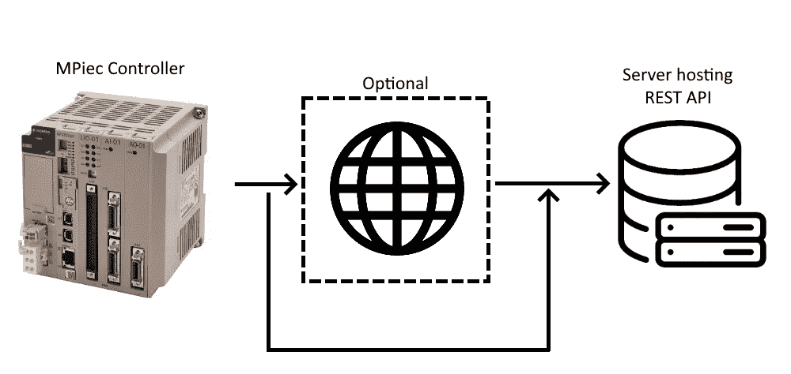
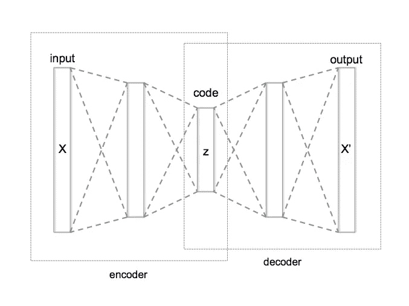
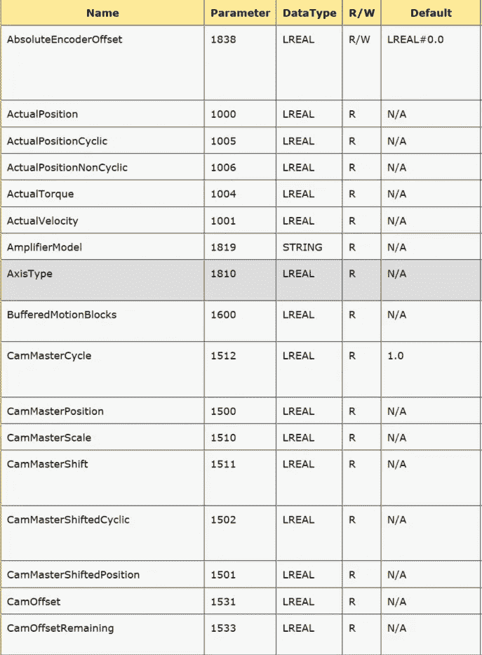
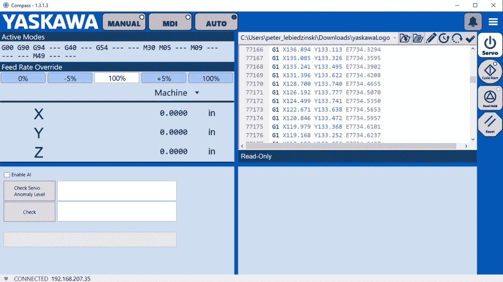
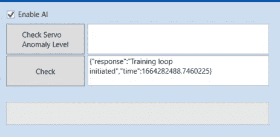
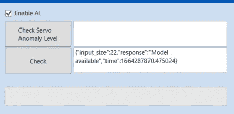
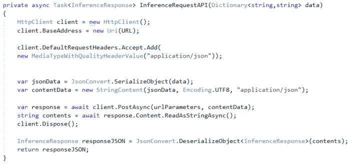
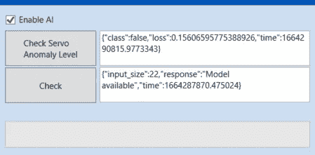

# 工业 PLC 上的 REST APIs 第 2 部分:系统健康监控

> 原文：<https://towardsdatascience.com/rest-apis-on-industrial-plcs-part-2-system-health-monitoring-1ad470f7f896>

## 监控系统中每个设备的运行状况

## 介绍

API 对于卸载计算和运行在给定编程语言中不容易完成的进程非常有用。在本系列的第一部分[工业 PLC 上的 REST APIs】中，我们实现了一个简单的 API，它从 SQL 数据库中添加和检索条目。输入数据库的数据用于训练机器学习模型，以检测连接到控制器的伺服驱动器中的异常。](/rest-apis-on-industrial-plcs-eb17e8c4d51b)

在这个例子中，我们将为收集的数据运行一个基本的训练循环，并对伺服系统进行推理，以查看它们是否表现异常。为此，我们将使用具有未标记数据的自动编码器网络，并测量重建损失以确定当前伺服状态的分类。

## 动机

通过实施异常检测模型，我们可以监控配置中每个伺服系统的健康状况。肉眼和耳朵可能不明显的东西将被模型捕捉到，用户可以相应地采取行动。及早发现伺服系统的问题，让我们有时间安排预防性维护，这大大减少了停机时间，并有助于防止因伺服系统故障而造成的任何损坏。

## 背景

自动编码器网络将用于识别伺服状态中的异常。自动编码器网络是合适的，因为它将从输入数据中滤除噪声，并利用可能存在的非线性关系提供更精确的重建。由于将使用未标记的数据，自动编码器网络的重建损失将用于分类异常。具有高于设定阈值的高重建损失的数据将被视为异常，而具有低于设定阈值的低重建损失的数据将被视为非异常。

3D 打印是伺服系统的一种流行用途；以高速度和加速度运行打印机会加快打印机的吞吐量，也会导致更高的动态负载。打印机可能几乎 100%的时间都在不停地运行，因此以潜在的方式监控伺服系统的状态是很有用的。

## 配置

在这个例子中，我们将创建一个 [Compass](https://www.yaskawa.com/products/motion/machine-controllers/software-tools/yaskawa-compass) 插件，它为数据采样和推断发出 API 请求。虽然 API 请求可以直接从 PLC 发出，但它们将从运行 Compass 的 PC 发出，以省去将请求路由到适当外部网络的麻烦。发出 API 请求的网络架构如下所示:



图 1:带有 PLC 的 REST API 网络架构，图片由作者提供

图上的箭头是以太网/IP 连接。在本例中，MPiec 控制器将与中间的可选 DNS 服务器进行对话。运行 Compass 的 PC 将自动处理 DNS 路由，并将请求发送到适当的服务器。

REST API 服务器托管在 AWS ec2 实例上，具有以下可用端点:

```
/api/v2/store_data #store a row(s) of data values for training/api/v2/inference #run inference on row(s)/api/v2/check #check on model availability
```

## 模型

来自 [PyOD GitHub](https://github.com/yzhao062/pyod) 库的自动编码器模型将用于检测伺服驱动器上的异常状态。自动编码器的网络结构如下所示:



图 2:自动编码器神经网络结构，图像由 Chervinskii⁴

与我的前一篇文章⁵[中使用的可以直接在 PLC 上运行的异常检测模型不同，AutoEncoder 计算量很大，必须在一个支持矢量化计算的不同设备上运行。如果你有兴趣了解更多关于自动编码器网络的信息，可以考虑阅读这篇](/anomaly-detection-on-servo-drives-f711f3e6022f)[⁵.的论文通过使用 API 来运行推理，我们显著降低了 PLC 的 cpu 负载并避免了性能问题。](https://citeseerx.ist.psu.edu/viewdoc/download?doi=10.1.1.703.5244&rep=rep1&type=pdf)

## 数据

来自伺服系统的所有可用的和相关的数据将用于这个例子。一些关键变量包括:

*   反馈位置、速度、加速度和扭矩
*   指令位置、速度、加速度和扭矩

最终，减少采样变量的数量，以减少读取变量的 cpu 负载，而不会对自动编码器模型产生重大影响，这将是最佳选择。在本例中，将从以下列表中读取所有与运动相关的轴参数:



图 3:变量采样的轴参数列表，作者图片

## 插件布局

该插件在启用时，将自动从伺服系统中批量采样数据，并使用`/api/v2/store_data`端点将数据行发送给 API 以供将来训练。我们将启用插件，并运行几个 g 代码文件几个小时，这样就可以采样一组不同的数据。



图 Compass 中的插件，作者图片

一旦收集了足够多的数据，就会调用`/api/v2/check`端点。端点被编程为:

1.  检查自动编码器型号的状态/可用性
2.  如果存在足够的数据，则启动培训课程

第一次调用`/api/v2/check`端点将返回以下内容:



图 5 :/ API/v2/check 端点的 API 响应，作者图片

一旦自动编码器完成训练并可用于推断，端点`/api/v2/check`将返回以下内容:



图 6:具有可用模型的/api/v2/check 端点的 API 响应，图片由作者提供

## 插件客户端代码

Compass 插件通过 POST 方法发出 HTTP 请求来与 API 通信。该请求包含给定端点的 JSON 格式的相关数据。在推断过程中，一行或多行被发送到 API，服务器将返回每一行的异常状态。该请求是用 c#完成的，代码如下:



图 7:c#中的 API 请求，作者图片

图 7 的复制粘贴友好格式:

```
private async Task<InferenceResponse> InferenceRequestAPI(Dictionary<string,string> data){HttpClient client = new HttpClient();client.BaseAddress = new Uri(URL);client.DefaultRequestHeaders.Accept.Add(new MediaTypeWithQualityHeaderValue("application/json"));var jsonData = JsonConvert.SerializeObject(data);var contentData = new StringContent(jsonData, Encoding.UTF8, "application/json");var response = await client.PostAsync(urlParameters, contentData);string contents = await response.Content.ReadAsStringAsync();client.Dispose();InferenceResponse responseJSON = JsonConvert.DeserializeObject<InferenceResponse>(contents);return responseJSON;}
```

服务器将以下列格式返回响应:



图 8:来自服务器的自动编码器推理响应，图片由作者提供

在上面图 8 的例子中，一行数据用于推断。该响应有三个关键响应项:

1.  `class` —推理的分类(如果异常则为真，如果没有检测到异常则为假)
2.  `loss` —自动编码器模型返回的重建损失，用于推理
3.  `time`——推论的时间

分类输出基于一个`threshold`值，该值使用重建损失将自动编码器的输出二进制化。在这个例子中，服务器的训练系统基于最初给出的训练数据预先选择阈值。服务器预先选择值 0.4 作为截止阈值，这意味着任何重建损失高于 0.4 的推断都将被视为异常。

对于生产应用，用户应仔细选择阈值。此外，应实施后处理算法来跟踪肯定分类的频率和幅度，以便单个肯定分类不会触发任何操作。

监控异常频率的一个简单有效的方法是在不同的时间间隔跟踪 3 个 SMA(简单移动平均线)并相互比较。例如，使用一组 5/30/120 分钟的 SMA，我们可以根据 120 分钟的 SMA 建立一个“标称”值，并将其与 5 分钟和 30 分钟的 SMA 进行比较。当较低的间隔 SMAs 超过标称值以上 3 个标准差时，我们可以考虑向用户发送需要检查 3D 打印机的通知。

## 结论

出于各种原因，REST APIs 与 PLC 的结合非常有用，包括能够轻松集成高性能机器学习模型来监控设备的健康状况。通过利用 API，几乎任何东西都可以与 PLC 及其连接的设备集成。

如果你对现成的指南针插件感兴趣，[联系我](https://www.linkedin.com/in/peter-lebiedzinski-4012a8123/)。

## 来源

[1] Lebiedzinski，P. (2022 年 5 月 27 日)。工业 PLC 上的 REST APIs。中等。2022 年 9 月 26 日检索，来自[https://towards data science . com/a-single-number-metric-for-evaluating-object-detection-models-c 97 F4 a 98616d](/rest-apis-on-industrial-plcs-eb17e8c4d51b)。

[2] *安川指南针*。安川。(未注明)。2022 年 9 月 26 日检索，来自[https://www . yaskawa . com/products/motion/machine-controllers/software-tools/yaskawa-compass](https://www.yaskawa.com/products/motion/machine-controllers/software-tools/yaskawa-compass)

[3]赵，杨，纳斯鲁拉，李，2019 .PyOD:用于可伸缩异常检测的 Python 工具箱。机器学习研究杂志(JMLR)，20(96)，第 1–7 页。

[4]作者切尔文斯基—自己的作品，CC BY-SA 4.0，[https://commons.wikimedia.org/w/index.php?curid=45555552](https://commons.wikimedia.org/w/index.php?curid=45555552)

[5] Lebiedzinski，P. (2021 年 11 月 12 日)。*伺服驱动器上的异常检测。*中等。2022 年 5 月 12 日检索，来自[https://towards data science . com/a-single-number-metric-for-evaluating-object-detection-models-c97f 4a 98616d](/anomaly-detection-on-servo-drives-f711f3e6022f)。

[6]乐，2015 .深度学习教程第 2 部分:自动编码器，卷积神经网络和递归神经网络。*谷歌大脑，谷歌公司*