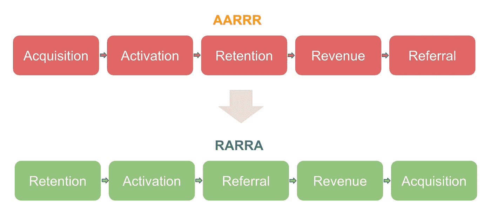
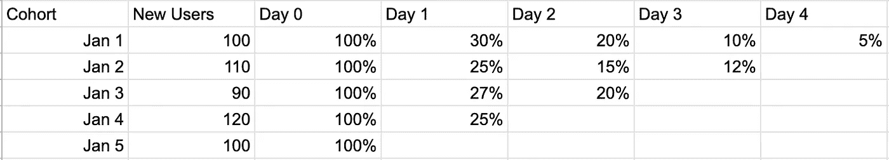

# 保留分析框架

> 原文：<https://towardsdatascience.com/retention-analysis-framework-4eb62933e2b>

# 保留分析框架

## 数据科学视角

幸运的猫在 [Unsplash](https://unsplash.com/?utm_source=unsplash&utm_medium=referral&utm_content=creditCopyText) 上的照片

你是一个试图了解你的产品或网站的用户的数据科学家吗？本文将从数据科学的角度向您介绍一个用户保留分析框架。本文将涵盖测量留存的三个维度(时间、用户状态、行动)、分析框架、如何通过分析找到“啊哈时刻”和“习惯时刻”，并调查用户离开和留下的原因。

# 为什么做留存分析很重要？

一个流行的商业增长框架模型是 AARRR(获取、激活、保留、收入和推荐)。然而，许多人批评 AARRR 过于关注收购，尽管留住人才更重要，尤其是对于许多努力留住人才的互联网产品来说。留住人才更重要的原因有很多:获取策略(如广告)很昂贵，留住一个用户往往比获得一个新用户更便宜；留存是成长的基础；用户保持率比获得率更直接与收入相关。

因此，AARRR 框架后来被重新调整为 RARRR(保留、激活、推荐、收入、收购)，保留是第一优先。

AARRR 重新排序为 RARRA(图片由作者制作)

# 我们如何定义和衡量保留？

保持率衡量的是在特定的时间内有多少用户回到你的产品。在测量保持力方面，有三个维度需要考虑。了解不同的保持措施并进行比较，将有助于我们为您的产品找到合适的保持措施。

## **维度 1:时间**

*   n 天/周/月保留

n 天留存率是计算留存率的最经典方法，它衡量在第 0 天首次使用产品的用户中，有多少比例的用户在第 n 天仍然活跃。这里的“天”可以是周或月。

是否使用每日、每周或每月保留取决于您的产品和用户使用您产品的频率。例如，对于高粘性的游戏产品，通常每天测量 N 天留存率。

*   无限保留

无限保留(也称为滚动保留)衡量在第 0 天首次使用该产品的用户中，有多少比例的用户在第 n 天及之后仍然活跃

*   托槽保持力

托槽固位更灵活。你可以定义你感兴趣的时间段。例如，Pinterest 衡量的是"[在注册](http://jwegan.com/growth-hacking/27-metrics-pinterests-internal-growth-dashboard/)后 28-35 天的一周时间内，仍在进行关键活动的新注册用户的百分比。

## **维度 2:用户状态**

除了时间，用户状态往往是另一个需要考虑的重要维度。首先，我们来看看如何定义用户状态。定义状态的方式有很多种，不同的公司/产品往往有自己定义用户状态的方式。以下是定义用户状态的一种方式:

*   新用户
*   搅动用户:x 天不活动
*   非活动用户:0-x 天非活动
*   被动用户:搅动后激活/不激活
*   活跃用户:不是新用户且没有反应的活跃用户

计算不同用户状态的保持率通常很重要。例如，新用户保持率衡量保持活跃的新用户的比例。活跃用户保持率衡量保持活跃的活跃用户的比例。在功能变化的情况下，我们可能会看到活跃用户保持率下降，因为用户已经习惯了产品。然而，与此同时，新用户的保留率可能会上升，这表明从长远来看，这一功能变化可能是一种改进。

## **维度 3:动作**

当我们说用户使用产品时，我们并没有定义我们所说的“使用”是什么意思。我们应该把“使用”定义为访问产品页面，停留一定时间，进行一定的动作，还是购买一件产品？我们将用于计算保留率的操作称为“关键操作”。

## **一个起点**

这么多措施，我们用哪一个，从哪里入手？

*   对于维度 1，我将从经典的 N 天/周/月保留开始，稍后研究其余的。为了确定时间间隔，我会画出用户使用产品的频率，用不同的时间间隔画出使用产品 x 次的用户百分比，用不同的时间间隔画出保持率，然后看看哪个对你的产品有意义。在您的分析中包含多个时间间隔是可以的。
*   对于维度 2，我会从新用户保持率开始，然后调查活跃用户保持率，尤其是新产品。
*   对于 dimension 3 来说，这真的取决于产品目标:你对货币化价值更感兴趣，还是你正处于通过某些行动来增长和留住用户的阶段？

# 分析框架

## **滞留曲线**

保留曲线绘制了保留时间，x 轴为时间，y 轴为保留率。理想情况下，随着时间的推移，当用户越来越多地回来时，我们希望看到一个微笑的曲线。下降的曲线表示危险，变平的曲线表示健康的产品。产品的目标是向上移动曲线，使曲线变平或上升。

保留曲线(图片由作者制作)

## **保留群组分析**

群组分析告诉我们，我们看到产品在哪里做得好，在哪里做得不好，以及产品在哪些用户群中取得了成功。我们可以从许多不同的类别来定义群组，例如:

*   人口统计:性别、年龄等。
*   采集:采集时间、采集来源等。
*   行为

我们可以用分组保留曲线或三角形保留图来表示保留群组(如下所示，获取时间为群组)。

三角形保留图(图片由作者制作)

## **统计分析**

像任何其他类型的分析一样，我们可以从计算描述性统计和相关性开始。我们还可以进行生存分析，以确定哪些属性很重要。查看我的[之前关于生存分析的博文](https://medium.com/analytics-vidhya/survival-analysis-using-lifelines-in-python-bf5eb0435dec?sk=477c6b46dd3efa67bc8252ef3489c315)。此外，RFM(保持率、频率、货币)分析框架通常用于用户细分。

## **一个起点**

一个好的起点是使用仪表板显示所有可用群组/组的保留曲线和三角形保留图表。然后，我们可以从仪表板中获得洞察力，并从那里开始。

# 对于新用户，寻找“啊哈时刻”

对于新用户来说，最重要的是最初几天或几周内的入职体验。几乎所有的产品都想帮助用户尽快实现“啊哈时刻”。问题是:我们如何定义用户的啊哈时刻，有助于啊哈时刻的用户行为是什么？例如，脸书关注的是“在 10 天内获得 7 个朋友”。这种行为(获得朋友)和神奇的数字(7 个朋友和 10 天)预示着用户未来的成功。我不认为我们所有人都应该为所有产品找到一个具有神奇数字的行为，但我认为从我们的数据中找出哪些行为有助于啊哈时刻是很重要的。然后，产品团队可以使用这些信息来改善我们的入职体验

## **一个起点**:

找到与未来几周/几个月的保留相关的用户事件和入职行为。

# 对于长期用户，找到“习惯时刻”

最成功的长期用户是如何形成使用产品的习惯的？他们是谁，他们一直在使用什么功能，他们有什么属性，他们的用户旅程是什么？目标是找到成功的功能和用户旅程，投资那些成功的功能，并鼓励新用户跟随成功的用户旅程。

## **一个起点**:

我们可以从对长期用户进行描述性分析开始，以识别用户行为和特征，然后进行群组分析，以找到这些用户的用户旅程。

# 人为什么会离开和留下？

人们离开和流失的原因可能有很多。例如:

*   他们可能不了解产品。
*   该产品可能很难使用。
*   人们可能看不到产品的价值。
*   人们更喜欢竞争对手的产品。
*   该产品可能有一些问题，如错误或缓慢。
*   新用户不是目标用户。用户需求和核心功能可能不匹配。
*   人们可能只在短时间内需要我们的产品。

人们留下来的原因可能有很多。例如:

*   人们喜欢这个产品。
*   个性化通知有效。
*   人们使用该产品已经成为一种习惯。

用户离开和留下的原因可能很难直接从产品数据中推导出来。相反，做用户研究和实验会有所帮助。此外，进行各种实验也可以解决人们为什么离开的问题，并扩大人们留下来的原因。例如，对更好的入职体验进行实验可能有助于人们在入职期间更好地理解产品，对推送通知的实验可能有助于提醒人们产品的价值，对各种产品功能的实验可能有助于识别和推广人们喜欢的关键功能。

## **一个起点**

协作是关键。为了了解用户，我们可以与 UX 研究团队合作，帮助设计调查和采访，并产生见解。为了进行实验，我们可以与工程师合作设计实验并分析结果。

希望这篇文章能为您提供一些关于如何开始留存分析以及如何深入进行未来分析的观点。如果您对保留分析有任何想法，请告诉我。我很想听听。谢谢大家！

**鸣谢**:感谢吉姆·贝德纳尔的反馈和支持！

参考:

*   【https://en.wikipedia.org/wiki/Customer_retention 
*   [https://clever tap . com/blog/aarrr-metrics-vs-rarra-framework/](https://clevertap.com/blog/aarrr-metrics-vs-rarra-framework/)
*   [https://clevertap.com/blog/guide-to-user-retention/](https://clevertap.com/blog/guide-to-user-retention/)
*   [https://ph iture . com/mobilegrowthstack/why-focusing-on-acquisition-will-kill-your-mobile-startup-E8 b5 FBD 81724/](https://phiture.com/mobilegrowthstack/why-focusing-on-acquistion-will-kill-your-mobile-startup-e8b5fbd81724/)
*   [https://amplitude . com/blog/how-to-growth-through-retention-analysis](https://amplitude.com/blog/how-to-increase-growth-through-retention-analysis)
*   [https://amplitude.com/mastering-retention](https://amplitude.com/mastering-retention)
*   [http://jwegan . com/growth-hacking/27-metrics-Pinterest-internal-growth-dashboard/](http://jwegan.com/growth-hacking/27-metrics-pinterests-internal-growth-dashboard/)
*   https://articles.sequoiacap.com/retention
*   【https://clevertap.com/blog/cohort-analysis-user-retention/ 
*   [https://www.youtube.com/watch?v=raIUQP71SBU&t = 1265s](https://www.youtube.com/watch?v=raIUQP71SBU&t=1265s)

由[杨索菲亚](https://sophiamyang.medium.com/)2022 年 1 月 17 日