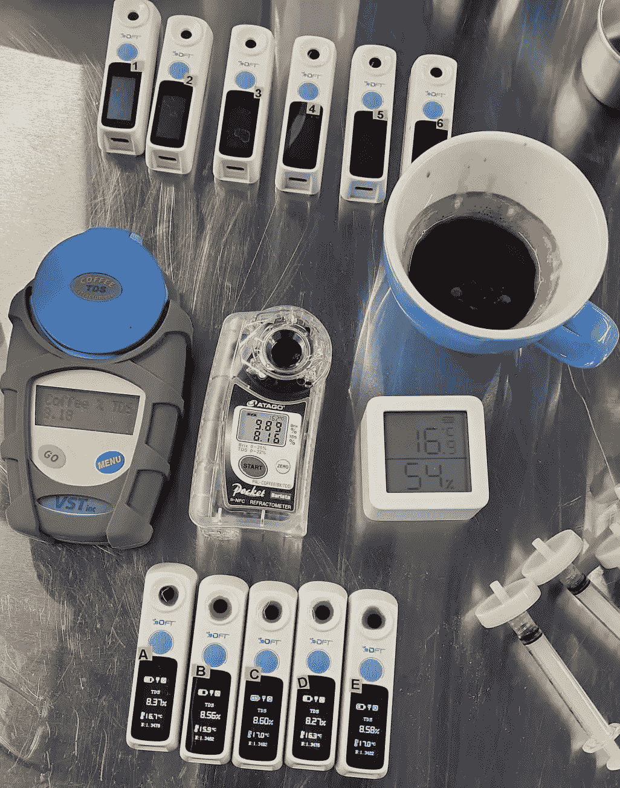
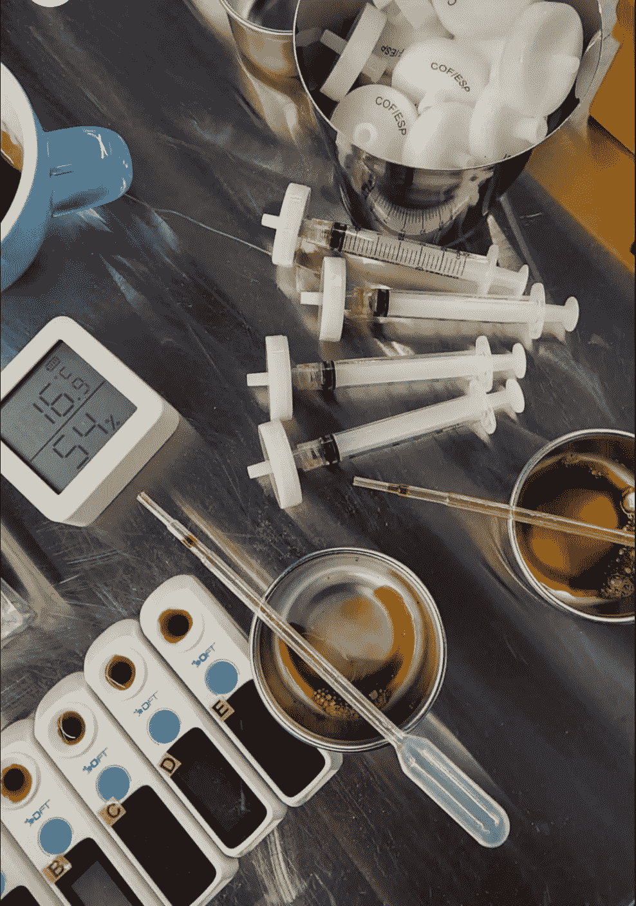
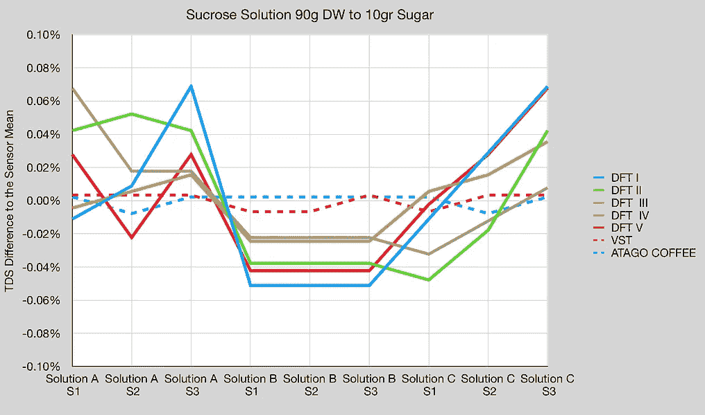
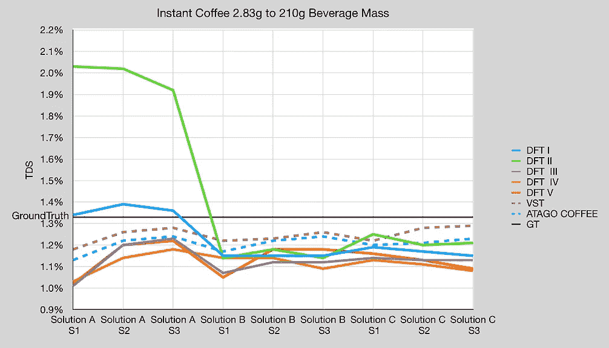
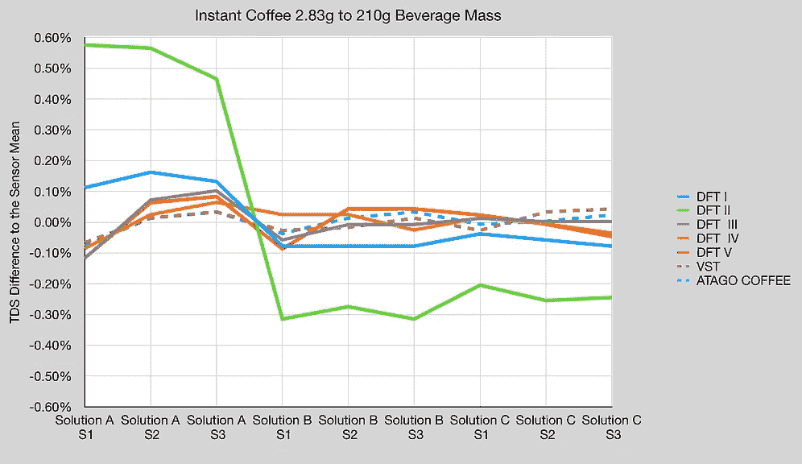
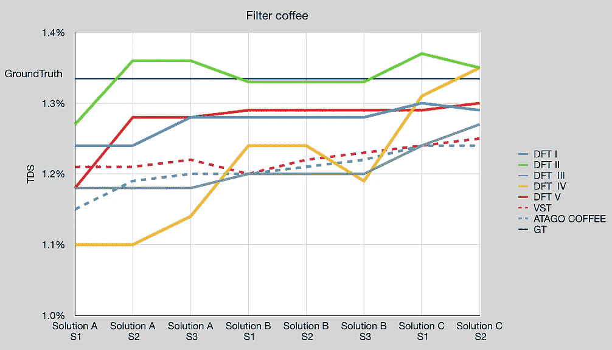
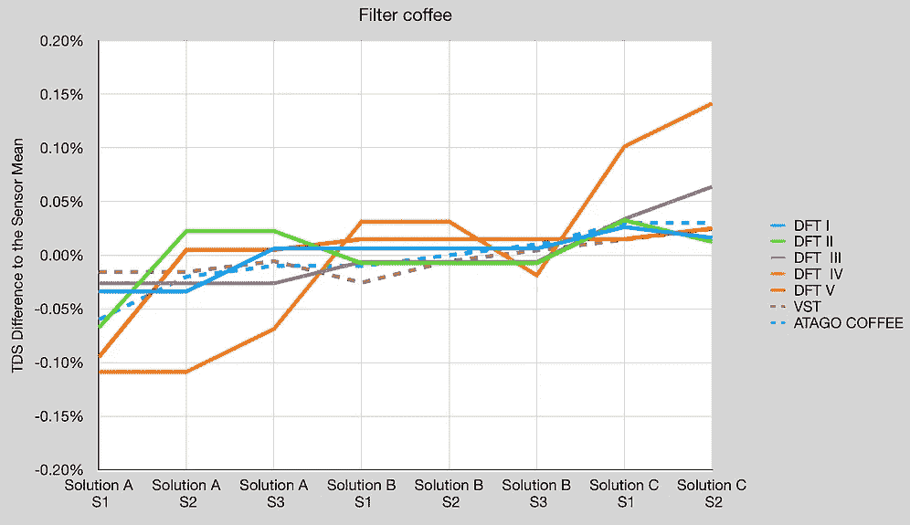
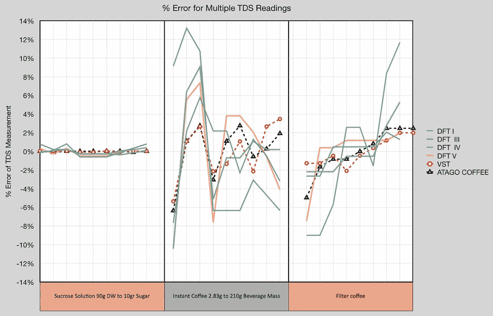
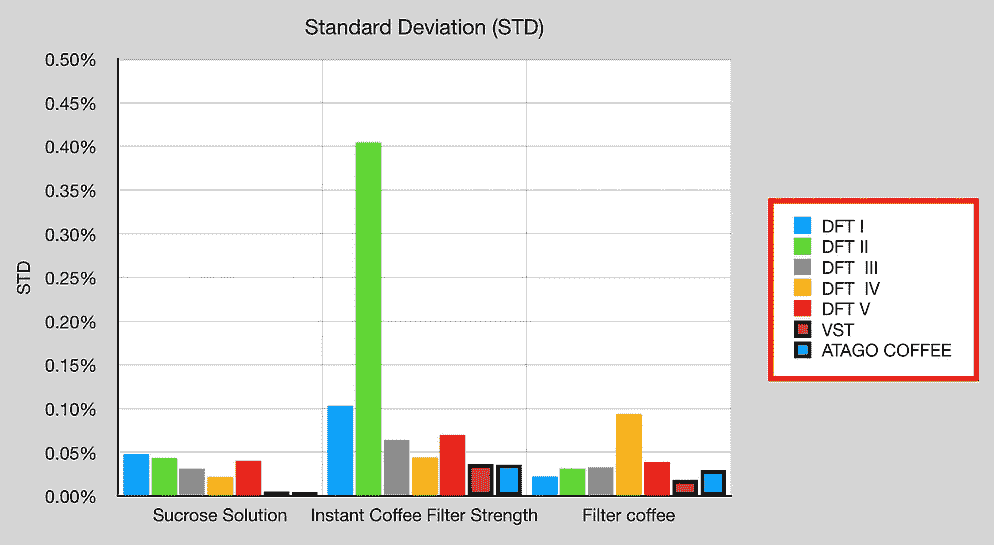
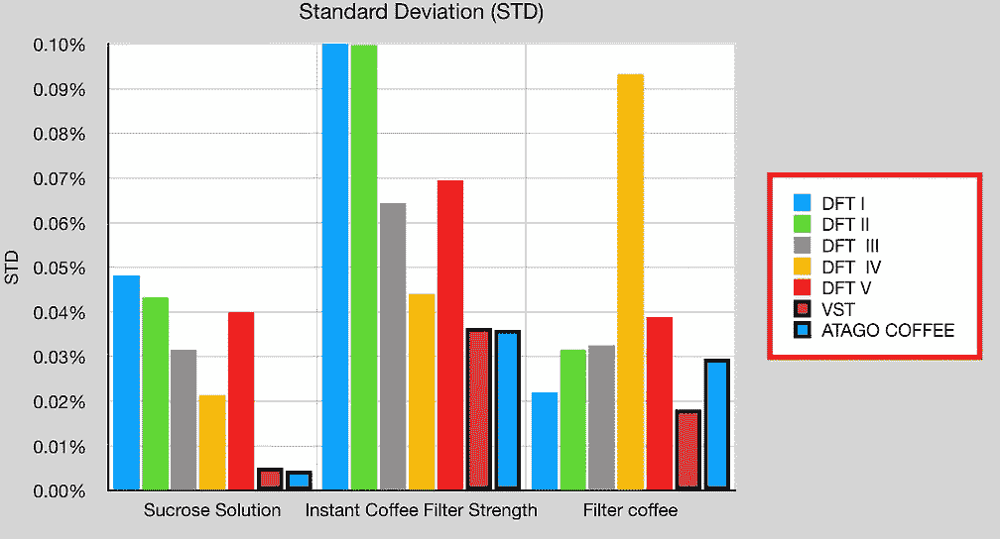

# 反思折射仪:VST、阿塔戈和迪流体:第一部分

> 原文：<https://towardsdatascience.com/rethinking-refractometers-vst-atago-and-difluid-part-1-b5fdb0e5731e>

## 咖啡数据科学

## 乔、杰里米和罗伯特

在过去的几年里，折光仪越来越多地被那些想要持续冲泡美味咖啡的人所使用，因为这些设备在这个非常主观的领域提供了一个非常宝贵且相对简单的客观指标。然而，缺点是为了实现高准确度和精确度，这对于较低浓度的酿造方法(例如，过滤)尤其重要，这些装置通常花费很多钱。

VST/米斯科和阿塔戈，有着纠结的过去，一直是咖啡领域主要的数字折光仪制造商。一些设备已经试图打入这一领域，声称可以以低得多的价格获得相当的性能——最近(也是积极营销的)是 DiFluid 公司的不可否认的可爱的折射计。随着咖啡社区[的许多人](https://rmckeon.medium.com/a-response-to-lance-hedricks-video-on-the-ultimate-guide-to-refractometry-55a793da8488)开始测试这款设备([包括我](https://rmckeon.medium.com/difluid-vs-atago-for-total-dissolved-solids-tds-in-espresso-d474614ad66f))，与 VST 和 Atago 更成熟的设备相比，双流体折光仪的准确度和精确度一直存在争议。

**进入** : [苏格拉底咖啡](https://www.instagram.com/socraticcoffee)。Socratic Coffee 已经收集并继续收集大量关于咖啡评估和制备设备的数据，包括 DiFluid(这里缩写为 DFT)。通过与他们合作，我们在这里展示了他们的一些数据，看看是否可以帮助我们更好地了解 DFT 设备在评估咖啡浓度方面的性能。

所有图片由作者提供

正如专业咖啡社区的许多讨论一样，得出基于经验的结论的最大挑战是获得高质量的数据。获得设备和必要的供应品是一个很大的障碍，设置和执行一个设计良好的测试协议也是如此。此外，不熟悉实验方法和数据分析技术会导致得出不恰当的结论。

例如，当涉及到咖啡相关折光率仪之间的比较测试时，收集数据的人通常只有 1 个 DFT 和 1 个 Atago 或 VST。在我之前对折光率仪的一些研究中，我认为我们可能没有充分认识到使用折光率仪评估咖啡可溶性的复杂性，这一新数据将我引向另一个问题:制造差异。

当在大规模生产中做任何事情时，必须进行质量控制，以确保设备符合某些规格。这很难做好，即使做得很好，来自同一制造商的设备之间也可能存在差异。例如，很有可能我的 DFT 器件与我的 Atago 相比表现良好，而其他人的 DFT 器件与不同的 Atago 或 VST 相比表现不佳。

谁是对的？假设两组数据都是以相当的严谨性和方法控制收集的，那么两组数据都可以证明他们的观点。需要指出的是，Atago 和 VST 都提供校准证书(Atago 符合 ISO 标准；VST 至 NIST 标准)。DFT 似乎不提供这种服务。

这里提供的数据的简要总结表明了两件事:

1.  让来自同一制造商的多种设备测试设备间的可变性是很重要的。
2.  我们需要更好地理解和评价使用光衍射来测量咖啡可溶性含量的局限性。

因为这里有大量的数据需要消化，所以为了便于演示，我们将其分成几个部分。

# 数据

数据分三批收集，涵盖 16 台 DFT 设备、1 台 VST、1 台 Atago Coffee 和 1 台 Atago RX-5000i。每批使用不同组的 DFT 装置(分别为 5、6 和 5)。此外，一些样品用水分天平进行了分析，提供了一个地面实况测量。使用了几种解决方案，每种都提供了不同的见解:

1.  蔗糖溶液(白利糖度测量的基础；公认的规范性数据；硬件的“干净”评估)
2.  浓度为**浓缩咖啡**的速溶咖啡(高咖啡可溶浓度，不可溶物干扰最小；蔗糖增加了难度，需要软件将折光率读数转换为咖啡可溶物)
3.  **过滤器**浓度的速溶咖啡(低咖啡可溶物浓度，不可溶物干扰最小；与速溶咖啡相比，信号强度降低，但与现实解决方案相比，噪音相对较低，因为速溶咖啡几乎完全是咖啡可溶物— 99.9%)
4.  **浓缩咖啡**(高咖啡可溶浓度的真实世界应用；噪声增加但信号强的困难测试解决方案)
5.  **过滤**咖啡(低咖啡可溶物浓度的实际应用；最困难的测试解决方案，信号减少，噪声增加，测试硬件和软件的鲁棒性)

应该注意的是，并不是所有的测试集都使用了所有这些解决方案。在测试中，一些样品用注射器过滤器过滤，一些没有，但在图表中有明确说明。在收集的每组数据之间校准设备。

在本文中，我们将研究蔗糖溶液、速溶咖啡的过滤强度和过滤咖啡。

# 分析

用**蔗糖**制成三种相同浓度的溶液，从每种溶液中取三个样品。我们看到 VST 和 Atago 非常接近地面实况，样本之间的差异非常小。DFT 器件始终显示出样品之间的更大差异。

我们可以查看所有样本中每个设备的均值差异。大多数 DFT 器件彼此之间具有相似的方差，并且该方差高于 VST 或 Atago。蔗糖是折光仪测试中使用的绝佳解决方案，因为它由单一可溶性物质(糖)组成，允许我们检查硬件在最简单的解决方案中提供折光读数的能力。

转到**过滤咖啡**，我们有**速溶咖啡**在**过滤**强度。在这个测试中，VST 和 Atago 更接近地面真相，但是一些 DFT 设备的样本差异更接近 VST 的差异。DFT II 的读数与其他的不同。

地面实况是 1.33% TDS (2.83/212.83)

当我们从速溶咖啡转向冲泡过滤咖啡时，故事发生了一点变化。有趣的是，关于地面真相，一个 DFT 设备(DFT II)似乎跟踪最近。VST 和 Atago 的表现彼此相似，这表明在这两种设备中的折光率-咖啡可溶性相关算法有显著的相似性。

查看这些设备，人们可能会获得类似 DFT II 的设备，并确定它与 VST 或 Atago 设备相比有显著差异。或者，人们可以获得类似 DFT III 的设备，并确定它在测试中与 VST 或 Atago 一样准确。

DFT 设备彼此之间存在差异，有些设备的差异类似于 VST 或 Atago。

最后，对于这三个测试，我们可以更全面地观察错误率百分比。这是读数的差值除以读数，这样我们就可以比较这三者。蔗糖的误差最小，而速溶咖啡和过滤咖啡的误差很大，即使是 Atago 和 VST 也是如此。

我们可以把标准差看作是方差的度量，除了实际过滤咖啡，阿塔哥和 VST 的标准差更低。这些结果令人困惑，因为它们并不明确。

左:满刻度，右:放大

# 讨论

我们有意不提供任何数据的统计分析，因为测试中只使用了一台 VST 和一台 Atago 设备。Socratic Coffee 之前报道了他们对多种 VST 和 Atago 设备的测试。从这些测试中最大的收获之一是，即使对于“黄金标准”设备 VST 和 Atago，单个样品的读数也可能不同。

然而，对于许多人来说，这些误差率可能不会造成重大问题，因为折光率是作为一种客观指标与其他指标结合使用，以实现一致性和所需的口味特征。普通咖啡师很可能不需要 VST 或 Atago 级别的性能，考虑到 DiFluid 的大小和价格，它可能是一个有吸引力的选择。

然而，这只是数据冰山的一角。让我们继续查看更多数据，并深入探究。

如果你愿意，可以在推特、 [YouTube](https://m.youtube.com/channel/UClgcmAtBMTmVVGANjtntXTw?source=post_page---------------------------) 和 [Instagram](https://www.instagram.com/espressofun/) 上关注我，我会在那里发布不同机器上的浓缩咖啡照片和浓缩咖啡相关的视频。你也可以在 [LinkedIn](https://www.linkedin.com/in/dr-robert-mckeon-aloe-01581595) 上找到我。也可以关注我在[中](https://towardsdatascience.com/@rmckeon/follow)和[订阅](https://rmckeon.medium.com/subscribe)。

# [我的进一步阅读](https://rmckeon.medium.com/story-collection-splash-page-e15025710347):

[我未来的书](https://www.kickstarter.com/projects/espressofun/engineering-better-espresso-data-driven-coffee)

[我的链接](https://rmckeon.medium.com/my-links-5de9eb69c26b?source=your_stories_page----------------------------------------)

[浓缩咖啡系列文章](https://rmckeon.medium.com/a-collection-of-espresso-articles-de8a3abf9917?postPublishedType=repub)

工作和学校故事集