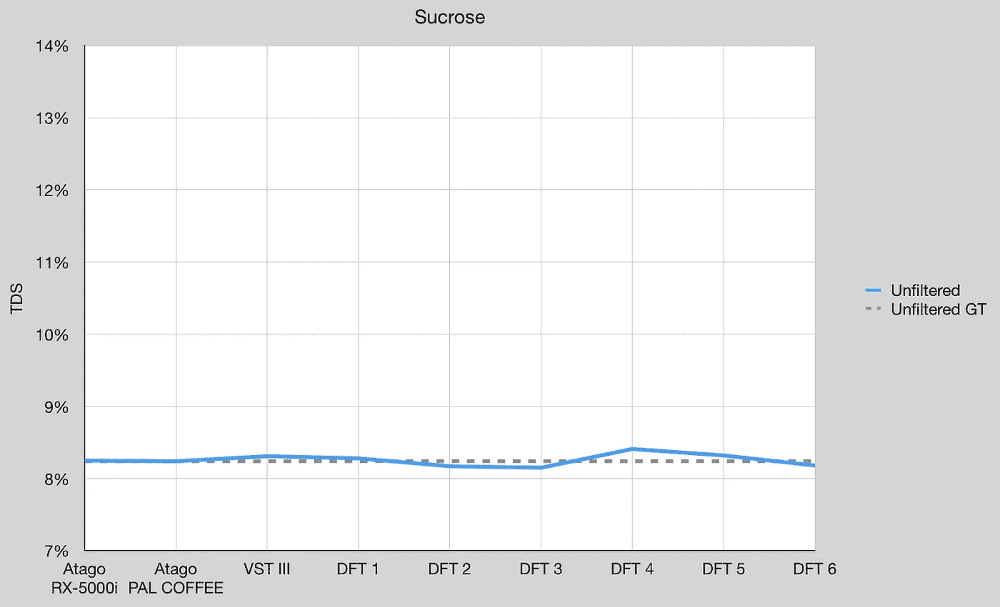
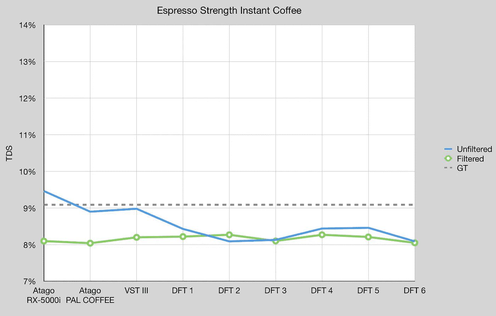
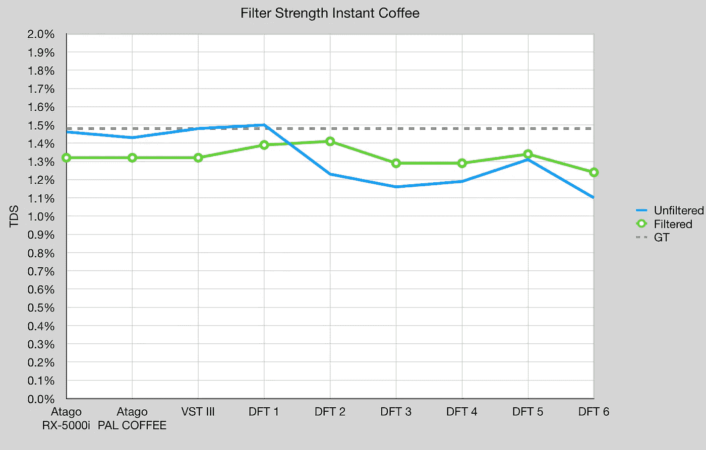
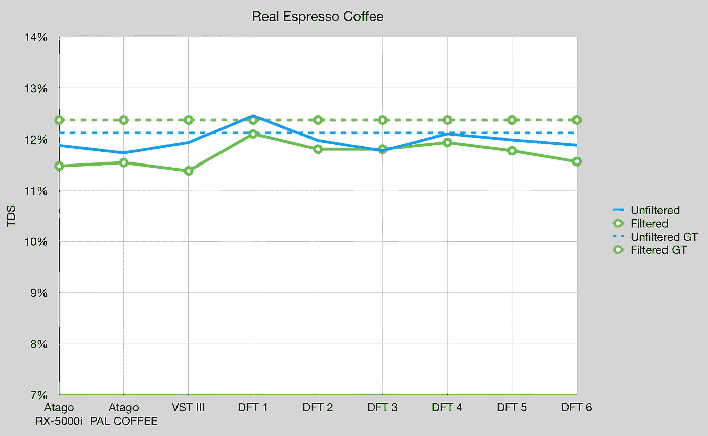
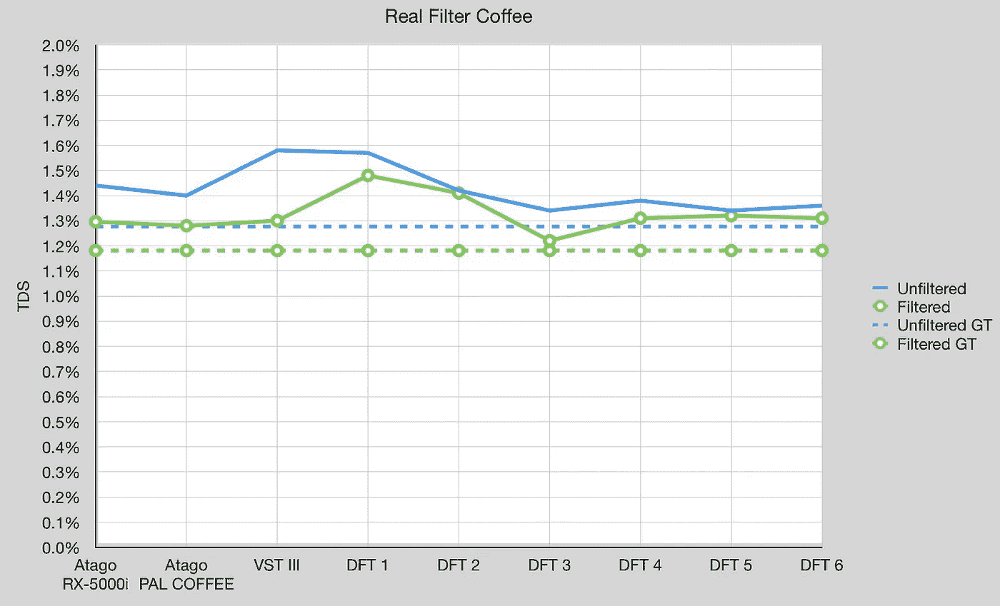
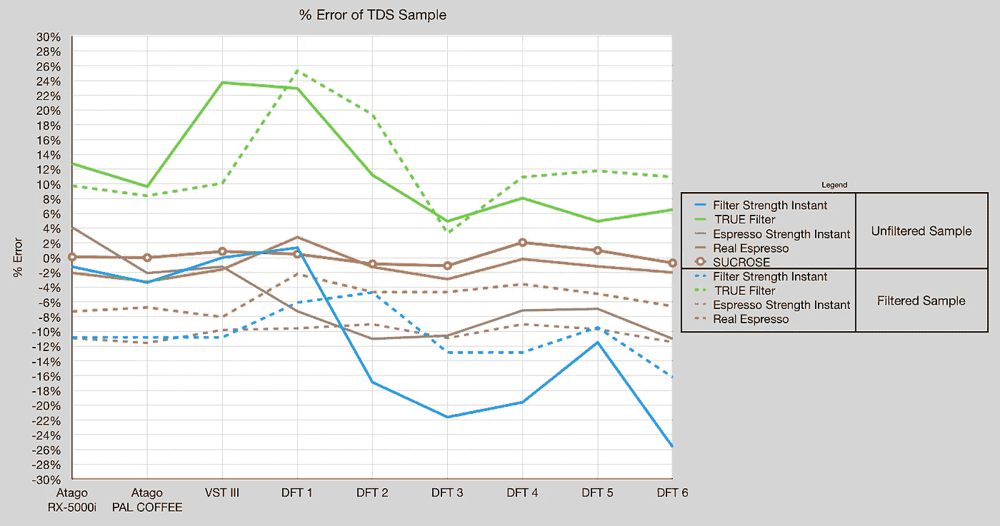

# 反思折射仪:VST、阿塔戈和迪流体:第二部分

> 原文：<https://towardsdatascience.com/rethinking-refractometers-vst-atago-and-difluid-part-2-2aadd3c60c52>

## 咖啡数据科学

## 罗伯特、乔和杰里米

这是评估 DiFluid (DFT)数字折光仪与 VST 和 Atago 折光仪系列的第二篇文章。折射仪已经被用于通过关联咖啡在特定温度下的折射率变化来确定咖啡中的总溶解固体(TDS)。虽然它们是最常用的咖啡折光仪，但 VST 和 Atago 设备也是最昂贵的。DiFluid 最近以更低的价格和更小的尺寸出现在市场上。社区中各种人的早期测试已经从 DFT 中产生了有趣的结果，但是，正如我们从[第 1 部分](/rethinking-refractometers-vst-atago-and-difluid-part-1-b5fdb0e5731e)中得出的结果，设备之间似乎存在显著的、不可预测的可变性。

Socratic Coffee 在多套 DFT 设备上收集数据。该测试的主要目的是了解这些设备对地面实况(即通过水分天平直接测量的咖啡可溶物)的精确度。此外，该测试结合了不同信号+噪声的不同解决方案。通过这些数据，我们对测量的复杂性和使用折光率推断溶解固体含量的困难有了更好的了解。

作者提供的所有图片

# 数据

数据分三批收集，涵盖 16 台 DFT 设备、1 台 VST、1 台 Atago Coffee 和 1 台 Atago RX-5000i。每批使用不同组的 DFT 装置(分别为 5、6 和 5)。此外，一些样品用水分天平进行了分析，提供了一个地面实况测量。使用了几种解决方案，每种都提供了不同的见解:

1.  蔗糖溶液(白利糖度测量的基础；公认的规范性数据；硬件的“干净”评估)
2.  **浓缩咖啡**浓度的速溶咖啡(高咖啡可溶物浓度，不可溶物干扰最小；蔗糖增加了难度，需要软件将折光率读数转换为咖啡可溶物)
3.  **过滤器**浓度的速溶咖啡(低咖啡可溶物浓度，不可溶物干扰最小；与速溶咖啡相比，信号强度降低，但与现实世界的解决方案相比，噪音相对较低，因为速溶咖啡几乎完全是咖啡可溶物——99.9%
4.  **浓缩咖啡**(高咖啡可溶浓度的真实世界应用；噪声增加但信号强的困难测试解决方案)
5.  **过滤**咖啡(低咖啡可溶物浓度的实际应用；最困难的测试解决方案，信号减少，噪声增加，测试硬件和软件的鲁棒性)

应该注意的是，并不是所有的测试集都使用了所有这些解决方案。在测试中，一些样品用注射器过滤器过滤，一些没有，但在图表中有明确说明。

在本文中，我们将查看所有五种解决方案，这组数据包含过滤和未过滤的样本。

# 分析

我们将从最理想的情况开始，蔗糖，然后转向过滤咖啡(由于 TDS 低，这是最困难的)。对于蔗糖，不同设备之间仍有差异，但它们非常接近 TDS。应该注意的是，所有关于地块的陈述都只是从数据中观察到的事实。y 轴设置在一个范围内，包括从 espresso 到过滤器强度的所有结果，而不是试图推断更一般化结果的推理分析。

Atago RX-5000i 的 TDS 结果最初以白利糖度为单位，并使用 Atago Pal 咖啡数据进行转换。对于每个读数，Atago Pal 咖啡给出白利糖度和 TDS，因此我们使用这个比率将 Atago RX-5000i 从白利糖度转换为 TDS。应该注意的是，所有这些器件在输出方面都有一些共性，但不是全部。Atago RX-5000i 只有 Brix，Atago Pal 咖啡有 Brix 和咖啡 TDS，DFT 有咖啡 TDS 和 nd(折光率)。

对于浓缩速溶咖啡，我们有一个过滤和未过滤的额外数据集。DFT 传感器的结果在过滤或未过滤的情况下匹配良好，但与实际情况有偏差。奇怪的是，两个 Atago 传感器和 VST 传感器在这种强度下得到更好的结果。

转到过滤强度速溶咖啡，未过滤的仍然表现更好，但只有一个 DFT 表现类似于非 DFT 设备。DFT 器件之间也有更多的可变性。

对于真正的浓缩咖啡，我们看到所有传感器都偏离了地面实况。DFT 器件的性能与其他器件非常相似。过滤后的结果具有更高的背景真实性，但是对于设备来说具有更低的 TDS。对于地面实况，这是使用湿度天平完成的，但只取了一个样本(由于时间限制；一个样品需要一个小时)。

现在，在最难衡量的方面，我们看到跨设备的高估。过滤遵循与之前相似的趋势，但是基础事实在样本之下而不是之上。过滤后的地面真相比未过滤的低，与之前相反，这很奇怪，但需要更多的数据才能更好地理解。

最后，我们可以查看这些不同类型的 TDS 样本的百分比误差。蔗糖表现最好，VST 和 Atago 几乎不相上下。DFT 有一些变化，但有些器件更接近。

这个数据集是各种咖啡的一个很好的样本。然而，
折光仪上的数据似乎指出了咖啡饮料的复杂性。应该对它们进行更好的研究，因为不同咖啡种类之间的差异比以前认为的更加微妙。看到过滤样本的明显影响也很奇怪，这是苏格拉底式咖啡在之前已经研究过的。正如他们的工作所表明的，过滤样品似乎比简单地去除噪音以提高折光率读数更复杂。

如果你愿意，可以在 [Twitter](https://mobile.twitter.com/espressofun?source=post_page---------------------------) 、 [YouTube](https://m.youtube.com/channel/UClgcmAtBMTmVVGANjtntXTw?source=post_page---------------------------) 和 [Instagram](https://www.instagram.com/espressofun/) 上关注我，我会在那里发布不同机器上的浓缩咖啡照片和浓缩咖啡相关的视频。你也可以在 [LinkedIn](https://www.linkedin.com/in/dr-robert-mckeon-aloe-01581595) 上找到我。也可以在[中](https://towardsdatascience.com/@rmckeon/follow)关注我，在[订阅](https://rmckeon.medium.com/subscribe)。

# [我的进一步阅读](https://rmckeon.medium.com/story-collection-splash-page-e15025710347):

[我未来的书](https://www.kickstarter.com/projects/espressofun/engineering-better-espresso-data-driven-coffee)

[我的链接](https://rmckeon.medium.com/my-links-5de9eb69c26b?source=your_stories_page----------------------------------------)

[浓缩咖啡系列文章](https://rmckeon.medium.com/a-collection-of-espresso-articles-de8a3abf9917?postPublishedType=repub)

工作和学校故事集