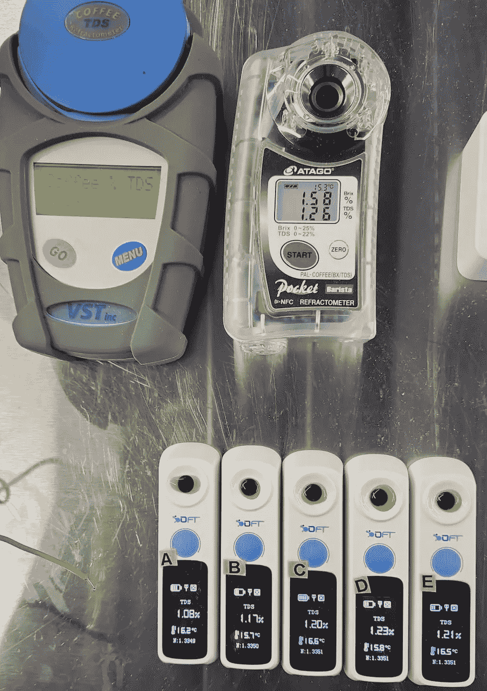
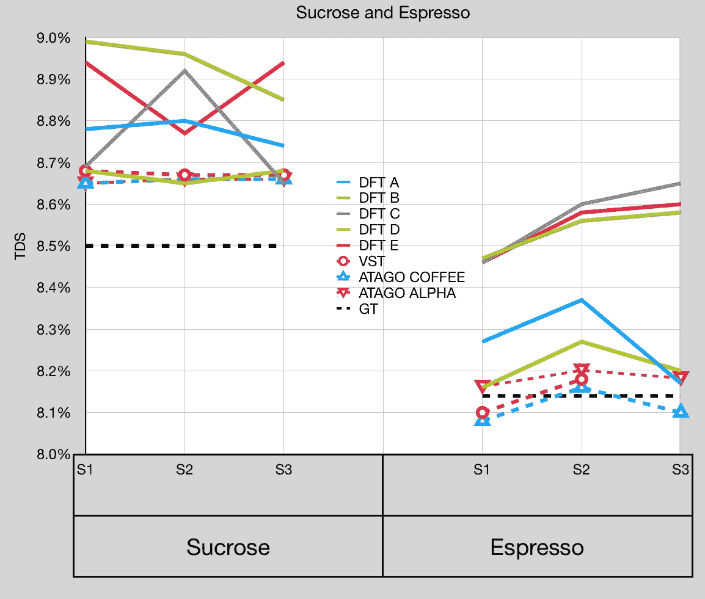
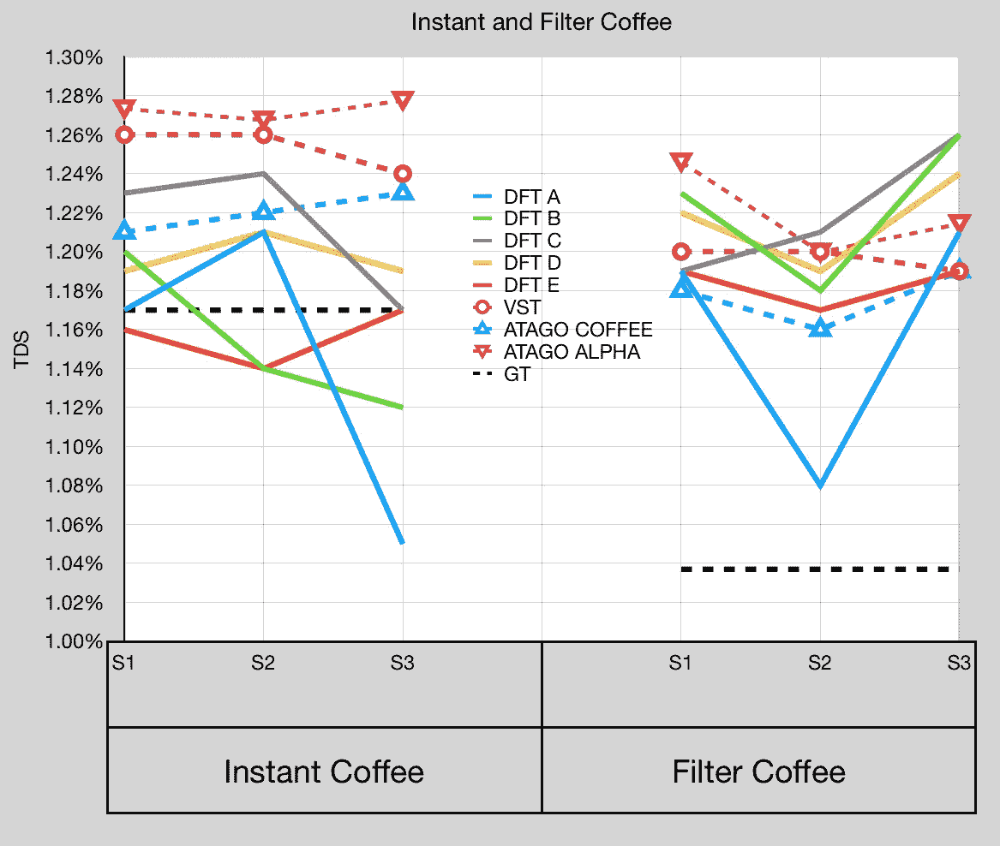

# 反思折射仪:VST、阿塔戈和迪流体:第三部分

> 原文：<https://towardsdatascience.com/rethinking-refractometers-vst-atago-and-difluid-part-3-e272ad081a81>

## 咖啡数据科学

## 作者:罗伯特、乔和杰里米

我们还有一个来自另一组 DFT 设备的[数据](https://instagram.com/socraticcoffee?igshid=YmMyMTA2M2Y=)。我们之前看了[两个](/rethinking-refractometers-vst-atago-and-difluid-part-1-b5fdb0e5731e)其他[批次](/rethinking-refractometers-vst-atago-and-difluid-part-2-2aadd3c60c52)的设备和实验。这些测试凸显了使用单个设备了解折光率仪性能以及不同设备性能的难度。

另一个变得越来越明显的挑战是，即使是像 VST 和 Atago 这样众所周知且经过校准的设备，也很难测量性能。这并不意味着折光仪在咖啡中没有多大用处，但我们需要更好地了解它们的读数，以及如何从读数中推断出总溶解固体(TDS)含量。

所有图片由作者提供

# 数据

数据分三批收集，涵盖 16 台 DFT 设备、1 台 VST、1 台 Atago Coffee 和 1 台 Atago RX-5000i。每批使用不同组的 DFT 装置(分别为 5、6 和 5)。此外，一些样品用水分天平进行了分析，提供了一个地面实况测量。使用了几种解决方案，每种都提供了不同的见解:

1.  蔗糖溶液(白利糖度测量的基础；公认的规范性数据；硬件的“干净”评估)
2.  浓度为**浓缩咖啡**的速溶咖啡(高咖啡可溶物浓度，不可溶物干扰最小；蔗糖增加了难度，需要软件将折光率读数转换为咖啡可溶物)
3.  **过滤器**浓度的速溶咖啡(低咖啡可溶物浓度，不可溶物干扰最小；与速溶咖啡相比，信号强度降低，但与现实世界的解决方案相比，噪音相对较低，因为速溶咖啡几乎完全是咖啡可溶物——99.9%
4.  **浓缩咖啡**(高咖啡可溶物浓度的实际应用；噪声增加但信号强的困难测试解决方案)
5.  **过滤**咖啡(低咖啡可溶物浓度的实际应用；最困难的测试解决方案，信号减少，噪声增加，测试硬件和软件的鲁棒性)

应该注意的是，并不是所有的测试集都使用了所有这些解决方案。在测试中，一些样品用注射器过滤器过滤，一些没有，但在图表中有明确说明。

在本文中，我们将研究所有四种解决方案:两种浓缩咖啡浓度，两种过滤浓度。

# 数据

每个样品对同一溶液有三个读数。阿塔哥咖啡，VST 和阿塔哥阿尔法趋势很好地结合在一起，但正如以前的实验表明，蔗糖对折射率有更清洁的影响。与其他实验类似，人们可以得到一个类似 DFT D 的装置，其精度非常接近 VST/阿塔戈。

更具挑战性的情况是过滤咖啡。VST、阿塔哥阿尔法和阿塔哥咖啡也有些许不同。速溶咖啡实验中的 DFT 设备更接近地面真相，这很奇怪，尽管样本数量太少，无法进行任何统计分析。

对于速溶咖啡来说，所有的样本都离地面真相很远，但彼此很接近。这可能表明在 VST 和阿塔哥咖啡中使用的转换算法试图解释一些信号噪声(阿塔哥阿尔法的读数被转换为 TDS，使用从 VST 和阿塔哥咖啡读数导出的公式，因此使用咖啡相关折光仪进行跟踪是可以预期的)。

这些折光仪的结果指出了咖啡如何影响折光率的一些基本差异。这种差距的一部分可能只是简单的校准问题，但在这些实验中，在测试开始时非常小心地校准了所有设备。该数据还表明，需要多个硬件样品来真正评估任何给定折光率仪的实用性。

如果你愿意，可以在推特、 [YouTube](https://m.youtube.com/channel/UClgcmAtBMTmVVGANjtntXTw?source=post_page---------------------------) 和 [Instagram](https://www.instagram.com/espressofun/) 上关注我，我会在那里发布不同机器上的浓缩咖啡照片和浓缩咖啡相关的视频。你也可以在 [LinkedIn](https://www.linkedin.com/in/dr-robert-mckeon-aloe-01581595) 上找到我。也可以关注我在[中](https://towardsdatascience.com/@rmckeon/follow)和[订阅](https://rmckeon.medium.com/subscribe)。

# [我的进一步阅读](https://rmckeon.medium.com/story-collection-splash-page-e15025710347):

[我的书](https://www.kickstarter.com/projects/espressofun/engineering-better-espresso-data-driven-coffee)

[我的链接](https://rmckeon.medium.com/my-links-5de9eb69c26b?source=your_stories_page----------------------------------------)

[浓缩咖啡系列文章](https://rmckeon.medium.com/a-collection-of-espresso-articles-de8a3abf9917?postPublishedType=repub)

[工作和学校故事集](https://rmckeon.medium.com/a-collection-of-work-and-school-stories-6b7ca5a58318?source=your_stories_page-------------------------------------)