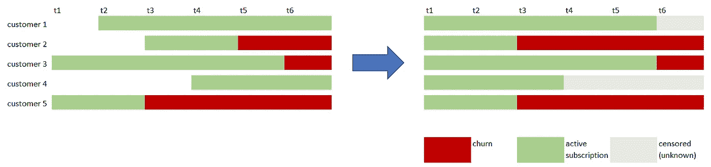
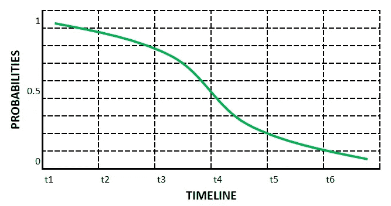
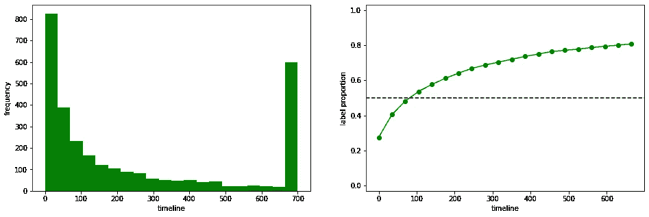
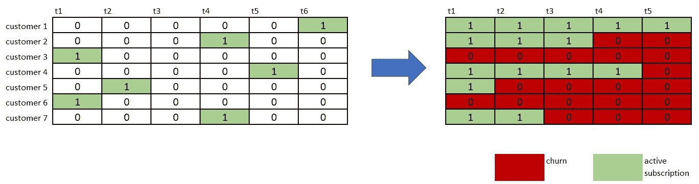
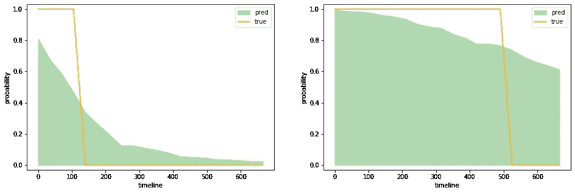
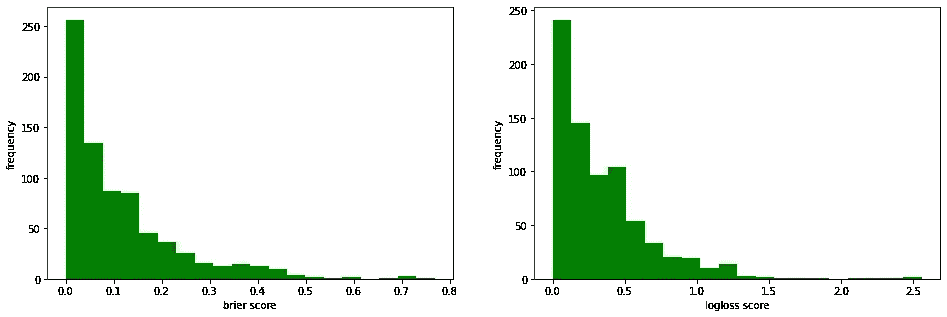

# 反思生存分析:如何让你的模型产生生存曲线

> 原文：<https://towardsdatascience.com/rethinking-survival-analysis-how-to-make-your-model-produce-survival-curves-7a9ef112e2af>

## 使用简单的 ML 方法预测事件时间


马库斯·斯皮斯克在 [Unsplash](https://unsplash.com?utm_source=medium&utm_medium=referral) 上的照片

在数据驱动的公司中，*事件时间*应用程序在决策中扮演着至关重要的角色(也超出了我们的想象)。**对于*事件时间分析*，我们指的是所有用于测量一些感兴趣的事件发生之前所经过的时间的技术**。这个简单的定义可能会立即概括出在业务环境中开发时间事件应用程序的所有好处(不仅仅是好处)。

时间-事件起源与医学领域相关，以回答诸如“被分析的个体能活多久？”。出于这个原因，术语*生存*和*事件发生时间*通常被用作同义词。如今，**随着机器学习的大规模采用，在医疗/临床部门以外的公司中也经常会发现生存方法学的应用**。制造商可能对估计某些发动机的预期寿命感兴趣；服务提供商可能需要计算其客户的预期寿命；金融机构可以评估借款人在一段时间内的破产风险。

**实际上，要对事件时间问题建模，有一套合适的方法**。从经典的线性统计方法到更复杂的机器学习方法，再到前沿的深度学习解决方案，已经发布了大量的*生存框架*。他们都很棒，但是他们必须尊重生存建模理论的假设，这可能会导致低适应性或对实际用例的限制。出于这些原因，**一种处理生存分析的便捷方法可能包括将时间-事件建模作为一个分类问题**。这个想法并不新鲜，在这两部作品[ [1](https://arxiv.org/pdf/1909.11171.pdf) ]、[ [2](https://proceedings.neurips.cc/paper/2011/file/1019c8091693ef5c5f55970346633f92-Paper.pdf) ](帖子底部的引文)中也能找到。

在这篇文章中，我们提出了一个用预测能力进行生存分析的概括。**我们的目标是将起始时间和感兴趣的事件之间的经过时间建模为多重二进制分类问题**。通过适当和简单的后处理，我们可以获得可靠和稳健的个体生存曲线。**我们可以使用我们最喜欢的分类算法**，像往常一样搜索参数，并考虑校准我们的结果的可能性，使它们更可信。

# 数据

安排我们处理的数据来实现一个生存预测应用程序是简单的，不需要特别的努力。我们必须有一些输入特征(数字或分类)和一个原始目标，就像在标准回归/分类表格任务中一样。在这种情况下，**目标表示*从监控开始到事件发生*** 经过了多长时间。



事件时间网格(在左侧)。已排序的事件时间网格(在右侧)。[图片由作者提供]

让我们想象成为一家提供在线订阅服务的公司。我们可能对计算客户在订阅时的预期寿命感兴趣。换句话说，当一个新客户登陆我们的平台并订阅获取服务时，我们想知道她/他还会成为我们的客户多久。我们可以通过开发一种输出概率生存曲线(每个客户一条)的生存方法来完成这项任务。**生存曲线是单调概率的序列**。对于每个时间步，我们有 0 到 1 之间的数字，表示在特定时间范围内某些事件(在我们的例子中是订阅)的生存可能性。



生存函数的图形表示。[图片由作者提供]

我们模拟了一些数字输入特征和一个目标，该目标代表了从第一次订阅开始个人保持我们的客户的时间。从我们的模拟中，我们观察到大多数客户在参与后的第一阶段就离开了(下图的左侧)。对于大多数公司来说，这是一种可靠的动态，在这种情况下，很多客户会在一段时间后流失。相反，我们有一群忠实的订户，他们仍然是我们服务的用户(下图右侧)。在我们的例子中，我们将最大可观察订阅时间限制为 700 个周期(比如说几天)。为了使我们的方法有效，这个假设是强制性的。



事件时间分布(左侧)。二进制标签比例(右侧)。[图片由作者提供]

# 建模

我们开始将离开时间宁滨成规则长度的组(箱)。对于分析中的每个客户，我们最终都有一个标准化的分类目标，其中几个唯一的类等于所创建的箱的数量。在这一点上，我们可以**用一热编码转换目标，产生一个 0 和 1 的多维二进制目标**。一个识别我们的客户离开的时间范围(离开箱子)。作为最后一步，我们必须在目标序列中，在“离开库”之前用左边的 1 替换 0。这最后一步很重要，它在准备建模的目标中提供了一个临时路径，其中零标识了客户所处的时间范围。



一键编码入库事件时间(左侧)。累积独热编码入库事件时间(右侧)。[图片由作者提供]

现在，我们已经以正确的格式获得了所有需要的东西。我们有一组特性和一个多维二元目标。换句话说，我们只需解决一个多维二元分类任务。解决它的一种可能性在于使用本地 scikit-learn 方法( [*分类链*](https://scikit-learn.org/stable/modules/generated/sklearn.multioutput.ClassifierChain.html) )。

```
from sklearn.multioutput import ClassifierChain
from sklearn.linear_model import LogisticRegression

model = ClassifierChain(
  LogisticRegression(random_state=33, max_iter=2000), cv=5
)
model.fit(X_train, y_train)
```

使用分类器链，**我们将多输出分类目标建模为独立但相关的二元分类任务**。我们之所以说依赖，是因为上一步的输出与初始特征连接在一起，并用作链中下一次训练的输入。

在训练阶段之后，我们以一组相关的二元分类器结束。它们中的每一个都提供了一个概率结果，这是构建最终个体生存曲线的一部分。概率肯定在 0 和 1 之间，但是不能保证生存函数的单调约束。换句话说，**第一时间区间中的生存概率必须高于在随后的时间范围**中获得的生存概率。为了满足这一要求，我们在客户级别对分类器链获得的概率进行后处理操作。

```
from sklearn.isotonic import IsotonicRegression
from joblib import Parallel, delayed

isoreg = IsotonicRegression(y_min=0, y_max=1, increasing=True)
x = np.arange(0, n_bins)

proba = model.predict_proba(X_test)

proba = Parallel(n_jobs=-1, verbose=1)(
    delayed(isoreg.fit_transform)(x, p) 
    for p in proba
)
proba = 1 - np.asarray(proba)
```

简单地**对最终概率应用保序回归，我们获得单调生存曲线作为最终输出**。



预测生存曲线的样本。[图片由作者提供]

最后，我们可以像在标准监督任务中一样，使用我们感兴趣的度量来测量误差。我们可以使用例如 Brier 评分或更标准的逻辑损失。

```
from sklearn.metrics import brier_score_loss, log_loss

brier_scores = Parallel(n_jobs=-1, verbose=1)(
  delayed(brier_score_loss)(true, pred, pos_label=1) 
  for true,pred in zip(y_test,proba)
)

logloss_scores = Parallel(n_jobs=-1, verbose=1)(
  delayed(log_loss)(true, pred, labels=[0,1]) 
  for true,pred in zip(y_test,proba)
)
```



测试数据的 Brier 分数分布(左侧)。测试数据的对数损失分布(在右边)。[图片由作者提供]

# 摘要

在这篇文章中，我们介绍了一种简单有效的方法，用我们选择的标准机器学习分类器来生成生存曲线。我们发现，我们可以通过将观察到的失败时间建模为二元目标序列来预测存活曲线。通过简单的概率后处理，我们获得了可靠的概率输出。所提出的方法可以很容易地推广和应用于许多情况下(也考虑删截观察，如果他们的添加是合理的，以提供性能的改善)。

[**查看我的 GITHUB 回购**](https://github.com/cerlymarco/MEDIUM_NoteBook)

保持联系: [Linkedin](https://www.linkedin.com/in/marco-cerliani-b0bba714b/)

## 参考

[1]钟，c；和 Tibshirani，R. (arXiv 2019)。[作为分类问题的生存分析](https://arxiv.org/pdf/1909.11171.pdf)。

[2]余，陈正宁；格雷内尔河；林，香港中文大学；神经信息处理系统进展 24–2011 年第 25 届神经信息处理系统年会。[将患者特异性癌症存活分布作为一系列相关回归变量进行学习](https://proceedings.neurips.cc/paper/2011/file/1019c8091693ef5c5f55970346633f92-Paper.pdf)。