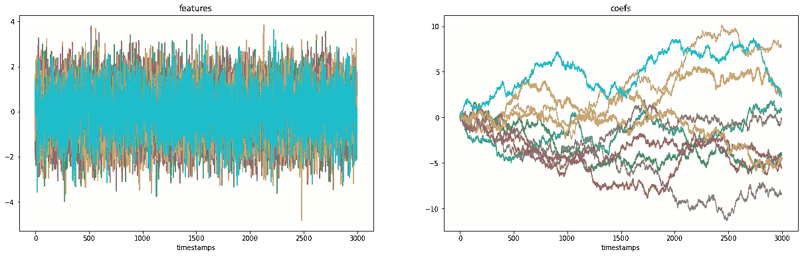
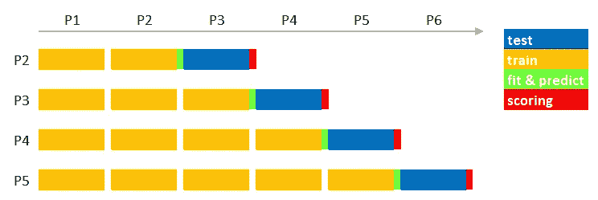
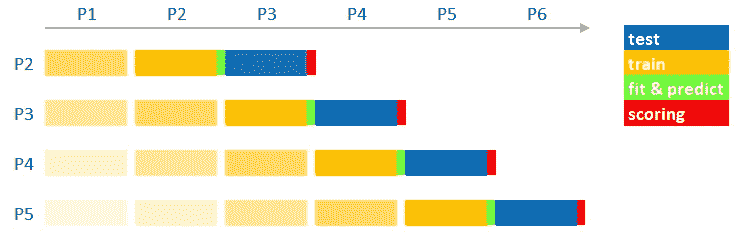
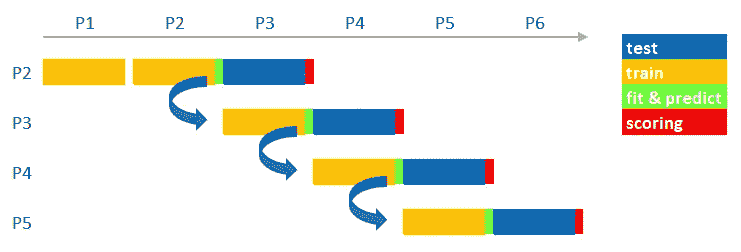
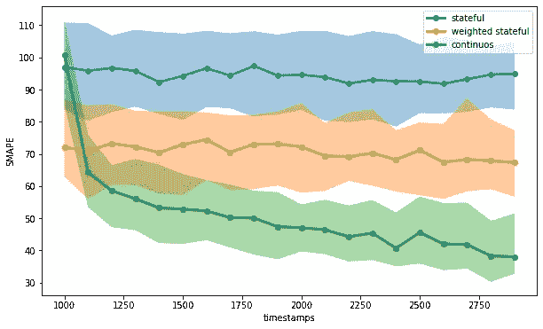
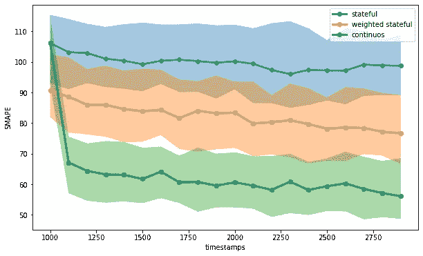

# 再培训，还是不再培训？具有梯度推进的在线机器学习

> 原文：<https://towardsdatascience.com/retrain-or-not-retrain-online-machine-learning-with-gradient-boosting-9ccb464415e7>

## Scikit-Learn 中持续学习的改装策略比较


由 [VD 摄影](https://unsplash.com/@vdphotography?utm_source=medium&utm_medium=referral)在 [Unsplash](https://unsplash.com?utm_source=medium&utm_medium=referral) 上拍摄

训练机器学习模型需要精力、时间和耐心。聪明的**数据科学家组织实验，并对历史数据**进行跟踪试验，以部署最佳解决方案。当我们将新的可用样本传递给我们的预构建机器学习管道时，可能会出现问题。在预测算法的情况下，**记录的性能可能偏离预期的性能**。

差异背后的原因多种多样。除了技术错误之外，**最常见也最令人担忧的原因是数据漂移**。从标准分布转变到偷偷摸摸的多元和概念漂移，我们必须准备处理所有这些情况。

在本帖中，**我们不关注如何检测数据漂移。我们尝试概述如何应对数据漂移**。最近已经引入了许多有趣的工具和新奇的技术来促进数据漂移检测。那很酷，但是之后我们能做什么呢？ ***“改装就是你需要的一切”*** 是用来处理这种情况的最广为人知的口号。换句话说，当新的标记数据变得可用时，我们应该让我们的模型不断地从中学习新的见解。

对于**在线机器学习**，我们指的是一个多步骤的训练过程，以允许我们的算法动态地适应新的模式。如果制作得当，它可能会比从头再训练提供更大的好处(在速度和性能方面)。这正是我们在这篇文章中想要测试的。

# 实验设置

**我们设想在一个流环境中运行**，在这个环境中，我们可以定期访问新的标记数据，计算感兴趣的指标，并重新训练我们的预测模型。

我们模拟了一个概念漂移的场景。我们有一些特征可以保持稳定的分布，并且随着时间的推移保持不变。我们的目标是这些特征的线性组合。每个单一特征对目标的贡献是动态的，并且不是随时间恒定的。



左:模拟特征。右图:模拟系数(图片由作者提供)

在这种情况下，**使用一段时间前训练的相同预测模型可能是无用的**。让我们研究一下我们可以选择的方案。

# 改装是你所需要的

为了了解目标和特征**之间的关系，我们需要经常更新我们的模型**。从这个意义上来说，我们有不同的战略可以选择。

我们可以采用*状态学习*，在这里，我们以一些预定义的时间间隔初始化，用我们处理的数据从头开始训练。我们要做的就是将新样本和历史样本合并。由于我们重新创建了先前拟合的模型，因此不需要存储它。



有状态学习(图片由作者提供)

*状态学习的变体*它是*加权状态学习。它在于给予最新的观察更高的权重。这可能有助于衡量更多的最新数据，并使新模型专注于最新的模式。进行加权训练很简单。许多最新的机器学习算法实现提供了内置的可能性，为每个样本赋予不同的权重。*



加权状态学习(图片由作者提供)

另一方面，我们可以考虑*连续学习*，又名*在线机器学习*。在*连续学习*中，我们使用先前的模型知识来初始化新的训练步骤。我们采用新的可用样本集，并使之前拟合的模型从中学习新的模式。通过更新(而不是重新初始化)模型知识，我们希望获得更好的性能，降低从头开始训练的成本。



持续学习(图片由作者提供)

# 实践中的在线机器学习

所有基于神经网络的算法都支持在线机器学习。我们可以随时通过传递新数据来更新样本损失，从而继续训练过程。

实事求是地说，在 scikit-learn 生态系统中，所有支持`***partial_fit***`方法的算法都可以进行持续学习。在下面的代码片段中，我们介绍了如何用几行代码就能做到这一点。

```
cv = TimeSeriesSplit(n_splits, test_size=test_size)for i,(id_train,id_test) in enumerate(cv.split(X)):
    if i>0:
        model = model.**partial_fit**(
            X[id_train[-test_size:]], y[id_train[-test_size:]]
        )
    else:
        model = SGDRegressor(**fit_params).fit(
            X[id_train], y[id_train]
        )
```

回到我们的实验，我们使用一个`**SGDRegressor**`在我们的模拟数据上测试三个提到的训练策略(*状态学习、加权状态学习、*和*连续学习*)。我们不会只做一次，而是通过模拟不同的场景来做多次，以更好地处理模拟过程中的可变性。我们定期评估 20 个周期的模型，并存储所有模拟场景的预测误差(计算为 SMAPE)。



SGDRegressor 在线机器学习性能(图片由作者提供)

我们可以看到，与其他策略相比，*持续学习*可以实现最佳性能。考虑到最近的观察结果，*加权状态学习*也可以比标准*状态学习*做得更好。

这些结果听起来很有希望。**有没有可能用其他算法做在线机器学习？**我们知道基于树的梯度推进的巨大威力。由于它们在各种情况下的适应性，许多机器学习项目都使用它们。如果能和他们一起操作在线机器学习，那就太好了。

希望我们能做到！和前面的例子一样简单。我们报告了一个片段，其中我们介绍了如何使用`**LGBMRegressor**`来实现它。

```
cv = TimeSeriesSplit(n_splits, test_size=test_size)for i,(id_train,id_test) in enumerate(cv.split(X)):
    if i>0:
        model = LGBMRegressor(**fit_params).fit(
            X[id_train[-test_size:]], y[id_train[-test_size:]],
            **init_model = model.booster_**
        )
    else:
        model = LGBMRegressor(**fit_params).fit(
            X[id_train], y[id_train]
        )
```

让我们在模拟场景中看看它的实际应用。



LGBMRegressor 在线机器学习性能(图片由作者提供)

我们取得了和以前一样令人满意的结果。**如果处理得当，在线机器学习听起来是有效的，并且可用于不同的算法**。

# 摘要

在这篇文章中，我们介绍了在线机器学习的概念。我们探索了不同的*有状态*改装策略，将它们与*持续学习*方法进行比较。在线机器学习在某些应用中被证明是一种很好的测试方法。**做在线机器学习有点艺术**。人们并不认为这可能会提高成绩。高使模型忘记它所学的东西是有风险的( [**灾难性遗忘**](https://en.wikipedia.org/wiki/Catastrophic_interference) )。从这个意义上来说，拥有一个可靠且充分的验证策略比以往任何时候都更加重要。

**如果你对题目感兴趣，我建议:**

*   [**漂移检测 SHAP:有效数据漂移监控**](https://medium.com/towards-data-science/shap-for-drift-detection-effective-data-shift-monitoring-c7fb9590adb0)
*   [**数据漂移可解释性:用 NannyML 进行可解释的移位检测**](https://medium.com/towards-data-science/data-drift-explainability-interpretable-shift-detection-with-nannyml-83421319d05f)
*   [**模型树:混合线性模型和决策树**](/model-tree-handle-data-shifts-mixing-linear-model-and-decision-tree-facfd642e42b) 处理数据移位

[**查看我的 GITHUB 回购**](https://github.com/cerlymarco/MEDIUM_NoteBook)

保持联系: [Linkedin](https://www.linkedin.com/in/marco-cerliani-b0bba714b/)