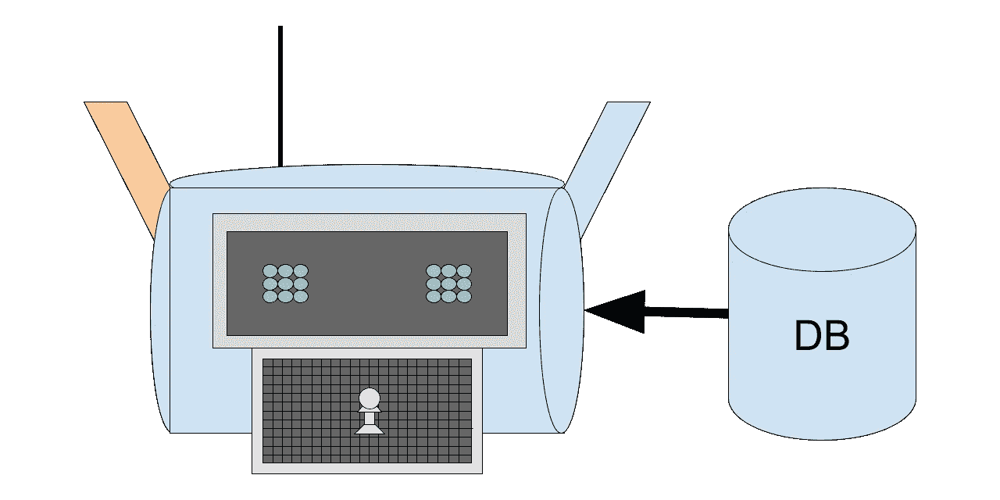
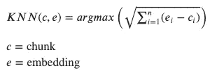
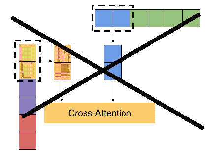
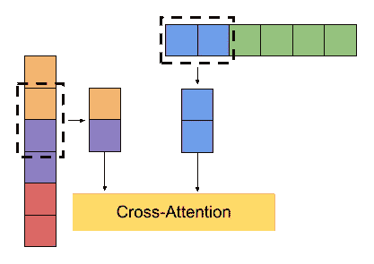
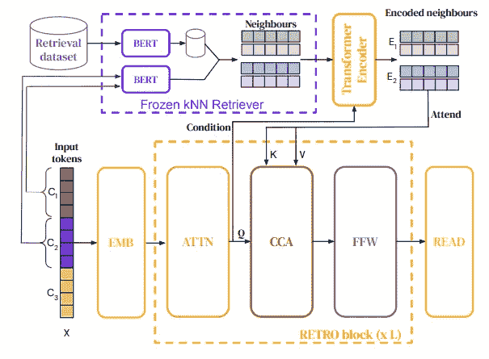
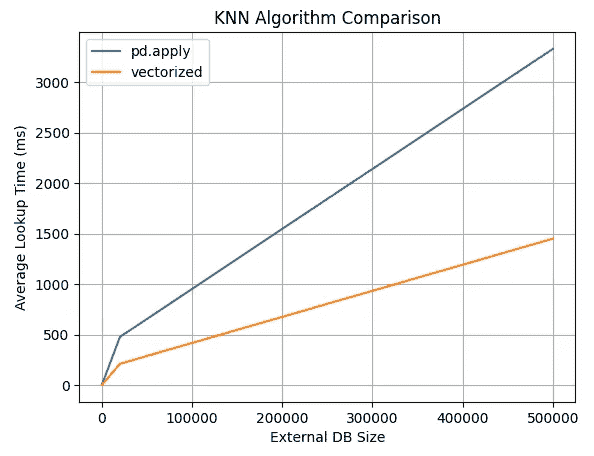
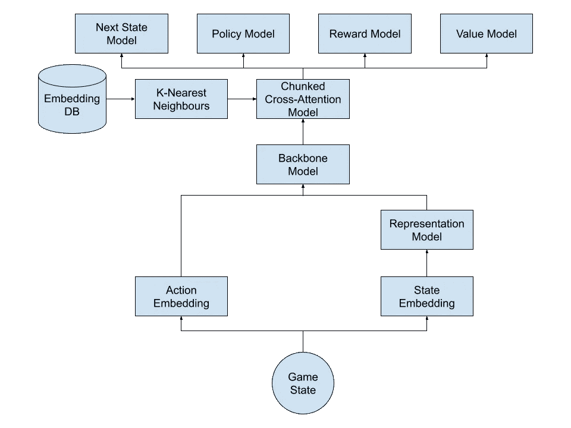
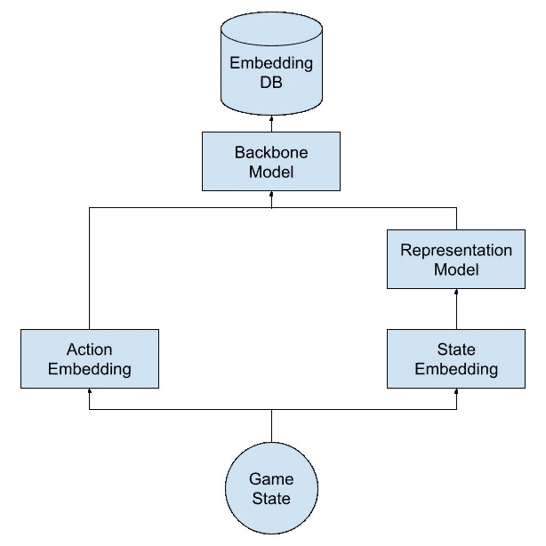

# 检索变压器增强强化学习

> 原文：<https://towardsdatascience.com/retrieval-transformer-enhanced-reinforcement-learning-24509e97c4c6>

## 将检索变形金刚与我们的游戏 AI Chappie 相结合

检索章节图|按作者分类的图片

大家好，如果你一直关注我以前的博客帖子，你就会知道我最近的[强化学习](https://en.wikipedia.org/wiki/Reinforcement_learning) (RL)代理([用离线强化学习下棋](https://medium.com/@bellerb/playing-chess-with-offline-reinforcement-learning-411edc5efd5f)，[用广义 AI 下棋](/playing-chess-with-a-generalized-ai-b83d64ac71fe))中一直在利用[变形金刚](https://arxiv.org/abs/1706.03762)。最近，一种被称为检索变压器的新型变压器因其高效而越来越受欢迎。此外，像 [OpenAI](https://openai.com/) 的 [WebGPT](https://arxiv.org/abs/2112.09332) 和 [DeepMind](https://deepmind.com/) 的 [RETRO Transformer](https://arxiv.org/abs/2112.04426) 这样的模型已经证明，这些较小的模型可以与大型模型如 [GPT-3](https://arxiv.org/abs/2005.14165) 相媲美。由于这些有希望的结果，我们将跟上最近的趋势，并尝试将这种类型的模型整合到我们的 RL 代理中，这似乎是合乎逻辑的。

# 检索变压器

在我们的 RL 代理中加入检索转换器之前，让我们先看看什么是检索转换器，以及为什么它如此有效。下面是从 DeepMind 的一篇博客文章中引用的一段话，其中他们描述了复古变形金刚所用方法背后的推理。

> “受大脑在学习时如何依赖专用记忆机制的启发，RETRO 有效地查询文本段落以改善其预测。”[10]

这句话暗示了我们的大脑在根据过去的经验做决定时是如何利用记忆作为框架的。例如，当你把某物抛向空中时，你期望它落地，因为你的大脑记得这个规则；

> “上升的必然下降。”艾萨克·牛顿[12]

DeepMind 通过利用外部数据库中存储的彼此非常相似的示例，重新创建了这种内存框架思想。为了确定与输入数据最相似的数据，逆向变换器确定 l-1 个输入数据块嵌入的 k-最近邻(KNN)。

k 近邻方程|作者图片

邻居和输入数据使用单独的自关注编码器块进行编码，并通过分块的交叉关注解码器块进行组合，从而为其提供类似于标准变换器的编码器-解码器架构。

分块交叉注意是交叉注意的一种形式，其中我们将查询(Q)、键(K)和值(V)分成更小的块，然后对这些块中的每一个执行交叉注意。在组块交叉注意中，我们不在每个输入组块和它的相邻组块之间执行交叉注意。

不正确的分块交叉注意层匹配图|作者图片

相反，我们将输入数据移动 m-1，并创建 l-1 个新的输入块。这些新创建的输入块包含来自前面的原始输入块的最后一个标记和它的原始输入块的后面的 m-1 个标记。

分块交叉注意力层匹配图|作者图片

然后，我们将最初丢弃的 m-1 个标记添加到交叉注意输出中。通过预先考虑 m-1 个标记，我们保留了更多来自原始输入数据的信息，这一点至关重要，因为我们希望模型的预测受输入数据的影响大于 KNN。

最后，我们在最后一个块中的剩余标记和最后一个邻居之间执行交叉关注。

分块交叉注意力图|图片来自[https://arxiv.org/pdf/2112.04426.pdf](https://arxiv.org/pdf/2112.04426.pdf)

分块交叉注意的结果通过前馈层传递。

复古图|图片由 https://arxiv.org/pdf/2112.04426.pdf[制作](https://arxiv.org/pdf/2112.04426.pdf)

# 建造我们的回收变压器

现在我们更好地理解了检索转换器，我们可以在我们的模型中有效地利用它的组件。

首先，我们将建立组块交叉注意模型。由于我们已经在[之前的博客文章](/playing-chess-with-a-generalized-ai-b83d64ac71fe)中创建了一个注意力模型，我们可以在这里重复使用。这里我们需要做的主要事情是创建一个分块机制来传递我们的邻居并输入到我们的注意力模型中。

现在我们已经建立了组块交叉注意模型，我们将创建我们的 KNN 函数。这个函数从潜在的相当大的样本空间中确定邻居，使得循环非常耗时(O(n))。为了优化这个函数，我们将对它进行矢量化，以消除遍历每个数据点的需要。首先，我们将把我们的数据框架转换成一个张量，这将允许使用矩阵计算。矩阵计算显示，与熊猫应用函数相比，性能有所提升。

k 近邻函数比较|作者图片

下面是我们的 KNN 函数的矩阵计算版本的代码。

新创建的 KNN 函数和分块的交叉注意层让这个模型看起来有所不同。下面是我们新模型架构的示意图。

新模型架构图|作者图片

看上面的图表，你会注意到我们在主干层之后添加了新的分块交叉注意层。这种放置是有意的，因为我们的 KNN 函数在单个矩阵上执行查找。将我们的分块交叉注意层放在主干层之后的另一个好处是主干层编码中表示的数据量。这些编码在我们的模型中是数据最丰富的，允许找到的邻居为最终层提供更好的框架。

最后一步，我们需要为外部嵌入数据库构建管道。

嵌入式数据库管道图|作者图片

管道是离线运行的，因为我们只需要在模型主干更新时重新计算嵌入。下面是这条管道的代码。

## 谢谢

现在你知道了，我们已经成功地升级了我们的国际象棋人工智能，以利用检索变压器的组件。你可以在我的 GitHub 上查看完整版本的代码。

感谢阅读。如果你喜欢这样，可以考虑订阅我的账户，以便在我最近发帖时得到通知。

# 参考

*   【https://arxiv.org/abs/1706.03762】T2[1]
*   【https://en.wikipedia.org/wiki/Reinforcement_learning】T4【2】
*   [https://towards data science . com/playing-chess-with-a-generalized-ai-b 83d 64 AC 71 Fe](/playing-chess-with-a-generalized-ai-b83d64ac71fe)[3]
*   [https://towards data science . com/building-a-chess-engine-part 2-db 4784 e 843d 5](/building-a-chess-engine-part2-db4784e843d5)【4】
*   [https://openai.com/](https://openai.com/)【5】
*   [https://arxiv.org/abs/2112.09332](https://arxiv.org/abs/2112.09332)【6】
*   [https://deepmind.com/](https://deepmind.com/)【7】
*   [https://arxiv.org/abs/2112.04426](https://arxiv.org/abs/2112.04426)【8】
*   [https://arxiv.org/abs/2005.14165](https://arxiv.org/abs/2005.14165)【9】
*   https://deep mind . com/blog/article/language-modeling-in-scale
*   [https://bokcenter.harvard.edu/how-memory-works](https://bokcenter.harvard.edu/how-memory-works)【11】
*   [https://www . goodreads . com/quotes/433926-what-go-up-must-down](https://www.goodreads.com/quotes/433926-what-goes-up-must-come-down)
*   [https://www . frieze . com/article/perception-vision #:~:text = In % 20 fact % 2C % 20it % 20is % 20 now，brain % 3B % 20it % 20 comes % 20 from % 20it。text = In % 20 many % 20 ways % 2C % 20 this % 20 makes % 20 sense。](https://www.frieze.com/article/perception-vision#:~:text=In%20fact%2C%20it%20is%20now,brain%3B%20it%20comes%20from%20it.&text=In%20many%20ways%2C%20this%20makes%20sense.)【13】