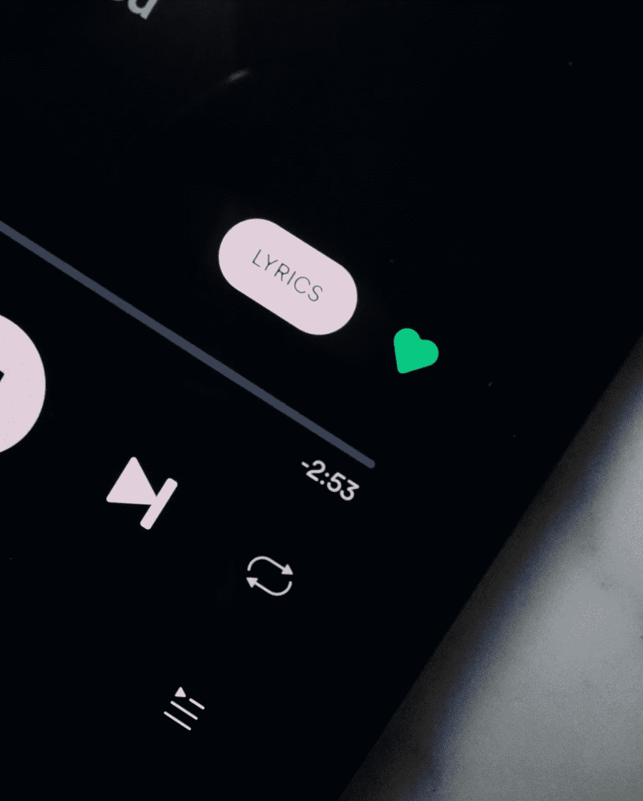
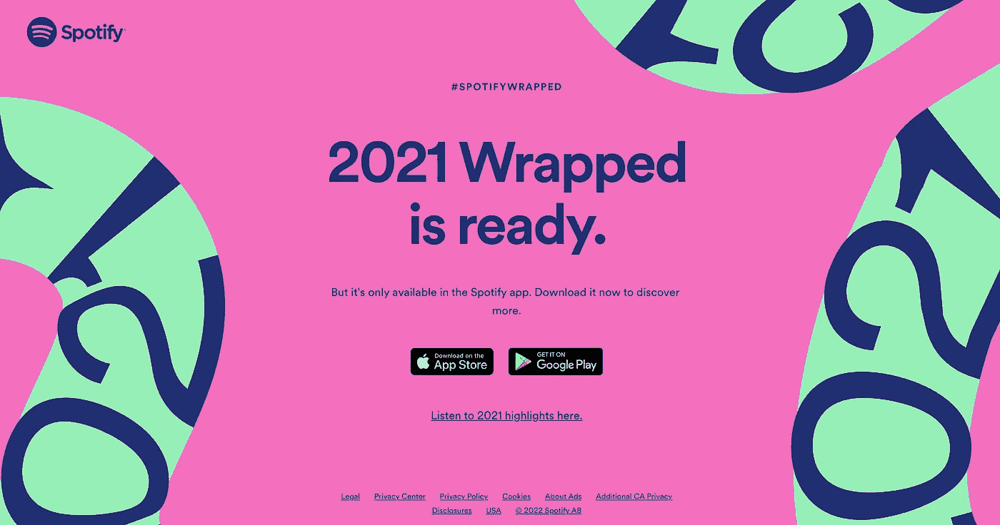
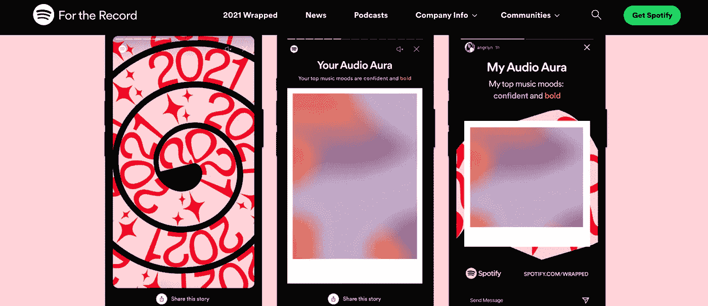
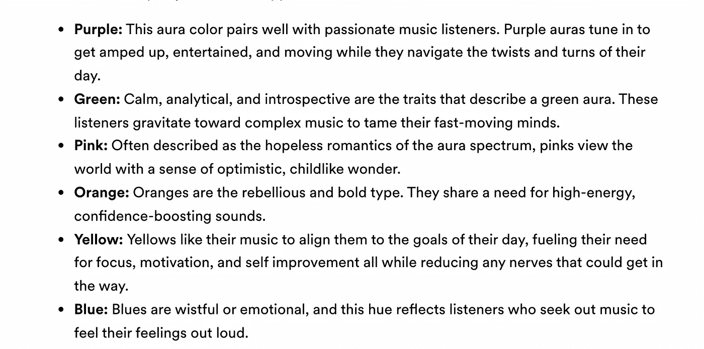
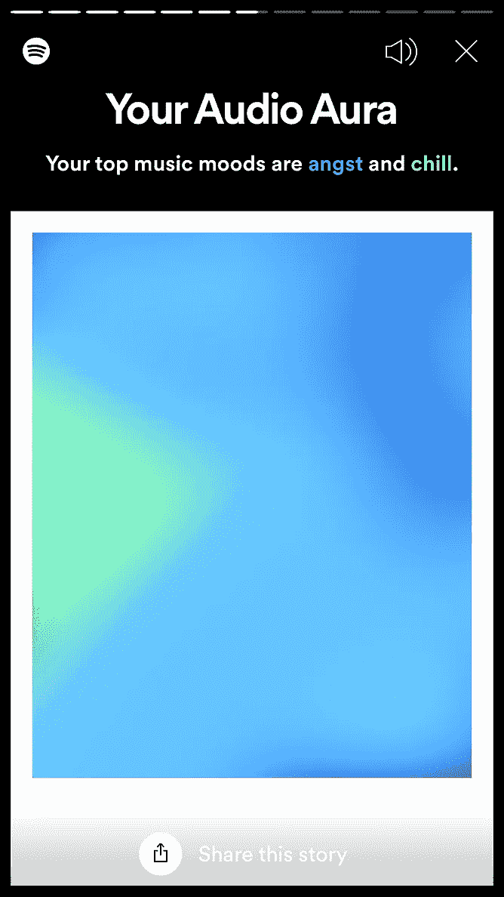
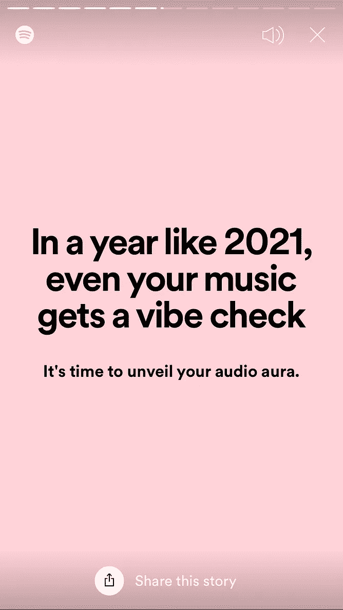
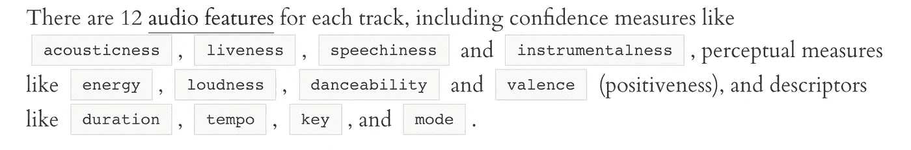
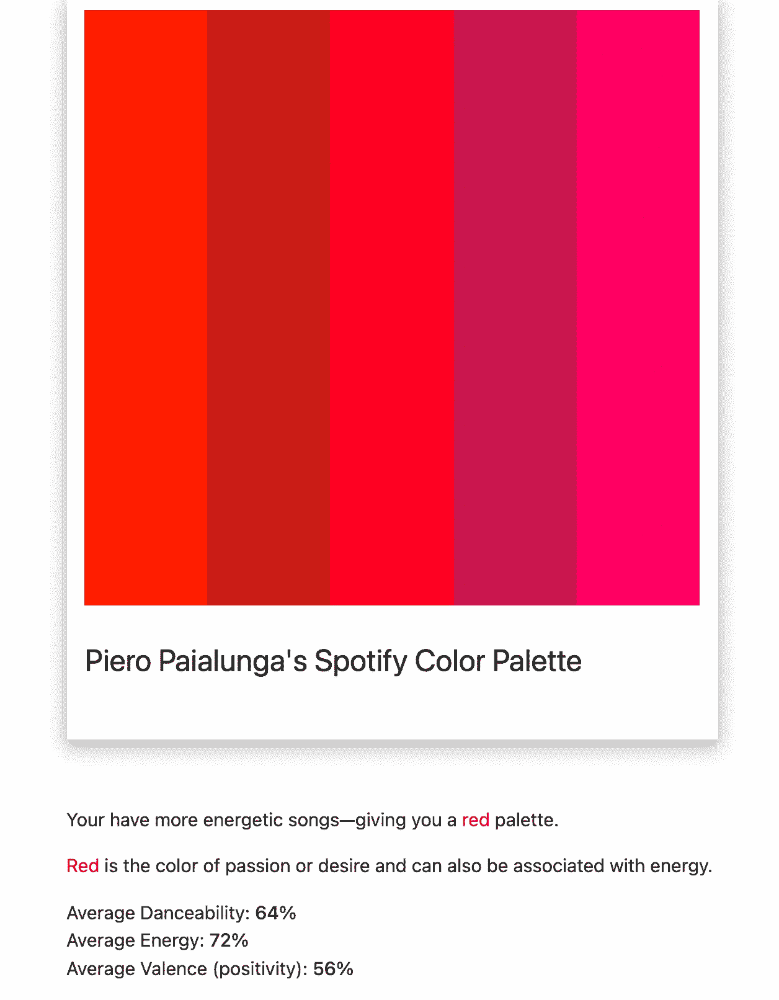
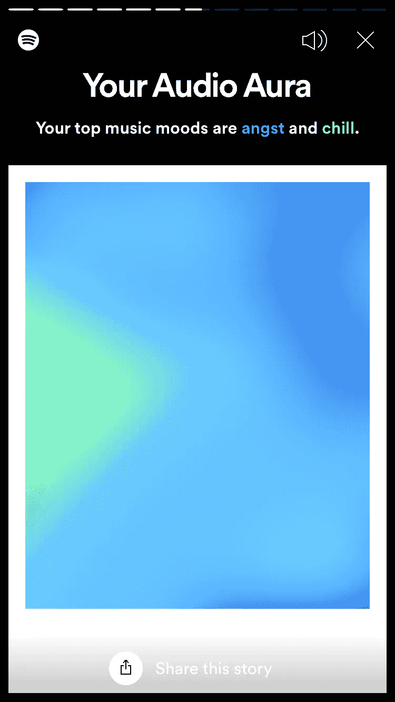

# 使用 Python 对 Spotify 包装的人工智能进行逆向工程

> 原文：<https://towardsdatascience.com/reverse-engineering-spotify-wrapped-ai-using-python-452b58ad1a62>

查尔斯·德鲁维奥在 [Unsplash](https://unsplash.com/s/photos/spotify-wrapped?utm_source=unsplash&utm_medium=referral&utm_content=creditCopyText) 上拍摄的照片

## [实践教程](https://towardsdatascience.com/tagged/hands-on-tutorials)

# 使用 Python 对 Spotify 包装的人工智能进行逆向工程

## 揭开年度最酷事件背后的神秘面纱

我远不是一个优秀的音乐家，但我确实热爱 T2 音乐。另一方面，我是一名专业研究人员，我的工作是构建**人工智能模型。**

我想你们都已经知道为什么我这么喜欢 Spotify。Spotify 基本上是我热爱的许多事物的总和，因为它将令人难以置信的人工智能技术应用于音乐世界。要让某人相信这些技术是不可思议的，只需打开应用程序，播放一首他们推荐的歌曲。你会意识到他们的推荐系统是准确的，而且…几乎是神奇的。

## 1.介绍 Spotify Wrapped

另一个由瑞典大公司提供的**魔术**活动是 [**Spotify 包装的**](https://en.wikipedia.org/wiki/Spotify_Wrapped) **。**

我做的截图，来自[这里](https://www.spotify.com/us/wrapped/)

自 2016 年以来，Spotify 决定使用你生成的所有统计数据来给你回顾你的最后一年音乐。在这个摘要中，您可以找到基本信息，如您的热门流派、热门艺术家和热门歌曲。

在 [2021 包裹体验](https://newsroom.spotify.com/2021-12-01/the-wait-is-over-your-spotify-2021-wrapped-is-here/)中真正突出的一点是所谓的[音频光环](https://newsroom.spotify.com/2021-12-01/learn-more-about-the-audio-aura-in-your-spotify-2021-wrapped-with-aura-reader-mystic-michaela/)。

我做的截图从[这里](https://newsroom.spotify.com/2021-12-01/learn-more-about-the-audio-aura-in-your-spotify-2021-wrapped-with-aura-reader-mystic-michaela/)

我建议你访问链接网站以了解更多信息，但简而言之，Spotify 团队能够将你的音乐品味与颜色相匹配。

他们是这样做的:

我从[这里](https://newsroom.spotify.com/2021-12-01/learn-more-about-the-audio-aura-in-your-spotify-2021-wrapped-with-aura-reader-mystic-michaela/)做的截图

很酷，不是吗？这是我的气场。

我做的截图

但是人工智能在哪里呢？

嗯，人工智能在他们用来检测歌曲是否“平静”(**绿色**)、“乐观”(**粉色**)、“情绪”(**蓝色**)等的工具中。
我在这本笔记本中试图揭示的是**Spotify 如何对歌曲的情绪进行分类，并将其与颜色进行匹配。**

让我们开始吧。

## 2.一些提示

我想说实话。我不知道我做的事情是否 100%正确:我不为 Spotify 工作，如果我为 Spotify 工作，我可能没有权利说它是如何工作的。

然而，有一些很好的暗示表明，如果这个过程不是我告诉你们的那样，我可能离真相不远了。

Spotify 的人工智能系统能够为每首歌曲创建 **12 个音频特征**。例如这篇[文章](https://www.kaylinpavlik.com/classifying-songs-genres/)使用这些特征对歌曲流派进行分类。

我从[这里做的截图](https://www.kaylinpavlik.com/classifying-songs-genres/)

而另一篇[文章](https://www.theverge.com/tldr/2018/2/5/16974194/spotify-recommendation-algorithm-playlist-hack-nelson)以非常详细的方式解释了这些特性，并用它们来玩推荐系统。

例如:

*   **声音度**是音轨是否是声音的置信度
*   **可跳性**表示一首歌曲有多少可跳性
*   **能量**是强度和活动的量度
*   效价是对音乐积极性的一种衡量

所有这些指标的值都在 0 和 1 之间。

可以说这是 Spotify 最伟大的艺术作品之一。当我们听一首歌时，我们能够确定**可跳舞性**、**能量**或**听觉**(如果我们学过一点音乐的话)，但要建造一台能够为我们做这些事情的**智能机器要困难得多**。

因此，有理由假设，由于这些功能如此复杂且信息量大， **Spotify 也会在打包体验中使用它们**。事实上，如果我们看看第一章对“情绪”的描述，并将其与上面的特征进行比较，我们可以看到，将颜色与像**能量、**可舞性和**价这样的特征相匹配并不困难。**

另一个指向这个方向的很好的暗示是所谓的 [**Spotify 调色板**](https://www.spotifypalette.com/) **，**，它根据心情调整功能，并给你一个调色板，给你 Spotify 的**可跳舞性、能量**和**价**。这是我的调色板:

我从[这里做的截图](https://www.spotifypalette.com/)

让我们把这个巨大拼图的所有碎片拼在一起:

*   Spotify 有一个 AI，从歌曲中提取出**【深度】特征**，这是他们自己的秘密。
*   Spotify 有自己的**“情绪”定义**，这可能与他们的功能有关
*   **奖励** : Spotify 让你能够用一个特定的 API 和一项名为[**的服务提取这一特性，Spotify 面向开发者**](https://developer.spotify.com/)

## 3.逆向工程部分

我们接下来要做的是:

*   **使用 Spotify API 访问我的 Spotify 播放列表**，其中包含我在 2021 年播放次数最多的歌曲
*   **提取特征**
*   **根据这些特征，理解为什么我最喜欢的音乐情绪是"*焦虑"*"和"*冷静"*！(见上图)**

我们需要做的第一件事是导入一些基本的库+ **spotipy** ，这是我们用来连接 Spotify 的库。

你需要的第二个东西是 Spotify 上的开发者账户。别担心，它不一定是高级的，而且非常容易创建。然后，您将使用您的**客户 ID** 和**密码**访问:

然后(**第三**步)我把我所有 100 首听得最多的歌上传到一个公共播放列表(如果你想听一些好的音乐，给[它](https://open.spotify.com/playlist/0wQ6Y6Xuhk784zsD14LYKS?si=4af8af86fc254ff2)一个机会)。在此之后，我提取了所有的跟踪代码，代码如下:

作为第四步，我提取了特征并构建了一个数据框架:

这就是了。

我做的另一件事(只是为了好玩)是绘制**对图**。

我知道这看起来很乱，但是让我们使用**关联**的**热图**来帮助自己。

例如，我们可以理解**能量**和**声音**之间的合理的反向相关性，以及**响度**和**能量之间的高度相关性。**这凸显了一个事实，即这些功能都是经过深思熟虑的，是 Spotify AI 系统的核心元素之一。

但是我们不要分心。他们说我的两种心情是“ ***焦虑*”**和“ ***寒意*”:**

我做的截图

在这一点上，对我来说，合理的做法是做一点功能工程，定义一些更接近“愤怒”的东西。考虑到我们所拥有的，我们可以试着将“**愤怒**”定义为“**消极**”。鉴于“**化合价**几乎等于“**正性**”，化合价是一个介于 0 和 1 之间的数，我们可以将“**负性”**定义为 **1-“正性”:**

让我们了解一下这些特性背后的统计数据:

1.  **直方图:**

2.**柱状图**

3.**箱线图**

4.**一些数字**:

这是关键时刻。以下是我们可以陈述的一些事情:

**A.** 舞蹈性和能量特征平均都在 50%以上( **62%** 和 **63%** )

**B.** 正面特征低( **46%** )，而负面(当然)仍然在 50%以上( **53%** )。

由于我们的假设是**能量**、**可跳舞性**和**价态**是 Spotify 在这种情况下使用的三个主要特征，我们可以假设:

1.高数值的**舞蹈性**是我作为一个顶级舞者所拥有的“**寒冷**”情绪的原因

2.高值的**能量**和**消极性(**或低值的化合价)是造成**焦虑**情绪的原因。

## 4.结论

我不知道逆向工程过程是否正确，因为我又不为 Spotify 工作。

我知道的是:

1.这些假设对我来说似乎是合理的，所以我认为如果它不完全正确，我可能已经对它的工作原理有了一些大概的了解

2.如果它是完全错误的，至少我在工作中获得了很多乐趣，这是目前对我来说最重要的事情，:D

如果你喜欢这篇文章，你想知道更多关于机器学习的知识，或者你只是想问我一些你可以问的问题:

A.在 [**Linkedin**](https://www.linkedin.com/in/pieropaialunga/) 上关注我，在那里我发布我所有的故事
B .订阅我的 [**简讯**](https://piero-paialunga.medium.com/subscribe) 。这会让你了解新的故事，并给你机会发短信给我，让我收到你所有的更正或疑问。
C .成为 [**推荐会员**](https://piero-paialunga.medium.com/membership) ，这样你就不会有任何“本月最大数量的故事”，你可以阅读我(以及成千上万其他机器学习和数据科学顶级作家)写的任何关于最新可用技术的文章。

再见:)