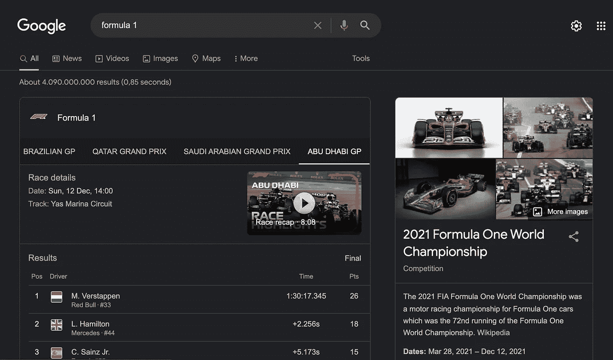
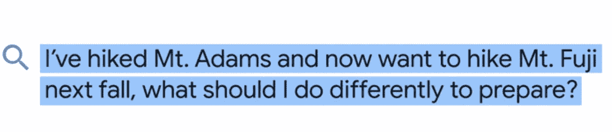
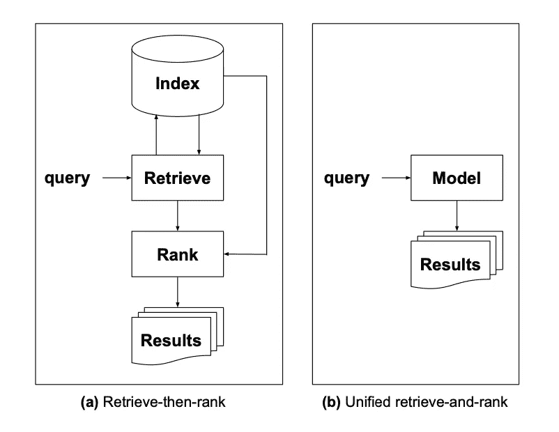

# 瑞普·伯特:谷歌的妈妈来了

> 原文：<https://towardsdatascience.com/rip-bert-googles-mum-is-coming-cb3becd9670f>

## Google MUM 解释:Google 的多任务统一模式背后是什么？

来源:照片由 Ialo Hernandez 在 Unsplash 上拍摄

2021 年 5 月 20 日，谷歌举行了开发者大会 I/O，并宣布了他们搜索引擎的新算法: **MUM，一个多任务统一模型** [1]。在过去的两年里，BERT 是他们搜索引擎的基础模型。伯特是一个惊人的释放，是最先进的，直到现在，直到妈妈来了。算法 BERT 在自然语言处理领域发生了很大的变化，并在数千甚至数百万个不同的应用和行业中得到应用。

BERT 是从传统的基于关键字的搜索转向更复杂的搜索查询的开端。它有助于以比以往更高的精度识别实体和实体之间的关系。有了 BERT，Google 不仅可以提供按索引排序的结果和链接参考，还可以在 Google 中显示即时结果。

谷歌特色片段立即显示结果。来源。自己的形象。

# MUM 的主要特点是什么？

MUM 继承了这一传统，并试图更加关注复杂的长尾搜索查询，尽可能高效地解决用户的请求。

妈妈输入数字:

> MUM 有潜力改变谷歌帮助你完成复杂任务的方式。MUM 使用 T5 文本到文本框架，比 BERT 强大 1000 倍。[2]

根据谷歌的说法，MUM 不仅比**强大 1000 倍**，在**效率**上得分也更高，而且它在三个主要类别中表现突出【2】:

*   MUM 是**多模态**并处理**多种媒体类型**
*   MUM 处理**更复杂的搜索查询**
*   妈妈**克服语言障碍**

好了，这些是事实，但是让我们看看这意味着什么。

**妈妈的多模态**意味着搜索算法不仅能理解文本，还能理解视频、图像和音频文件。[2] **这样用户就可以把文字输入和图像输入结合起来。** [2]搜索某个图形图案的用户可以使用 google lens 输入包含该图案的图像，并且可以使用文本来丰富图像以获得更多细节和更好的结果，例如具有该图案的文本结构。

在谷歌博客的例子中，他们通过以下问题[2]展示了妈妈的能力:

来源:[谷歌博客](https://blog.google/products/search/introducing-mum/)

在这种情况下，谷歌声明妈妈会理解你在比较两座不同的山。因为它知道你想为徒步旅行做准备，它会认为你正在秋天行走，并根据这个季节的天气、必要的装备、徒步旅行所需的训练以及更多信息提出建议。根据谷歌的说法，MUM 更有能力识别实体之间的关系，因此**更适合更复杂的问题**和长尾关键词/问题【2】。

此外，妈妈能够**消除语言障碍**，从原本是其他语言的搜索结果中传递答案。因此，如果你搜索有关富士山的信息，谷歌将有可能提供你的语言的结果，即使原始内容是在日本网站上找到的。

# 多任务统一模型算法背后隐藏着哪些技术？

当然，MUM 是一个巧妙选择的营销名称，让科技界可以轻松地交流新的谷歌算法(就像熊猫、企鹅公司一样)。算法背后真正的算法或机器学习系统尚未完全揭示。这是谷歌的策略，向世界温和地介绍他们新的令人惊讶的搜索引擎算法，不让黑暗中有太多的光明。

尽管如此，谷歌经常发表研究论文，介绍机器学习领域的新方法和改进。检查这些并把它们与 MUM 的新特性联系起来，很容易找到最有可能代表全新 MUM 算法的论文。因此，MUM 是一个算法星座，它构成了世界上最强大的搜索引擎的新搜索算法。这极有可能也是朝着正确方向迈出的又一步，以保持其地位和准垄断地位。

其中一篇论文是**“重新思考搜索:让领域专家走出范儿”**(梅茨勒等人。这解释了当前的搜索引擎对于导航和事务性搜索查询是有用的，但是在满足信息需求方面有困难。传统的信息检索系统(如 2018 年之前的谷歌)提供参考文献，但不提供直接信息[]。

> 当经历信息需求时，用户希望与领域专家合作，但是通常转向信息检索系统，例如搜索引擎。[5]

如果你在过去几年中使用过谷歌，你可能会看到一些发展，比如向用户提供直接信息的片段，而不是仅仅列出参考文献。这是谷歌将他们的搜索引擎变成领域专家的方式。向专家的转变已经从 BERT 开始，但现在应该进入下一个阶段。

经典的信息检索系统有一个过程，首先是索引，然后是检索，最后是参考文献的排序，也称为检索然后排序范式[5]。新的方法用一个统一的模型代替了这一部分，该模型在同一个组件中进行检索和排序。出于多任务学习的目的，系统基于 T5，当然，MUM 也基于 T5。

资料来源:Metzler，d .等人[4]。

另一篇论文，也是上一篇论文的合著者唐纳德·梅茨勒(Donald Metzler)写的，是 2020 年 8 月发布的[“用户活动流的顺序专家的多任务混合】](https://storage.googleapis.com/pub-tools-public-publication-data/pdf/63a48017f06cd046cbf97f158195e9d96e8b2205.pdf) (MoSE)。底层机器学习系统可以基于用户点击行为和服务器日志进行学习。换句话说，“顺序专家的多任务混合”试图揭示为什么用户有特定的点击和搜索查询历史。那么，第一个输入是如何影响随后的输入的，谷歌能够更早地交付一个(更好的)解决方案吗？这有助于理解如何解决更复杂的搜索查询。MoSE 系统“使用长短期记忆(LSTM)模拟连续用户行为”[4]，因此不仅能够预测单个搜索查询的结果，还能够预测一组连续搜索查询的结果。

谷歌研究团队的论文基于两个任务，但它也进一步解释说，他们的目标是在未来将其扩展到更多的任务。该算法在 G Suite(如 Gmail)中的搜索任务上进行了测试和训练。MoSE 的平均错误率比现有模型低 10%。

如果你通读这篇论文，你可能会遇到两个不适合 MUM 算法的主要问题:在 MUM 算法的情况下，谷歌公布了该模型也是基于变压器的，MoSE 系统不包括任何变压器部件。

研究人员指出

> MoSE 由通用构建块组成，可以轻松扩展，例如使用除 LSTM 之外的其他顺序建模单元，包括 GRUs、attentions 和 Transformers[4]

由于这篇论文已经在 17 个月前发表了，我相信谷歌团队已经为他们的新系统填补了这个空白，并通过使用 Transformers 对其进行了改进。

MUM 正在解决的另一个棘手问题是处理多个数据源，如图像、文本，将来还有音频和视频。在论文本身中，作者指出“[他们]没有显式地处理多模型数据，如图像或自然语言输入”[4]，并进一步解释说“扩展 MoSE 以更好地处理此类数据将是有趣的”[4]。我很确定在过去的 17 个月里，Google 团队能够解决他们博客中宣布的前两种数据类型(图片和文本)。

## 结论

MUM 的首批功能已经由谷歌实现，但更多功能将在 2022 年推出。正如谷歌所说，多模态将首先用于图像和文本，随后也用于语音和视频。文章中提到的第一篇论文清楚地展示了如何将检索-排序过程转化为一个统一的模型。MUM 是多任务统一模型的简称。因此，第一篇论文使用 T5 模型来处理统一模型。第二篇文章讨论了多任务部分，展示了如何应用 LSTM 来更好地处理复杂的搜索查询。结合两篇论文，我们非常接近妈妈的样子。当然，还有更多的组件，可能还有更多的文件将为妈妈发挥作用。很明显，MUM 仍处于起步阶段，看到 MUM 在未来如何发展以及将会添加哪些功能将会令人兴奋。

感谢你的阅读，希望你喜欢。

*消息来源*

[1]维肖莱克，C. (2021 年)。*麻省理工学院的“妈妈”也会谷歌一下。*[https://t3n . de/news/mum-Google-komplexe-suchanfragen-1379918/](https://t3n.de/news/mum-google-komplexe-suchanfragen-1379918/)

[2]纳亚克，P. (2021)。MUM:理解信息的新人工智能里程碑。https://blog.google/products/search/introducing-mum/

[3] Nguyen，G. (2019)。*常见问题解答:所有关于谷歌搜索中的 BERT 算法。*[https://search engine land . com/FAQ-all-about-the-Bert-algorithm-in-Google-search-324193](https://searchengineland.com/faq-all-about-the-bert-algorithm-in-google-search-324193)

[4]梅茨勒等人(2020 年)。*针对用户活动流的顺序专家多任务混合。*[https://storage . Google APIs . com/pub-tools-public-publication-data/pdf/63a 48017 f 06 CD 046 CBF 97 f 158195 e 9d 96 E8 b 2205 . pdf](https://storage.googleapis.com/pub-tools-public-publication-data/pdf/63a48017f06cd046cbf97f158195e9d96e8b2205.pdf)

[5]梅茨勒等人。艾尔。(2021).重新思考搜索:把领域专家从粉丝中培养出来。[https://arxiv.org/pdf/2105.02274.pdf](https://arxiv.org/pdf/2105.02274.pdf)T21