# 超参数调整期间过多多个局部最小值的风险含义

> 原文：<https://towardsdatascience.com/risk-implications-of-excessive-multiple-local-minima-during-hyperparameter-tuning-fe6f517e57e8>

## 我们的认识论局限和知识幻觉

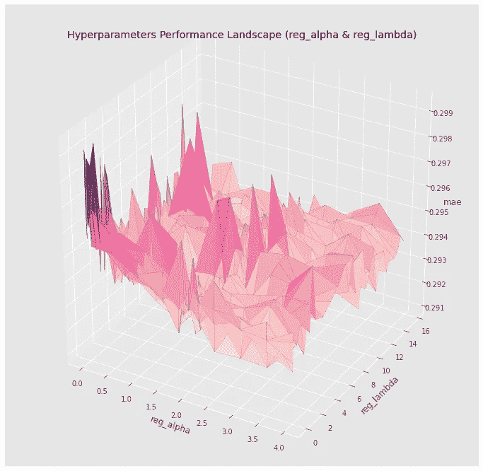

使用 Matplotlib 的 plot_trisurf 进行 3D 可视化:由 Michio Suginoo 制作

超参数调整期间过多的多个局部最小值是模型性能对超参数值的微小变化高度敏感的症状，如上图所示。

当我在本机 XGBoost API 的超参数对 reg_alpha 和 reg_lambda 上执行网格搜索调优时，我遇到了这种非常崎岖不平的性能状况，有多次起伏。这只是我对房地产价格预测回归分析的一个组成部分。然而，在很大程度上，我全神贯注于以下问题。

*   那些多个局部极小值是否意味着任何风险？
*   ***如果有的话，那些是什么？***

在这篇阅读中，我想分享我基于我的项目案例研究对这些问题的观察和思考。

# A.超参数调整概述

这里，我只想对我在原始项目中执行的超参数调优过程做一个非常简要的概述。

***a)超参数***

我使用了 Python 的原生 XGBoost API[。](https://xgboost.readthedocs.io/en/stable/)

[在原生 XGBoost API](https://xgboost.readthedocs.io/en/latest/parameter.html#parameters-for-tree-booster) 中内置的许多超参数中，由于给定的计算资源可用性有限，本分析主要关注以下 8 个超参数。

*   [**eta**](https://xgboost.readthedocs.io/en/stable/parameter.html#parameters-for-tree-booster)
*   [**max_depth**](https://xgboost.readthedocs.io/en/stable/parameter.html#parameters-for-tree-booster)
*   [**子样**](https://xgboost.readthedocs.io/en/stable/parameter.html#parameters-for-tree-booster)
*   [**col sample _ bytree**](https://xgboost.readthedocs.io/en/stable/parameter.html#parameters-for-tree-booster)
*   [**最小 _ 子 _ 体重**](https://xgboost.readthedocs.io/en/stable/parameter.html#parameters-for-tree-booster)
*   [**伽马**](https://xgboost.readthedocs.io/en/stable/parameter.html#parameters-for-tree-booster)
*   **[阿尔法 ](https://xgboost.readthedocs.io/en/stable/parameter.html#parameters-for-tree-booster)**
*   **<https://xgboost.readthedocs.io/en/stable/parameter.html#parameters-for-tree-booster>**

****关于这些超参数的定义，请参考原生 [XGBoost API](https://xgboost.readthedocs.io/en/stable/parameter.html#parameters-for-tree-booster) 的文档。****

****除了这 8 个超参数，我在调优过程中使用[**early _ stopping _ round**](https://xgboost.readthedocs.io/en/latest/python/python_api.html?highlight=cv()#xgboost.train)调优了迭代次数[**num _ boost _ round**](https://xgboost.readthedocs.io/en/latest/python/python_api.html?highlight=cv()#xgboost.train)。****

****关于 XGBoost 超参数的更多内容，这里有一个 Jason Brownlee 写的很好的总结: [*机器学习的梯度提升算法的温和介绍*](https://machinelearningmastery.com/gentle-introduction-gradient-boosting-algorithm-machine-learning/) *。*****

*******b)调谐方法*******

****理想地，在所有这 8 个超参数上的单个联合调谐将准确地捕获这些超参数之间所有可能的相互作用。然而，联合调谐具有巨大的搜索网格数据点，因此在计算上将是昂贵的。****

****为了节约分析的计算成本，我从 8 个参数对中选择了 4 个:即****

*   ****(最大深度，eta)****
*   ****(子样本，列样本 _ 字节树)****
*   ****(最小 _ 孩子 _ 体重，伽玛)，以及****
*   ****(寄存器 _alpha，寄存器 _lambda)。****

****我对这 4 个超参数对中的每一个进行了成对调整。每次调整后，最佳调整结果用于替换超参数对的旧值。通过这种方式，每次调优都会逐步提高调优模型的性能。****

****这总体上减少了搜索网格数据点的数量，并以网格搜索的公正性为代价节约了调整过程的计算成本。当然，这里的基本假设是，通过 4 个成对调节获得的结果不会在本质上偏离在所有 8 个超参数上的理想单个联合调节。****

****在调优方法方面，我想强调几个重要的脚注。****

*   ****我在超参数调整的训练数据集上运行 [***k 重交叉验证***](https://xgboost.readthedocs.io/en/latest/python/python_api.html?highlight=cross%20validation#xgboost.cv) 。****
*   ****我使用网格搜索法进行参数调整。****
*   ****我使用 3D 可视化和三角插值技术[来填充搜索网格数据点之间的空隙，并渲染出一个平滑的表演场景表面。](https://en.wikipedia.org/wiki/Surface_triangulation)****

*******c)第一次调谐结果*******

****这里，我们有 4 个成对超参数调整结果的 3D 可视化。每个图表显示了每个成对超参数调整的性能情况。****

****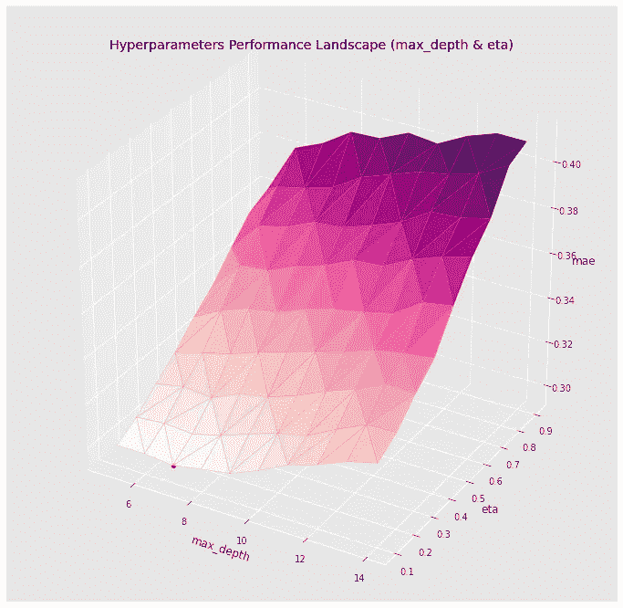****

****使用 Matplotlib 的 plot_trisurf 进行 3D 可视化:由 Michio Suginoo 制作****

****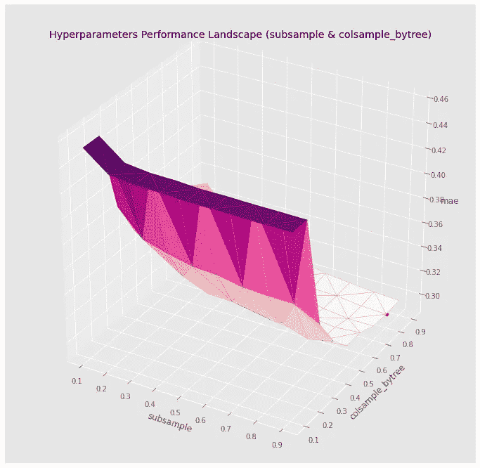****

****使用 Matplotlib 的 plot_trisurf 进行 3D 可视化:由 Michio Suginoo 制作****

****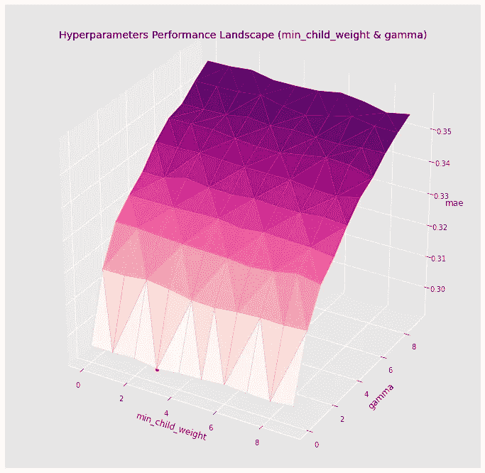****

****使用 Matplotlib 的 plot_trisurf 进行 3D 可视化:由 Michio Suginoo 制作****

********

****使用 Matplotlib 的 plot_trisurf 进行 3D 可视化:由 Michio Suginoo 制作****

****如您所见，最后一个性能场景展示了与其他三个性能场景截然不同的行为。它产生了多个局部最小值和多个凹陷和凸起，并对超参数对的值的微小变化表现出极大的敏感性。相反，前 3 种情况呈现了相对一致的性能景观。****

****下面，我想介绍超参数对的第一个搜索网格设置。****

```
**for reg_alpha in [0, 1e-2, 0.1, 1, 2, 3, 4, 8, 10, 12, 14] for reg_lambda in [0, 1e-2, 0.1, 1, 2, 3, 4, 8, 10, 12, 14] ]**
```

****数据点之间的间隔故意设置得不均匀，以观察搜索网格的粒度对性能前景的影响。对于这两个超参数，我在 0 和 1 之间设置了一个更精细的粒度间隔，在 4 之后的范围内设置了一个更粗糙的间隔。****

****下表列出了搜索网格上的前 10 个最佳性能数据点。****

****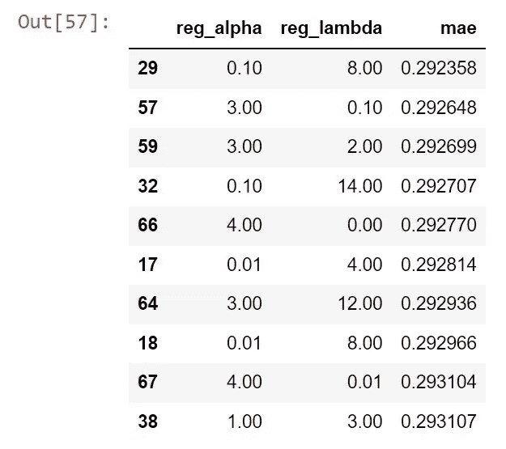****

****制作人:杉尾道夫****

****该表确定了在搜索网格数据点(reg_alpha =0.1，reg_lambda=8.0)时的最佳性能；第二好的是(reg_alpha =3.0，reg_lambda=0.1)。****

****为了更深入地了解(reg_alpha 和 reg_lambda)的超参数对的不稳定性能状况，我沿着 reg_alpha 的前 2 个数据点值(即 reg_alpha = 0.1 和 3.0)对性能状况进行了切片。****

****对于每个切片，这里我沿着 reg_alpha 绘制了切片性能曲线，并在切片性能曲线上绘制了前 10 个最佳性能搜索网格数据点的表格。****

****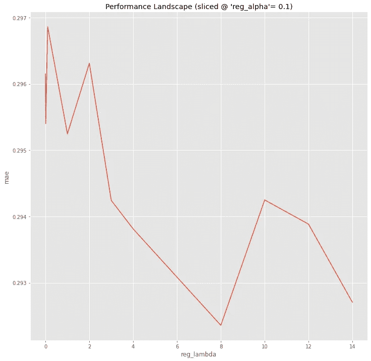****

****制作人:杉尾道夫****

****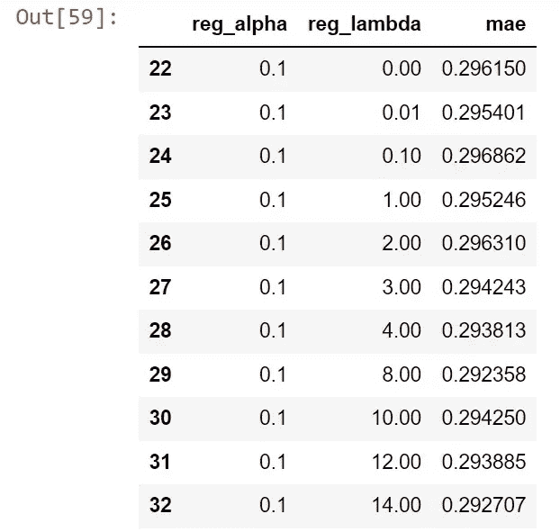****

****制作人:杉尾道夫****

****沿着上面的 reg_alpha=0.1 切片的性能曲线确认了在(reg_lambda = 0.01、1.00 和 8.00)的 3 个局部最小值。在 0 和 2 之间有明显的下降和上升。在某种程度上，reg_lambda = 0.01 处的局部最小值和那些凹陷和凸起不会被捕获，如果我们没有在 0 和 1 之间的粒度局部搜索网格设置的话。****

****现在，让我们看看另一条沿 reg_alpha =3.0 切片的性能曲线及其前 10 位性能搜索网格数据点。****

****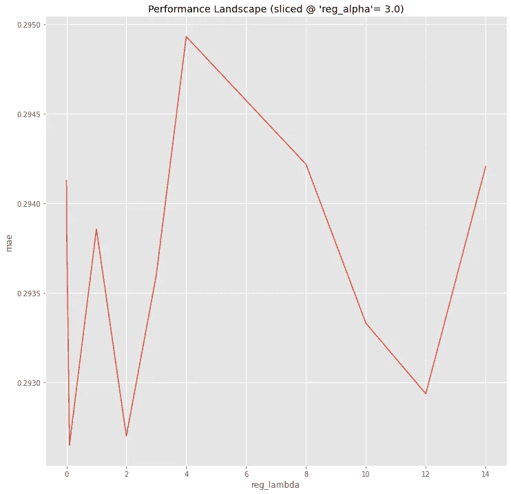****

****制作人:杉尾道夫****

****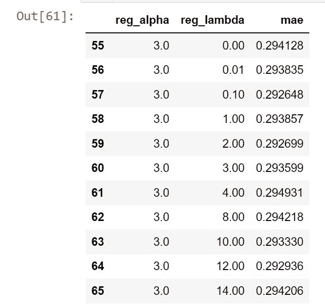****

****制作人:杉尾道夫****

****沿着(reg_alpha = 3.0)的性能状况的第二部分确定了在(reg_lambda = 0.01)和(reg_lambda = 1.0)之间形成的尖锐深渊。深渊形状的强烈凹凸不平(沿 reg_lambda = 0.01、0.1 和 1.00)由局部搜索网格设置捕获，该设置比搜索网格的任何其他部分都精细得多。换句话说，如果我们在搜索网格中错过了(reg_lambda = 0.1)的单个数据点，我们将无法捕捉到(reg_lambda = 0.01)和(reg_lambda = 1.0)之间的局部最小值的存在。****

*******d)网格搜索的盲点与可视化*******

****这两条切片的性能曲线揭示了网格搜索的一个普遍缺陷:性能前景捕获的只是在所选搜索网格上预测的性能结果。称之为搜索网格性能；我们没有任何关于搜索网格之外的任何数据点的性能的信息。称之为脱离搜索网格的性能。****

****此外，可视化使情况变得更糟，通过平滑地插入搜索网格上的性能来推测那些不可见的搜索网格外的性能。在非搜索网格间隔内平滑的图像只是一个假象，但根本不是事实。这个人工制品可能会在我们不稳定的感知中造成一种知识幻觉。换句话说，我们可以通过盲目地用平滑的视觉假象来控制我们的视觉来欺骗自己。****

****搜索网格设置中更精细的粒度可能会揭示更粗糙的性能环境。也就是说，通过更精细的搜索网格设置，我们可能会发现更多的凹陷和凸起。它可能会发现许多其他隐藏的局部最小值的存在，这些最小值在当前的性能环境中是不可见的。****

****此外，地面实况全局最小值很可能出现在当前搜索网格之外，并且位于与由当前搜索网格设置识别的当前最小值相距很远的地方。****

****简而言之，当前的性能状况可能不仅捕捉到了其粗糙的部分图像，还欺骗了我们的视觉。****

*******e)reg _ alpha 和 reg_lambda 的第二轮调整。*******

****为了测试假设的视图，我做了一个更细粒度的搜索网格设置，如下所示，并为特定的超参数对重新运行成对调优。****

```
**for reg_alpha in [0, 1e-2, 2e-2, 3e-2, 0.1, 0.5, 1, 1.5, 1.8, 1.9, 2, 2.1, 2.2, 2.5, 3, 3.5, 4]for reg_lambda in [0, 1e-2, 2e-2, 3e-2, 0.1, 0.5, 1, 1.5, 1.8, 1.9, 2, 2.1, 2.2, 2.5, 3, 4, 5, 6, 7, 7.5, 8, 8.5, 9, 9.5, 10, 10.5, 11, 11.5, 12, 12.5, 13, 13.5, 14, 14.5, 15, 15.5]**
```

****这是第二轮调整结果的三维可视化。****

********

****用 Michio Suginoo 制作的 Matplotlib 的 plot_trisurf 进行三维可视化****

****正如预期的那样，超参数对(reg_alpha 和 reg_lambda)的第二轮调整比第一轮调整呈现出更加崎岖的性能状况，有更多的下降和上升。****

****下面是第二轮调优的前 10 个性能搜索网格数据点。****

****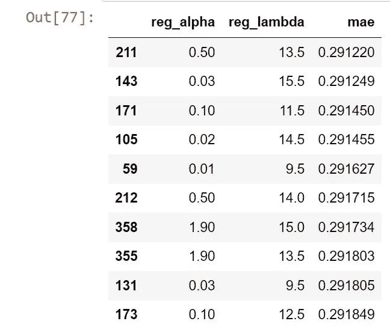****

****制作人:杉尾道夫****

****现在，这证实了我之前的担心是正确的。****

*   ****首先，第一个搜索网格的粗略粒度低估了性能状况对超参数对值的微小变化的实际敏感度。****
*   ****top 10 performance search-grid data point 表显示，粒度更细的第二轮调整在与第一轮调整结果(reg_alpha = 0.1，reg_lambda = 8.0)完全不同的位置(reg_alpha = 0.5，reg_lambda = 13.5)发现了其最佳性能数据点。****

# *******B .正在使用的多个本地最小值和方法的风险影响*******

****该分析使用网格搜索来进行超参数调整，并使用三角插值来渲染超参数值上的性能景观的 3D 可视化。像任何其他方法一样，这些方法在它们自己的设计中有其固有的局限性。以及 reg_alpha 和 reg_lambda 的超参数对的特定成对调谐的结果，展示了多个局部最小值，这是高灵敏度/易变性能的症状，暴露了那些固有设计限制的风险。在某种程度上，这种极度敏感的表现放大并暴露了使用这些方法的风险。****

****以下是这些局限性的概述。****

******局限性 1)网格搜索的盲点:******

*   ****搜索网格被设置为所选离散超参数数据点的集合。称之为搜索网格数据点。网格搜索只计算选定搜索网格中那些离散超参数数据点的性能结果，或搜索网格性能。****
*   ****调优并没有告诉我们在相邻的两个搜索网格数据点之间发生了什么。我们对所选搜索网格之外或搜索网格之外的性能值(评估指标)一无所知。因此，调优结果最多只能让我们看到底层性能状况的一部分。****

******限制 2)虚幻的视觉化******

*   ****3D 可视化仅捕获搜索网格上的结果。****
*   ****并且 3D 可视化平滑地内插那些离散的数据点，以创建估计的脱离搜索网格的评估度量值的人工制品。该人工制品产生了关于脱离搜索网格的评估度量值的知识幻觉。****

****如果当前的搜索网格仅捕获其灵敏度的部分图像，则脱离搜索网格的地面实况性能可能比其在平滑的可视化上出现的更敏感/不稳定，并且更崎岖，有更多的下降和颠簸。换句话说，它的高灵敏度表明 ***地面实况脱离网格性能*** 可能实质上偏离投影在 3D 可视化上的插值估计的假象。****

****此外，业绩前景的高度敏感性可能会进一步带来风险，即地面实况全局最小值可能出现在搜索网格之外，并且与搜索网格上的全局最小值相距甚远。在这种意义上，当与仅具有单个局部最小值的 3 个其他情况相比时，多个局部最小值放大了遭受可视化的网格搜索和三角测量插值技术的那些固有限制的风险。****

# *******C .偏差-*** 方差 ***模型选择中的取舍*******

****现在，在这个阶段，考虑到这两轮调整的结果，我们想对模型选择做出一个试探性的决定来回答下面的问题。我们应该选择哪个调整模型:第一次调整结果还是第二次调整结果？****

****我们是否可以说，与第一轮结果相比，第二轮调整提供了更好的解决方案，因为它在调整期间产生了更好的性能(k 倍交叉验证)？****

****可惜没那么简单。到目前为止，我们只使用训练数据集进行 k-fold 交叉验证。****

****为了回答这个问题，我们需要考虑[偏差-方差权衡](https://en.wikipedia.org/wiki/Bias%E2%80%93variance_tradeoff)或欠拟合-过拟合权衡的角度。换句话说，我们需要在测试数据集 上运行调整后的模型，并比较它们的性能。****

****下面的表格比较了交叉验证数据集和测试数据集之间的性能，分别为“调整(验证 MAE)”和“测试性能(MAE)”三个阶段:预调整阶段、第一次成对调整后以及第二次成对调整后。****

****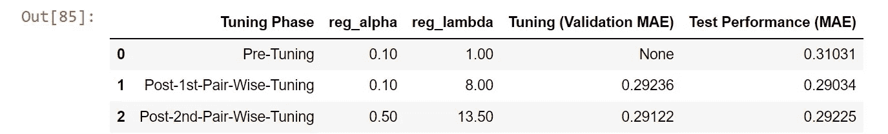****

****制作人:杉尾道夫****

****该表表明，最佳测试性能实际上是在第一轮调优时产生的，而不是在第二轮调优时产生的。这表明第二轮调整期间较好的交叉验证性能结果说明了 ***方差*** ，或 ***过拟合*** 。****

****为了解决偏差-方差权衡问题，我们必须选择第一轮结果，拒绝第二轮结果用于模型选择。****

****对于数据驱动的机器学习，模型不稳定性是由偏差-方差权衡或欠拟合-过拟合权衡引起的关键问题。当新类型的数据集出现在部署域中并进入优化模型时，在开发阶段优化的模型可能会表现出意外的行为。模型性能的稳定性需要在模型风险管理的整个生命周期中进行评估。****

# *******D .讨论*******

****尽管如此，第一轮调整结果是否是绝对意义上的最佳解决方案仍不确定。考虑到模型的异常敏感性，当前搜索网格的粒度可能不够精细，无法捕捉到真实的全局最小值。在第一轮和第二轮中使用的搜索网格之外，可能存在更好的解决方案(甚至对于测试数据集)。****

****我们要不要设置一个新的搜索网格来测试这个疑问？****

****这将是一个永无止境的故事。****

****最重要的是，当我们使用网格搜索参数调整时，我们永远无法知道绝对意义上的最佳解决方案。网格搜索最多只能捕捉到仅投射在搜索网格上的性能状况的一部分。我们没有任何关于搜索范围外性能的信息。****

****从这个意义上来说，我们并不了解整个表演领域的全貌。原则上，我们的知识仅限于那些离散的搜索网格上的数据点。更糟糕的是，三角插值可视化技术呈现了连续性能景观的假象，并在我们对整个性能景观的不确定感知中产生了错觉。总的来说，如果我们认为我们可以获得真实性能的全貌，也就是真实性能的全局最小值，那就太天真了。****

****除了前面反复提到的两个限制之外，所选择的调优方法还有另一个明显的限制，即成对调优。****

******限制 3)成对调谐的偏好******

*   ****所有超参数的单个联合调整将更好地捕捉所有超参数之间的实际性能交互。可能会得出完全不同的结论。从这个意义上说，成对调整捕获的全局最小值可能是不准确的，并且不同于真实的全局最小值。****
*   ****只有 4 个成对调整，我们没有覆盖 8 个超参数的所有可能的组合对(28=8×7/2)。这些缺失组合之间的相互作用不能被 4 个成对调节捕获。****

****对本地 XGBoost API 的 reg_alpha 和 reg_lambda 进行成对调整，证明了模型性能对超参数对值的微小变化高度敏感，并揭示了网格搜索和插值 3D 可视化的认识论限制。****

*   ****网格搜索只能捕获搜索网格上的模型性能，而不会给我们留下任何关于搜索网格外性能的信息。****
*   ****更糟糕的是，三角形插值通过平滑性能景观，蒙蔽了我们的视觉，并产生了关于实际模型性能的错觉。****

****简而言之，这两种限制都存在于这些方法的设计中。因此，它们是体系结构固有的，无法解决。这设置了一个认识论的限制:我们永远不会达到我们的地面真实性能景观的完美知识，因此，地面真实的全球最小值。这将引出一个相关的问题:****

*   ****如果在认识论上不可能找到基本事实的全局最小值，有可能建立它的强大代理吗？什么构成了全局最小值的可靠代理？****

****此外，在超参数对上使用更细粒度的搜索网格设置进行的第二轮调整揭示了一个复杂的偏差-方差权衡问题。虽然提高了训练成绩，却恶化了考试成绩。不幸的是，更细粒度的网格搜索只能使模型过度适应训练数据集，而不能优化一般的模型性能。这提出了另一个相关的问题:****

*   ****从调优模型的总体优化角度来看，基本事实全局最小值有什么关系吗？****

****另一点是:在分析中，认识论的限制似乎对 3 个其他性能场景没有问题，即对于以下 3 对:(max_depth，eta)，(subsample，colsample_bytree)，(min_child_weight，gamma)，因为它们相对一致。很明显，只有在 reg_alpha 和 reg_lambda 的高灵敏度性能环境下，我们才注意到认识论的限制。****

****这告诉我们一些事情:只要性能状况没有表现出对这些超参数值的微小变化的高度敏感性，三角形插值与网格搜索的结合似乎已经成为一种稳健的解决方案。****

****这转化为另一个视角:除了这些方法的一般认识论限制，还有一个过度敏感的性能景观的更严重的问题。需要解决过多局部最小值的风险影响。一个相关的问题是:****

*   ****多个局部最小值是否表明部署域中调优模型的模型不稳定性，其中新类型的数据集可能被引入到模型中？****

****你怎么想呢?****

****这些问题似乎都没有不言自明的答案。****

# ****D.结论****

****现在，我将关闭这个职位，同时保持这些问题的答案。展望未来，我希望继续关注过多多重最小值的风险影响，并探索那些尚未解答的问题。此外，我欢迎读者联系我，分享他们对此事的看法。****

****总的来说，这篇文章揭示了在超参数调优过程中，我们在寻找性能全局最小值的基本事实答案时的认知局限性。****

****网格搜索只确定了搜索网格上的模型性能，搜索网格外的性能未知。让情况变得更糟的是，3D 可视化渲染了脱离搜索网格的数据点上的三角插值的假象，并创造了一种知识的幻觉。****

****此外，从偏差-方差权衡的角度来看，我们是否需要获得关于基本事实全局最小值的知识并不是不证自明的。****

****感谢你阅读这篇文章。****

****如果你对原分析的整个过程感兴趣，可以访问 [my Github repository](https://github.com/deeporigami/Portfolio/blob/main/XGBoost/Version%201%20XGBoost%20Hyperparameter%20Tuning%20and%20Performance%20Landscape.ipynb) 查看代码实现。作为脚注，为了生成所有这些图像，我使用了 python 和 Matplotlib。****

# ****确认****

****我要感谢 TDS 的编辑团队，特别是[凯瑟琳·普雷里](https://www.linkedin.com/in/ACoAAArEpWwBHvFKeyTA3JKk6gApzplqwM2hjKY)，感谢他们在编辑阶段提供的宝贵意见。****

# ****参考****

*   ****布朗利(Brownlee)，J. [*机器学习的梯度推进算法温和介绍*](https://machinelearningmastery.com/gentle-introduction-gradient-boosting-algorithm-machine-learning/) *。* (2016)。检索自机器学习掌握:[https://Machine Learning Mastery . com/gentle-introduction-gradient-boosting-algorithm-Machine-Learning/](https://machinelearningmastery.com/gentle-introduction-gradient-boosting-algorithm-machine-learning/)****
*   ****维基百科。 [*偏差-方差权衡*](https://en.wikipedia.org/wiki/Bias%E2%80%93variance_tradeoff#:~:text=In%20statistics%20and%20machine%20learning,bias%20in%20the%20estimated%20parameters.) *。* (2022)。检索自维基百科:[https://en . Wikipedia . org/wiki/Bias % E2 % 80% 93 variance _ trade off #:~:text = In % 20 statistics % 20 and % 20 machine % 20 learning，Bias % 20 In % 20 估计% 20 参数。](https://en.wikipedia.org/wiki/Bias%E2%80%93variance_tradeoff#:~:text=In%20statistics%20and%20machine%20learning,bias%20in%20the%20estimated%20parameters.)****
*   ****维基百科。 [*【交叉验证(统计)*](https://en.wikipedia.org/wiki/Cross-validation_%28statistics%29#k-fold_cross-validation) *。* (2022)。从维基百科检索:[https://en . Wikipedia . org/wiki/Cross-validation _ % 28 statistics % 29 # k-fold _ Cross-validation](https://en.wikipedia.org/wiki/Cross-validation_%28statistics%29#k-fold_cross-validation)****
*   ****维基百科。 [*曲面三角剖分*](https://en.wikipedia.org/wiki/Surface_triangulation) *。* (2022)。从维基百科检索:[https://en.wikipedia.org/wiki/Surface_triangulation](https://en.wikipedia.org/wiki/Surface_triangulation)****
*   ****xgboost 开发人员。 [XGBoost 参数](https://xgboost.readthedocs.io/en/stable/parameter.html)。(2021).检索自[https://xgboost . readthe docs . io/en/stable/parameter . html # parameters-for-tree-booster](https://xgboost.readthedocs.io/en/stable/parameter.html#parameters-for-tree-booster)****