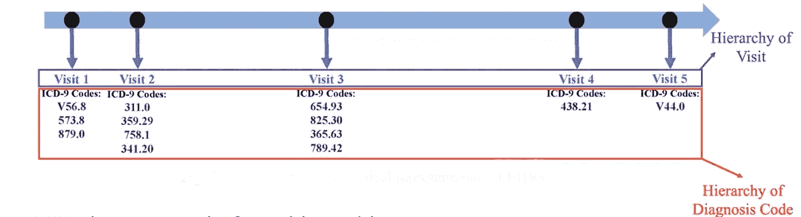
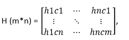
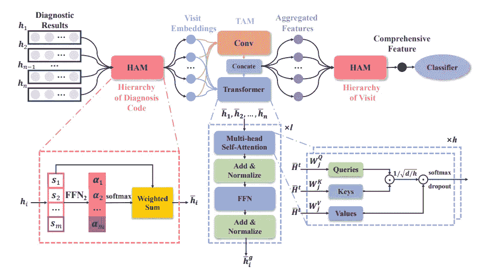
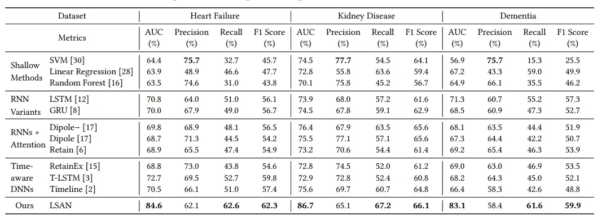

# 基于分层注意机制的 EHR 数据风险预测

> 原文：<https://towardsdatascience.com/risk-prediction-with-ehr-data-using-hierarchical-attention-mechanism-685028e01faa>

## LSAN 基本指南:用分级注意建模长期依赖和短期关联

图片由 [Jukka Niittymaa](https://pixabay.com/users/jniittymaa0-701650/?utm_source=link-attribution&amp;utm_medium=referral&amp;utm_campaign=image&amp;utm_content=1185076) 来自 [Pixabay](https://pixabay.com/?utm_source=link-attribution&amp;utm_medium=referral&amp;utm_campaign=image&amp;utm_content=1185076)

电子健康记录(EHR)是全面的历史健康记录，包含患者就医时的症状。EHR 数据具有两级层次结构，由一组按时间顺序排列的就诊组成，在每次就诊中，有一组无序的诊断代码。诊断代码可以属于 ICD-9 或 ICD-10 格式，表示某种疾病的症状。

风险预测是医疗保健行业中最流行的问题陈述之一。风险预测是指对未来某一疾病高风险成员的预测。现有方法侧重于对时间访问进行建模，而忽略了对访问中的诊断代码进行建模的重要性，并且访问中大量与任务无关的信息通常导致现有方法的性能不令人满意。

在本文中，我们将讨论如何通过保持长期依赖性和短期相关性来执行风险预测。

# LSAN 简介:

> **参考论文:**[LSAN——对风险预测的长期依赖和短期相关性进行分层关注建模](https://dl.acm.org/doi/abs/10.1145/3340531.3411864)

EHR 数据由两级层次结构组成:就诊层次结构和每次就诊的诊断代码层次结构。

(来源)，EHR 的等级表示图

本文提出了一个 LSAN 深度神经网络模型来模拟 EHR 数据的层次结构。

# 任务:

任务是使用纵向 EHR 数据𝑯 ∈ R𝑚×n.计算能够预测患者‘p’在未来可能发生的某些疾病的函数 f。该函数的主要关注点是从患者数据 h 中提取隐藏的疾病进展信息，并处理噪声信息的问题。

## 输入符号:

对于每个病人`‘p’`，它期望历史诊断结果作为一个顺序列表𝑯=【𝒉1，𝒉2,…，𝒉𝑛】，其中𝒉𝑖是𝑖-the 就诊的诊断结果，n 是就诊次数。

每个就诊诊断结果由 ICD-9 代码的子集`**𝑪 = {𝒄1,𝒄2,…,𝒄𝑚}**`组成，其中𝑚是数据集中唯一诊断代码的数量。

此处`**hiCj=1**`如果就诊的诊断结果包含 cj 诊断代码，否则`**hiCj=0**`

# **创意:**

LSAN 是一种端到端模型，

1.  **HAM** (在诊断代码层次中):它用设计的诊断代码级注意力学习访问嵌入。
2.  TAM (时间聚合模块):它捕获访问之间的长期依赖性和短期相关性。
3.  **HAM** (在就诊层级中):TAM 的输出用于通过 HAM 中的就诊级注意力来学习最终的综合患者表现。
4.  **分类器**:综合表示用于预测

([来源](https://dl.acm.org/doi/10.1145/3340531.3411864))，LSAN 架构

HAM 的功能是利用 HER 的分层表示，并且它具有注意机制来去除 EHR 数据中的噪声。

## **HAM(在诊断代码层级中):**

## **用途:**

在诊断代码的层次结构中，我们应该减少噪声信息，以便为每次访问学习更好的嵌入。在每次就诊中，可能存在与目标类别无关的诊断代码。因此，我们需要区分每次就诊中诊断代码的重要性。

HAM 利用分级注意机制来更加注意与我们的目标疾病相关的诊断代码，而较少注意其他代码。

**实施:**

1.  由于𝑯 ∈ R^(m*n)是一个稀疏矩阵，不适合表示学习，所以想法是学习每个代码的密集嵌入
2.  HAM 首先通过一层前馈网络 FFN1 将每个诊断码𝒄𝑖编码成密集嵌入的𝒆𝑖 ∈ R𝑑
3.  HAM 首先通过 1 层前馈网络 FFN1 `𝒆𝑖 = FFN1 (𝒄𝑖) = ReLU(𝑾1𝒄𝑖 + 𝒃1), where 𝑾1 ∈ R𝑑×𝑚, 𝒃1 ∈ R^d`将每个诊断码𝒄𝑖编码成密集嵌入的𝒆𝑖 ∈ R𝑑
4.  𝑬 = [𝒆1,…，𝒆𝑚] ∈ R^(𝑑×m)，m 个唯一诊断码的 d 维稠密表示
5.  对于𝑖-th 访问，我们获得一个密集嵌入集𝑺𝑖 = [𝒔1,…,𝒔𝑚]其中𝒔𝑗 = 𝒆𝑗如果𝒉𝑖𝑗 = 1 以反映某种症状或疾病的存在，否则𝒔𝑗 = 0
6.  尽管如此，𝑺𝑖 ∈ R𝑑×m 对于学习过程来说是多余的。现在哈姆提取每次访问的潜在信息，并将其表示为`**𝒉¯𝑖 ∈ R𝑑**`
7.  为了提取潜在的访问信息，HAM 使用了一个三层前馈网络(FFN_2)。FFN_2 学习每个密集嵌入𝑺𝑖的注意力权重并一起出席它们。
8.  我们得到每个诊断代码的注意力得分𝛼𝑖∈r(𝛼𝑖= ff N2(𝒔𝑖))，如果𝒔𝑖 = 0，我们设置𝛼𝑖=∞。用 softmax: `**𝑎𝑖 = exp(𝛼𝑖)/( Σ𝑗=1tom exp(𝛼𝑗) )**`归一化关注度，这里𝑎𝑖是归一化权重
9.  现在，我们为𝑖-th 就诊`**(𝒉¯𝑖 = Σ𝑖=(1 to m) 𝑎𝑖 · 𝒔𝑖).**`获得了单个嵌入𝒉 𝑖。结果，在诊断代码的层级中，我们获得了患者‘p’的一组关注特征`**𝑯¯ = [𝒉¯1,…, 𝒉¯𝑛] ∈ R𝑑×𝑛**`。

## **TAM(在诊断代码层级中):**

## **用途:**

TAM 将访问嵌入与来自全局和时态结构的两种时态信息聚合在一起。当所有访问的特征被放入 TAM 时，

1.  它通过 **Transformer** 对全球结构中的长期依赖关系进行建模，例如在患者的整个医疗旅程中，每次就诊如何与其他就诊相关联。
2.  通过**卷积层**在本地结构中进行短期关联，例如每个访问如何在短时间内与其他访问相关联。

**实施:**

1.  **TAM 通过卷积进行短期相关性建模:**它过滤掉来自无关诊断代码的噪声，提取每个阶段中相关的疾病进展信息，用于时间聚合

**2。TAM 在变压器长期依赖关系建模中:**

a.Transformer 并行处理所有的访问功能，不会模糊每个功能的细节

b.我们在 Transformer 中使用多头自关注机制进行特征关注，TAM 中的 Transformer 编码器具有𝑙层，其中每层中的计算是相同的

c.将位置编码添加到𝑖-th 输入访问中，𝒉 𝑡 𝑖 = 𝒉 𝑖 + 𝒕I，其中𝒕𝑖是位置编码

d.每层变压器都有'ℎ'头、

这两个时间信息都有利于学习特征的鲁棒性，因此我们连接𝒉 𝑔 𝑖和𝒉 𝑙 𝑖以获得用于风险预测的特征𝒉𝑖 ∈ R2𝑑，

> 𝒉𝑖=𝒉𝑙𝑖concate(𝒉𝑔𝑖)

最后，TAM 输出一个矩阵𝑯 = [𝒉~1,…，𝒉~𝑛] ∈ R2𝑑×n

## **火腿(按拜访层次):**

## **用途:**

在访问层次中，我们应该注意访问之间的相关性。它捕捉了疾病的时间模式。通过提取相邻访问之间的局部时间相关性并利用长期相关性信息来滤除噪声。

它侧重于从所有访问中提取整体语义。

**实施:**

1.  类似于诊断代码层次中的 HAM，它首先采用 3 层前馈网络 FFN4 来学习注意力分数𝛽𝑖 ∈ R，`**𝛽𝑖 = FFN4 ( 𝒉𝑖).**`
2.  然后，我们用 softmax 函数`**b𝑖 = exp(𝛽𝑖)/( Σ𝑗 =1m exp(𝛽𝑗)**`得到归一化的注意力权重𝑏𝑖 ∈ R
3.  风险预测的综合特征𝒙 ∈ R2𝑑通过注意机制学习，其中 `**𝒙 = Σ𝑖=1n (𝑏𝑖 · 𝒉~𝑖)**`

## **分类器:**

1.  最后，我们利用𝒙进行风险预测，𝑦ˆ = 𝜎(𝒘T𝒙 + 𝑏)，其中𝒘 ∈ R2d 和 b ∈ R
2.  对于训练集 t，我们使用二元交叉熵损失 l 来训练模型，并获得学习参数𝜽

# 结论:

LSAN 架构捕获访问之间的长期依赖性和短期相关性。根据论文作者进行的实验，LSAN 方法的性能相对优于浅层方法(SVM、线性回归等)或 RNN/RNN+注意力模型。

([来源](https://dl.acm.org/doi/10.1145/3340531.3411864))，不同 EHR 数据集上的风险预测性能比较

# 参考资料:

[1] LSAN 论文(2020 年 10 月 19 日):[https://dl.acm.org/doi/10.1145/3340531.3411864](https://dl.acm.org/doi/10.1145/3340531.3411864)

> 感谢您的阅读