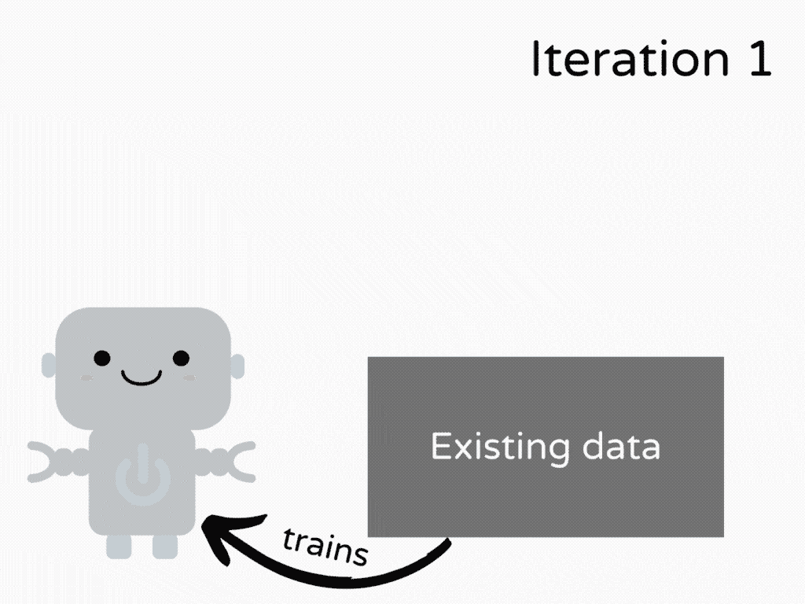
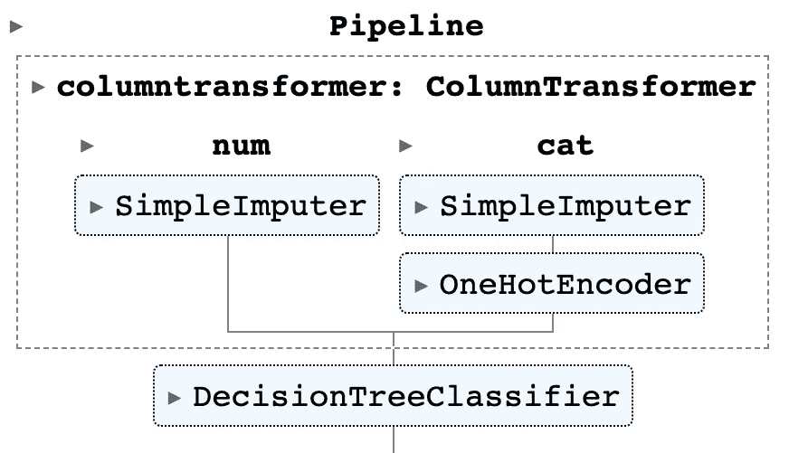
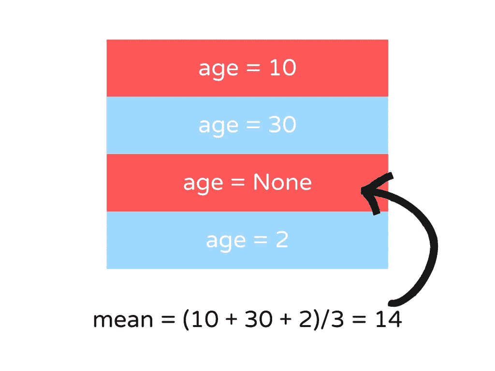
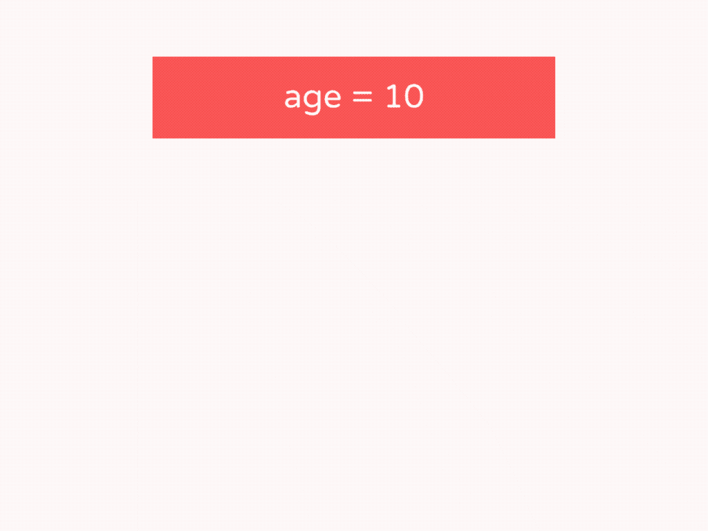
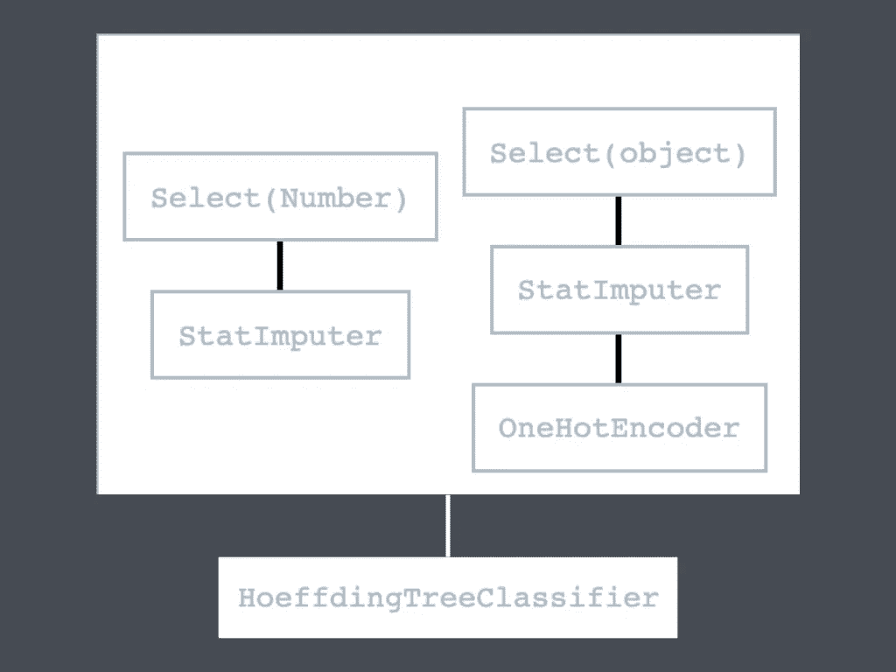
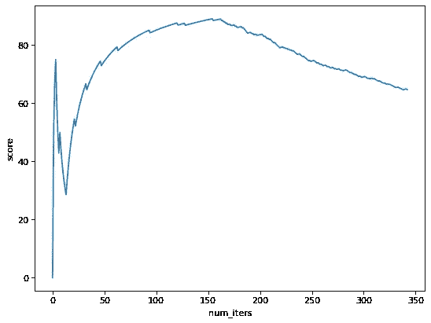
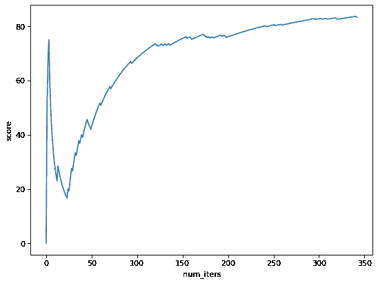

# river:Python 中的在线机器学习

> 原文：<https://towardsdatascience.com/river-online-machine-learning-in-python-d0f048120e46>

## 一种在生产中更新 ML 模型的快速廉价方法

# 批量学习的问题

数据从业者使用批量学习从数据中学习是很常见的。批量学习就是批量训练 ML 模型。批量学习的 ML 管道通常包括:

*   将数据分为训练集和测试集
*   将模型拟合到列车组
*   在测试集上计算模型的性能
*   将模型推向生产

然而，在生产中，流水线并没有到此为止。为了确保模型在输入数据发生变化时是稳健的，数据从业者还需要定期对新数据集和现有数据集的组合进行重新训练。

随着数据的增长，训练模型需要更多的时间和资源。



批量学习演示(作者)

因此，批量学习在以下情况下并不理想:

*   应用程序需要频繁的模型更新。
*   公司负担不起存储和训练大数据的计算资源。

# 在线学习简介

在在线学习中，模型是在数据流而不是整个数据集上进行增量训练的。换句话说，模型每次只从一个观察值或一小组观察值中学习。


在线学习演示(作者)

因此，每个学习步骤既快又便宜，这使得它非常适合快速变化的应用程序和计算资源有限的公司。

在本文中，您将学习如何使用 River 对流数据进行机器学习。

随意发挥，并在这里叉这篇文章的源代码:

<https://github.com/khuyentran1401/Data-science/blob/master/machine-learning/river_streaming/streaming.ipynb>  

# 什么是河流？

[River](https://github.com/online-ml/river) 是一个在线机器学习的 Python 库。要安装 River，请键入:

```
pip install river
```

在接下来的几节中，我们将比较使用 scikit-learn 进行批量学习和使用 River 进行在线学习。

# 准备数据

在做任何新奇的事情之前，我们将从准备数据开始。

从 seaborn 导入`penguins`数据集:

```
import seaborn as sns

df = sns.load_dataset("penguins")
```

查看数据的信息:

```
df.info()
```

```
Data columns (total 7 columns):
 #   Column             Non-Null Count  Dtype  
---  ------             --------------  -----  
 0   species            344 non-null    object 
 1   island             344 non-null    object 
 2   bill_length_mm     342 non-null    float64
 3   bill_depth_mm      342 non-null    float64
 4   flipper_length_mm  342 non-null    float64
 5   body_mass_g        342 non-null    float64
 6   sex                333 non-null    object
```

创建特征数据(`X`)和标签数据(`y`):

```
target = 'species'
y = df[target]
X = df.drop(target, axis=1)
```

现在我们准备用 scikit-learn 和 River 创建一个 ML 管道！

# 使用 scikit-learn 进行批量学习

导入有用的库:

```
from sklearn.model_selection import train_test_split
from sklearn.pipeline import make_pipeline
from sklearn.impute import SimpleImputer
from sklearn.preprocessing import OneHotEncoder
from sklearn.tree import DecisionTreeClassifier
from sklearn.compose import ColumnTransformer
from sklearn.metrics import confusion_matrix, f1_score
```

为了在批量学习中训练模型，我们通常从将数据集分成训练集和测试集开始:

```
X_train, X_test, y_train, y_test = train_test_split(X, y, random_state=1)
```

使用 scikit-learn 的转换器和分类器创建管道:

```
# Get numerical and categorical features
numeric_features = X_train.select_dtypes(exclude=object).columns
categorical_features = X_train.select_dtypes(include=object).columns

# Specify transformers for each type of features
numeric_transformer = SimpleImputer()
categorical_transformer = make_pipeline(
    SimpleImputer(strategy="most_frequent"), OneHotEncoder()
)
preprocessor = ColumnTransformer(
    transformers=[
        ("num", numeric_transformer, numeric_features),
        ("cat", categorical_transformer, categorical_features),
    ]
)

# Create a pipeline with transformers and classifier
sklearn_clf = make_pipeline(preprocessor, DecisionTreeClassifier())
```

管道概述:



作者图片

训练模型并预测测试数据:

```
# Train the model
sklearn_clf.fit(X_train, y_train)

# Get prediction
y_pred = sklearn_clf.predict(X_test)
```

这些步骤对于数据从业者来说是非常标准的。让我们把这段代码变成在线学习，比较两种方法的区别。

# 用 River 进行在线学习

## 流过数据集

导入有用的库:

```
from river import (
    stream,
    compose,
    preprocessing,
    evaluate,
    metrics,
    tree,
    imblearn,
    stats,
)
import numbers import numbers
```

在在线学习中，观察是一次提供一个。我们将通过用`stream.iter_pandas`遍历两个熊猫数据帧(`X`和`y`)的每一行来模仿这种行为:

```
for xi, yi in stream.iter_pandas(X, y):
    pass
```

让我们看看最后的`xi`和`yi`是什么样子的:

```
>>> xi
{'island': 'Biscoe',
 'bill_length_mm': 49.9,
 'bill_depth_mm': 16.1,
 'flipper_length_mm': 213.0,
 'body_mass_g': 5400.0,
 'sex': 'MALE'}

>>> yi
'Gentoo'
```

## 计算运行统计

由于数据集中有一些缺失值，我们将用数据集的平均值来估算缺失值。

为了找到数据集的平均值，我们将数据集中的 N 个非空值相加，然后将结果除以 N。



作者图片

在在线学习中，我们不能应用相同的程序来计算平均值，因为我们不知道整个数据集的值。因此，我们将使用*运行统计数据*来估计平均值。

要计算移动平均值，只要有新值就更新平均值。然后使用运行平均值来更新缺失值。



作者图片

在 River 中，我们可以使用`preprocessing.StatImputer`用一个运行统计来替换丢失的值。

为了从一个实例中学习并转换该实例，我们将使用`learn_one`方法和`transform_one`方法。

```
X_sample = [{"age": 10}, {"age": 30}, {"age": None}, {"age": 2}]
mean = stats.Mean()
imputer = preprocessing.StatImputer(("age", mean))
for xi_sample in X_sample:
    imputer.learn_one(xi_sample)
    print(imputer.transform_one(xi_sample))
```

```
{'age': 10}
{'age': 30}
{'age': 20.0}
{'age': 2}
```

## 创建一个 ML 管道

`river.compose`提供了几种类似于`sklearn.compose`的方法来构建机器学习管道。

让我们使用这些方法来创建一个转换分类和数字特征的管道:

```
cat = (
    compose.SelectType(object)
    | preprocessing.StatImputer()
    | preprocessing.OneHotEncoder(sparse=True)
)
num = compose.SelectType(numbers.Number) | preprocessing.StatImputer()
preprocessor = num + cat
```

使用管道学习和转换观察结果:

```
preprocessor.learn_one(xi)
preprocessor.transform_one(xi)
```

```
{'island_Biscoe': 1,
 'bill_length_mm_49.9': 1,
 'bill_depth_mm_16.1': 1,
 'flipper_length_mm_213.0': 1,
 'body_mass_g_5400.0': 1,
 'sex_MALE': 1,
 'bill_length_mm': 49.9,
 'bill_depth_mm': 16.1,
 'flipper_length_mm': 213.0,
 'body_mass_g': 5400.0}
```

最后，我们将使用决策树算法从数据中学习。

传统的批量决策树无法处理在线学习需求，因为当有新的观察值时，它们需要用整个数据集进行重新训练。

因此，我们将使用 [Hoeffding 树](https://riverml.xyz/0.14.0/api/tree/HoeffdingTreeClassifier/) (HT)分类器进行在线学习。HT 是迄今为止最流行的增量决策树家族。

```
classifier = tree.HoeffdingTreeClassifier()
```

> 了解更多关于[决策树在线机器学习](https://maxhalford.github.io/slides/online-decision-trees.pdf)。

接下来，将转换器和超线程分类器结合到一个管道中，转换数据并从中学习:

```
def get_pipeline():
    cat = (
        compose.SelectType(object)
        | preprocessing.StatImputer()
        | preprocessing.OneHotEncoder(sparse=True)
    )
    num = compose.SelectType(numbers.Number) | preprocessing.StatImputer()
    classifier = tree.HoeffdingTreeClassifier()

    return (num + cat) | classifier

pipeline = get_pipeline()
```

可视化管道:

```
pipeline
```



作者图片

## 训练模型并预测新的观察结果

让我们使用这个管道来创建一个函数，该函数根据数据流进行预测并训练一个模型:

```
def train(X, y):
    pipeline = get_pipeline()

    # Initialize metrics 
    f1_score = metrics.MicroF1()
    cm = metrics.ConfusionMatrix()

    f1_scores = []

    # Iterate over the dataset
    for xi, yi in stream.iter_pandas(X, y, shuffle=True, seed=1):
        # Predict the new sample
        yi_pred = pipeline.predict_one(xi)

        # Get the score
        if yi_pred is not None:
            f1_score.update(yi, yi_pred)
            f1_scores.append(f1_score.get() * 100)
            cm.update(yi, yi_pred)

        # Train the model with the new sample
        pipeline.learn_one(xi, yi)

    return f1_scores, cm, pipeline

f1_scores, cm, pipeline = train(X, y)
```

在上面的代码中，我们遍历了每个样本。对于每个样本，我们:

*   用现有模型预测新样本
*   计算新预测的微观平均 F1 分数和混淆矩阵，然后更新现有分数
*   将新的 F1 分数保存到 F1 分数列表中，以供进一步分析
*   用新样本训练模型并更新模型


作者图片

让我们检查树分类器的参数:

```
pipeline.steps['HoeffdingTreeClassifier'].summary
```

```
{'n_nodes': 1,
 'n_branches': 0,
 'n_leaves': 1,
 'n_active_leaves': 1,
 'n_inactive_leaves': 0,
 'height': 1,
 'total_observed_weight': 344.0}
```

随着迭代次数的增加，用线形图直观显示分数的变化。

```
import matplotlib.pyplot as plt 

def plot(scores: list):
    iters = range(len(scores))
    ax = sns.lineplot(x=iters, y=scores)
    ax.set(xlabel='num_iters', ylabel='score')
    plt.show()

plot(f1_scores)
```



作者图片

我们可以看到，微 F1 分数在第 150 次迭代前后达到最高值，然后下降。

我们还可以使用`evaluate.progressive_val_score`方法在流数据集上评估模型的性能:

```
metric = metrics.MicroF1()

evaluate.progressive_val_score(
    dataset=stream.iter_pandas(X, y, shuffle=True, seed=1),
    model=pipeline,
    metric=metric,
    print_every=50, # print every 50 iterations
)
```

```
[50] MicroF1: 73.47%
[100] MicroF1: 84.85%
[150] MicroF1: 88.59%
[200] MicroF1: 83.42%
[250] MicroF1: 74.70%
[300] MicroF1: 68.90%
MicroF1: 64.72%
```

最终分数相当低。让我们通过查看混淆矩阵来深入了解模型性能:

```
cm
```

```
 Adelie   Chinstrap   Gentoo  
   Adelie      143           8        0  
Chinstrap       44          22        2  
   Gentoo       66           1       57
```

我们可以看到，大多数错误预测被归类为`Adelie`物种。这可能是因为数据不平衡。我们可以通过查看`y`中每个值的计数来确认这一点。

```
y.value_counts()
```

```
Adelie       152
Gentoo       124
Chinstrap     68
```

当检查`y`的值时，我们可以看到`Adelie`标签比其他标签多。

在下一节中，我们将学习如何用 River 处理不平衡数据集。

# 处理不平衡数据

为了处理不平衡的数据，我们将使用`RandomSampler`类来调整每个标签的样本数量，这允许我们获得目标分布。

`RandomSampler`使用[欠采样和过采样](https://machinelearningmastery.com/random-oversampling-and-undersampling-for-imbalanced-classification/)来适应指定的约束。

例如，在下面的示例中，`desired_dist={"Adelie": 0.1, "Gentoo": 0.4, "Chinstrap": 0.5}`告诉 River 对数据进行采样，以便分类器遇到 10%的`Adelie`，40%的`Gentoo`，以及 50%的`Chinstrap`。

```
classifier = tree.HoeffdingTreeClassifier()
sampler = imblearn.RandomSampler(
    classifier=classifier,
    desired_dist={"Adelie": 0.1, "Gentoo": 0.4, "Chinstrap": 0.5},
    seed=2,
)
```

让我们将`RandomSampler`类合并到我们的管道中，看看性能是否有所提高:

```
def get_pipeline():
    # Specify the transfomers
    cat = (
        compose.SelectType(object)
        | preprocessing.StatImputer()
        | preprocessing.OneHotEncoder(sparse=True)
    )
    num = compose.SelectType(numbers.Number) | preprocessing.StatImputer()

    # Specify classifiers
    classifier = tree.HoeffdingTreeClassifier()
    sampler = imblearn.RandomSampler(
        classifier=classifier,
        desired_dist={"Adelie": 0.1, "Gentoo": 0.4, "Chinstrap": 0.5},
        seed=2,
    ) 
    return (num + cat) | sampler

f1_scores, cm, pipeline = train(X, y)
```

绘制跨迭代的微观平均 F1 分数:

```
plot(f1_scores)
```



作者图片

微观平均 F1 分数最初在最初几次迭代中降低，然后在后面的迭代中增加。

混淆矩阵还显示使用`RandomSampler`时有更多的正确预测。

```
cm
```

```
 Adelie   Chinstrap   Gentoo  
   Adelie      111          37        3  
Chinstrap        5          62        1  
   Gentoo        5           6      113 
```

让我们调用`evaluate.progressive_val_score`方法来获得每次迭代的 F1 分数:

```
pipeline = get_pipeline()

metric = metrics.MicroF1()

evaluate.progressive_val_score(
    dataset=stream.iter_pandas(X, y, shuffle=True, seed=1),
    model=pipeline,
    metric=metric,
    print_every=50,
)
```

```
[50] MicroF1: 42.86%
[100] MicroF1: 67.68%
[150] MicroF1: 75.17%
[200] MicroF1: 75.88%
[250] MicroF1: 80.32%
[300] MicroF1: 82.61%
MicroF1: 83.38%
```

不错！使用`RandomSampler`时最终微均 F1 分 83.38%。

# 结论

恭喜你！您刚刚学习了如何使用 River 进行在线机器学习。我希望这篇文章能给你创建一个生产就绪的机器学习模型所需的知识。

我喜欢写一些基本的数据科学概念，并尝试不同的数据科学工具。你可以在 LinkedIn 和 T2 Twitter 上与我联系。

星[这个回购](https://github.com/khuyentran1401/Data-science)如果你想检查我写的所有文章的代码。在 Medium 上关注我，了解我的最新数据科学文章，例如:

</statsannotations-add-statistical-significance-annotations-on-seaborn-plots-6b753346a42a>  </texthero-text-preprocessing-representation-and-visualization-for-a-pandas-dataframe-525405af16b6>  </shap-explain-any-machine-learning-model-in-python-24207127cad7>  </predict-movie-ratings-with-user-based-collaborative-filtering-392304b988af>  

# 参考

库马尔，A. (2022，4 月 7 日)。*区别在线&批量学习*。数据分析。2022 年 12 月 5 日检索，来自[https://vital flux . com/difference-between-online-batch-learning](https://vitalflux.com/difference-between-online-batch-learning)