# RNN:递归神经网络——如何在 Python 中成功地对序列数据建模

> 原文：<https://towardsdatascience.com/rnn-recurrent-neural-networks-how-to-successfully-model-sequential-data-in-python-5a0b9e494f92>

## 神经网络

# RNN:递归神经网络——如何在 Python 中成功地对序列数据建模

## rnn 的可视化解释和使用 Keras 和 Tensorflow Python 库构建它们的逐步指南

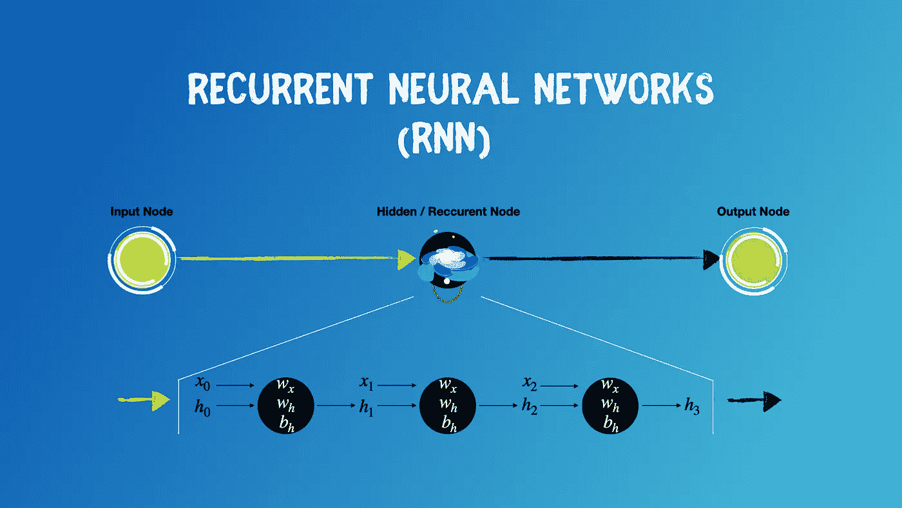

递归神经网络。图片由[作者](https://solclover.com/)提供。

# **简介**

对序列数据进行建模和预测需要一种不同于标准回归或分类的方法。幸运的是，一种被称为递归神经网络(RNNs)的特殊类型的神经网络就是为此目的而专门设计的。

在本文中，我将介绍 RNNs 的结构，并给出一个完整的例子，说明如何在 Python 中使用 Keras 和 Tensorflow 构建一个简单的 RNN。

如果你不熟悉神经网络的基本结构，你可能更愿意先熟悉一下[前馈](/feed-forward-neural-networks-how-to-successfully-build-them-in-python-74503409d99a)和[深度前馈](/deep-feed-forward-neural-networks-and-the-advantage-of-relu-activation-function-ff881e58a635) NNs。

# 内容

*   看看机器学习的世界
*   递归神经网络的体系结构
*   如何建立和训练你自己的 RNN 的 Python 例子

# 看看机器学习的世界

虽然神经网络最常以监督的方式使用带标签的训练数据，但我觉得它们独特的机器学习方法值得单独归类。

递归神经网络有自己的子分支，由简单 RNNs、LSTMs(长短期记忆)和 GRUs(门控递归单元)组成。

下图是**交互式的，**所以请点击不同的类别来**放大并展示更多的**👇。

机器学习算法分类。由[作者](https://solclover.com/)创作的互动图表。

***如果你喜欢数据科学和机器学习*** *，请* [*订阅*](https://solclover.com/subscribe) *获取我的新文章邮件。*

# 递归神经网络的结构

首先，让我们提醒自己典型的前馈神经网络是什么样子的。请注意，它可以包含任意数量的输入节点、隐藏节点和输出节点。下面的 2–3–2 结构纯粹是为了说明。

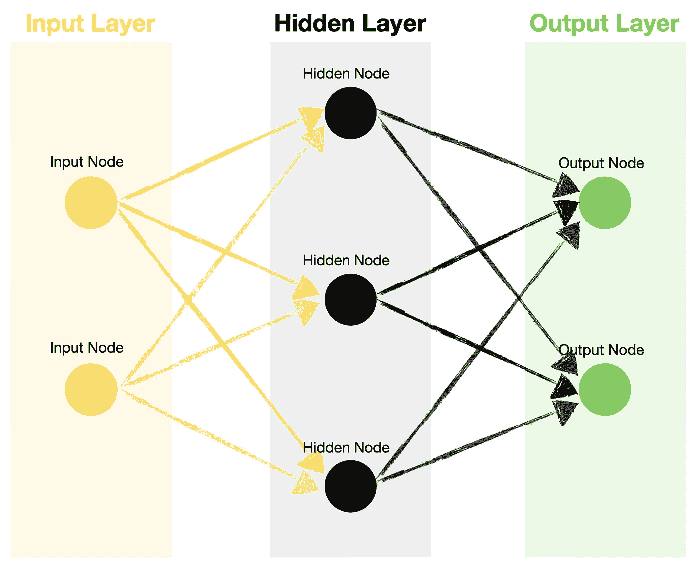

简单的前馈神经网络结构。图片由[作者](https://solclover.com/)提供。

接下来，如果我们看看 RNN，我们会注意到一个细微的差别。RNN 内部的隐藏单元有一个内置的反馈回路，使信息能够多次传回同一个节点。这些隐藏单元通常被称为**循环单元**。


简单递归神经网络结构。图片由[作者](https://solclover.com/)提供。

递归单元处理预定数量的**时间步长**的信息，每次通过激活功能传递该特定时间步长的隐藏状态和输入。

> **时间步长** —通过循环单元对输入进行单次处理。例如，如果您只有一个时间步长，那么您的输入将只被处理一次(相当于常规的隐藏节点)。如果您有七个时间步长，那么您的输入将被处理七次。

请参见下图，该图显示了循环单元内部的反馈回路:

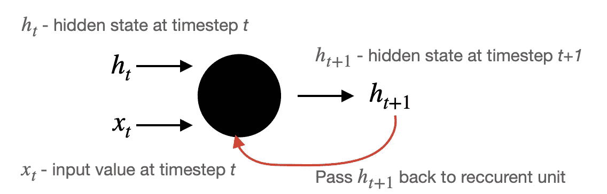

时间步长 t 处的循环单元操作。图片由[作者](https://solclover.com/)提供。

注意，在初始时间步，隐藏状态 h0 被初始化为 0。接下来，输出**(在 *t+1* 处的隐藏状态*h*)**被传递回递归单元，并与以下输入一起被再次处理:

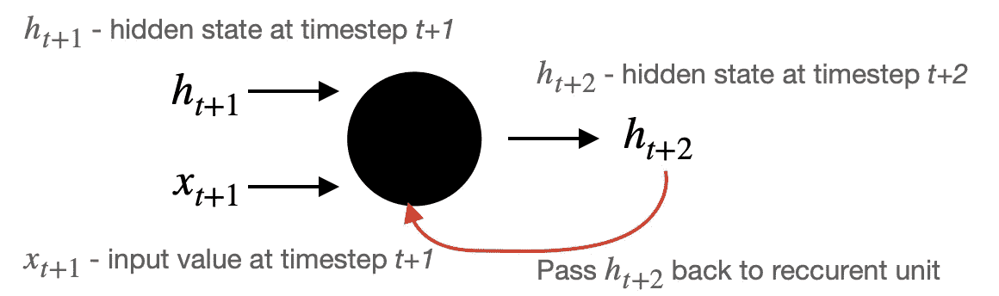

时间步长 t+1 的循环单元操作。图片由[作者](https://solclover.com/)提供。

重复该过程，直到达到指定的时间步长数。

让我们把所有这些联系起来，看看一个简单的 RNN 有一个输入、一个隐藏节点(包含三个时间步长)和一个输出会是什么样子。


递归单元的展开。图片由[作者](https://solclover.com/)提供。

为了更详细地解释发生了什么，让我们看一个简单的例子。

假设您想根据过去三天的气温序列来预测明天的气温。然后:

*   **输入** —虽然您可能只有一个输入节点，但您必须传递三个数字的序列作为您的输入，因为这是递归层所需要的，即[x0，x1，x2]，…，[x_{n-2}，x_{n-1}，x_{n}]。
*   **递归层** —在典型的前馈神经网络中，隐藏节点有两个参数:权重和偏差。然而，递归层有三个参数**需要优化:输入权重、隐藏单元权重和偏差。注意，即使你有十个时间步长，它仍然是三个参数。**
*   **训练** —使用反向传播算法训练典型的前馈神经网络。与此同时，训练 RNN 使用稍微修改的反向传播版本，其中包括及时展开来训练网络的权重。该算法基于计算梯度向量，简称为**时间反向传播**或 **BPTT** 。

现在您已经熟悉了一个简单 RNN 的架构，让我们来看一个 Python 示例。

[](https://solclover.com/membership)[](https://www.linkedin.com/in/saulius-dobilas/)

# 如何建立和训练你自己的 RNN 的 Python 例子

## 设置

我们需要以下数据和库:

*   [来自 Kaggle](https://www.kaggle.com/jsphyg/weather-dataset-rattle-package) 的澳大利亚天气数据(许可:[知识共享](http://www.bom.gov.au/other/copyright.shtml?ref=ftr)，数据原始来源:[澳大利亚联邦气象局](http://www.bom.gov.au/climate/data/))。
*   用于数据操作的[熊猫](https://pandas.pydata.org/docs/)和[熊猫](https://numpy.org/)
*   [Plotly](https://plotly.com/python/) 用于数据可视化
*   [用于递归神经网络的 Tensorflow/Keras](https://www.tensorflow.org/api_docs/python/tf)
*   [Scikit-learn 库](https://scikit-learn.org/stable/index.html)，用于将数据拆分为[训练测试](https://scikit-learn.org/stable/modules/generated/sklearn.model_selection.train_test_split.html?highlight=train_test_split#sklearn.model_selection.train_test_split)样本，用于数据缩放([最小最大缩放器](https://scikit-learn.org/stable/modules/generated/sklearn.preprocessing.MinMaxScaler.html))，以及用于附加模型评估([均方误差](https://scikit-learn.org/stable/modules/generated/sklearn.metrics.mean_squared_error.html))

让我们导入所有的库:

上面的代码打印了本例中使用的包版本:

```
Tensorflow/Keras: 2.7.0
pandas: 1.3.4
numpy: 1.21.4
sklearn: 1.0.1
plotly: 5.4.0
```

接下来，我们下载并获取澳大利亚的天气数据(来源: [Kaggle](https://www.kaggle.com/jsphyg/weather-dataset-rattle-package) )。我们还执行一些简单的数据操作，并导出一个新的变量(中间温度)供我们使用。

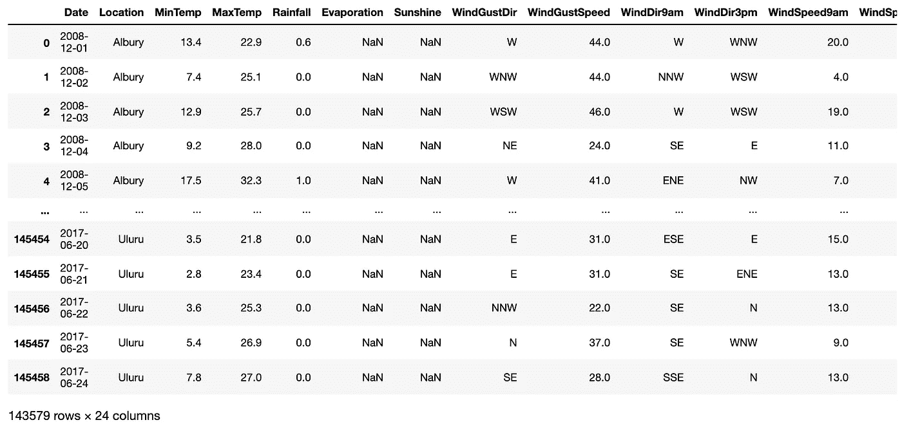

一小段 [Kaggle 的澳大利亚天气数据](https://www.kaggle.com/jsphyg/weather-dataset-rattle-package)做了一些修改。图片由[作者](https://solclover.com/)提供。

假设数据包含澳大利亚多个地方的天气信息，让我们选择一个城市(堪培拉)并在图表上绘制每日中值温度。

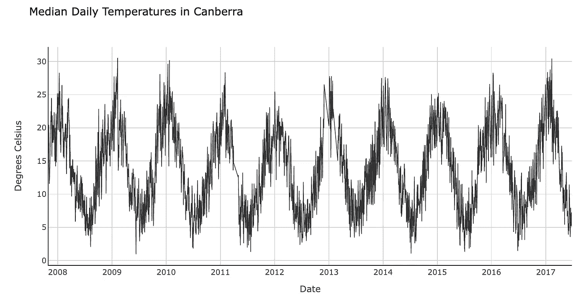

堪培拉的日平均气温。图片由[作者](https://solclover.com/)提供。

## 训练和评估递归神经网络(RNN)

在我们训练和评估我们的递归神经网络之前，我们需要创建一个函数来帮助我们重塑数据，以遵循所需的格式。

上述函数可以重构任意数量时间步长的数据。例如，由于我使用了七个时间步长(即，一系列 7 天的温度来预测第二天的气温)，它将像这样分割数据:


说明如何为 RNN 重新构建顺序数据。图片来自[作者](https://solclover.com/)。

现在我们可以训练和评估我们的 RNN。我们在这个例子中使用了一个极其简单的神经网络，它有四层，每层只有一个节点。通过添加额外的层、节点或改变激活函数，您可以随意进行试验。

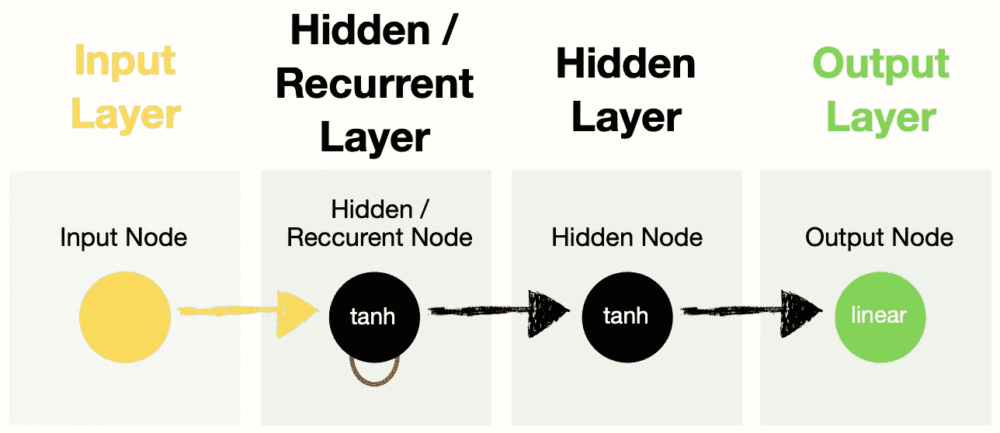

示例中使用的 RNN 的结构。图片由[作者](https://solclover.com/)提供。

我对下面的代码做了大量的注释，以便让您清楚地理解每个部分的作用。因此，我不会在文章正文中重复同样的内容。

上述代码为我们的递归神经网络打印了以下摘要和评估指标:

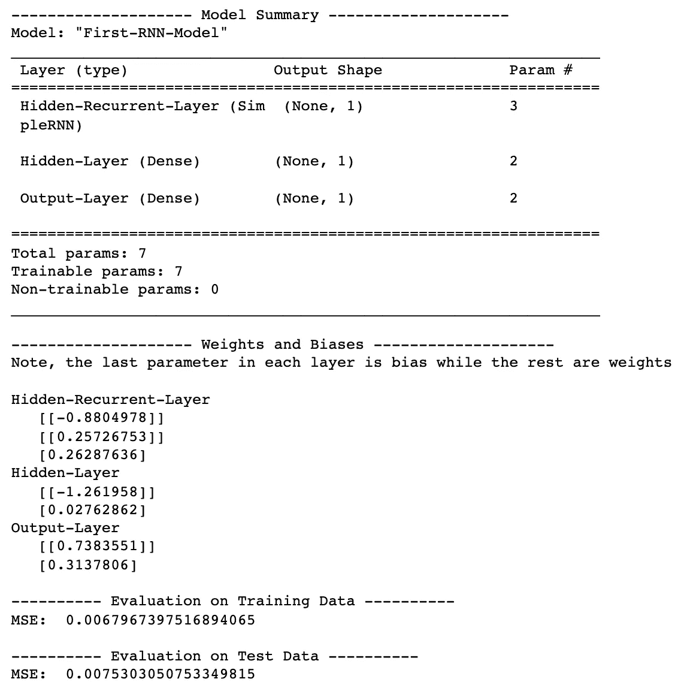

递归神经网络性能。图片由[作者](https://solclover.com/)提供。

现在让我们将结果绘制在图表上，并比较实际值和预测值。注意，我们使用 **inverse_transform** 函数将目标和预测从缩放(我们在训练 RNN 之前使用了 MinMaxScaler)转换到原始值范围。

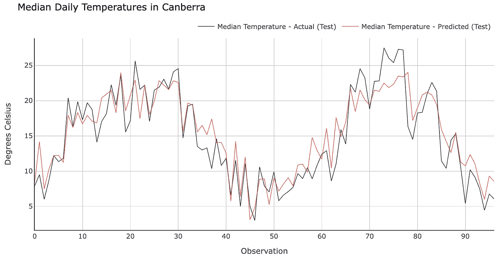

RNN 模型对试验数据的预测。图片由[作者](https://solclover.com/)提供。

以上结果是针对测试数据集的。预测看起来相当准确，但是请记住，我们在每种情况下都取 7 个先前的数据点，并且只预测下一个。因此，如果我们试图预测未来的多个时间点，这个特定模型的结果会不太准确，我将在后面的示例中展示这一点。

## **使用 RNN 生成预测**

您会记得，在上述模型的训练和预测过程中，我们将序列中的每第 8 个观察值作为目标。但是，如果我们想用这个模型为我们的数据框架中的每一项(每一天)生成预测呢？下面的代码正是这样做的:

因为我们将模型预测添加到了原始数据框架中，所以我们可以使用它来绘制结果。

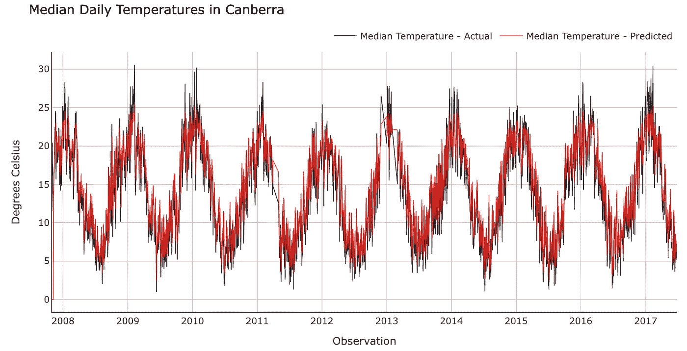

整个数据样本的 RNN 模型预测。图片由[作者](https://solclover.com/)提供。

再次，相当不错的结果记住，我们只预测未来一天的温度。

如果我们试图预测未来 365 天的温度，一次预测一天的温度，会怎么样？我们将尝试在 7 天序列中反复添加新的预测，同时从序列中删除最早的预测。

最后，我们重用上一步中的图表绘制代码来显示过去两年的结果和未来 365 天的预测。

```
replace:
x=dfCan['Date'] → x=dfCan2['Date'][-730:] # for both traces
y=dfCan['MedTemp'] → y=dfCan2['MedTemp'][-730:] # for first trace
y=dfCan['MedTemp_prediction'] → y=dfCan2['MedTemp_prediction'][-730:] # for second trace
```

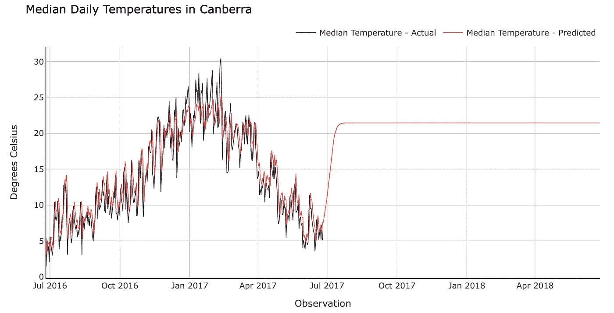

RNN 模型对未来 365 天的预测。图片由[作者](https://solclover.com/)提供。

我们可以看到，使用现有的 RNN 模型进行任何长于*日+1* 的预测都是不明智的。这种结果的原因是，我们设计它只是为了提前一天进行预测，并且部分受到具有相对“短记忆”的 RNNs 的影响。

在即将到来的文章中，我将分析更高级版本的递归神经网络，如 **LSTM(长短期记忆)**和 **GRU(门控递归单元)**，所以不要忘记[订阅](https://solclover.com/subscribe)不要错过它们。

# 结束语

我真诚地希望你喜欢阅读这篇文章，并获得一些新的知识。

请使用本文提供的代码来构建您自己的递归神经网络。你可以在我的 [GitHub 库](https://github.com/SolClover/Art043_NN_Recurrent_Neural_Networks)中找到完整的 Jupyter 笔记本。

在我努力让我的文章对读者更有用的时候，如果你能让我知道是什么驱使你阅读这篇文章，以及它是否给了你想要的答案，我将不胜感激。如果不是，缺少什么？

干杯！👏
**索尔·多比拉斯**

***如果你已经花光了这个月的学习预算，下次请记得我。*** *我的个性化链接加盟媒介:*

<https://solclover.com/membership>  

您可能感兴趣的其他文章:

</feed-forward-neural-networks-how-to-successfully-build-them-in-python-74503409d99a>  </deep-feed-forward-neural-networks-and-the-advantage-of-relu-activation-function-ff881e58a635>  </lle-locally-linear-embedding-a-nifty-way-to-reduce-dimensionality-in-python-ab5c38336107> 