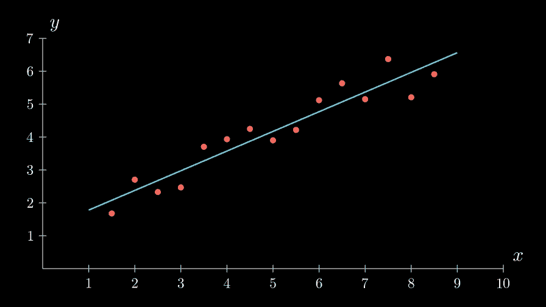
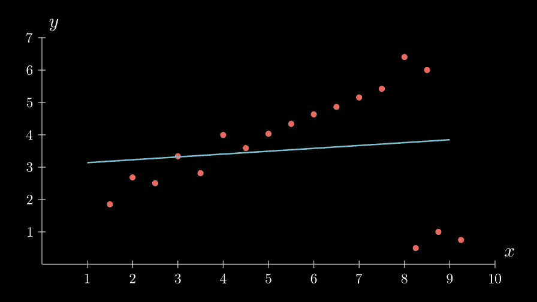
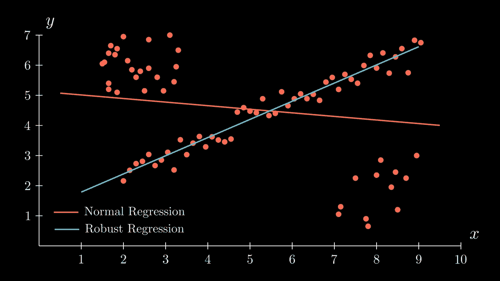
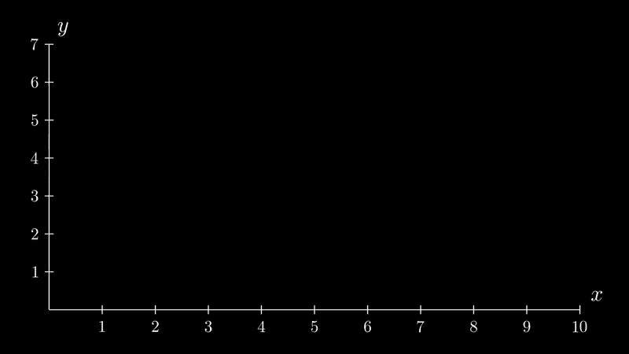
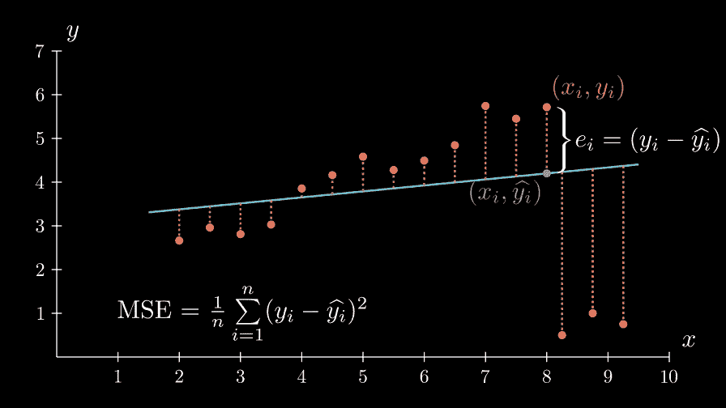
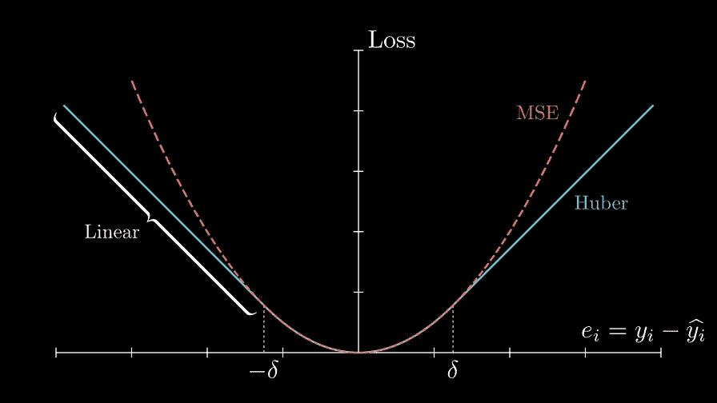
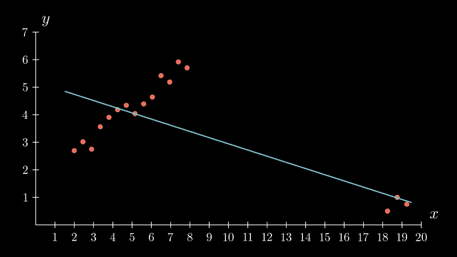
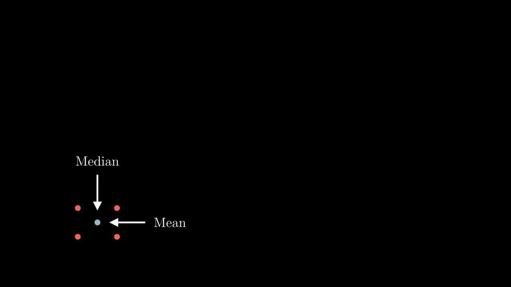
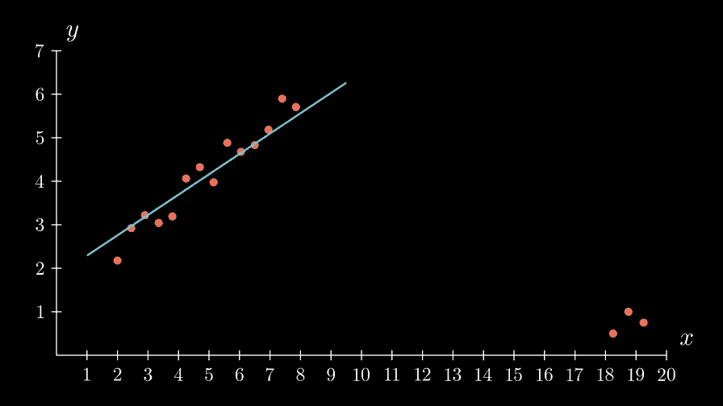
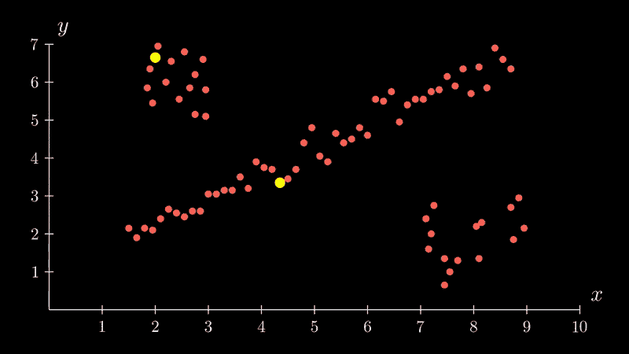

# 线性回归的一个大问题以及如何解决

> 原文：<https://towardsdatascience.com/robust-regression-23b633e5d6a5>

## 机器学习中的稳健回归简介

经典线性回归背后的想法很简单:在数据点上画一条**“最佳拟合”线**，使均方误差最小化:

普通最小二乘法的经典线性回归。(图片由作者提供)

看起来不错。但是在现实生活中，我们并不总是得到如此干净、良好的数据。相反，我们可能会得到这样的结果:

与上面相同的算法，但是现在由于异常值而表现不佳。(图片由作者提供)

现在这是一场灾难——只有几个**错误，外围点**破坏了线性模型，即使人眼很清楚如何画出“最佳”线。

你可能会认为我们所要做的就是剔除那些异常值，我们就完成了，但是当你有一个 4096 维的数据集和一百万个样本时，祝你好运！事情会很快失控。相反，我们需要一个通用的方法，使我们能够执行回归**，尽管**离群值或严重噪声。

由此出现了**稳健回归**的概念。

正常回归比稳健回归表现差。(图片由作者提供)

这种离群点的出现是错误测量、噪声、人为错误或错误假设的常见结果，尤其是在(非常)高维自然数据(图像、音频等)普遍存在的机器学习中。

在本文中，您将知道如何正确地将模型拟合到遭受这种问题的数据，如上图所示。

# 预赛

要解决问题，我们必须知道问题的确切原因。

回想一下线性回归是如何工作的:由于直线( *y=mx+b* )完全由两个参数 *m* 和 *b* 描述，我们必须找到 *m* 和 *b* 的值，使得直线和实际数据点之间的**均方误差** (MSE)最小化**:**

****

**MSE =(虚线长度的平方之和)÷(虚线的数量)。(作者制作的动画)**

**您可以将虚线(代表地面实况数据点和直线之间的误差)视为金属弹簧，将蓝线视为刚性杆。弹簧以正比于其长度平方的力将杆拉向它们的红点，直到达到平衡。**

**然而，这种方法的问题是，一旦你得到一个外围点…**

****

**离群值破坏了模型的运行。(作者制作的动画)**

**…该点和线**之间的误差将计入总误差**，算法将尝试将其最小化。换句话说，异常值的“弹簧”会把线拉向他们。**

**但这激发了一个想法:**

> *****忽略或减少离群点的误差，使其不会影响总 MSE。*****

**那么，我们如何识别外围点的错误呢？**

# **胡伯损失回归**

**回想一下 MSE 损失的定义:**

****

**均方误差图。(图片由作者提供)**

**虚线的长度(即误差或残差)被平方、相加，然后除以点数( *n* )以获得需要最小化的均方误差损失。**

**Huber loss 的想法是**不平方橙色虚线**(代表异常值的误差)的长度，而只平方红色虚线，这样异常值就不会对损失造成太大影响。**

**为了知道哪些误差不平方，我们定义了一个准则:**如果绝对误差大于某个阈值(δ)，就不平方。**由于异常值通常“远离”原始点(因此它们具有较大的误差)，它们*希望*不会被平方，因此对整体损失的影响较小。**

****

**Huber 损失与 MSE 损失的比较。x 轴是数据点和直线之间的误差(残差)。指出了 Huber 损耗的线性部分，其中误差没有平方。(图片由作者提供)**

**要实现 Huber 损耗，只需用您最喜欢的最小化算法中的 Huber 损耗替换 MSE 损耗:**

****

**用误差表示 MSE 损失和 Huber 损失的数学表达式。(图片由作者提供)**

**让我们看看它是如何工作的:**

****

**Huber 回归在行动。红色虚线是方形的，而橙色虚线不是。(作者制作的动画)**

**不错！现在，异常值对算法的影响没有以前那么大，因为它们相应的损失被衰减了。使用弹簧类比，橙色弹簧现在比红色弹簧弱，拉力也没有红色弹簧大。**

**然而，这种方法存在一些问题。一个是选择δ的值。它应该是什么并不总是很清楚，所以要不断试错(δ=1.35 是一个典型的开始)。另一个问题是，如果离群值太远…**

****

**胡伯回归遭到破坏。(图片由作者提供)**

**…事情可能会变得不可收拾——它们的误差变得如此之大，以至于即使没有平方，它们也会超过损失。然而，我们仍然很清楚什么是“最佳拟合”线，所以必须有另一种方法来解决这个问题。**

# **泰尔-森回归**

**统计学家中有一句名言:**

> **中位数比平均数更能抵抗异常值。**

**原因显而易见:**

****

**与数轴上五个数的中值相比的算术平均值。(作者制作的动画)**

**中值的概念也可以扩展到任意数量的维度(在所谓的 [**空间中值**](https://en.wikipedia.org/wiki/Geometric_median) 中)，同时仍然保留其抗异常值的属性:**

****

**与四个 2D 点的分量平均值相比的空间中值。(作者制作的动画)**

**于是产生了**泰尔森回归**的想法:**

> ***用一条直线将每一对点连接起来(*y*=*m**ᵢ**x*+*b**ᵢ***)得到斜率截距对列表(* m **ᵢ，** b **ᵢ** *)。这些对的空间中值将给出最佳拟合线的斜率和截距。***

**让我们来看看这个爆炸的案例是如何运作的:**

****

**泰尔森回归在行动。(图片由作者提供)**

**太棒了。**

**你可能已经注意到，我们需要连接每一对点，这给了我们( *n* 选择 2)=*n*(*n*—1)**2 对(如果 *n* 是点数)。对于大型数据集，这可能导致难以处理的长计算时间(例如，仅 1000 个点就产生 50 万个(*m****ᵢ*，***b****ᵢ***)对来寻找的空间中值)。****

****一种解决方案是只对这些点对的随机子集进行处理，或者不是连接每一对点来得到一条线，而是将一条线拟合到每一个 *k* 点元组。这牺牲了速度的鲁棒性。另一个解决方案是使用 RANSAC。****

# ****兰萨克****

****随机样本一致性(RANSAC)算法基于这样一种想法，即数据的随机子集具有一定的无异常值概率，因此将模型拟合到该子集可能会产生最佳拟合模型。因此，重复挑选一个随机子集并对其拟合模型的过程足够多次，将有希望产生最佳拟合模型。该算法的典型版本如下:****

1.  ****从数据中随机抽取点的子集。****
2.  ****将线性(或其他)模型拟合到随机样本。****
3.  ****计算所有点和模型之间的误差(即残差)。误差小于预定阈值的点被分类为内点，其余的被分类为外点。****
4.  ****重复上述步骤特定次数，选择**得分最高的型号**作为最适合的型号。****

********

****RANSAC 插图:将线性模型拟合到两个随机选取的点，计算得分，并重复该过程。得到的模型是得分最高的模型。(作者制作的动画)****

****分数通常被定义为内球的数量。如果两个模型的内层数相等，选择 MSE 最小或 R 最大的一个。****

****这种方法的一个直接缺点是它是不确定的。也就是说，它并不总是保证产生我们正在寻找的最佳拟合模型，因为我们在有限的迭代次数中处理随机子集。此外，超参数(子集大小、迭代次数、停止标准)是特定于问题的，需要手动调整。然而，RANSAC 是一种强大且广泛使用的算法，尤其是在计算机视觉中，这是由于其鲁棒性和扩展到非线性模型和更高维数据集的能力。****

# ****结论****

****现在，您知道了如何使模型稳健地适应被异常值破坏的数据。上面的每种方法都有自己的优点和缺点，所以在选择哪种方法来解决给定的问题时要小心。此外，应进行适当的分析，以确保异常值是真正由不必要的误差和噪声引起的，还是由数据中尚未考虑的重要潜在模式引起的。****

****上述三种算法都可以从 [scikit-learn 库](https://scikit-learn.org/stable/auto_examples/linear_model/plot_robust_fit.html)中获得。****

****保持强壮。****