# 基于蒙特卡罗模拟的鲁棒供应链网络

> 原文：<https://towardsdatascience.com/robust-supply-chain-network-with-monte-carlo-simulation-21ef5adb1722>

## 当你设计一个供应链网络时，你考虑到你的需求波动了吗？

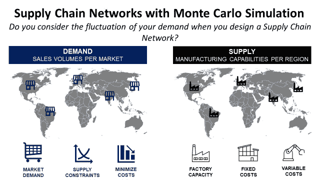

(图片由作者提供)

# 目标

建立一个简单的考虑需求波动的供应链网络设计方法。

# 介绍

供应链优化充分利用数据分析，找到**工厂**和**配送中心**的最佳组合，以满足您客户**的**需求**。**

在市场上的很多软件和解决方案中，背后的核心结构是一个[线性规划模型](https://www.youtube.com/watch?v=XXzOCbbXM7s)。

假设 [**需求**](/supply-chain-optimization-with-python-23ae9b28fd0b) 不变，这些模型中的一些找到工厂的正确分配以满足需求并最小化成本。

> 如果需求波动会发生什么？

你的网络可能会失去稳健性，尤其是当你的需求季节性很强时(电子商务、化妆品、快时尚)。

在本文中，我们将构建一个简单的方法来设计一个**健壮的供应链网络**，使用 Python 的蒙特卡罗模拟。

💌新文章直接免费放入你的收件箱:[时事通讯](https://www.samirsaci.com/#/portal/signup)

```
**SUMMARY**
**I. Supply Chain Network Design** Find the right allocation of factories to meet a global demand
**II. Problem Statement** What happens if your demand is fluctuating?
**1\. Limits of the initial solution** Understand the robustness of the initial solution **2\. Methodology of simulation** Simulate 50 scenarios based on a normal distribution of the demand
**3\. Analyze the results
What are the different combinations of solutions?
4\. Final Solution** The most robust combination?
**III. Conclusion & Next Steps**
```

如果你喜欢看，可以看看这篇文章的视频

# 一.供应链网络设计

## 1.全球供应链网络

作为一家国际制造公司的供应链管理负责人，你想重新定义未来 5 年的供应链网络。

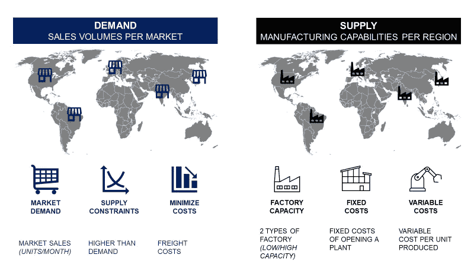

供应链网络问题—(图片由作者提供)

需求从五个不同市场(巴西、美国、德国、印度和日本)的客户需求开始。

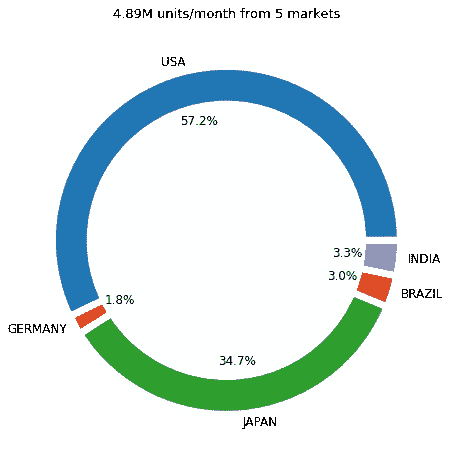

百万单位/月的需求—(图片由作者提供)

美国市场驱动了一半以上的需求。

**供货能力** 你可以在五个市场开厂。在低容量和高容量设施之间有一个选择。

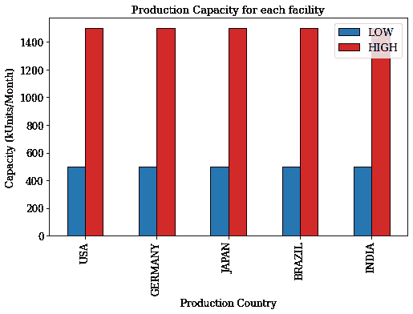

(图片由作者提供)

*示例:美国的低产能工厂每月可生产 500，000 台。*

**固定成本**
如果你开设一家工厂，你的预算中会增加固定成本(电力、房地产、资本支出等)。

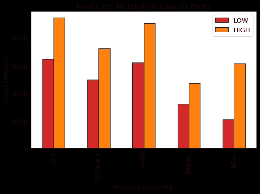

(图片由作者提供)

印度高容量工厂的固定成本低于美国低容量工厂。

**可变成本**

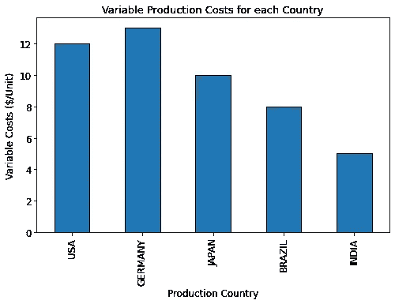

(图片由作者提供)

*固定成本+可变成本=生产总成本*

**运费**
将一个集装箱从 XXX 国运到 YYY 国的费用。

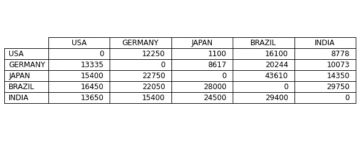

运费(美元/集装箱)——(图片作者提供)

**总成本**

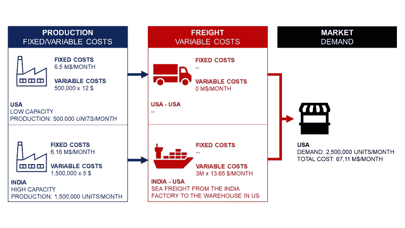

(图片由作者提供)

*生产并将产品运送到市场的总成本。*

根据市场需求，我需要在哪里开设工厂？

## 3.线性规划模型

关于更多的细节，你可以在参考链接中找到以前的文章，在那里我详细解释了如何使用 PuLP Python 库来实现它。

这是一个经典的带有目标函数、约束和参数的线性规划问题。


(图片由作者提供)

**制造足迹**
*我需要在哪里打开位置？*

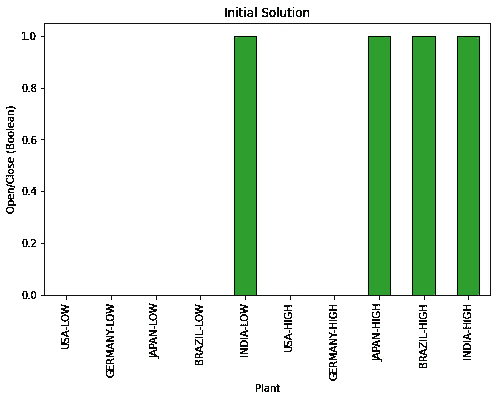

(图片由作者提供)

*你需要在巴西、美国、日本和印度开设四家分店。除了巴西，所有这些地方都是高容量工厂。*

**产品流**
YYY 工厂为 XXX 市场生产了多少台？

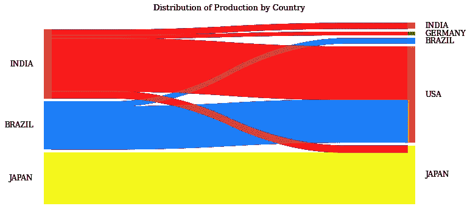

(图片由作者提供)

*日本工厂只为当地市场生产，而巴西和印度主要由出口需求驱动。*

[](http://samirsaci.com) [## 萨米尔 Samir 供应链组合的数据科学

### 🏭使用高级数学概念的供应链网络优化👨‍🏭仓储的持续改进…

samirsaci.com](http://samirsaci.com) 

# 二。问题陈述

> *你可以在我的 Github(跟随我:D)资源库中找到* ***源代码*** *带* ***哑数据****:*[链接](https://github.com/samirsaci/monte-carlo)
> *我的作品集与其他项目:* [*萨奇*](https://samirsaci.com/)

这种解决方案是在假设市场需求不变的情况下实施的。

## **1。初始解决方案的限制**

如果我们在日本有+10%,在美国有+20%,会有什么影响？

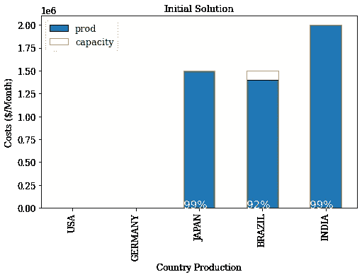

(图片由作者提供)

*通过查看利用率，您可以很容易地猜到您当前的占用空间将无法适应这种激增的需求。*

## 2.模拟方法论

我们不能依赖单一的解决方案，并期望我们的网络能够吸收全年的需求。

通常，这些参数是根据年平均销售额计算出来的。

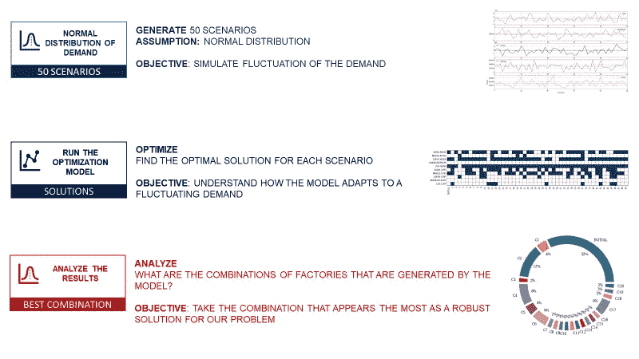

(图片由作者提供)

*让我们模拟这种需求变化，看看对网络设计的影响。*

## 生成 50 个场景

我们假设需求遵循正态分布，变异系数 CV = 0.5。*(您可以根据自己的需要调整发行版)*

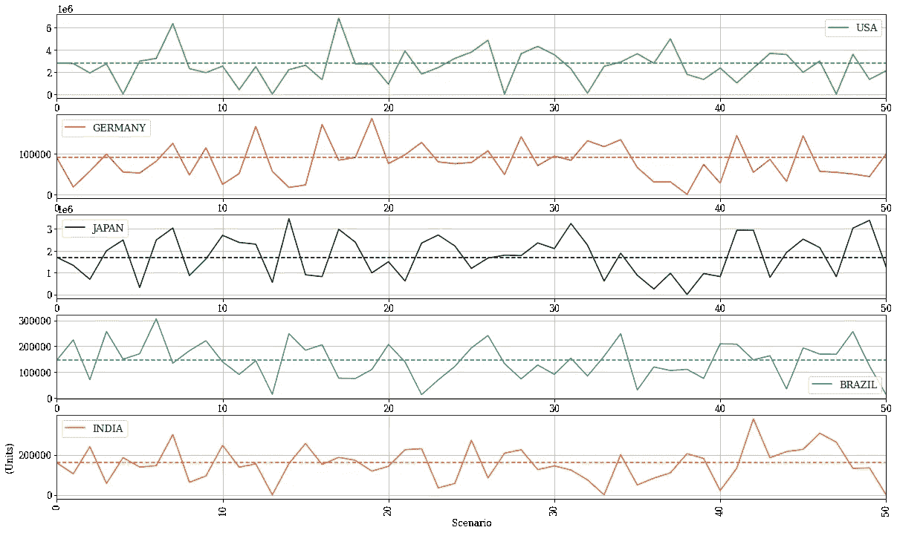

(图片由作者提供)

现在你有一个 50 列的矩阵，代表你的 50 个不同的场景。

**每个场景的最优解** 每个场景的最优组合是什么？

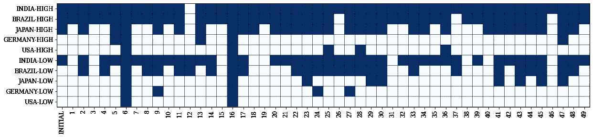

场景结果的布尔图—[使用 Python 创建布尔图:[教程](https://www.youtube.com/watch?v=xkJA2YgiKyg)

*   *印度始终至少有一家工厂开放*
*   *场景 16 需要开放所有设施，因为美国需求达到峰值*
*   *场景 12 在巴西和印度只需要 2 个低产能设施*

**最优组合的分布** 我们是否有比其他组合出现频率更高的组合？

删除重复后，我们有 16 个独特的组合

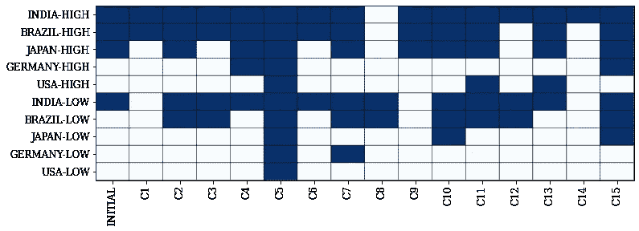

场景结果的布尔图—[使用 Python 创建布尔图:[教程](https://www.youtube.com/watch?v=xkJA2YgiKyg)

哪种组合看起来最稳健？

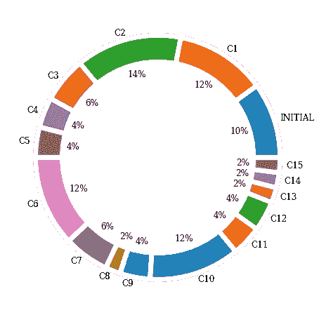

按解决方案绘制事件的圆环图—[使用 Python 创建圆环图:[教程](https://www.youtube.com/watch?v=eGH4ZQYT3-4)

组合 C2(印度和巴西的高/低植物+日本的 1 株高植物)似乎出现得最多。紧随其后的是 C2、C6 和 C10。

## 4.最终解决方案

起草一个明确的结论并不容易，但如果我们选择安全的解决方案，我们需要采取 C2 组合。

由于它在低生产成本国家的足迹最大化，我们肯定能满足大多数情况下的需求。

[](http://samirsaci.com) [## 萨米尔·萨奇

### 数据科学博客，专注于仓储，运输，数据可视化和机器人流程自动化…

samirsaci.com](http://samirsaci.com) 

# 三。后续步骤

*关注我的 medium，了解更多与供应链数据科学相关的见解。*

## 结论

这个问题没有完美的解决方案，因为我们需要在保证供应和降低成本之间权衡轻重。

这种方法是围绕库存服务水平和生产成本目标展开讨论的良好开端。

## 下一步

现在我们有了一组潜在最佳解决方案的候选方案，我们需要在我们的 50 个场景中测试它们:

*   每个场景的总成本是多少？
*   我们的工厂产生的需求百分比是多少？

这将带来量化信息，开始与管理层讨论，并获得最终仲裁。

# 关于我

让我们在 [Linkedin](https://www.linkedin.com/in/samir-saci/) 和 [Twitter](https://twitter.com/Samir_Saci_) 上连线，我是一名供应链工程师，使用数据分析来改善物流运营和降低成本。

如果你对数据分析和供应链感兴趣，可以看看我的网站

[](https://samirsaci.com) [## Samir Saci |数据科学与生产力

### 专注于数据科学、个人生产力、自动化、运筹学和可持续发展的技术博客

samirsaci.com](https://samirsaci.com) 

# 参考

[1] —用 Python 优化供应链，[萨米尔萨奇](https://medium.com/u/bb0f26d52754?source=post_page-----21ef5adb1722--------------------------------)，[链接](/supply-chain-optimization-with-python-23ae9b28fd0b)