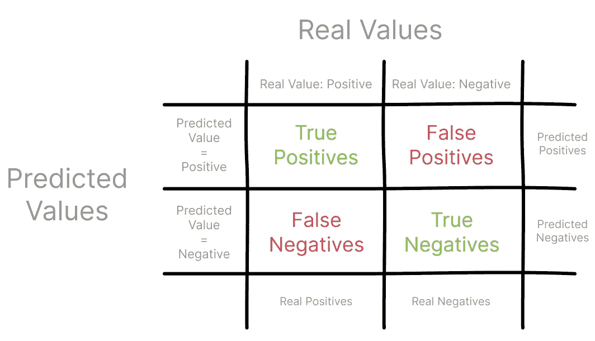
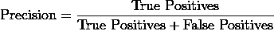
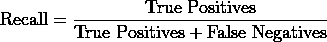
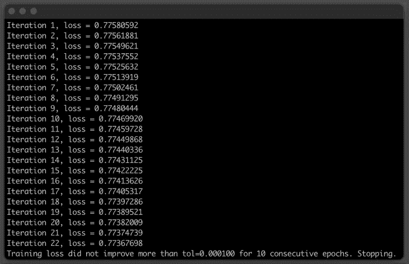
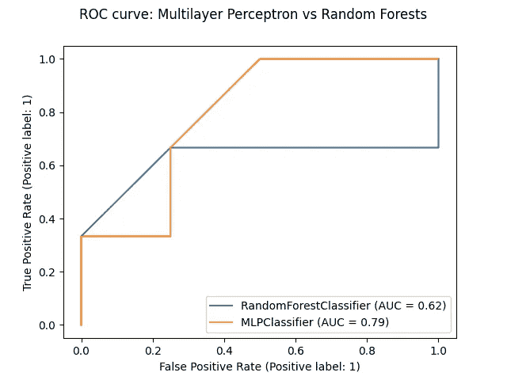

# ROC 分析和 AUC —曲线下面积

> 原文：<https://towardsdatascience.com/roc-analysis-and-the-auc-area-under-the-curve-404803b694b9>

## 用 Python 中的一个真实例子来解释


(图片由作者提供)

*受试者操作特征曲线(ROC)分析和曲线下面积(AUC)是数据科学中广泛使用的工具，借用信号处理来评估不同参数化下模型的质量，或者比较两个或多个模型的性能。*

*传统的性能指标，如精确度和召回率，严重依赖于正面的观察。因此，ROC 和 AUC 使用真阳性和假阳性率来评估质量，同时考虑阳性和阴性观察结果。*

从分解问题到用机器学习解决问题的道路有多个步骤。在高层次上，它涉及数据收集、清理和特征工程、构建模型，最后但同样重要的是，**评估模型性能**。

当您评估模型的质量时，通常会使用像 [precision 和](https://en.wikipedia.org/wiki/Precision_and_recall)recall 这样的指标，也分别称为数据挖掘领域的置信度和敏感度。

这些指标将预测值与实际观察值进行比较，通常来自一个保留集，最好使用[混淆矩阵](https://en.wikipedia.org/wiki/Confusion_matrix)进行可视化。



*混淆矩阵(图片由作者提供)*

先来关注一下**精度**，也称为阳性预测值。使用**混淆矩阵**，您可以将精度构建为所有真阳性与所有预测阳性的比率。



**回忆**，也称为真阳性率，代表真阳性与观察到的和预测的所有阳性的比率。



使用混淆矩阵中不同的观察集合来描述精度和召回，您可以开始看到这些度量如何提供模型性能的狭窄视图。

一个突出的事实是，精确度和召回率只关注正面的例子和预测[1]，而不考虑任何负面的例子。此外，他们没有将模型的性能与中位数情景进行比较，中位数情景只是简单的随机猜测。

> 在深入研究如何计算精确度和召回率之后，您可以开始看到这些指标如何提供模型性能的一个狭窄视图。

为了补充您的模型评估并从精度和召回中排除偏差，您可以在数据科学家的工具包中使用一些强大的工具:**接收器操作特性曲线(ROC)** 分析及其**曲线下面积(AUC)** 。

# ROC 曲线:从信号理论到机器学习

ROC 是一个总结工具，用于可视化精确度和召回率之间的权衡[2]。

这项技术出现在信号检测理论领域，是二战期间雷达技术发展的一部分[3]。对于不熟悉信号理论的人来说，这个名字可能有点混乱，但它指的是由军用雷达操作员读取雷达信号，因此有了[接收机工作特性曲线](https://en.wikipedia.org/wiki/Receiver_operating_characteristic#History)中的*接收机工作*部分。

雷达操作员的部分工作是在雷达上识别接近的敌方单位，关键部分是能够从噪声(例如，静态噪声或其他随机干扰)中准确区分信号(即，实际进入的单位)。他们是判断什么是信号，什么是噪音的专家，当一个假想的敌人单位是你自己的单位或者根本没有东西的时候，他们可以避免向它冲锋。

现在你可能在想*等等，这听起来像是一个熟悉的任务！*

事实上，这项任务在概念上非常类似于将图像分类为猫或不是猫，或者检测患者是否患有疾病，同时保持较低的假阳性率。

**ROC 分析**利用 ROC 曲线确定二进制信号的值有多少被噪声污染，即随机性【4】。它提供了一系列操作点的灵敏度和特异性的总结，作为一个连续的预测器[5]。

ROC 曲线通过将 x 轴上的*假阳性率*对 y 轴上的*真阳性率*作图而获得。

因为*真阳性率*是检测到信号的概率，而*假阳性率*是错误警报的概率，ROC 分析也被广泛用于医学研究，以确定有把握地检测疾病或其他行为的阈值[5]。


不同 ROC 曲线的示例(图片由作者提供)

一个完美的模型将具有为零的假阳性率*和等于一的真阳性率*，因此它将是 ROC 图左上方的一个单一操作点。而最差的可能模型将在 ROC 图的右下方有一个工作点，其中*假阳性率*等于 1，而*真阳性率*等于 0。**

> *它[ROC 曲线]提供了一系列操作点的敏感性和特异性的汇总，作为一个连续的预测因子。*

*随机猜测模型有 50%的机会正确预测结果，因此，*假阳性率*将总是等于*真阳性率*。这就是为什么图上有一条对角线，代表*检测信号对噪声*的 50/50 几率。*

# *使用曲线下面积(AUC)评估机器学习模型*

*你的父母有一个舒适的床和早餐，而你，作为一名数据科学家，让自己建立一个模型，将他们的评论分为积极或消极。*

*为了处理这个[情感分析](https://en.wikipedia.org/wiki/Sentiment_analysis)任务，你从使用[多层感知器](/multilayer-perceptron-explained-with-a-real-life-example-and-python-code-sentiment-analysis-cb408ee93141)开始，并使用准确度和损失作为一种方式来理解是否真的足够好来解决你的分类问题。*

*知道了 **ROC 分析**如何抵抗偏差，以及它在机器学习中用于比较模型或比较同一模型的不同参数化的事实，您想知道在对来自您父母的家庭和早餐的评论进行分类时，多层感知器是否确实是一个好模型。*

*为了重建模型，你需要收集评论集，然后把它分成训练和测试两部分，并对其进行标记。*

```
*from sklearn.model_selection import train_test_split
from sklearn.feature_extraction.text import TfidfVectorizer

corpus = [
    'We enjoyed our stay so much. The weather was not great, but everything else was perfect.',
    'Going to think twice before staying here again. The wifi was spotty and the rooms smaller than advertised',
    'The perfect place to relax and recharge.',
    'Never had such a relaxing vacation.',
    'The pictures were misleading, so I was expecting the common areas to be bigger. But the service was good.',
    'There were no clean linens when I got to my room and the breakfast options were not that many.',
    'Was expecting it to be a bit far from historical downtown, but it was almost impossible to drive through those narrow roads',
    'I thought that waking up with the chickens was fun, but I was wrong.',
    'Great place for a quick getaway from the city. Everyone is friendly and polite.',
    'Unfortunately it was raining during our stay, and there weren\'t many options for indoors activities. Everything was great, but there was literally no other oprionts besides being in the rain.',
    'The town festival was postponed, so the area was a complete ghost town. We were the only guests. Not the experience I was looking for.',
    'We had a lovely time. It\'s a fantastic place to go with the children, they loved all the animals.',
    'A little bit off the beaten track, but completely worth it. You can hear the birds sing in the morning and then you are greeted with the biggest, sincerest smiles from the owners. Loved it!',
    'It was good to be outside in the country, visiting old town. Everything was prepared to the upmost detail'
    'staff was friendly. Going to come back for sure.',
    'They didn\'t have enough staff for the amount of guests. It took some time to get our breakfast and we had to wait 20 minutes to get more information about the old town.',
    'The pictures looked way different.',
    'Best weekend in the countryside I\'ve ever had.',
    'Terrible. Slow staff, slow town. Only good thing was being surrounded by nature.',
    'Not as clean as advertised. Found some cobwebs in the corner of the room.',
    'It was a peaceful getaway in the countryside.',
    'Everyone was nice. Had a good time.',
    'The kids loved running around in nature, we loved the old town. Definitely going back.',
    'Had worse experiences.',
    'Surprised this was much different than what was on the website.',
    'Not that mindblowing.'
]

# 0: negative sentiment.  1: positive sentiment
targets = [1, 0, 1, 1, 1, 0, 0, 0, 1, 0, 0, 1, 1, 1, 0, 0, 1, 0, 0, 1, 1, 1, 1, 0, 0]

# Splitting the dataset
train_features, test_features, train_targets, test_targets = train_test_split(corpus, targets, test_size=0.25,random_state=123)

#Turning the corpus into a tf-idf array
vectorizer = TfidfVectorizer(stop_words='english', lowercase=True, norm='l1')*
```

*[多层感知器](/multilayer-perceptron-explained-with-a-real-life-example-and-python-code-sentiment-analysis-cb408ee93141)模型准备好接受训练。*

```
*from sklearn.neural_network import MLPClassifier

def buildMLPerceptron(train_features, train_targets, num_neurons=2):
    """ Build a Multi-layer Perceptron and fit the data
        Activation Function: ReLU
        Optimization Function: SGD, Stochastic Gradient Descent
        Learning Rate: Inverse Scaling
    """

    classifier = MLPClassifier(hidden_layer_sizes=num_neurons, max_iter=35, activation='relu', solver='sgd', verbose=10, random_state=762, learning_rate='invscaling')
    classifier.fit(train_features, train_targets)

    return classifier

train_features = vectorizer.fit_transform(train_features)
test_features = vectorizer.transform(test_features)

# Build Multi-Layer Perceptron with 3 hidden layers, each with 5 neurons
ml_percetron_model = buildMLPerceptron(train_features, train_targets, num_neurons=5)*
```

*都准备好训练模型了！当您运行上面的代码时，您会看到类似下面的内容。*

**

**训练多层感知器模型的输出。(图片由作者提供)**

*为了全面分析 ROC 曲线，并将您刚刚构建的多层感知器模型的性能与其他几个模型进行比较，您实际上想要计算曲线下的[面积(AUC)](https://en.wikipedia.org/wiki/Receiver_operating_characteristic#Area_under_the_curve) ，在文献中也称为 *c 统计量*。*

***曲线下面积(AUC)** 的值介于 0 和 1 之间，因为该曲线绘制在 1x1 网格上，与信号理论平行，它是信号可检测性的度量[6]。*

*这是一个非常有用的统计数据，因为它给出了模型如何排列真实观察值和错误观察值的想法。它实际上是一个标准化版本的 [Wilcoxon-Mann-Whitney 秩和检验](https://en.wikipedia.org/wiki/Mann%E2%80%93Whitney_U_test#Area-under-curve_(AUC)_statistic_for_ROC_curves)，该检验从单个分布中抽取两个有序测量样本来检验零假设【4】。*

*c-statistics 对一正一负的平局数进行归一化处理。*

> *[……]与信号理论类似，[曲线下的区域]它是信号可检测性的度量。*

*为了绘制 ROC 曲线并计算曲线下面积(AUC ),您决定使用 [SckitLearn 的 RocCurveDisplay 方法](https://scikit-learn.org/stable/modules/generated/sklearn.metrics.RocCurveDisplay.html#sklearn.metrics.RocCurveDisplay.from_estimator),并将您的[多层感知器](/multilayer-perceptron-explained-with-a-real-life-example-and-python-code-sentiment-analysis-cb408ee93141)与随机森林模型进行比较，尝试解决相同的分类任务。*

```
*import matplotlib.pyplot as plt
from sklearn.ensemble import RandomForestClassifier
from sklearn.metrics import roc_auc_score, RocCurveDisplay

def plot_roc(model, test_features, test_targets):
    """
    Plotting the ROC curve for a given Model and the ROC curve for a Random Forests Models
    """

    # comparing the given model with a Random Forests model
    random_forests_model = RandomForestClassifier(random_state=42)
    random_forests_model.fit(train_features, train_targets)

    rfc_disp = RocCurveDisplay.from_estimator(random_forests_model, test_features, test_targets)
    model_disp = RocCurveDisplay.from_estimator(model, test_features, test_targets, ax=rfc_disp.ax_)
    model_disp.figure_.suptitle("ROC curve: Multilayer Perceptron vs Random Forests")

    plt.show()

# using perceptron model as input
plot_roc(ml_percetron_model, test_features, test_targets)*
```

*上面的代码为你的[多层感知器](/multilayer-perceptron-explained-with-a-real-life-example-and-python-code-sentiment-analysis-cb408ee93141)和随机森林模型绘制了 ROC 曲线。它还计算两种模型的曲线下面积(AUC)。*

**

*多层感知器与随机森林模型的 ROC 图。(图片由作者提供)*

# *结论*

*从 ROC 分析图和每个模型的曲线下面积(AUC)值，您可以看到多层感知器模型的总体 AUC(在图中表示为 MLPClassifier)略高。*

*当与试图解决对你父母的床和早餐的评论的情绪进行分类的相同任务的随机森林模型相比时，多层感知器做得更好。*

*在这种特殊情况下，通过*如何关闭*也可以看出，橙色线开始到达图的左上角，在这里预测的真实阳性率越来越高，相反，假阳性率越来越低。*

*您还可以看到，随机森林模型仅略好于随机模型，后者的 AUC 等于 0.5。*

*希望您喜欢学习 ROC 分析和曲线下面积，这是两种比较机器学习模型的强大技术，使用更抗偏差的指标。*

**感谢阅读！**

# *参考*

1.  *超能力大卫。(2008).[评估:从精度、召回率和 F 因子到 ROC](https://arxiv.org/abs/2010.16061) ，国际机器学习技术杂志 2:1 (2011)，第 37–63 页*
2.  **加雷斯·詹姆斯，丹妮拉·威滕，特雷弗·哈斯蒂，罗伯特·蒂布拉尼。(2021).统计学习导论:在 r .(第二版)中的应用**
3.  *凯尔内·j·斯特雷纳:中华民国下面是什么？[接收机工作特性曲线介绍](https://journals.sagepub.com/doi/10.1177/070674370705200210)。加拿大精神病学杂志。2007;52(2):121–128*
4.  *Flach，P.A. (2011 年)。ROC 分析。参见:萨姆特，韦伯，G.I .(编辑)机器学习百科全书。马萨诸塞州波士顿斯普林格。*
5.  *库克号。[风险预测中受试者工作特性曲线的使用和误用](https://www.ahajournals.org/doi/10.1161/CIRCULATIONAHA.106.672402)。流通。2007 年 2 月 20 日；115(7):928–35.*
6.  *绿色 DM。[关于信号检测理论的说教](https://www.ncbi.nlm.nih.gov/pmc/articles/PMC7363450/)。声学学会。2020 年 7 月；148(1):222.*