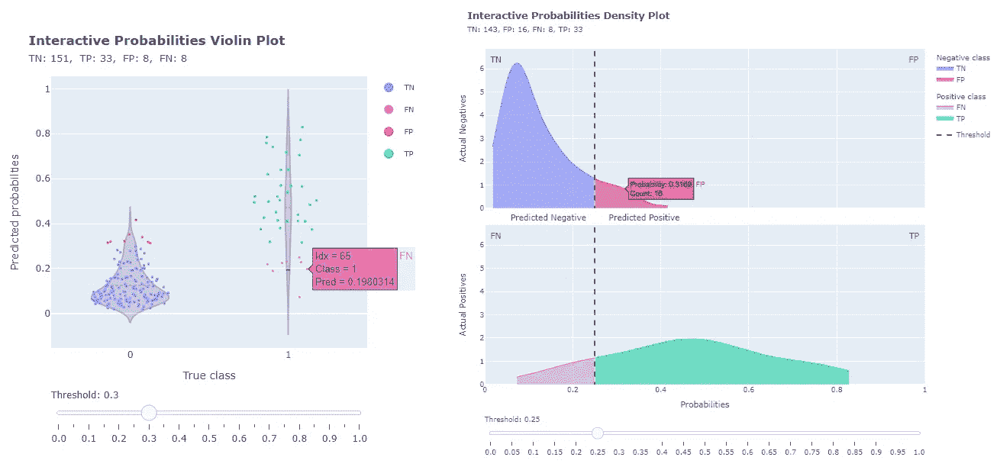
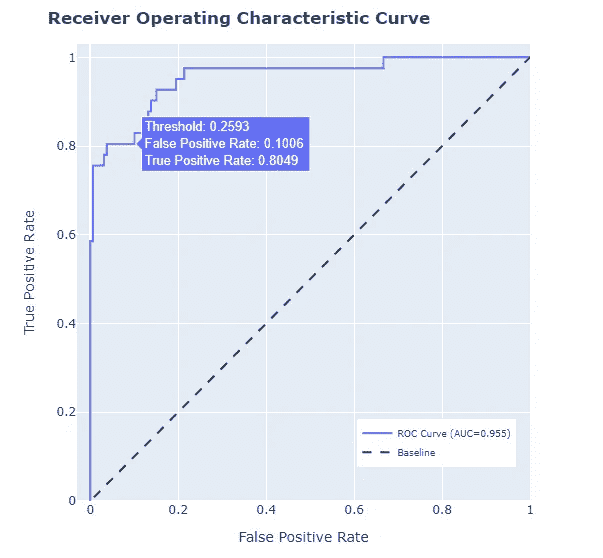
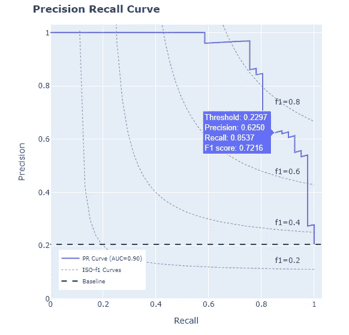
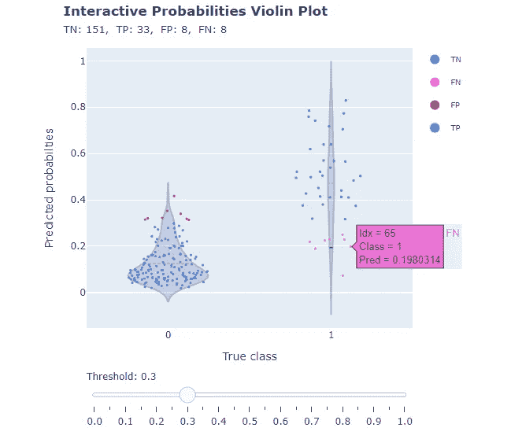
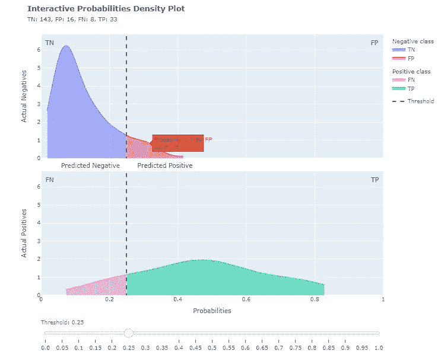

# binclass-tools Python 包中的 ROC 和精度召回曲线、概率分布和密度图

> 原文：<https://towardsdatascience.com/roc-and-pr-curves-probabilities-distribution-and-density-plots-now-in-binclass-tools-python-9351681a3803>

## 二元分类的标准图现在可以在 binclass-tools 包中获得



(图片由作者提供)

我最近宣布了一个 Python 包的发布，这个包对于二进制分类的分析非常有用。特别是，开发这一软件包的需要源于分析不平衡的二进制分类的困难。使用交互式绘图进行混淆矩阵和成本分析被证明对研究模型性能至关重要，因此创建了 Python[**bin class-tools**](https://github.com/lucazav/binclass-tools)包，正如我在下面的文章中强调的:

[](/finding-the-best-classification-threshold-for-imbalanced-classifications-with-interactive-plots-7d65828dda38)  

由于该 Python 包的目标是为最终用户提供一组用于二进制分类模型的有用工具，因此添加了基本图，以及混淆矩阵和成本图，用于测量模型性能。

# ROC 曲线和 PR 曲线

通常，为了了解二元分类模型的表现，除了分析其混淆矩阵，分析师还绘制了著名的*接收器操作特性* ( *ROC* )和*精确召回* ( *PR* )曲线。这篇文章超出了解释上述曲线是如何构造的范围。关于如何做到这一点的更多细节可以在参考资料中找到。有趣的是，由于有了 *binclass-tools* 包，现在也可以非常容易地绘制上述两条曲线。

一旦训练了分类器，就可以很容易地计算包含通过将测试数据集传递给分类器的`**predict_proba**` (产生变量`**test_predicted_proba**` )而获得的预测分数的向量。然后，可以使用该包的`curve_ROC_plot`功能来获得 ROC 曲线，传递预测分数和相应的真实标签:

```
area_under_ROC = bc.curve_ROC_plot(
    true_y = y_test,
    predicted_proba = test_predicted_proba)
```

除了绘图之外，该函数还返回 ROC 曲线下的面积值。结果图如下所示:



图 1 —使用 binclass-tools 软件包获得的 ROC 曲线(作者提供)

由于图的交互性，您可以在工具提示中查看曲线上每个点的阈值、假阳性率(FPR)和真阳性率(TPR)的值。

类似地，可以用下面的简单代码来绘制*精确召回曲线*:

```
area_under_PR = bc.curve_PR_plot(
    true_y= y_test, 
    predicted_proba = test_predicted_proba, 
    beta = 1)
```

除了返回 PR 曲线下的面积之外，该函数还返回以下图:



图 2 —使用 binclass-tools 软件包获得的 PR 曲线(作者提供)

同样，图形的交互性允许您探索每个阈值的精确度和召回值。工具提示还显示了 *fᵦ-score* 值(β值作为参数传递给函数)，这是一个通过精度和召回定义的指标，通常用于评估模型性能。此外，该图包含 *iso-fᵦ曲线*，为了方便起见，这些曲线标识了 fᵦ值恒定的点。

在 ROC 和 PR 曲线中，绘制了基线(随机猜测目标类别的天真模型的虚拟曲线)。

# 概率分布和密度图

两个目标类别的 *predict_proba* 分数的分布可以使用*交互概率分布图*进行研究，该分布图使用 *violin 图*来最好地表示它们。所讨论的图用于回答问题“每个预测目标类的概率分值是如何分布的？”。

这种交互式绘图的一个非常方便的功能是允许改变分类器阈值的滑块。这允许与混淆矩阵分类(TP、TN、FP、FN)相关联的预测子集显示为每个目标类别的分数分布图上方的点:



图 3 —作者使用 binclass-tools 软件包获得的概率分布图

将鼠标悬停在这些点上会产生一个工具提示，其中包含与该点关联的观察的行号指示器( *idx* )、观察的真实类( *class* )以及与观察关联的 *predict_proba* 分值( *pred* )。通过将鼠标悬停在图的侧边，我们可以获得两个 violin 图的四分位数信息。不同的颜色区分不同类别的混淆矩阵。

Violin plots 允许您获得按目标类别细分的预测分布的“自上而下”视图。另一方面，如果您想要查看与“轮廓图像”相同的分布(通常显示的分布)，您可以借助新的*predicted _ proba _ Density _ curve _ Plot*函数生成*交互概率密度图*，使用高斯或 KDE 方法平滑直方图，使用以下代码:

```
threshold_step = 0.05
curve_type = 'kde' #'kde' is the default value, 'normal' otherwisebc.predicted_proba_density_curve_plot(
    true_y = y_test, 
    predicted_proba = test_predicted_proba, 
    threshold_step = threshold_step,
curve_type = curve_type)
```

您得到的输出是一个交互式绘图，其中也有阈值滑块，其步长在对上一个函数的调用中定义:



图 4——作者使用 binclass-tools 软件包获得的概率密度图

该图中的两个子图中的每一个都被标识阈值的垂直虚线分成两个区域。该图中的两个子图中的每一个都被标识阈值的垂直虚线分成两个区域。这样就形成了四个区域，每个区域与一个混淆矩阵分类(TN，FP，FN，TP)相关联。因此，工具提示突出显示了每个单独区域的详细信息，显示了 *predict_proba* 得分以及属于特定阈值的特定分类的预测数量。

# 结论

从版本 0.3.0 开始，Python *binclass-tools* 包引入了四个新的交互式情节:

*   *交互式接收机工作特性(ROC)曲线*
*   *交互式精确召回曲线*
*   *交互概率分布图*
*   *交互概率密度图*

有了新版本， *binclass-tools* 包可以被认为是研究二进制分类器性能的完整工具。

您可以在 Github 上找到 binclass-tools 存储库:

[](https://github.com/lucazav/binclass-tools)  

# 信用

你可以在精确召回曲线和概率分布图中找到的一些细节受到了 *Yohann Lereclus* 和 *Pi Esposito* 的 *plot-metric* 包的启发:

[](https://github.com/yohann84L/plot_metric)  

# 参考

1.  [理解 AUC-ROC 曲线|作者 Sarang Narkhede |走向数据科学](/understanding-auc-roc-curve-68b2303cc9c5)
2.  [精确召回曲线。有时一条曲线值一千……|道格·斯汀| Medium](https://medium.com/@douglaspsteen/precision-recall-curves-d32e5b290248)
3.  [Violin Plots 101:可视化分布和概率密度|模式](https://mode.com/blog/violin-plot-examples/)
4.  [深度:内核密度估计| Python 数据科学手册(jakevdp.github.io)](https://jakevdp.github.io/PythonDataScienceHandbook/05.13-kernel-density-estimation.html)