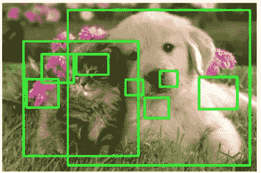
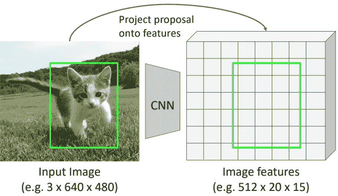
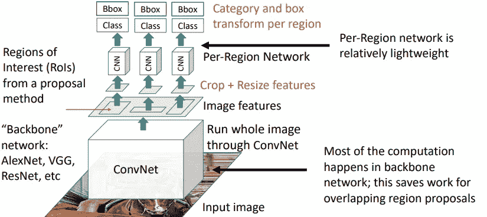
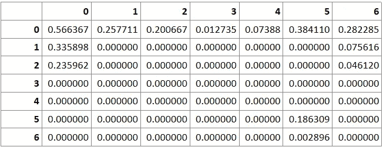
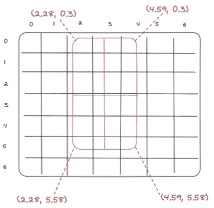
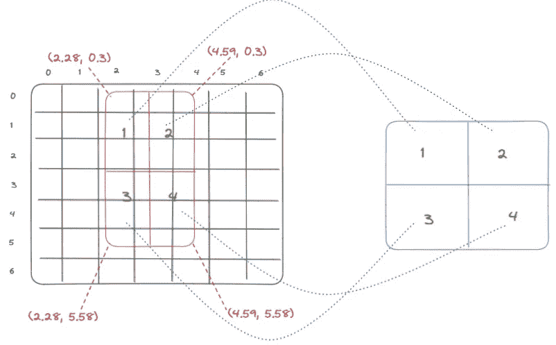
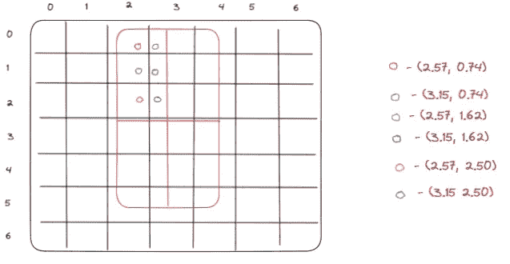
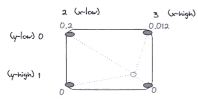
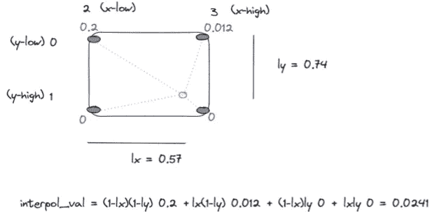
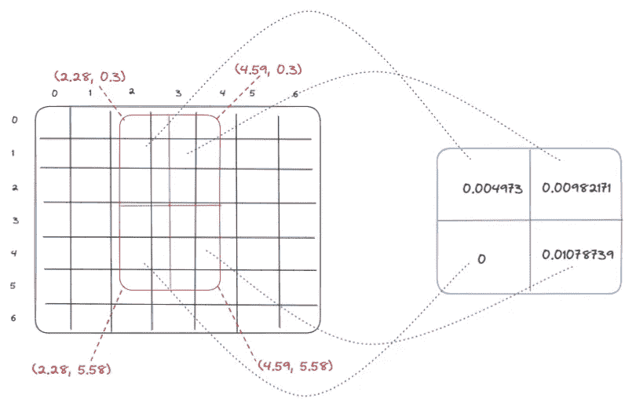

# 罗伊 Align 解释道

> 原文：<https://towardsdatascience.com/roialign-explained-d30f6843da3a>

## 使用 Python 实现


[https://unsplash.com/@wansan_99](https://unsplash.com/@wansan_99)

## 介绍

在本教程中，我们将用 Python 再现并解释来自 *torchvision.ops.roi_align 的 RoIAlign 函数。*我在网上找不到任何能准确复制 torchvision 库结果的代码，因此我不得不将 torchvision 中的 C++实现翻译成 Python，你可以在这里找到。

## 背景

计算机视觉中的感兴趣区域(RoI)可以定义为图像中的一个区域，在该区域中，潜在的对象可能位于**对象检测任务**中。下面的图 1 显示了一个 RoI 提议的例子。



[https://web.eecs.umich.edu/~justincj/slides/eecs498/WI2022](https://web.eecs.umich.edu/~justincj/slides/eecs498/WI2022)—图 1

涉及 RoI 的对象检测模型之一是[更快的 R-CNN](https://arxiv.org/abs/1506.01497) 。更快的 R-CNN 可以由两个阶段组成:**区域提议网络(RPN)** ，其提议 RoI 并表明每个 RoI 是前景(包含对象)还是背景；以及**分类网络**，其预测 RoI 中包含的对象类别和偏移，即 RoI 的变换(移动和调整大小)以使用这些偏移将它们变换成最终提议，从而将对象更好地包围在边界框中。分类网络也拒绝不包含对象的负面提议——这些负面提议被分类为背景。
重要的是要知道 ROI 不是在原始图像空间中预测的，而是在从视觉模型中提取的**特征空间**中预测的。下图说明了这个想法:



[https://web.eecs.umich.edu/~justincj/slides/eecs498/WI2022](https://web.eecs.umich.edu/~justincj/slides/eecs498/WI2022)—图二

我们将原始图像传入一个预先训练的视觉模型，然后提取特征的 3D 张量，每个特征的大小都是上面的 *20x15* 的情况。但是，根据我们从哪个图层提取特征以及使用哪个视觉模型，它可能会有所不同。正如我们所看到的，我们可以在图像特征坐标中找到原始图像坐标中的盒子的精确对应关系。现在，**为什么**我们真的需要投资回报池？
感兴趣区域的问题在于它们的大小都不同，而分类网络需要固定大小的特征。



[https://web.eecs.umich.edu/~justincj/slides/eecs498/WI2022](https://web.eecs.umich.edu/~justincj/slides/eecs498/WI2022)—图 3

因此，RoI 汇集使我们能够将所有 RoI 映射到相同的大小，例如映射到 *3x3* 固定大小的特征，并预测它们包含的类别和偏移。RoI pooling 有多种变体，在本文中，我们将重点关注 **RoIAlign** 。让我们最后看看这是如何实现的！

## 建立

让我们首先定义一个要使用的特征映射的例子。因此，我们假设我们处于从感兴趣的图像中提取了一个尺寸特征的阶段。



作者图片—图 3

现在，假设我们提取了一个 RoI，在图 4 中用红色标出了以下坐标(我们省略了方框中的特征值):



作者图片—图 4

在图 4 中，我们还将我们的 RoI 分为 4 个区域，因为**我们正在汇集成一个 *2x2* 维度特征**。使用 RoIAlign，我们通常执行**平均池**。



作者图片—图 5

现在的问题是，我们如何平均汇集这些子区域？我们可以看到它们与网格错位，因此我们不能简单地平均每个子区域内的细胞。解决方案是用**双线性插值**对每个子区域中间隔规则的点进行采样。

## 双线性插值和池化

首先，我们需要拿出我们在 RoI 的每个子区域中插入的点。下面我们选择合并到 *2x2* 区域，输出我们想要插值的点。

```
# 7x7 image features
img_feats = np.array([[0.5663671 , 0.2577112 , 0.20066682, 0.0127351 , 0.07388048,
        0.38410962, 0.2822853 ],
       [0.3358975 , 0\.        , 0\.        , 0\.        , 0\.        ,
        0\.        , 0.07561569],
       [0.23596162, 0\.        , 0\.        , 0\.        , 0\.        ,
        0\.        , 0.04612046],
       [0\.        , 0\.        , 0\.        , 0\.        , 0\.        ,
        0\.        , 0\.        ],
       [0\.        , 0\.        , 0\.        , 0\.        , 0\.        ,
        0\.        , 0\.        ],
       [0\.        , 0\.        , 0\.        , 0\.        , 0\.        ,
        0.18630868, 0\.        ],
       [0\.        , 0\.        , 0\.        , 0\.        , 0\.        ,
        0.00289604, 0\.        ]], dtype=np.float32)

# roi proposal
roi_proposal = [2.2821481227874756, 0.3001725673675537, 4.599632263183594, 5.58889102935791]
roi_start_w, roi_start_h, roi_end_w, roi_end_h = roi_proposal

# pooling regions size
pooled_height = 2
pooled_width = 2

# RoI width and height
roi_width = roi_end_w - roi_start_w
roi_height = roi_end_h - roi_start_h
# roi_height= 5.288, roi_width = 2.317

# we divide each RoI sub-region into roi_bin_grid_h x roi_bin_grid_w areas.
# These will define the number of sampling points in each sub-region
roi_bin_grid_h = np.ceil(roi_height / pooled_height)
roi_bin_grid_w = np.ceil(roi_width / pooled_width)
# roi_bin_grid_h = 3, roi_bin_grid_w = 2
# Thus overall we have 6 sampling points in each sub-region

# raw height and weight of each RoI sub-regions
bin_size_h = roi_height / pooled_height
bin_size_w = roi_width / pooled_width
# bin_size_h = 2.644, bin_size_w = 1.158

# variable to be used to calculate pooled value in each sub-region
output_val = 0

# ph and pw define each square (sub-region) RoI is divided into.
ph = 0
pw = 0
# iy and ix represent sampled points within each sub-region in RoI. 
# In this example roi_bin_grid_h = 3 and roi_bin_grid_w = 2, thus we
# have overall 6 points for which we interpolate the values and then average 
# them to come up with a value for each of the 4 areas in pooled RoI 
# sub-regions 
for iy in range(int(roi_bin_grid_h)):
    # ph * bin_size_h - which square in RoI to pick vertically (on y axis)
    # (iy + 0.5) * bin_size_h / roi_bin_grid_h - which of the roi_bin_grid_h 
    # points vertically to select within square 
    yy = roi_start_h + ph * bin_size_h + (iy + 0.5) * bin_size_h / roi_bin_grid_h
    for ix in range(int(roi_bin_grid_w)):
        # pw * bin_size_w -  which square in RoI to pick horizontally (on x axis)
        # (ix + 0.5) * bin_size_w / roi_bin_grid_w - which of the roi_bin_grid_w 
        # points vertically to select within square 
        xx = roi_start_w + pw * bin_size_w + (ix + 0.5) * bin_size_w / roi_bin_grid_w
        print(xx, yy)

# xx and yy values: 
# 2.57 0.74
# 3.15 0.74
# 2.57 1.62
# 3.15 1.62
# 2.57 2.50
# 3.15 2.50
```

在图 6 中，我们可以看到子区域 1 的相应的 6 个采样点坐标。



作者图片—图 6

为了对坐标 *(2.57，0.74)* 的第一个点对应的值进行双线性插值，我们找到该点所在的方框。所以我们取这些值的*底*——*(2，0)* ，它对应于盒子的左上角点 *(x_low，y_low)* ，然后在这些坐标上加 1 就找到了盒子的右下角点 *(x_high，y _ high)*——*(3，1)。*这表现在下图中:



作者图片—图 7

根据图 3，点 *(0，2)* 对应 0.2，点 *(0，3)* 对应 0.012，以此类推。按照前面的代码，在最后一个循环中，我们找到了子区域内红点的插值:

```
x = xx; y = yy
if y <= 0: y = 0
if x <= 0: x = 0
y_low = int(y); x_low = int(x)
if (y_low >= height - 1):
    y_high = y_low = height - 1
    y = y_low
else:
    y_high = y_low + 1

if (x_low >= width-1):
    x_high = x_low = width-1
    x = x_low
else:
    x_high = x_low + 1

# compute weights and bilinear interpolation
ly = y - y_low; lx = x - x_low;
hy = 1\. - ly; hx = 1\. - lx;
w1 = hy * hx; w2 = hy * lx; w3 = ly * hx; w4 = ly * lx; 

output_val += w1 * img_feats[y_low, x_low] + w2 * img_feats[y_low, x_high] + \
              w3 * img_feats[y_high, x_low] +  w4 * img_feats[y_high, x_high] 
```

所以我们对红点有如下结果:



作者图片—图 8

如果我们对子区域中的所有 6 个点都这样做，我们会得到以下结果:

```
# interpolated values for each point in the sub-region
[0.0241, 0.0057, 0., 0., 0., 0.]

# if we then take the average we get the pooled average value for 
# the first region:
0.004973
```

最后，我们得到以下平均汇总结果:



作者图片—图 9

完整代码:

## 对代码的附加注释

上面的代码包含一些我们没有讨论的附加特性，我将在这里简要解释一下:

*   您可以将 *align* 变量更改为 True 或 False。如果为真，则将框坐标像素移动-0.5，以便更好地与两个相邻像素索引对齐。该版本用于[探测器 2](https://paperswithcode.com/lib/detectron2) 。
*   *sampling_ratio* 定义了 RoI 的每个子区域中采样点的数量，如图 6 所示，其中使用了 6 个采样点。如果 *sampling_ratio = -1* ，那么它会像我们在第一段代码中看到的那样自动计算:

```
roi_bin_grid_h = np.ceil(roi_height / pooled_height)
roi_bin_grid_w = np.ceil(roi_width / pooled_width)
```

## 结论

在本文中，我们已经看到了 RoIAlign 是如何工作的，以及它是如何在 *torchvision* 库中实现的。RoIAlign 可以被视为神经网络架构中的一层，每一层都可以向前和向后传播，从而能够端到端地训练您的模型。
阅读完这篇文章后，我鼓励你也阅读一下 RoI pooling，以及为什么 RoIAlign 更受青睐。如果你理解 RoIAlign，理解 RoI pooling 应该不成问题。