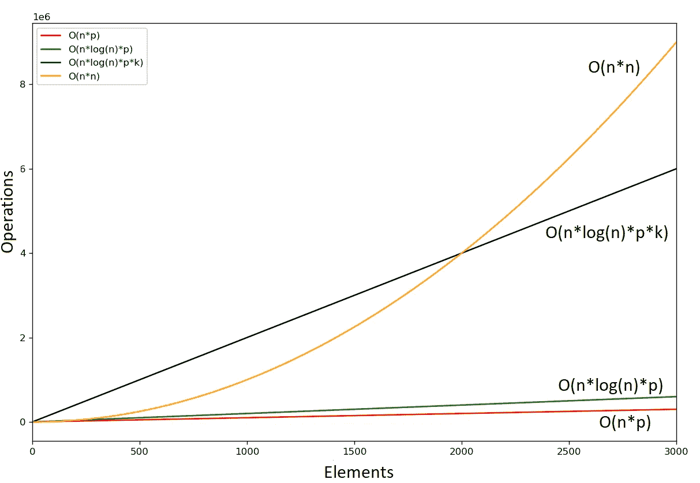
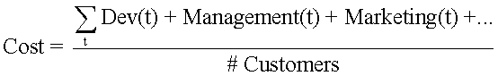

# 计算复杂性对产品价值的影响

> 原文：<https://towardsdatascience.com/role-of-computational-complexity-in-algorithm-development-and-overall-product-value-623e0b919970>

## [行业笔记](https://towardsdatascience.com/tagged/notes-from-industry)

# 计算复杂性对产品价值的影响

## 为您的产品选择最有价值的算法

克里斯托夫·高尔在 [Unsplash](https://unsplash.com?utm_source=medium&utm_medium=referral) 上拍摄的照片

计算复杂性(包括时间和空间复杂性)的重要性被低估了，尤其是对于成为产品一部分的算法。对于诸如 Kaggle 提供的竞赛的一般算法开发、使用 ML 的数据分析、概念验证(POC)的模型开发和优化，计算复杂度不太重要。然而，对于作为产品进入生产系统的算法，由于有限的资源可用性、预测和模型构建的时间限制，以及最重要的云资源产生的**成本**，计算复杂性应该得到重视。

计算复杂性在模型训练中起着重要作用，在模型训练中，与预测相比，需要调整和优化，预测的复杂性通常为 *O(n*p)* ，其中 n 是预测的数量，p 是数据集中的特征数量。

模型构建范例:

1.  ***流* :** 每当你得到一个新的数据，我们就用所有(或有限)以前的数据重建模型。可能是最准确的，但是昂贵、耗时并且在预测上有延迟。非常适合某些时间序列数据，如股票预测和推荐系统(网飞、Hulu 等)。).由于预测中的高延迟，几乎没有人会采用这种方法。考虑到最好的硬件配置和数据架构(最大),有人会等 5-10 分钟让网飞提供最准确的电影推荐吗？最大 RAM 和 GPU 的计算节点数量)？绝不！！！
2.  ***批量* :** 每小时或每天或每周重建模型。很可能不如流式方法准确，但成本较低，并且根据模型构建的频率和数据量，预测可能会有微小的延迟。适用于数据模式频繁变化、需要重建模型以提高准确性的产品—推荐系统、网络安全威胁检测、产品销售或需求预测等。
3.  ***周期性* :** 每月或每 3 个月或每 6 个月重新构建模型。与分批法相比，周期要长得多。非常适合很少或从不改变数据模式的应用，例如特定的时间序列数据，包括能源预测、产品或图像分类等。

*批量*和*周期*范式被公司普遍采用。被训练的算法类型和所使用的数据量可能会显著改变所需的训练时间，并且可能需要昂贵的计算节点来进行处理。尽管从技术上来说，在云环境中使用最大处理能力、RAM 和/或 GPU 来扩展您的资源、计算节点是可能的，但出于上述原因之一，通常不希望这样做，即**成本**。因此，我们应该经常检查算法的计算复杂度——时间和空间复杂度。没有人会愿意花 5 美元在市场上只卖 9.99 美元的算法开发和维护上，即使它可能是市场上最好的。

例如，让我们考虑一个数据集 D 的分类问题，该数据集具有 *n* 个观察值和 *p* 个特征。我们正处于模型开发阶段，我们考虑使用 3 种算法来构建预测模型—逻辑回归、决策树和随机森林。

算法的时间和空间复杂度是:

*   逻辑回归:O(n*p)和 O(p)
*   决策树 O(n*log(n)*p)和 O(树的深度)
*   随机森林 O(n*log(n)*p*k)和 O(树的深度*k)

其中 k 是树的数量。

特征 p = 100，树深度 k = 10(图片由作者提供)

**O(n * p)<O(n * log(n)* p)<O(n * log(n)* p * k)<O(n * n)**

随着元素 *n* 数量的增加，操作数量也会增加，如上图所示。为了在大约相同的时间内获得结果(建模)，可能需要更多的资源。逻辑回归在计算上比决策树便宜，而决策树又比随机森林便宜。当我们添加更多数量的计算节点时，我们会增加运行时构建算法的成本。随着数据量的增加和高度复杂的算法，我们可能需要改变基础设施本身，以实现与不太复杂的算法相同的结果。

例如，对于一个具有 *O(n*p)* 的简单算法，我们可以使用一个简单的基于 spark 的系统进行并行化，计算节点的数量要合理地少(例如:5 个)，而当复杂性增加时，我们可能需要增加节点的数量来在规定的时间内实现相同的结果，这导致了计算成本的增加。当数据量很大时——如前所述，计算时间明显增加，此外，我们可能需要更改基础架构——从 DB read 切换到 Kafka 以减少数据读取延迟，从而增加基础架构和维护成本。对于机器学习(ML)模型，除了深度学习(DL)模型之外，空间复杂度通常较低。

在一个企业中，保持合理的低成本是利润最大化的第一件事，这将允许企业自身的发展。一家公司不会花费超过为服务或产品提供的金额，除非是某些产品，如人工智能系统，在这些产品中，建立最准确的预测系统将成倍提高客户满意度，并建立市场领导地位——这是一种创业意识，在早期阶段通过牺牲利润来赢得客户。对于模型构建——在成本和准确性或模型的复杂性之间总是有一个权衡(假设复杂模型比简单模型更准确，这在大多数情况下是正确的)。对于预测-在成本和预测时间之间进行权衡。

> “产品价值是客户通过使用产品满足其需求而获得的**收益**，减去相关的**成本**。复杂性是将这样的产品交付给客户所付出的努力。”休伯特·帕兰

**产品价值=收益—成本**

*   **Dev(t) —** 在算法和相关产品的整个生命周期中发生的开发、维护和基础设施成本。
*   基础设施成本( **Infra(t)** )包括软件或工具购买、订阅等。，以支持产品的开发和维护。
*   **资源(t) —** 与开发和维护人员(resᵢ)相关的成本/工资，取决于工资率(rateᵢ)和时间(tᵢ)
*   管理——与整个管理相关的成本
*   营销——与营销工作相关的成本

与讨论主题相关的唯一成本是**开发(t)** 成本，包括算法开发、优化、部署到生产系统中，以及**实时执行**和系统支持。作为一名数据科学家，我们有责任尽最大努力保持合理的低成本，同时牺牲与产品价值相关的预测准确性。

线性回归、逻辑回归、朴素贝叶斯等算法。比随机森林、SVM、神经网络等复杂算法便宜。这在大多数情况下是高度精确的，当然涉及高计算成本。因此，我们绝对需要考虑为客户提供相当好的产品所花费的成本(可接受的精度水平、模型构建和预测时间)。请注意，我们可能不会为所有事情构建一个单一的 ML 模型。我们经常需要为每个客户或服务或两者建立模型，并且所有这些都需要在一定的时间范围内发生——比如一个小时或几个小时。预测时间框架也是如此，它通常要短得多，比如一秒或一分钟。这仅适用于您计划在生产系统中部署并应用到产品中的算法。

如果上述示例中考虑的所有 3 ML 算法产生几乎相同的交叉验证结果—假设 **85% (LR)、87% (DT)和 88% (RF)** 。基于手头的产品，我们应该倾向于 **LR，因为它是最具成本效益的算法，并且 *O(n*p)* 不会显著降低预测精度。**

我希望我已经足够强调了算法中计算复杂性的重要性，以及它是如何影响产品成本的。如果你是数据科学家，重要的是始终考虑与算法相关的成本，这反过来取决于计算的复杂性。通常，计算成本不会是产品成本的重要组成部分之一，但如果我们不专注于控制它，它可能会成为一个重要组成部分。

感谢阅读！如果我遗漏了什么，请留下您的反馈并帮助改进这篇文章。