# NumPy 中的滚动窗口——时间序列分析方法的支柱

> 原文：<https://towardsdatascience.com/rolling-windows-in-numpy-the-backbone-of-time-series-analytical-methods-bc2f79ba82d2>

## NumPy 中的滚动(滑动)窗口计算是如何工作的？它们和熊猫打滚相比如何？

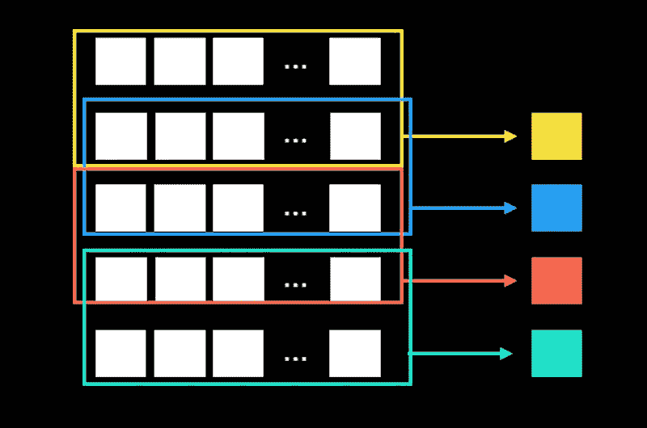

图片作者。

滚动或滑动计算在时间序列分析中至关重要。从金融到流行病分析，很可能你需要执行移动窗口计算，所以学会如何做并做好它们是至关重要的。

这个故事还将探索 NumPy 中滚动计算的基础及其局限性；它还将包括一些日常用例的配方。

在 Pandas 中，执行滚动计算非常简单，也许比 NumPy 更简单。在 NumPy 中，执行这个任务的实用程序有些隐藏；也许这就是为什么在时间序列滚动中很少看到 NumPy 代码的原因。

一个自然的问题出现了:如果我们可以很容易地在熊猫身上做到这一点，为什么要使用 NumPy？在这个故事中，我们将比较熊猫和 NumPy 的滚动窗口。我喜欢熊猫，但有时我们需要更深入地了解 NumPy，以便更精细地处理数据。

在 Pandas 和 NumPy 中，对向量(1D 数组)进行滚动计算非常简单，但是对矩阵进行滚动计算更具挑战性；这就是为什么我们需要 NumPy 的粒度。

## 故事结构

*   滑动窗口->添加额外维度
*   For 循环与 NumPy
*   滚动阵列存储器配置文件
*   函数:1D 数组->标量
*   功能:多个 1D 阵列-> 1D 阵列
*   熊猫大战熊猫
*   2D 阵列中的滚动函数
*   多元回归的滚动最小二乘系数
*   多元回归的滚动最小二乘 R-squared
*   2D 阵列的滚动线性组合
*   这个故事的寓意

## 滑动窗口->添加额外维度

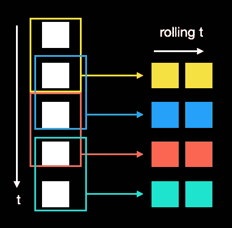

滚动机制[图片由作者提供]。

NumPy 的滚动窗口解决方案是创建另一个具有额外维度的数组。这种数组包含附加轴的每个索引上的指定滑动窗口处的滚动原始数组。这个工具有些隐蔽，你可以通过导入中的
点的数量来判断:

`np.lib.stride_tricks.sliding_window_view`

例如，让我们创建一个包含 1000 个元素的 1D 数组:

> (1000,)

然后我们用 100 的窗口滚动它:

> (901, 100)

如您所见，形状的维度增加了一，这个新维度的大小正好是窗口的大小。

对于维数更高的数组也是如此，例如，对于具有 1，000 行 10 列的 2D 数组:

> (1000, 10)

如果我们沿着行滚动它:

> (901, 10, 100)

## For 循环与 NumPy

由于滑动(滚动)计算在按时间索引的过程中最有用，首先想到的编程控制流语句是`for`循环。

NumPy 以其相对于纯 Python 的性能而闻名。因此，让我们比较一下使用`for`循环和 NumPy 的`sliding_window_view`循环通过滚动回顾窗口遍历数组所需的时间:

> 每圈 37.2 秒±4.06 秒(平均标准偏差。戴夫。7 次运行，每次 10，000 个循环)

> 每圈 297s±14.2s(平均标准偏差。戴夫。7 次运行，每次 1000 个循环)

众所周知，如果使用得当，NumPy 至少比 Python 快一个数量级。这次考试也不例外。

## 滚动阵列存储器配置文件

一个自然的问题出现了:

如果一个额外的维度被添加到滚动窗口大小的数组中，这难道不是内存效率很低吗？

答案是否定的，因为新数组实际上是原始数组的视图；因此，内存中没有副本。

让我们创建两个数组，并检查它们是否共享内存

> 真实的

当然，他们有。

然而，新的滚动数组的内存使用量稍高，因为为`view`本身创建了一些新数据。但是内存使用率高多少呢？

让我们使用 Pympler 内存分析器编写一个小测试。我们将通过参数`size_lb`(数组大小下限)`size_hb`(数组大小上限)和`size_steps`来改变原始数组的大小，以控制试验的次数。窗口的大小通过`window` 参数指定:

返回的`dataclass`具有每个大小的数组内存使用量和滚动数组使用量。结果总结在下面的内存使用率图中:

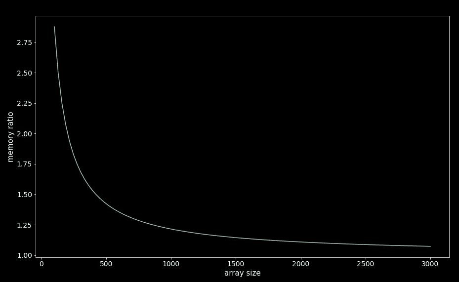

内存比率图:滚动数组/原始数组[图片由作者提供]。

我们可以看到，对于较小的阵列，滚动阵列视图的开销很大，但随着阵列变大，它会收敛到 1。

## 函数:1D 数组->标量

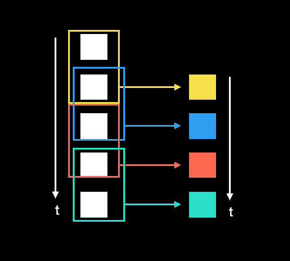

一个函数:1D 数组-> float，当滚动时产生另一个 1D 数组。

在 1D 数组中执行滚动计算是最简单的情况。直觉上，我们希望映射一个函数，它接受回看数组并返回一个标量；这样，一个新的 1D 阵列就产生了。新数组的长度为:

> 原始数组的长度—窗口大小+ 1

一旦我们有了滚动数组(有了额外的维度)，我们需要沿着最后一个轴(滚动轴)应用一个 NumPy 函数；为此，我们有两个选择:

*   使用 NumPy 内置函数
*   在滚动轴中使用带有`reduce`方法的数字`ufunc`

如果你想了解更多关于`ufuncs`和如何创建你自己的真正矢量化`ufuncs`的信息，请查看[这个故事](/numpy-ufuncs-the-magic-behind-vectorized-functions-8cc3ba56aa2c)。

计算过程中使用的函数必须针对数组进行优化；这是利用 NumPy 性能的唯一方法。使用 NumPy 的实用程序如`apply_along_axis`不会导致性能提升。

一个简单的例子是计算滚动标准差。让我们首先用标准正态分布的样本创建一个数组，然后滚动该数组。我们可以保持生成的数组不变，或者回填缺失的索引:

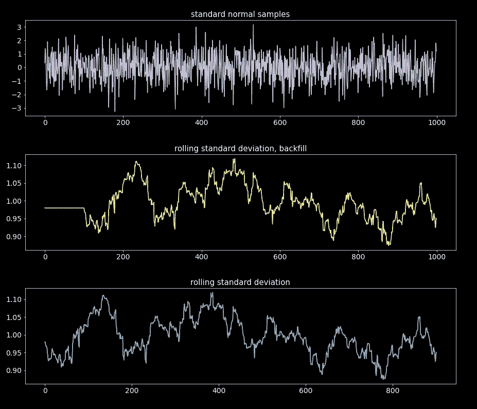

图片作者。

## 功能:多个 1D 阵列-> 1D 阵列

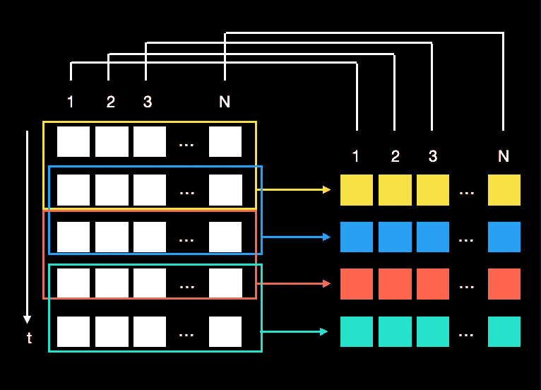

一个函数:2D 数组(多个 1D 数组)-> 1D 数组(多个浮点数)，当滚动时产生另一个 2D 数组。

我们也可以同时对多个向量进行滚动计算。这些向量可以排列成 2D 阵列，但是滚动计算本身不在滚动矩阵*上。所有列(行)都以同样的方式处理；在适当的矩阵卷上，列(行)索引之间没有区别。这就是矢量化的工作原理。*

例如，我们可以用标准正态样本创建一个 2D 数组(每列一个过程),然后一次性计算所有列的滚动标准偏差:

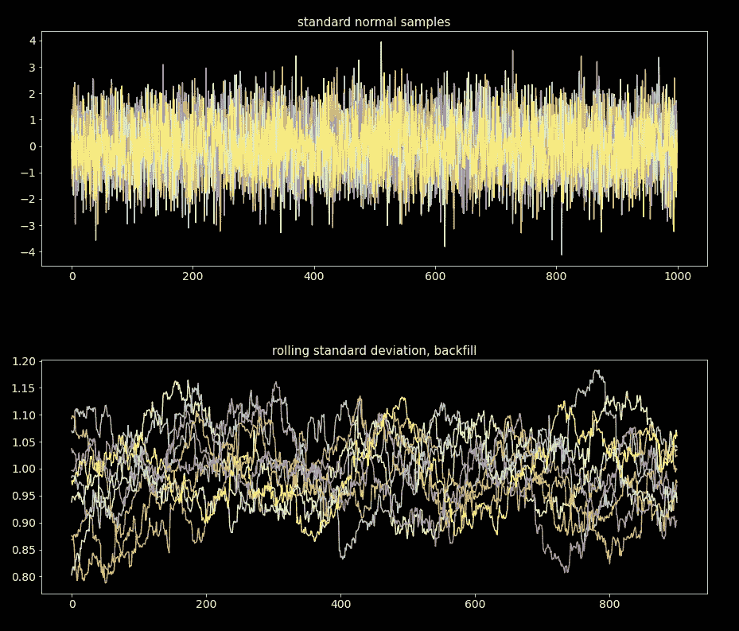

图片作者。

事实证明，适当的矩阵滚动，即我们可以以特定的方式组合列(行)，要复杂得多，我们将在后面的章节中看到。

## 熊猫大战熊猫

Pandas 有一个非常方便的滚动序列和数据帧的方法。我发现它比 NumPy 的更直观，更容易使用。但正如我们将看到的，它也有缺点。

就速度而言，熊猫滚动和 NumPy 相比如何？让我们计算滚动标准偏差并找出:

> 每圈 258s±20.7s(平均标准偏差。戴夫。7 次运行，每次 1000 个循环)

> 每圈 262s±8.16s(平均标准偏差。戴夫。7 次运行，每次 1000 个循环)

如你所见，速度性能都差不多。因此，对于内置计算来说，这是一个平局。

如果我们想应用一个自定义函数呢？我们可以在 pandas 中使用`apply`方法，在 NumPy 中使用`apply_along_axis`方法来使用我们的函数，该函数接受一个 1D 数组(序列)并返回一个浮点数:

> 每循环 5.31 毫秒 386 秒(平均标准偏差戴夫。7 次运行，每次 100 个循环)

> 每循环 6.64 毫秒 693 秒(平均标准时间。戴夫。7 次运行，每次 100 个循环)

同样，它们在速度上不相上下。

但是最后一个测试有一个警告；在使用 NumPy 时，如果可以的话，我们应该避免使用`apply_along_axis`，因为它没有针对速度进行优化。为了释放 NumPy 的性能，我们需要在滚动数组中使用的函数下，使用编译的、真正的矢量化、`ufuncs`。查看[这个故事](/numpy-ufuncs-the-magic-behind-vectorized-functions-8cc3ba56aa2c)来了解关于`ufuncs`的一切。

例如，如果我们以矢量化的方式进行相同的计算:

> 每圈 79.8 秒±3.77 秒(平均标准偏差。戴夫。7 次运行，每次 10，000 个循环)

令人印象深刻的提升。

我们可以争辩说，我们可以在 Pandas 中应用编译的矢量化函数和`ufuncs` 。然而，在熊猫滚动的工作流程中迷路更容易。经常会混淆什么是矢量化(快速性能)，什么不是矢量化(慢速)。NumPy 说得很清楚。

NumPy 提供的只是一个额外维度的滚动数组视图，我们可以根据自己的需要使用这样的数组。如果您正在进行非向量化操作或在 NumPy 数组上使用 for 循环，您知道这样做是在自担风险。

## 2D 阵列中的滚动函数

将 2D 数组滚动到标量中[图片由作者提供]。

正如我们前面指出的，滚动矩阵(2D 阵列)是棘手的。在 NumPy 或 Pandas 中，对滚动矩阵应用用户定义的函数没有简单的解决方案。如前一节所述，同时滚动多个 1D 阵列(技术上是 2D 阵列)与滚动一个矩阵不同。

滚动矩阵的一个示例是对多个回归变量(具有多个列的矩阵)执行滚动最小二乘回归，并对每个行索引(可以将此轴视为时间)获取 R 平方度量或所有回归变量系数。我经常面临的问题。在前一种情况下，2D 数组在滚动时会产生 1D 数组，而在后一种情况下，2D 数组在滚动时会创建另一个 2D 数组。

有很多方法可以做到这一点，但是没有一个通用的 T2 解决方案。没有任何方法可以应用一个任意的、可能是纯 Python 函数，并期望它能够工作并且很快。相反，我们需要能够产生一种算法，该算法可以利用一个或多个编译和矢量化的操作来操纵滚动数组。通常，除了 NumPy 的工具之外，还需要一些数学知识。

在下面的部分中，我们将回顾一些我经常使用的滚动 2D 阵列的配方。

## 多元回归的滚动最小二乘系数

要做滚动最小二乘回归，我们首先需要知道矩阵形式的数学。以下形式的线性模型:

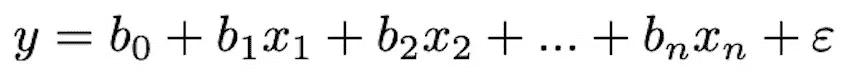

其中 *ε* 为内径，可通过 *y* 和 *x* 的多个样本进行拟合。考虑所有样本可得出模型规格的矩阵方程:

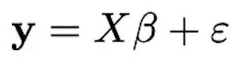

其中 *y，β* 和 *ε* 是大小等于样本大小的列向量， *T* 上标表示转置。 *X* 是一个有 *n* 列的矩阵，行数等于样本大小。如果我们想包含一个不为零的截距，矩阵 *X* 的第一列中有 1。

那么 *β* 的 OLS(普通最小二乘法)估计为:

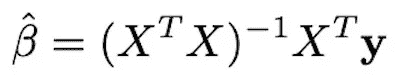

利用这个方程，我们可以进行适当的矢量化滚动。但是首先，让我们用最简单的方法，使用一个`for`循环来滚动。然后我们将实现矢量化版本并比较性能。

我们的玩具数据将是 1，000 x 10 个标准正态样本的数组:

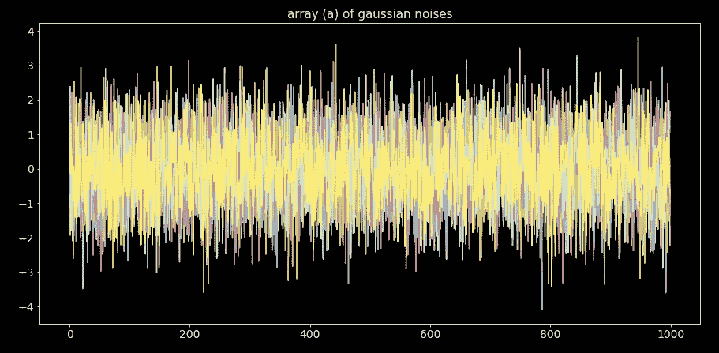

图片作者。

我们需要应用的在滑动窗口的每个索引处获得 *β* 的函数是:

然后，我们使用一个`for`循环编写一个通用滚动代码，该循环使用一个`Func4Loop`类型的静态函数进行滚动:

如果我们传递我们的函数，我们可以创建一个矩阵，其中每一行都是一个 *β* 向量:

现在让我们实现矢量化版本。它比`for`循环稍微复杂一点，但是值得努力。

*   如果需要，第一个函数`_get_X_n_y_rolled`将一个常数加到 *X* 上，并生成滚动阵列视图。
*   第二个函数`_get_beta_vec_from_Xy`通过`np.einsum`执行滚动矩阵乘法，对产品进行粒度控制， *t* 轴(第一个轴)保留在所有产品中。
*   最后一个函数只是合并了前面函数的逻辑。

调用我们的函数，我们创建我们的滚动 *β* 矩阵，向量化:

两种方法产生相同的结果:

> 真实的

尽管有一些微小的数字差异。

好的部分来了，让我们测试一下速度:

> 每循环 314 毫秒±141 毫秒(平均标准时间。戴夫。7 次运行，每次 1 个循环)

> 每循环 56.4 毫秒±2.48 毫秒(平均标准时间戴夫。7 次运行，每次 10 个循环)

矢量化版本确实值得努力。

## 多元回归的滚动最小二乘 R-squared

获得滚动 R 平方需要更多的数学知识。请记住，该指标可以表示为:

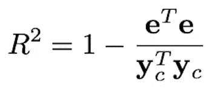

其中 ***y_c*** 是居中的*y 矢量【贬低】，矢量 ***e*** 是剩余矢量:*

*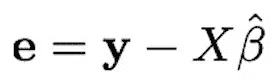*

*和上一节一样，我们首先用一个`for`循环开始滚动。也就是说，我们定义了在循环的每次迭代中应用的静态函数:*

*借用上一节中的`get_rolling_func_loop`，我们计算滚动 R 平方:*

*对于矢量化版本，我们还借用了上一节中的函数`_get_X_n_y_rolled`和`_get_beta_vec_from_Xy`。像上一节一样，我们使用`np.einsum`进行滚动矩阵乘法来保留第一个轴(即 *t* 轴)。*

*如您所见，两种计算是等效的:*

> *真实的*

*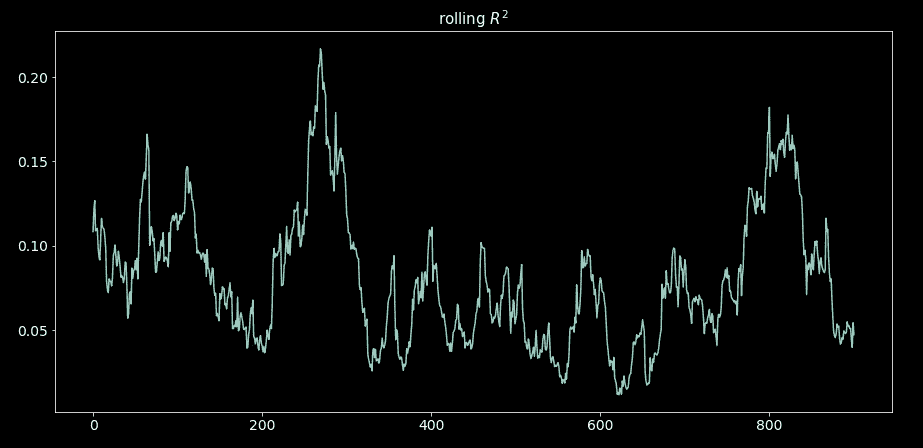*

*图片作者。*

*和速度:*

> *每循环 958 毫秒 397 毫秒(平均标准时间。戴夫。7 次运行，每次 1 个循环)*

> *每循环 73.7 毫秒±2.11 毫秒(平均值±标准偏差戴夫。7 次运行，每次 10 个循环)*

*和往常一样，矢量化版本不会让人失望。*

## *2D 阵列的滚动线性组合*

*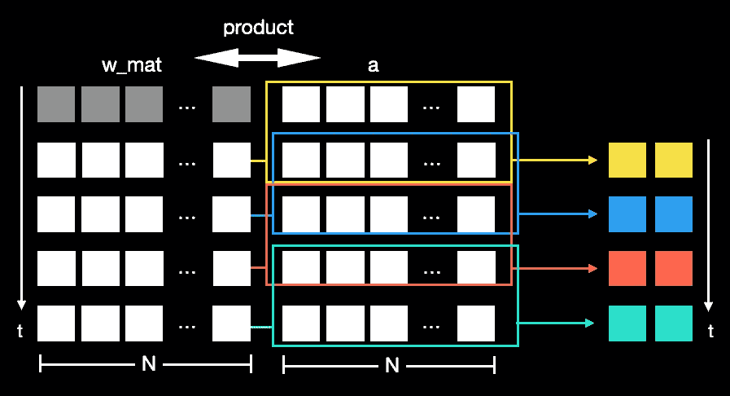*

*2D 阵列的滚动线性组合(按列排列)。*

*我想和大家分享的最后一个配方是滚动线性组合。这在时间序列分析中对向量进行协整时非常有用。*

*在每个时间点，我们都有一个权重向量(`w_vec`)，形成多个时间序列的线性组合。所以实际上，我们有两个列数相同的矩阵，一个用于权重(`w_mat`)，另一个用于时间序列(每列一个序列)。*

*每一个`w_vec`都是在一个使用回顾窗口的协整设置中找到的。因此，滚动线性组合允许我们分析协整向量算法的演变。*

*对于我们的玩具数据，我们创建了一个数组(`a )`包含时间序列，`w_mat,`包含线性组合系数(列的索引对应于`a 's`列)。*

*然后我们创建滚动数组(`a_rolled`)并执行乘积(`a_prod_w_rolled`)。这个产品是 2D 的；每行包含滚动线性组合时间序列:*

*最后，我们可以对最后一个轴应用一个函数；我们使用标准偏差进行演示。*

*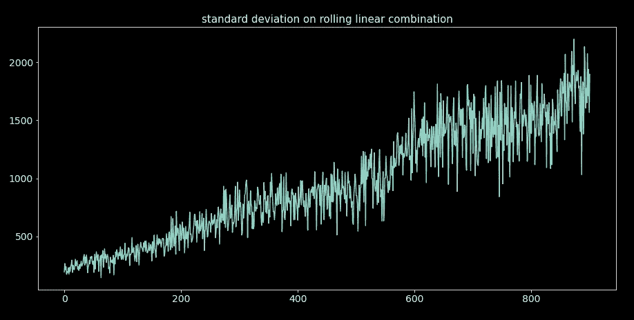*

*图片由 autor 提供。*

*说清楚。该函数适用于随时间变化的系数和过程的滚动线性组合。*

## *这个故事的寓意*

*这个故事没有单一的寓意，而是有四个:*

*   *没有什么神奇的方法可以应用一个通用函数来执行快速的矢量化滚动计算，尤其是当我们滚动 2D 数组并且列(行)的顺序很重要的时候。我们需要停下来，设计一种算法，能够利用矢量化代码的性能，实现我们的功能目标。*
*   *有时 NumPy 提供了熊猫所缺乏的粒度。*
*   *使用 NumPy 时，一定要注意不要把编译(矢量化和优化)的代码和纯 Python 代码混在一起；否则，我们的性能会受到影响。如果我们必须这样做，界限应该尽可能的清晰。*
*   *当您需要在阵列之间定制产品时，请使用`np.einsum`。*

*我希望这个故事对你有用。 [*订阅*](https://medium.com/subscribe/@diego-barba) *到我的邮件列表如果你想知道更多这样的故事。**

*喜欢这个故事吗？通过我下面的推荐链接成为一个媒体成员来支持我的写作。无限制地访问我的故事和许多其他内容。*

*<https://medium.com/@diego-barba/membership> *