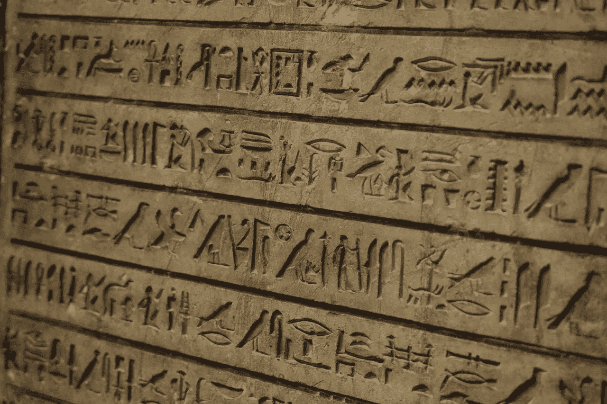
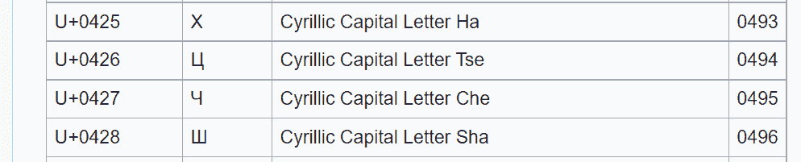

# 不用机器学习就能把任何语言罗马化

> 原文：<https://towardsdatascience.com/romanize-any-language-without-machine-learning-c9ef6bc88b77>

## 一种利用 Unicode 表的启发式方法



图片来自 [Pixabay](https://pixabay.com/photos/hieroglyphic-writing-egyptian-3839141/)

罗马化是将语言和文字转换成一种通用的拉丁表示法的任务。

让我们以日语单词“アメリカ".”为例如果你没有学过日语，你可能不知道它是什么意思。让我们把它罗马化——我们得到:“美国。”

现在，你能猜出“アメリカ”是什么意思吗？

你猜对了:美国。

罗马化不是翻译。它比翻译简单得多，但可以帮助你理解你不知道的语言中的单词，甚至句子。

在自然语言处理(NLP)中，罗马化是一种非常廉价的方式，可以在不同的语言中进行单词或句子的比较，例如使用利用字符串相似性的方法或度量。

> ***NLP 示例***
> 
> “アメリカ”和“美国”之间的 Levenshtein 距离是最大值 7，因为我们必须替换 4 个字符并添加 3 才能将“アメリカ”转换为“美国”。它并没有告诉我们，这两个词实际上在意义或发音上非常接近。如果我们将“アメリカ”罗马化为“amerika”，那么“amerika”和“America”之间的 Levenshtein 距离是 2，表明这两个词彼此相对接近。

在本文中，我将介绍一种简单而高效的罗马化方法，它基于适用于任何语言的 Unicode 表和规则。该方法由 [Hermjakob et al. (2018)](https://aclanthology.org/P18-4003.pdf) 提出。不需要任何机器学习。因此，它是轻量级的，在小型 CPU 上工作，除了 Unicode 表之外不需要任何数据。

# 基于启发式的罗马化

目标是将任何语言的 Unicode 字符映射到 ASCII 字符。

> ***定义***
> 
> *Unicode 是世界上大多数书写系统和语言中一致的文本编码标准，包括那些已经灭绝的书写系统和语言。当前版本(15.0)包含 161 个书写文字的 149，186 个字符。*
> 
> *ASCII 是另一种编码标准。它的第一版可以追溯到 1963 年，当时计算机的功能非常有限。ASCII 标准只包含 95 个可打印字符。*

罗马化文本不会包含任何音调符号。例如，法语单词“café”将被映射为“cafe”。

注意:*说到这里，我必须补充一点，罗马化不是音译。换句话说，罗马化不会为可能使用隐式元音的语言(例如，阿拉伯语)创建任何丢失的元音。*

既然我已经阐明了目标，让我们来讨论这种基于启发式的方法是如何工作的。

Unicode 表包含明确的字符描述。维基百科上的 Unicode 字符列表给出了这些描述。由 [Hermjakob 等人(2018)](https://aclanthology.org/P18-4003.pdf) 提出的方法利用它们来绘制角色。

让我们看看这些描述中的一些，例如越南文字:


截图来自[Unicode 字符列表](https://en.wikipedia.org/wiki/List_of_Unicode_characters)(维基百科)。第一列是语言。第二列是字符代码。第三列是角色本身。第四列是描述。—图片由作者提供。

越南语使用许多音调符号，即附加在拉丁字母上的小符号。正如我们在这个 Unicode 表中看到的，描述明确指出了字符是如何形成的。例如，“ỏ”是一个“上面带钩的拉丁文小写字母 o”

鉴于这种描述，基于启发式的罗马化只是制定了一个规则，即“ỏ”是拉丁字母“o”。实际上，上面截图中的越南语字符都被罗马化成了“o”。

让我们举另一个例子，比如在俄语中使用西里尔字母。



截图来自[Unicode 字符列表](https://en.wikipedia.org/wiki/List_of_Unicode_characters)(维基百科)——图片由作者提供

这种罗马化采用其他启发法，例如如果辅音后面跟着一个或多个元音，罗马化将只保留辅音。

这里，对于这些西里尔字符，罗马化简单地映射如下，给出了 Unicode 表中的描述:

*   “х”到“h”
*   “ц”到“ts”
*   “ч”到“ch”
*   “ш”到“上海”

我给出的越南语和西里尔语的例子非常简单。在实践中，要使这种方法具有普遍性，还需要制定更多的规则。

此外，对于某些字符家族，Unicode 表中没有任何描述。例如，对于中文、朝鲜语和埃及象形文字，我们必须使用其他资源(如汉字的汉语拼音表)来制定单独的罗马化规则集。

还有数字的特例。一个罗马化程序应该将任何语言的数字映射到相同的数字以保持一致性。

我们可以选择将数字罗马化为西方阿拉伯数字，例如 0 到 9。对于某些语言，当一个数字可以映射到其对应的西方阿拉伯数字时，映射将是微不足道的。例如，在孟加拉语中，通过以下一对一的转换，数字“২৪৫৬”将被罗马化为 2456:

*   “২”改为“2”
*   “৪”到“4”
*   “৫”到“5”
*   “৬”到“6”

对于其他语言，计数系统可能会有很大不同。中国人、日本人或阿姆哈拉人就是这种情况。我们必须为这些语言创建另一组规则，如下例所示:

*   在阿姆哈拉语中:፲፱፻፸由四个数字፲、፱、፻和፸组成，它们被映射到 10、9、100 和 70，然后将被转换成罗马化序列 1970。፲፱፻፸是 1970 年。
*   In Japanese: ３２万 is made of three numbers, ３, ２, and 万, that will be mapped to 3, 2, and 0000 which will be then transformed into the romanized sequence 320000\. ３２万 is 320000.

# 乌洛曼

幸运的是，我们不必实现所有这些规则。Ulf Hermjakob (USC 信息科学研究所)发布了一个[“通用”的罗马化器，称为“uro man”](https://github.com/isi-nlp/uroman)实现它们。

该软件是用 Perl 编写的，可以在任何有 CPU 的机器上运行。它是开源的，[可以无限制使用](https://github.com/isi-nlp/uroman/blob/master/LICENSE.txt)。

它将需要罗马化的字符序列作为输入，并将罗马化的版本作为输出。

所有罗马化的规则都列在一个单独的文件中，如果需要，可以修改这个文件来添加新的规则。

为了进行演示，我们将尝试在不翻译的情况下理解一些俄语。

我将把下列短语罗马化:

*   Компьютер
*   Графическая карта
*   Америка
*   Кофе
*   Россия
*   есть хлеб
*   бег по утрам

如果你不懂俄语，你就猜不出它们是什么意思。

我将短语保存到文件“phrases.txt”中，每行一个短语，然后使用以下命令将文件 phrases.txt 作为输入提供给 uroman:

```
bin/uroman.pl < phrases.txt
```

它将生成如下罗马化短语:

*   компьютер→komp yuter
*   графическаякарта→graficheskaya karta
*   америка→美国
*   коте→kofe
*   россия→罗西亚
*   есть хлеб → est khleb
*   бег по утрам → beg po utram

现在，我们可以猜测它们的意思。我可以对前 5 个条目这样做:

*   “kompyuter”是“计算机”
*   “graficheskaya karta”是“图形卡”
*   “amerika”就是“美国”
*   “kofe”是“咖啡”
*   “罗西亚”是“俄罗斯”

它们中的大多数在被借用的语言中有相似的发音。你猜测罗马化单词意思的能力很大程度上取决于你已经知道的语言。

最后两个短语更有挑战性。如果你不熟悉一种接近俄语的语言，那么罗马化就不是很有用。

*   “est khleb”是“吃面包”
*   “乞博乌特拉姆”是“晨跑”

这只是俄语的一个例子。你可以对任何语言做同样的事情。

# 这种方法的局限性

虽然这种方法是通用的，但对于有限的几种语言来说并不准确。

For instance, the Chinese character “雨” (rain) will be romanized into “yu”.

但是在日语中，同样的一个字，意思相同，但是发音却大不相同，怎么办呢？

这种方法不做区分。如果你用这种方法罗马化日文，你会得到一个更接近中文发音的罗马化版本。没有任何语言标识来阻止它。

# 结论

这种罗马化方法获得了 ACL 2018 最佳演示论文奖。

该方法简单、通用。它通过将任何语言转换成相同的书写脚本来简化许多自然语言处理任务。

然而，如果你需要一个精确的特定语言的罗马化器，我不推荐。如果您有合适的训练数据和所需的计算资源，序列到序列深度学习方法将产生更准确的结果。

*如果你喜欢这篇文章，支持我工作的最好方式就是使用我的链接成为一个媒体成员:*

[](https://medium.com/@bnjmn_marie/membership) [## 通过我的推荐链接加入媒体-本杰明·玛丽

### 阅读本杰明·玛丽(以及媒体上成千上万的其他作家)的每一个故事。您的会员费直接支持…

medium.com](https://medium.com/@bnjmn_marie/membership) 

*如果你已经是会员，想要支持这项工作，* [*就在 Medium*](https://medium.com/@bnjmn_marie) *上关注我吧。*