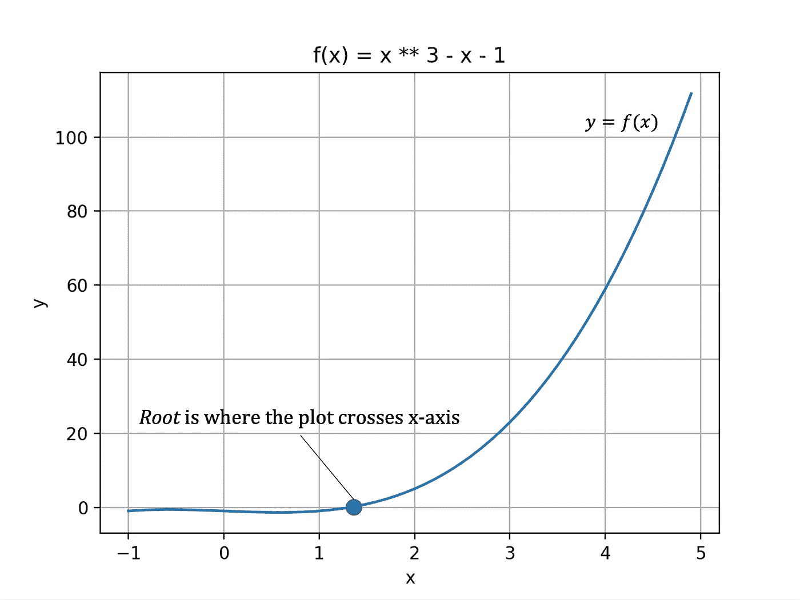
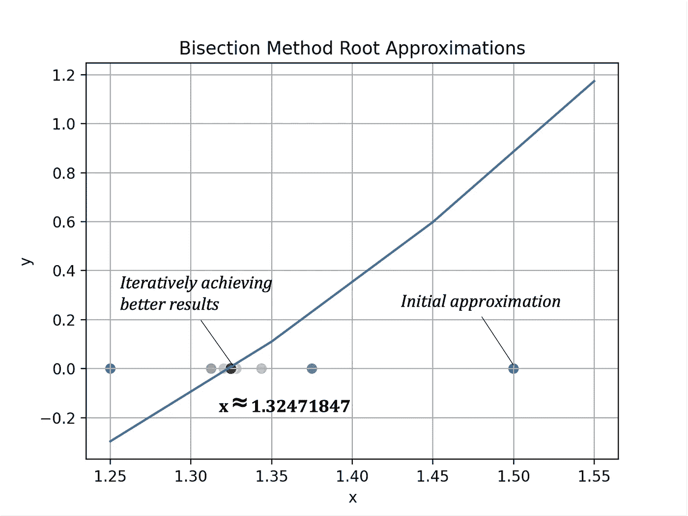
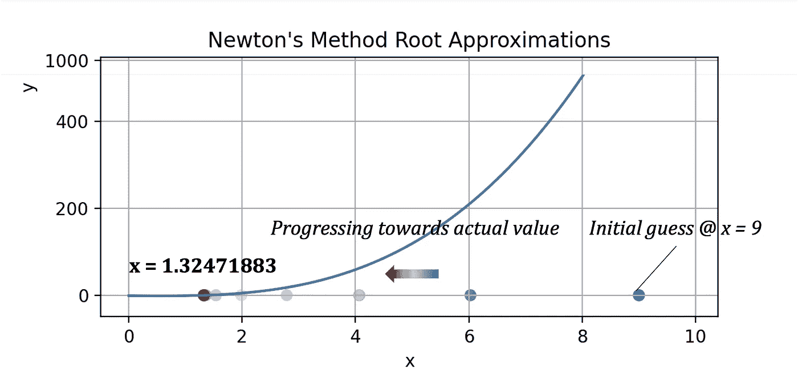
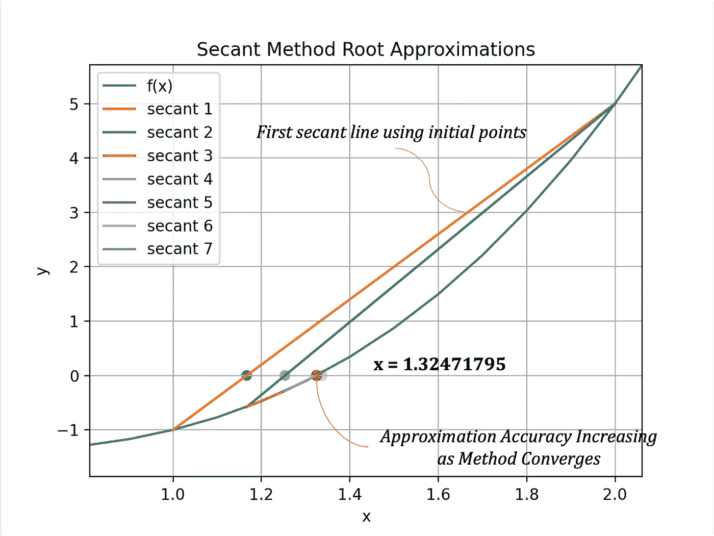

# Python 中的求根方法

> 原文：<https://towardsdatascience.com/root-finding-methods-from-scratch-in-python-84040c81a8ba>

## 使用 Python 的二分法、牛顿法和割线法数学求根算法

## 介绍

数值**根** - **寻找**算法迭代计算*连续函数*的*零点*的更好近似，也称为**根**。

*本文介绍了四种标准求根算法背后的理论，以及它们在 Python 中的实现。*

照片由 [Esther Jiao](https://unsplash.com/@estherrj?utm_source=medium&utm_medium=referral) 在 [Unsplash](https://unsplash.com?utm_source=medium&utm_medium=referral) 上拍摄

以等式 1 为例:

等式 1 —示例函数(图片由作者提供)

图 1 是在区间[-1，5]上等式 1 的*图。一个**零**或**根**是 f(x)等于 0 时 x 的任意*值。即*曲线穿过 x 轴的位置。在这种情况下，根位于 *x₀ = 1* 和 *x* ₁ *= 2* 之间。*

图 1 —等式 1 的曲线图(图片由作者提供)

*本文的目标是使用一些数值运算来逼近 Python 中的根。*

实现这一目标的三种方法是:

1.  二分法
2.  牛顿方法
3.  割线法

## 二分法

**二分法**通过*在中点*重复划分区间来逼近连续函数的根。

该技术适用于两个符号相反的值已知的情况。

> *如果区间*【x₀，x₁】*上有一个* f(x) *的根，那么*【f(x₀】*【f(x₁】*一定有不同的符号。即***【f(x₀)f(x₁】<0**。*

*如有必要，复习这篇[介值定理](https://medium.com/@andrewdaviesul/checking-if-a-solution-exists-intermediate-value-theorem-53d85890350)文章。*

* [## Python 中的介值定理

### 用介值定理检验函数的解是否存在

medium.com](https://medium.com/@andrewdaviesul/checking-if-a-solution-exists-intermediate-value-theorem-53d85890350) 

设 *x₀* 和 *x₁* 为估计区间的起点和终点。然后，用等式 2 计算出*【x₀，x₁】*之间的中点( *x₂* )。

等式 2 —二分法(图片由作者提供)

接下来的猜测要么是 *x₀* 和 *x₂* 的中点，要么是 *x₂* 和 *x₁* 的中点，就看根落在哪边了。**收敛缓慢** *。*

要点 1 给出了二分法的示例实现。

要点 Python 中的二分法

*存储*逐次根逼近和*绘图*图 2 说明了算法的**迭代性质**。

图 2-对分根估计的迭代改进(图片由作者提供)

对等式 1 运行二分法，在*【1，2】*之间指定一个*区间*，在**x**≈**1.324718475**处返回一个*解*。查看图 1 可以看出，这个值在期望值附近。

这个过程大约需要 *18 次迭代*才能达到这个结果。评估改进是逐渐发生的*。*

*关于该算法的最后一点是，可以使用等式 3*估计实现特定**误差界限**所需的最小迭代次数*。*

**

*等式 3 —迭代次数(图片由作者提供)*

**x₀* 和 *x₁* 是区间起点和终点，例如*【1，2】。**

* [## 二分法误差界限的推导

### 这是一个家庭作业问题，我想知道是否有人可以解释一下。设$x_n = \frac{a_n + b_n}{2}…

scicomp.stackexchange.com](https://scicomp.stackexchange.com/questions/16458/deriving-the-error-bound-for-bisection-method) 

使用 Gist 3 中的 Python 代码实现该等式。

要点 2 —误差界限和迭代计数器* 

## *牛顿方法*

*可能是最著名的求根算法，**牛顿法** *逼近实值连续函数*的零点。从解的*初始猜测*开始，等式 4 **迭代**使用*函数*和*导数*在 ***xₙ*** 处的值的知识来改进近似。*

*   ****n*** :迭代计数器*
*   ****xₙ₊₁****:*下一步估计*
*   ****xₙ****:*目前最好的估计*
*   ****f(xₙ)****:*函数在 *xₙ* 求值*
*   ****f'(xₙ)*** :在 *xₙ* 的 *f* 的导数*

**

*等式 4——牛顿法(图片由作者提供)*

*显然，这个过程需要 f(x) 的*一阶导数，因此 *f(x)* 必须是**可微的**。**

*Gist 3 提供了 Python 代码来实现牛顿法的*迭代解*。它使用 **Sympy** 库来评估 *f'(xₙ)* 。在每次通过循环时，参数值被*代入*到等式 1 中，以确定 *xₙ₊₁* 。*

*一个**公差** **极限**控制过程何时中断，当 *f(xₙ)* 接近*零点*时触发该条件。*

*要点 3——具有符号评估的牛顿法的迭代解*

*如上，保存每个猜测和*绘图*图 3 显示了牛顿法*如何逼近*正确解。*

**

*图 3 —牛顿零猜测的改进(图片由作者提供)*

*初始猜测为 *x = 9* ，该方法返回的结果为*f(x)= 0*@***x = 1.324718834***。需要 8 次迭代才能达到 1e-5 的精度。*

> *牛顿法的收敛速度比二分法快得多，但有其局限性，这取决于所讨论的函数的导数。*

## *割线法*

**割线法*与二分法非常相似，只是**不是在中点处划分，而是通过连接端点**的割线来划分区间。*

*等式 4 将在 Python 中迭代地*或递归地*或*实现。**

**

*等式 4 —割线法(图片由作者提供)*

*Gist 4 **中的 Python 方法递归地使用割线方法求解根。***

*要点 4——具有符号评估的牛顿法的迭代解*

*从初始值 *x₀* = 1 和 *x₁* = 2 开始，该过程在 8 次递归调用内，在 **x = 1.324717957** 处输出 *f(x)* 的根。图 4 *显示了*每次走刀产生的割线。*

**

*图 4——割线法可视化(图片由作者提供)*

*割线法是*仅次于牛顿法的*。最适用于需要**比二分法更快收敛**的情况，但是对函数 *f(x)* 求*解析导数*太困难或者*不可能。**

# *结论*

*实现求根算法对于学工程和数学的学生来说很有价值。再者，还有很多其他的方法，用户可以**探索**和扩展自己的***知识*** 和*编码技能*，比如*布伦特的*或者*斯特芬森的*方法。*

*如果你对 *Python* 、*工程学*和*数据科学*感兴趣，请关注并查看我的其他文章。*

* [## 通过我的推荐链接加入媒体-安德鲁·约瑟夫·戴维斯

### 作为一个媒体会员，你的会员费的一部分会给你阅读的作家，你可以完全接触到每一个故事…

medium.com](https://medium.com/@andrewdaviesul/membership)  [## Python 的矩阵代数基础|第 1 部分

### 使用 Python 理解和实现基本矩阵代数概念和运算

towardsdatascience.com](/fundamentals-of-matrix-algebra-with-python-part-1-85aaa17e3632) 

## 参考

[1] [微积分:完整教程，第八版](https://www.pearson.com/uk/educators/higher-education-educators/program/Adams-Calculus-A-Complete-Course-8th-Edition/PGM1010104.html) —罗伯特·A·亚当斯，美国北卡罗来纳大学教堂山分校**