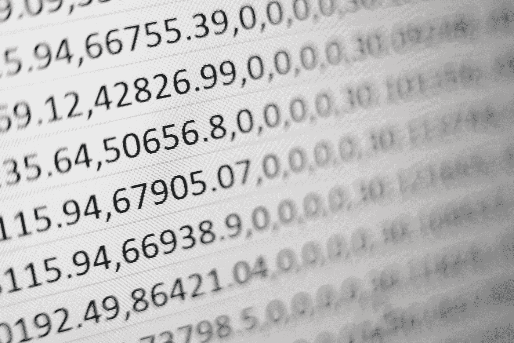

# 舍入器:对复杂 Python 对象中的数字进行舍入

> 原文：<https://towardsdatascience.com/rounder-rounding-numbers-in-complex-python-objects-e4b6f3b563f8>

## rounder 包使您能够对任何对象中的所有数字进行舍入，只需一个命令

rounder:在 Python 中舍入数字从未如此简单。照片由[米卡·鲍梅斯特](https://unsplash.com/@mbaumi?utm_source=medium&utm_medium=referral)在 [Unsplash](https://unsplash.com?utm_source=medium&utm_medium=referral) 上拍摄

舍入数字很少引起问题。在标准库中，我们有函数`round()`、`math.ceil()`和`math.floor()`，通过它们我们可以使用三种标准类型的舍入。这应该够了，不是吗？

实际上，并不总是这样。假设您有以下对象，您希望将其舍入到两位十进制数字:

*注意*:在本例中，对象及其特定字段的含义并不重要。它只是一个可能的复杂嵌套对象的表示。然而，为了简单起见，我没有把它弄得太复杂。然而，当使用它时，想象一个复杂的嵌套字典，它的字段是其他嵌套字典、列表和其他类型的对象。

你会怎么做？你如何处理这样一个对象中的所有数字？您可能认为这相对容易，因为只需编写一个专用函数来处理这种特定类型的嵌套对象就足够了。这是可行的，但是如果对象发生了一点点变化呢？你必须更新这个函数，以使它反映对象的新结构。或者，您可以编写一个递归函数来实现这一点，但是该函数不必那么容易编写，因为它需要处理 Python 提供的如此多的不同类型。

因此，从`round(1.122, 1)`的简单性，我们转移到一个硬编码舍入一个特定类型和结构的对象的函数，或者转移到一个相当困难的递归函数。这不再简单…

这是唯一的方法吗？没有更简单的方法吗？Python 不是承诺简单吗？

# 简单的方法:`rounder`

幸运的是，有一个简单的方法:T5 包。它提供了一些函数，允许对许多不同类型的复杂和嵌套对象中的数字进行舍入。

让我们回到我们的例子。我们希望将来自`obj`对象的数字四舍五入为两位十进制数字。这就是你如何使用`rounder`来做这件事:

这不是很简单吗？

现在，假设您已经决定将`obj`中的数字四舍五入到五位有效数字。Python 没有为此提供内置函数，但是`rounder`提供了。您可以使用`rounder.signif()`表示数字，使用`rounder.signif_object()`表示嵌套对象:

*注意* : `obj`是一个可变对象，因为我们之前对它进行了舍入，所以它发生了变化。因此，要再次使用它的原始版本，您需要重新创建它，就像我们在上面创建它一样。

同理，也可以使用`rounder.ceil_object()`和`rounder.floor_object()`，分别对应`math.ceil()`和`math.floor()`功能。

# 更多关于`rounder`

## 可变对象与不可变对象

我们必须记住，不像不可变的对象，可变的对象在适当的位置被改变*。这意味着当您使用或不使用新名称对其进行更新时，原始对象将被更改。同样的，如果你改变它的(浅层)拷贝，原始对象也会被更新。*

*同样的规则也适用于`rounder`操作。记住这不是典型的`rounder`而是 Python。换句话说，`rounder`实现了 Python 处理可变和不可变对象的典型方式。*

*`rounder`然而，函数使得处理可变对象更加简单。为了简单起见，这次我们将使用更简单、更小的对象:*

*我们确实预料到了这一点，但是由于列表是可变的，`x`也被改变了:*

*如果你不希望这种情况发生，`rounder`可以帮助你。可以使用参数`use_copy`，默认为`False`；这就是为什么默认情况下，`rounder`会改变原来的对象。这是 Python 的默认行为:如果你想创建一个对象的副本，你必须手动完成。*

**注*:提浅抄和深抄的好地方。你可以在[标准库](https://docs.python.org/3/library/copy.html) `[copy](https://docs.python.org/3/library/copy.html)` [模块](https://docs.python.org/3/library/copy.html)或者[这里](https://realpython.com/copying-python-objects/)阅读这个主题。如果你需要或想要加深或更新你的知识，你可以休息一下，现在就做。*

*这就是`use_copy`如何改变`rounder`函数的行为:*

*我们也可以使用`use_copy`的其他`rounder`功能:*

*至于四舍五入到有效数字，记住这个操作也影响整数:*

## *自定义舍入*

*`rounder`包还提供了一个通用函数`rounder.map_object()`，它使您能够应用任何接受一个数字并返回一个数字的可调用函数(所以，`Callable[numbers.Number, numbers.Number]`)。您可以使用它来应用自定义舍入。*

*例如，假设您想要对一个浮点数应用以下舍入，比如说`x`:*

*   *如果`x`是一个整数，原封不动地返回*
*   *`abs(x) > 100`时四舍五入为整数*
*   *`100 > abs(x) > 10`时四舍五入到 1 位小数*
*   *`10 > abs(x) > 1`时四舍五入到 2 位小数*
*   *否则，四舍五入到 3 位小数*

*例如，当您用不同单位或不同比例的数字对对象进行舍入时，可以使用这种舍入方法。下面的函数可以做到这一点:*

*这个函数的名字`round_float`意味着它将只对浮点进行舍入。它可以被命名为`round_only_floats`，但是这个名字不能完全代表它的功能；这是因为它不舍入非数字。所以，我把它命名为`round_float`，以区别于`round`。*

*让我们来看看实际情况:*

*现在，让我们对上面使用的`obj`对象使用这个函数:*

*如您所见，该函数的签名类似于`[map()](/does-python-still-need-the-map-function-96787ea1fb05)`[函数](/does-python-still-need-the-map-function-96787ea1fb05)的签名，第一个参数是一个可调用的，用于作为第二个参数提供的对象。这可以帮助你记住如何使用`rounder.map_object()`。*

*实际上，你可以使用这个函数将*任何*可调用的`Callable[numbers.Number, numbers.Number]`应用于对象中的所有数字，甚至是那些与舍入无关的数字。考虑这个例子:*

## *类型*

*值得一提的是，`rounder`的函数支持许多不同的类型，比如所有内置的容器类型(如`dict`、`list`、`tuple`和`set`)，还有生成器、`map`和`filter`对象、队列、命名元组、`array.array`等等。你会在[包的仓库](https://github.com/nyggus/rounder#types-that-rounder-works-with)中找到他们的列表。注意，当您将一个`generator`类型输入到一个`rounder`函数中时，您也会收到一个生成器。*

## *异常处理*

*典型的舍入函数在用于非数字时会抛出`TypeError`:*

*`rounder.signif()`功能的运行方式类似:*

*名称以`_object`结尾的`rounder`函数则不然:*

*这些函数的行为是这样的，因为当对象是对象的容器时，函数递归地在它们上面运行，舍入(如果不是数字，则不舍入)对象的每个最低级别的元素。*

## *履行*

*高级开发人员可能会欣赏`rounder`的开发方式。这一想法来自该计划的合著者路德·范·德·哈姆。这个包的本质是使用闭包实现的，这是一种优雅的方法——比包的第一个版本(未发布)中使用的最初的基于类的方法优雅得多。*

*你可以从[包库](https://github.com/nyggus/rounder/)中，特别是从它的[主模块](https://github.com/nyggus/rounder/blob/main/rounder/rounder.py) `[rounder](https://github.com/nyggus/rounder/blob/main/rounder/rounder.py)`中，了解更多关于包的实现。*

# *结论*

*`rounder`封装使舍入变得容易。有了它，您可以使用最常见的舍入方法:*

*   *将一个数字四舍五入到特定的小数位数(`round_object()`)；*
*   *将一个数字向下(`floor_object()`)或向上(`ceil_object()`)舍入到最接近的整数；*
*   *将数字舍入到特定的有效数字(`signif()`和`signif_object()`)；*

*而且是一种定制的舍入方法，这要归功于*

*   *使用自定义函数(`map_object()`)对数字进行舍入。*

*但这并不是`rounder`如此有用的原因。它非常有用，因为您可以对任何复杂和/或嵌套的对象类型使用名称以`_object`结尾的`rounder`函数，该函数将对对象中的所有数字进行舍入。*

*这个包还简化了可变对象的操作。通常，当您想要创建一个可变对象的副本时，您需要调用`copy.deepcopy()`，这将创建该对象的深层副本。有了 rounder，你就不必这样做了；使用`use_copy=True`参数就够了，函数会帮你做。*

*简而言之，每当你需要在比一个数字更复杂的对象中舍入数字时(比如一个遵循`numbers.Number`抽象基类的对象)，你会发现`rounder`特别有用。它的功能也适用于常规数字。随着`rounder`包的出现，我们想要舍入所有数字的对象的复杂性不再是问题。*

# *资源*

*       *