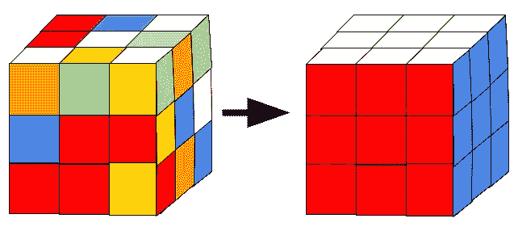
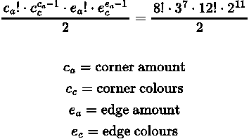
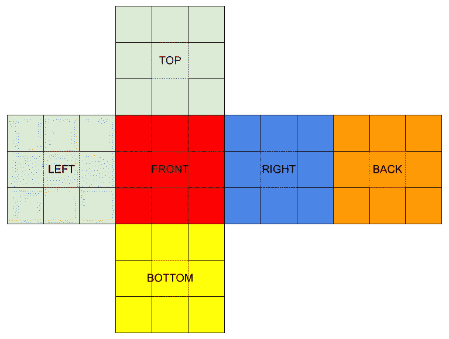
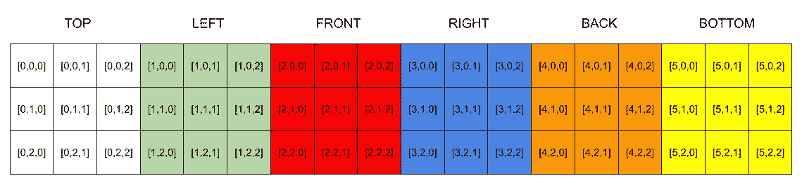
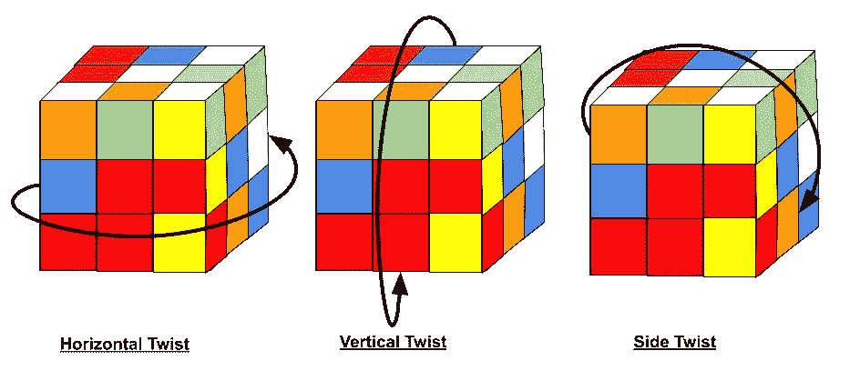
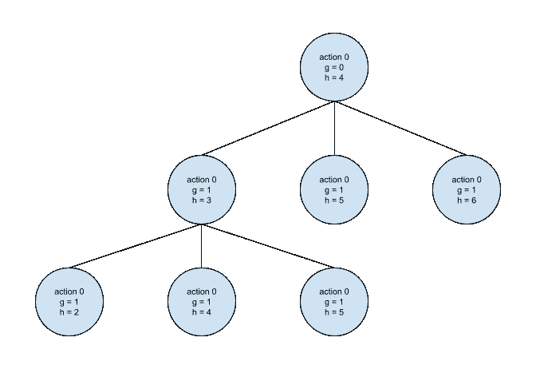

# 魔方求解器

> 原文：<https://towardsdatascience.com/rubiks-cube-solver-96fa6c56fbe4>

## 用 Python 3 构建魔方解算器

解魔方|作者图片

大家好，今天我们将使用 python 3 创建一个[魔方](https://en.wikipedia.org/wiki/Rubik%27s_Cube)解算器。在这篇博客文章中，我将介绍游戏理论和所需的算法，这样你就可以轻松地击败任何魔方。

随着魔方的流行，我敢肯定你以前见过一个，但以防万一你没有，我会给他们一个快速的纲要。魔方是由 ernő·鲁比克发明的一种流行游戏。魔方有一套简单的规则，解读混乱的三维拼图。传统上，魔方是一个 3x3 的立方体，但现在有许多经典游戏的变体。

魔方是要解决的复杂谜题，共有 [43，252，003，274，489，856，000 种](https://medium.com/@chaitanyaanimesh/calculating-the-number-of-permutations-of-the-rubiks-cube-121066f5f054)可能的组合。

魔方方程式的排列|作者图片

由于这种复杂性，从业余爱好者到数学家，许多人都在研究魔方。由于立方体的复杂群论，数学家们已经喜欢上了它，产生了许多关于这个主题的科学论文。

其中一张意义重大的纸是纸“[魔方组的直径是二十个](http://kociemba.org/math/papers/rubik20.pdf)”在这篇论文中，他们确定“上帝的数字”是 20 转。“神数”是魔方的一个术语，指的是在任何构型下解决一个魔方的最大转动次数。

这项研究的另一个令人印象深刻的成果是各种解决立方体问题的标准化算法。

# 构建立方体

好了，现在我们有了魔方的背景知识，我们的第一步将是建立一个。为了简单起见，我们将坚持 nxn 立方体，这样我们就不需要处理任何其他三维形状的几何图形(有时拼图是其他形状，如正方形或三角形)。

平铺多维数据集视图|作者提供的图像

为了构建我们的多维数据集，让我们为用户创建一个自定义的交互类。这样，我们可以将内部状态存储在多维数据集对象中，以减少在操作多维数据集时需要传递给每个函数的变量数量。

首先，我们需要确定创建多维数据集的最有效的数据结构。为了这个项目，我们将使用一个三维数组(嵌套列表)。由于需要对立方体进行操作，我选择了这种数据结构。使用一个三维数组，我们可以创建映射来平均在 [O(n)](https://en.wikipedia.org/wiki/Big_O_notation) 时间内将方块切换到位。

3D 阵列表示|作者图片

接下来，我们需要构建三个独立的函数来操作立方体。使用魔方，您只能进行三种可能的移动。

魔方运动|作者图片

我们的三个动作功能都采取了非常相似的方法。我们使用映射来切换立方体的位置。对于垂直和侧向扭曲函数，我们使用 For 循环遍历列的每一行，使得这些函数的时间复杂度为 O(n)。但是，水平扭曲函数会原地切换行，时间复杂度为 O(1)。我们还检查是否需要在每次旋转时旋转最近的面。为了旋转魔方的面，我们转置各自的矩阵。

# 求解立方体

现在我们有了魔方的工作模型，让我们开始制作求解器。

对于求解者，我们可以采用多种方法来解决这个问题。然而，我们将采取[游戏树](https://en.wikipedia.org/wiki/Game_tree)的方法。

用博弈树的方法，我们知道我们将需要搜索博弈树来找到可能解决立方体的最少移动。我们可以使用蛮力方法，然而，以今天的计算限制，这是不可行的。相反，我们将使用更有效的搜索算法。

我们要用的算法是[迭代深化 A*](https://en.wikipedia.org/wiki/Iterative_deepening_A*) (IDA*)搜索算法。由于内存限制，该算法优于 [A*](https://en.wikipedia.org/wiki/A*_search_algorithm) 。A*和 IDA*使用类似的方法，其中 A*记得哪些节点被访问过，而 IDA*不记得。通常情况下，A*是搜索问题的最佳选择，然而，对于如此大的搜索空间，如果我们使用 A*，很可能会耗尽内存。

IDA*是一种树形搜索方法，它结合了[试探法](https://en.wikipedia.org/wiki/Heuristic_(computer_science))和[深度优先搜索](https://en.wikipedia.org/wiki/Depth-first_search) (DFS)。在 IDA*中，启发式算法指导 DFS，树在每次迭代中扩展，类似于蒙特卡罗树搜索(参见我的博客文章[构建国际象棋引擎:第二部分](https://medium.com/towards-data-science/building-a-chess-engine-part2-db4784e843d5)关于 MCTS 的解释)。

下面是 IDA*方法的示例树。在这个图中，我显示了 g_score(到达当前节点的成本)和 h_score(前面路径的预测成本)。该算法使用 g_score 和 h_score 的简单和来评估每个节点。

IDA*游戏树示例|作者图片

如之前在 IDA*中所述，我们不会保存已访问的节点。不保存访问过的节点有利也有弊。通过不保存被访问的节点，我们有机会访问同一个节点两次，这给了我们整个算法更差的时间复杂度。然而，通过不保存我们访问过的节点，我们不需要那么多的内存。对于我们的用例，节省内存是很重要的，因为我们正在处理一个可能有 43，252，003，274，489，856，000 个节点的博弈树。

好了，现在我们对将要使用的算法有了更好的理解，让我们来构建它。首先需要做的是建立我们的启发式。

对于我们的试探法，我们将采用简单的强力方法，并使用广度优先搜索算法来检查节点。在这里，我们将把立方体的不同状态以及从已求解的立方体到达那里的移动次数存储在一个哈希表中。通过将多维数据集状态存储在哈希表中，我们创建了一个简单的查找表来了解哪个状态需要解决的移动量最少。

现在我们有了试探法，我们可以实现 IDA*算法来求解立方体。构建该算法将使用简单的 DFS(深度优先搜索)算法和上述评分方法(g_score + h_score)。当访问每个节点时，会传入我们前一个节点的 g_score 来知道当前的开销。为了确定 h_score，将在我们的启发式图中快速查找节点。为了简单起见，如果我们发现一个不在我们的启发式地图中的节点，就将 h_score 设置为 20(上帝的数字)。在这里，我们可以创建一些额外的等式来获得更好的估计，但对于我们的简单用例，这是不需要的(如果你有一个等式，请随意在评论中留下它)。综上所述，我们应该得到类似下面的代码。

# 谢谢

就这样，我们成功地创建了我们的魔方解算器。你可以在我的 GitHub [上查看完整版本的代码。](https://github.com/bellerb/RubiksCube_Solver)

感谢阅读。如果你喜欢这样，可以考虑订阅我的账户，以便在我最近发帖时得到通知。

# 参考

*   https://en.wikipedia.org/wiki/Rubik%27s_Cube
*   [https://ruwix . com/the-Rubik-cube/how-to-solve-the-Rubik-cube-初学者-方法/](https://ruwix.com/the-rubiks-cube/how-to-solve-the-rubiks-cube-beginners-method/)
*   [https://medium . com/@ chaitanyaanimesh/calculating-of-number of-the-permutating-of-the-number of-the-rubkis-cube-121066 f5f 054](https://medium.com/@chaitanyaanimesh/calculating-the-number-of-permutations-of-the-rubiks-cube-121066f5f054)
*   [https://en.wikipedia.org/wiki/Ern%C5%91_Rubik](https://en.wikipedia.org/wiki/Ern%C5%91_Rubik)
*   [https://en.wikipedia.org/wiki/Big_O_notation](https://en.wikipedia.org/wiki/Big_O_notation)
*   [http://kociemba.org/math/papers/rubik20.pdf](http://kociemba.org/math/papers/rubik20.pdf)
*   [https://en.wikipedia.org/wiki/Game_tree](https://en.wikipedia.org/wiki/Game_tree)
*   [https://en.wikipedia.org/wiki/Iterative_deepening_A*](https://en.wikipedia.org/wiki/Iterative_deepening_A*)
*   [https://en.wikipedia.org/wiki/A*_search_algorithm](https://en.wikipedia.org/wiki/A*_search_algorithm)
*   [https://en . Wikipedia . org/wiki/Heuristic _(计算机科学)](https://en.wikipedia.org/wiki/Heuristic_(computer_science))
*   [https://medium . com/forward-data-science/building-a-chess-engine-part 2-db 4784 e 843d 5](https://medium.com/towards-data-science/building-a-chess-engine-part2-db4784e843d5)