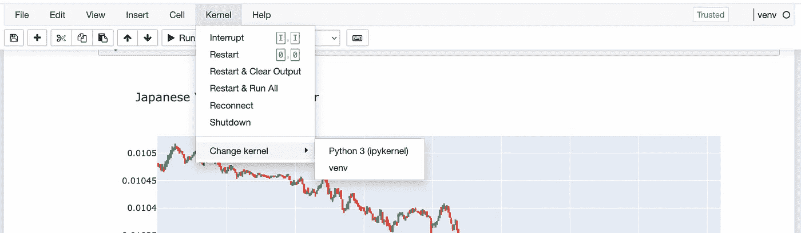

# 在现有的虚拟环境中运行新的 Jupyter 笔记本电脑

> 原文：<https://towardsdatascience.com/run-a-new-jupyter-notebook-in-an-already-existing-virtual-environment-7490b3dd5ab6>

## 解决无法从默认的 Jupyter 笔记本安装中访问虚拟环境模块的问题


照片由[斯科特·韦伯](https://unsplash.com/es/@scottwebb?utm_source=medium&utm_medium=referral)在 [Unsplash](https://unsplash.com?utm_source=medium&utm_medium=referral) 拍摄

# 问题是

有几种不同的 Python 工作流，了解多种工作流可以让您在处理不同类型的问题时更加容易。对我来说，我喜欢使用 VS 代码和终端，但是当我需要一些快速的数据可视化时，没有什么比 Jupyter 笔记本更适合快速迭代了。

问题是，**你如何从现有的虚拟环境中运行你的 Jupyter 笔记本？**如果您运行命令`jupyter notebook`，即使是在[虚拟环境](https://medium.com/swlh/painless-easy-virtual-environment-setup-for-your-python-project-5aed144acebf)中，它也会使用默认内核启动 Jupyter 笔记本服务器，例如: *Python 3 (ipykernel)。*如果您尝试导入您环境中安装的任何模块，您可能会得到*模块未找到*错误。

**Extra:** 在此阅读更多关于设置虚拟环境的信息:

[](https://medium.com/swlh/painless-easy-virtual-environment-setup-for-your-python-project-5aed144acebf) [## 虚拟环境其实很简单……(如果你不把它们弄复杂的话)。

### 一个超级简单、轻量级的解决方案，可以快速高效地为您的 Python 项目设置可移植环境…

medium.com](https://medium.com/swlh/painless-easy-virtual-environment-setup-for-your-python-project-5aed144acebf) 

经过一番疯狂的谷歌搜索，我终于找到了这个快速可靠的解决方案:

# 设置 Jupyter 笔记本

1.  导航并激活您的虚拟环境*(如果您在这一步需要帮助，请参阅上面的文章)。*
2.  使用以下命令在您的虚拟环境中安装一个 Jupyter 内核:

```
ipython kernel install --user --name=venv
```

其中`--user`将安装限制在本地用户，而`--name`在步骤 1 中被设置为环境名。

3.接下来，用恰当命名的命令打开您的笔记本:

`jupyter notebook`

4.查看笔记本的右上角，看看哪个内核正在运行。它可能会以默认内核启动。点击菜单栏中的*内核*，导航至*更改内核*。然后，从下拉列表中选择您在上一步中提供的环境名称。

**重述:**从菜单中选择*内核→更改内核→您的内核名称*



将内核更改为您在上面的示例中设置的内核。在这里，选择“venv”将允许访问安装在该环境中的所有模块。

# 提示和技巧

1.  如果您想查看已经设置的可用内核，请键入以下命令:

`jupyter kernelspec list`

2.要删除以前安装的内核，请使用:

`jupyter kernelspec uninstall venv`

其中" *venv"* 是您的环境的名称。

# 关闭

应该可以了！现在，当您在笔记本(即`import pandas as pd`)中运行导入语句时，您将可以访问您环境中的所有模块。现在，您已经了解在虚拟环境中运行 Jupyter 笔记本电脑需要什么了。

**注意:**在这个用例中，我没有安装 Anaconda。如果您安装了 Anaconda，有一个有用的 GUI 可以帮助您管理环境设置，有些人可能更喜欢这种方法。

写这篇文章是为了在你多次遇到这个问题时，作为一个快速的书签参考。